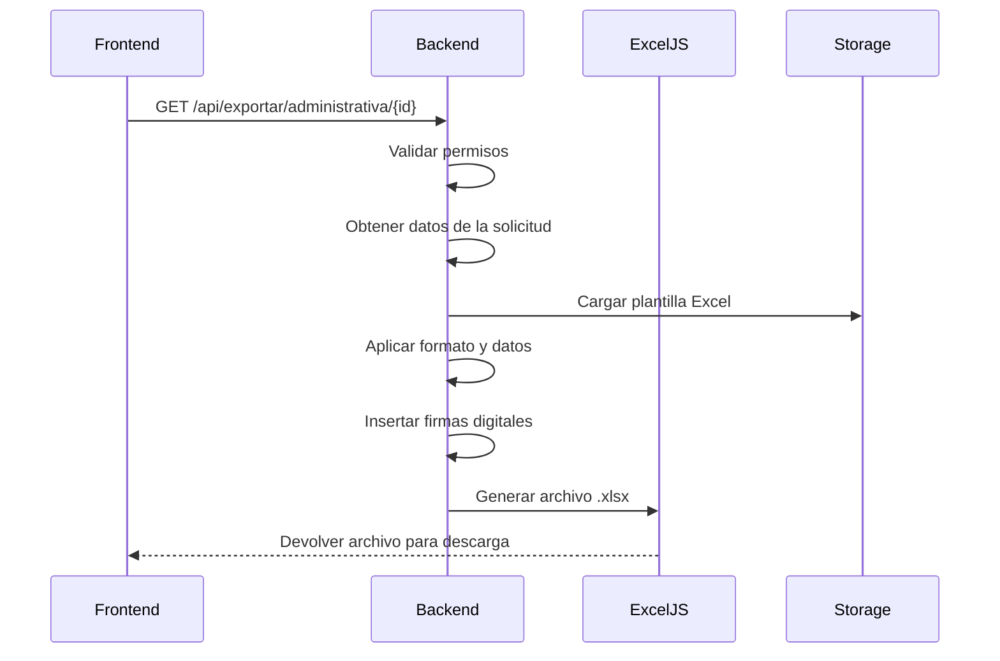
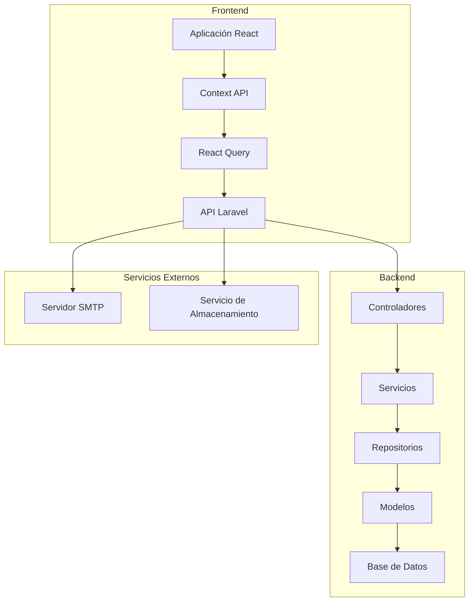

# Flujos de Trabajo y Arquitectura del Sistema

## 1. Flujos de Trabajo Principales

### 1.1 Proceso de Aprobación de Solicitudes

```mermaid
flowchart TD
    A[Inicio: Usuario crea solicitud] --> B{Validación de datos}
    B -->|Válido| C[Guardar como "Pendiente"]
    C --> D[Notificar a Jefe Inmediato]
    D --> E{¿Aprobado?}
    E -->|Sí| F[Notificar a TI]
    E -->|No| G[Rechazar y notificar]
    F --> H{¿Aprobado por TI?}
    H -->|Sí| I[Procesar solicitud]
    H -->|No| G
    I --> J[Notificar al solicitante]
    G --> K[Notificar al solicitante]
```

### 1.2 Flujo de Exportación a Excel



## 2. Módulos del Sistema

### 2.1 Gestión de Usuarios y Roles
- **Roles**: Administrador, Jefe Inmediato, Personal de TI, Usuario Final
- **Permisos**: Basados en roles con herencia
- **Autoservicio**: Actualización de perfil y cambio de contraseña

### 2.2 Sistema de Notificaciones
- Notificaciones en tiempo real (WebSocket)
- Historial de notificaciones
- Preferencias de notificación por usuario

### 2.3 Panel de Administración
- Dashboard con métricas clave
- Gestión de catálogos
- Monitoreo del sistema

## 3. Arquitectura Técnica

### 3.1 Diagrama de Componentes



### 3.2 Estructura de Directorios

```
hefesto/
├── client/                   # Frontend React
│   ├── components/           # Componentes reutilizables
│   ├── pages/                # Vistas de la aplicación
│   ├── hooks/                # Custom hooks
│   └── lib/                  # Utilidades y configuraciones
└── hefesto-backend/          # Backend Laravel
    ├── app/
    │   ├── Http/Controllers/ # Controladores de API
    │   ├── Services/         # Lógica de negocio
    │   ├── Repositories/     # Acceso a datos
    │   ├── Models/           # Modelos Eloquent
    │   └── Exports/          # Clases de exportación
    ├── database/
    │   ├── migrations/
    │   └── seeders/
    └── storage/app/
        ├── templates/        # Plantillas Excel
        └── firmas/          # Firmas digitales
```

## 4. Mejoras Futuras

### 4.1 Autenticación de Dos Factores (2FA)
- Implementar 2FA para mayor seguridad
- Opción de autenticación por aplicación o SMS

### 4.2 API Externa
- Documentación con Swagger/OpenAPI
- Endpoints para integración con otros sistemas

### 4.3 Reportes Avanzados
- Exportación a PDF/Excel personalizable
- Gráficos y estadísticas

### 4.4 Aplicación Móvil
- Versión móvil con React Native
- Notificaciones push
- Firma digital en dispositivos táctiles

## 5. Consideraciones de Seguridad

- Validación de entrada en frontend y backend
- Protección contra CSRF y XSS
- Cifrado de datos sensibles
- Registro de auditoría de acciones
- Política de contraseñas seguras

## 6. Rendimiento y Escalabilidad

- Caché de consultas frecuentes
- Optimización de consultas a la base de datos
- Balanceo de carga
- Escalado horizontal de servicios

## 7. Monitoreo y Mantenimiento

- Health checks automatizados
- Monitoreo de rendimiento
- Alertas tempranas
- Copias de seguridad programadas

---

*Documentación generada el 2025-11-20*
*Última actualización: 2025-11-20*
