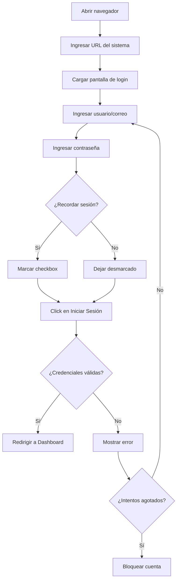
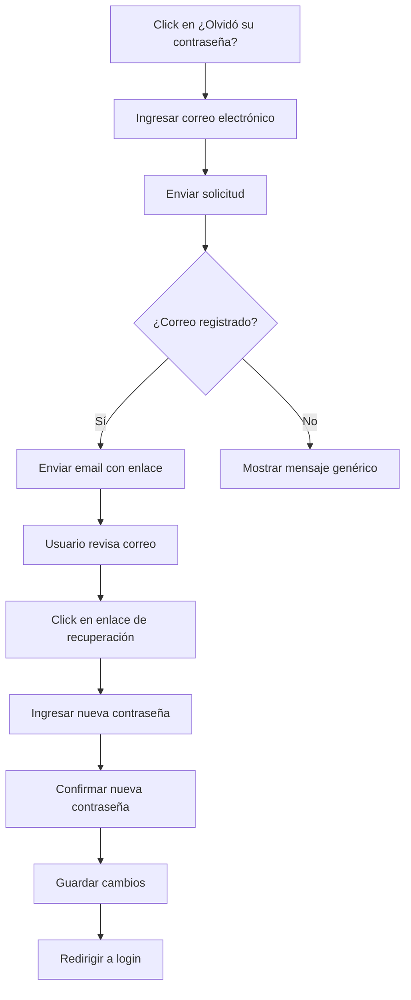
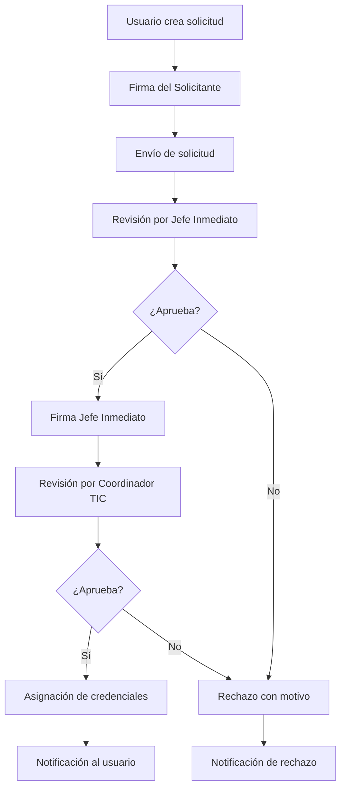
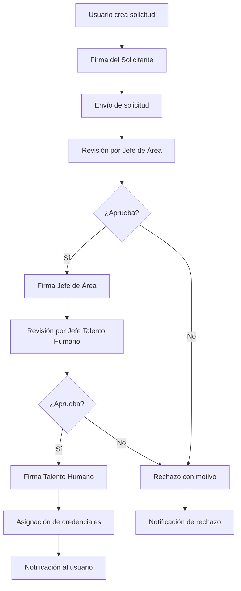
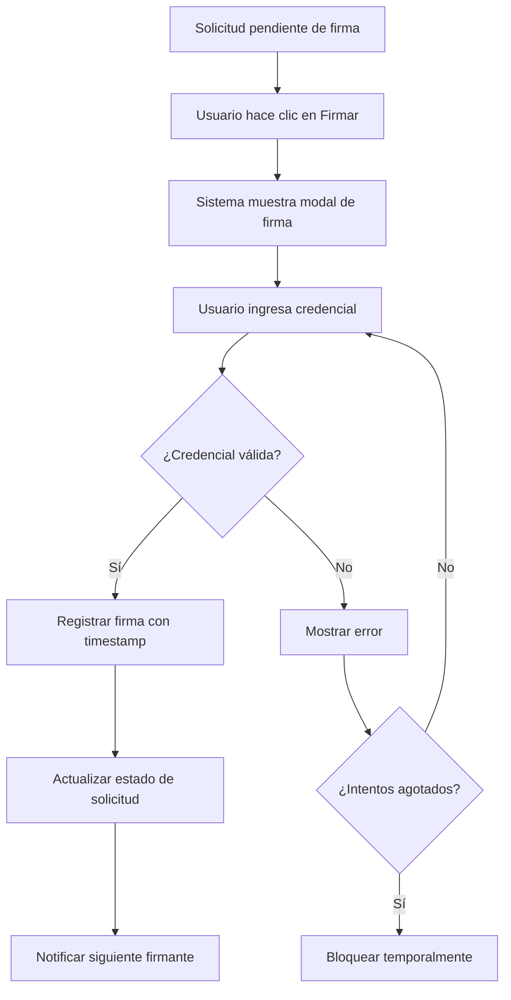
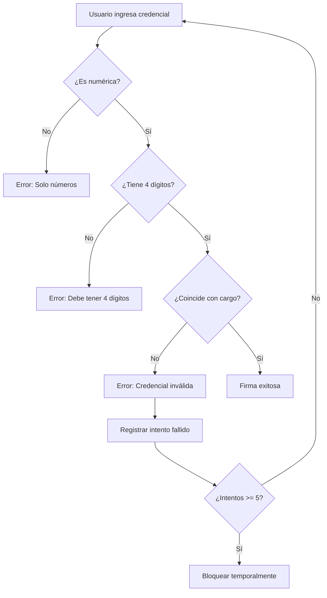

# 📘 MANUAL DE USUARIO - SISTEMA KAIZEN
## Gestión de Usuarios para Historia Clínica
### Hospital Universitario del Valle - HUV

---


---

## 📋 ÍNDICE GENERAL

1. [Introducción al Sistema](#1-introducción-al-sistema)
2. [Requisitos del Sistema](#2-requisitos-del-sistema)
3. [Acceso al Sistema](#3-acceso-al-sistema)
4. [Panel de Control (Dashboard)](#4-panel-de-control-dashboard)
5. [Gestión de Solicitudes](#5-gestión-de-solicitudes)
6. [Registro de Historia Clínica](#6-registro-de-historia-clínica)
7. [Registro Administrativo](#7-registro-administrativo)
8. [Seguimiento de Solicitudes](#8-seguimiento-de-solicitudes)
9. [Control y Aprobación](#9-control-y-aprobación)
10. [Gestión de Usuarios](#10-gestión-de-usuarios)
11. [Gestión de Roles y Permisos](#11-gestión-de-roles-y-permisos)
12. [Configuración de Seguridad](#12-configuración-de-seguridad)
13. [Configuración del Sistema](#13-configuración-del-sistema)
14. [Gestión de Credenciales y Firmas](#14-gestión-de-credenciales-y-firmas)
15. [Perfil de Usuario](#15-perfil-de-usuario)
16. [Firma Digital](#16-firma-digital)
17. [Exportación de Datos](#17-exportación-de-datos)
18. [Preguntas Frecuentes](#18-preguntas-frecuentes)
19. [Solución de Problemas](#19-solución-de-problemas)
20. [Glosario de Términos](#20-glosario-de-términos)

---

# 1. INTRODUCCIÓN AL SISTEMA

## 1.1 ¿Qué es KAIZEN?

**KAIZEN** es un sistema integral de gestión de usuarios para acceso a Historia Clínica del Hospital Universitario del Valle. El nombre proviene del término japonés que significa "mejora continua", reflejando el compromiso de la institución con la optimización constante de sus procesos.

### 1.1.1 Propósito del Sistema

El sistema KAIZEN tiene como objetivos principales:

- **Centralizar** la gestión de solicitudes de acceso a sistemas hospitalarios
- **Automatizar** el flujo de aprobación de credenciales
- **Garantizar** la trazabilidad de todas las operaciones
- **Cumplir** con las normativas de seguridad de información en salud
- **Facilitar** la administración de permisos y roles

### 1.1.2 Beneficios del Sistema

| Beneficio | Descripción |
|-----------|-------------|
| **Eficiencia** | Reduce tiempos de procesamiento de solicitudes |
| **Seguridad** | Control granular de accesos y permisos |
| **Trazabilidad** | Registro completo de actividades |
| **Cumplimiento** | Adherencia a normativas de salud |
| **Automatización** | Flujos de trabajo automatizados |

### 1.1.3 Módulos del Sistema

KAIZEN está compuesto por los siguientes módulos principales:

1. **Módulo de Autenticación**
   - Inicio de sesión seguro
   - Recuperación de contraseña
   - Bloqueo por intentos fallidos

2. **Módulo de Solicitudes**
   - Registro de solicitudes administrativas
   - Registro de solicitudes de historia clínica
   - Seguimiento de estado

3. **Módulo de Control**
   - Aprobación/Rechazo de solicitudes
   - Gestión de usuarios
   - Administración de roles

4. **Módulo de Configuración**
   - Parámetros del sistema
   - Políticas de seguridad
   - Gestión de credenciales de firma

## 1.2 Arquitectura del Sistema

### 1.2.1 Componentes Técnicos

```
┌─────────────────────────────────────────────────────────────┐
│                    FRONTEND (React + Vite)                   │
│  ┌──────────┐  ┌──────────┐  ┌──────────┐  ┌──────────┐    │
│  │  Login   │  │ Dashboard│  │Solicitud │  │  Control │    │
│  └──────────┘  └──────────┘  └──────────┘  └──────────┘    │
└─────────────────────────────────────────────────────────────┘
                              │
                              ▼
┌─────────────────────────────────────────────────────────────┐
│                    BACKEND (Laravel 11)                      │
│  ┌──────────┐  ┌──────────┐  ┌──────────┐  ┌──────────┐    │
│  │   API    │  │  Auth    │  │ Services │  │  Models  │    │
│  └──────────┘  └──────────┘  └──────────┘  └──────────┘    │
└─────────────────────────────────────────────────────────────┘
                              │
                              ▼
┌─────────────────────────────────────────────────────────────┐
│                    BASE DE DATOS (MySQL)                     │
│  ┌──────────┐  ┌──────────┐  ┌──────────┐  ┌──────────┐    │
│  │  Users   │  │Solicitud │  │  Roles   │  │ Permisos │    │
│  └──────────┘  └──────────┘  └──────────┘  └──────────┘    │
└─────────────────────────────────────────────────────────────┘
```

### 1.2.2 Flujo General del Sistema

```
Usuario ──► Login ──► Dashboard ──► Solicitud ──► Firma ──► Aprobación ──► Credenciales
    │                     │              │           │            │              │
    │                     ▼              ▼           ▼            ▼              ▼
    │               Ver Estado      Llenar      Validar      Revisar       Notificar
    │               Solicitudes    Formulario   Credencial   Solicitud     Usuario
    │                     │              │           │            │              │
    └─────────────────────┴──────────────┴───────────┴────────────┴──────────────┘
```

## 1.3 Roles del Sistema

### 1.3.1 Tipos de Usuarios

El sistema KAIZEN maneja diferentes tipos de usuarios, cada uno con permisos específicos:

#### 👤 Usuario Regular
- Puede crear solicitudes de acceso
- Puede ver el estado de sus propias solicitudes
- Puede editar su perfil personal
- Puede descargar e imprimir sus solicitudes

#### 👨‍💼 Supervisor
- Todos los permisos de Usuario Regular
- Puede ver solicitudes de su área
- Puede dar seguimiento a solicitudes

#### 👨‍⚕️ Jefe Inmediato
- Todos los permisos de Supervisor
- Puede aprobar/rechazar solicitudes de su área
- Puede firmar solicitudes como responsable

#### 🏥 Jefe de Talento Humano
- Permisos extendidos de aprobación
- Puede gestionar solicitudes de múltiples áreas
- Puede generar reportes de personal

#### 💻 Coordinador TIC
- Permisos de gestión técnica
- Puede asignar credenciales
- Puede configurar parámetros del sistema

#### 🔑 Administrador
- Acceso total al sistema
- Puede gestionar usuarios y roles
- Puede configurar políticas de seguridad
- Puede ver registros de auditoría

### 1.3.2 Matriz de Permisos por Rol

| Funcionalidad | Usuario | Supervisor | Jefe Inmediato | Coord. TIC | Admin |
|---------------|---------|------------|----------------|------------|-------|
| Crear solicitud | ✅ | ✅ | ✅ | ✅ | ✅ |
| Ver mis solicitudes | ✅ | ✅ | ✅ | ✅ | ✅ |
| Ver todas solicitudes | ❌ | 🔶 | 🔶 | ✅ | ✅ |
| Aprobar solicitudes | ❌ | ❌ | ✅ | ✅ | ✅ |
| Rechazar solicitudes | ❌ | ❌ | ✅ | ✅ | ✅ |
| Asignar credenciales | ❌ | ❌ | ❌ | ✅ | ✅ |
| Gestionar usuarios | ❌ | ❌ | ❌ | ❌ | ✅ |
| Gestionar roles | ❌ | ❌ | ❌ | ❌ | ✅ |
| Configurar seguridad | ❌ | ❌ | ❌ | ❌ | ✅ |
| Ver auditoría | ❌ | ❌ | ❌ | ❌ | ✅ |

**Leyenda:** ✅ Permitido | ❌ No permitido | 🔶 Limitado a su área

---

# 2. REQUISITOS DEL SISTEMA

## 2.1 Requisitos de Hardware

### 2.1.1 Para Usuarios Finales

| Componente | Mínimo | Recomendado |
|------------|--------|-------------|
| Procesador | Intel Core i3 / AMD Ryzen 3 | Intel Core i5 / AMD Ryzen 5 |
| Memoria RAM | 4 GB | 8 GB |
| Almacenamiento | 500 MB libres | 1 GB libres |
| Pantalla | 1366 x 768 px | 1920 x 1080 px |
| Conexión | 5 Mbps | 10 Mbps |

### 2.1.2 Para Dispositivos Móviles

| Dispositivo | Sistema Operativo | Versión Mínima |
|-------------|-------------------|----------------|
| Smartphone Android | Android | 8.0 (Oreo) |
| iPhone | iOS | 12.0 |
| Tablet Android | Android | 8.0 (Oreo) |
| iPad | iPadOS | 12.0 |

## 2.2 Requisitos de Software

### 2.2.1 Navegadores Compatibles

| Navegador | Versión Mínima | Estado |
|-----------|----------------|--------|
| Google Chrome | 90+ | ✅ Recomendado |
| Mozilla Firefox | 88+ | ✅ Compatible |
| Microsoft Edge | 90+ | ✅ Compatible |
| Safari | 14+ | ✅ Compatible |
| Opera | 76+ | ✅ Compatible |
| Internet Explorer | - | ❌ No soportado |

### 2.2.2 Configuración del Navegador

Para el correcto funcionamiento del sistema, asegúrese de tener habilitado:

1. **JavaScript** - Necesario para la interfaz interactiva
2. **Cookies** - Requeridas para mantener la sesión
3. **localStorage** - Para guardar preferencias locales
4. **Popups** - Para descarga de archivos y reportes

### 2.2.3 Plugins Requeridos

- **PDF Viewer** - Para visualizar formatos PDF
- **Excel Viewer** (opcional) - Para previsualizar archivos Excel

## 2.3 Requisitos de Red

### 2.3.1 Configuración de Red

```
┌─────────────────────────────────────────────────────────┐
│                    RED HOSPITALARIA                      │
│                                                          │
│   ┌──────────┐     ┌──────────┐     ┌──────────┐       │
│   │ Usuario  │────►│ Firewall │────►│ Servidor │       │
│   │  (PC)    │     │          │     │  KAIZEN  │       │
│   └──────────┘     └──────────┘     └──────────┘       │
│                                          │              │
│                                          ▼              │
│                                    ┌──────────┐        │
│                                    │   Base   │        │
│                                    │  Datos   │        │
│                                    └──────────┘        │
└─────────────────────────────────────────────────────────┘
```

### 2.3.2 Puertos Utilizados

| Puerto | Protocolo | Uso |
|--------|-----------|-----|
| 8080 | HTTP | Frontend (desarrollo) |
| 8000 | HTTP | Backend API |
| 443 | HTTPS | Conexión segura (producción) |
| 3306 | TCP | Base de datos MySQL |

### 2.3.3 URLs del Sistema

| Ambiente | URL Frontend | URL API |
|----------|--------------|---------|
| Desarrollo | http://localhost:8080 | http://localhost:8000/api |
| LAN | http://192.168.2.146:8080 | http://192.168.2.146:8000/api |
| Producción | https://kaizen.huv.gov.co | https://api.kaizen.huv.gov.co |

---

# 3. ACCESO AL SISTEMA

## 3.1 Pantalla de Inicio de Sesión

### 3.1.1 Elementos de la Pantalla de Login

La pantalla de inicio de sesión presenta los siguientes elementos:

```
┌─────────────────────────────────────────────────────────────┐
│                                                             │
│  ┌─────────────────┐    ┌─────────────────────────────┐    │
│  │                 │    │                             │    │
│  │    [LOGO]       │    │     BIENVENIDO              │    │
│  │    KAIZEN       │    │     Ingresa tus             │    │
│  │                 │    │     credenciales            │    │
│  │  Gestión de     │    │                             │    │
│  │  Usuarios HC    │    │  ┌─────────────────────┐   │    │
│  │                 │    │  │ Usuario o Correo    │   │    │
│  │  Hospital       │    │  └─────────────────────┘   │    │
│  │  Universitario  │    │                             │    │
│  │  del Valle      │    │  ┌─────────────────────┐   │    │
│  │                 │    │  │ Contraseña      👁️  │   │    │
│  │                 │    │  └─────────────────────┘   │    │
│  │                 │    │                             │    │
│  │                 │    │  ☐ Recordar sesión         │    │
│  │                 │    │                             │    │
│  │                 │    │  ┌─────────────────────┐   │    │
│  │                 │    │  │   INICIAR SESIÓN    │   │    │
│  │                 │    │  └─────────────────────┘   │    │
│  │                 │    │                             │    │
│  │                 │    │  ¿No tienes cuenta?        │    │
│  │                 │    │  [Crear cuenta]            │    │
│  │                 │    │                             │    │
│  └─────────────────┘    └─────────────────────────────┘    │
│                                                             │
└─────────────────────────────────────────────────────────────┘
```

### 3.1.2 Campos del Formulario

| Campo | Descripción | Validación |
|-------|-------------|------------|
| **Usuario/Correo** | Nombre de usuario o correo electrónico registrado | Obligatorio, formato email válido si es correo |
| **Contraseña** | Clave de acceso del usuario | Obligatorio, mínimo 8 caracteres |
| **Recordar sesión** | Mantiene la sesión activa por más tiempo | Opcional |

### 3.1.3 Botón de Visibilidad de Contraseña

El ícono 👁️ permite alternar la visibilidad de la contraseña:
- **Oculta (por defecto)**: La contraseña se muestra como puntos (•••••••)
- **Visible**: La contraseña se muestra en texto plano

## 3.2 Proceso de Inicio de Sesión

### 3.2.1 Pasos para Iniciar Sesión



### 3.2.2 Instrucciones Detalladas

**Paso 1: Acceder al Sistema**
1. Abra su navegador web preferido (Chrome recomendado)
2. En la barra de direcciones, escriba la URL del sistema
3. Espere a que cargue la pantalla de inicio de sesión

**Paso 2: Ingresar Credenciales**
1. En el campo "Usuario o Correo", ingrese su identificador
2. En el campo "Contraseña", ingrese su clave de acceso
3. Si lo desea, marque "Recordar sesión" para mantener su sesión activa

**Paso 3: Iniciar Sesión**
1. Haga clic en el botón "INICIAR SESIÓN"
2. Espere mientras el sistema valida sus credenciales
3. Será redirigido automáticamente al Panel de Control

## 3.3 Manejo de Errores de Autenticación

### 3.3.1 Mensajes de Error Comunes

| Código | Mensaje | Causa | Solución |
|--------|---------|-------|----------|
| 401 | "Credenciales inválidas" | Usuario o contraseña incorrectos | Verificar datos e intentar nuevamente |
| 429 | "Demasiados intentos" | Se excedió el límite de intentos | Esperar el tiempo indicado |
| 403 | "Cuenta desactivada" | La cuenta está inactiva | Contactar al administrador |
| 500 | "Error del servidor" | Problema técnico | Reportar a soporte técnico |

### 3.3.2 Sistema de Bloqueo por Intentos Fallidos

El sistema implementa un mecanismo de seguridad que bloquea temporalmente las cuentas después de múltiples intentos fallidos:

```
┌─────────────────────────────────────────────────────────┐
│           POLÍTICA DE BLOQUEO POR INTENTOS              │
├─────────────────────────────────────────────────────────┤
│  Intentos permitidos:        5 intentos                 │
│  Tiempo de bloqueo:          15 minutos                 │
│  Reinicio del contador:      Después de login exitoso   │
└─────────────────────────────────────────────────────────┘
```

**Comportamiento:**
1. **Intento 1-4**: Se muestra mensaje con intentos restantes
2. **Intento 5**: Se bloquea la cuenta por 15 minutos
3. **Durante bloqueo**: Se muestra tiempo restante para desbloqueo

### 3.3.3 Indicador de Intentos Restantes

Cuando ingresa credenciales incorrectas, el sistema muestra:

```
┌─────────────────────────────────────────────────────────┐
│  ⚠️ Credenciales inválidas                              │
│  Intentos restantes: 3                                  │
└─────────────────────────────────────────────────────────┘
```

## 3.4 Registro de Nuevo Usuario

### 3.4.1 Acceso al Formulario de Registro

1. En la pantalla de login, haga clic en "¿No tienes cuenta?"
2. Haga clic en el enlace "Crear cuenta"
3. Se abrirá el modal de registro de usuario

### 3.4.2 Formulario de Registro

```
┌─────────────────────────────────────────────────────────┐
│              REGISTRO DE NUEVO USUARIO                   │
├─────────────────────────────────────────────────────────┤
│                                                          │
│  Nombre completo *                                       │
│  ┌─────────────────────────────────────────────────┐    │
│  │                                                  │    │
│  └─────────────────────────────────────────────────┘    │
│                                                          │
│  Correo electrónico *                                    │
│  ┌─────────────────────────────────────────────────┐    │
│  │                                                  │    │
│  └─────────────────────────────────────────────────┘    │
│                                                          │
│  Contraseña *                                            │
│  ┌─────────────────────────────────────────────────┐    │
│  │                                             👁️   │    │
│  └─────────────────────────────────────────────────┘    │
│                                                          │
│  Confirmar contraseña *                                  │
│  ┌─────────────────────────────────────────────────┐    │
│  │                                             👁️   │    │
│  └─────────────────────────────────────────────────┘    │
│                                                          │
│  Departamento/Área                                       │
│  ┌─────────────────────────────────────────────────┐    │
│  │ Seleccione...                              ▼    │    │
│  └─────────────────────────────────────────────────┘    │
│                                                          │
│  ☐ Acepto los términos y condiciones                    │
│                                                          │
│  ┌─────────────────────────────────────────────────┐    │
│  │              CREAR CUENTA                        │    │
│  └─────────────────────────────────────────────────┘    │
│                                                          │
└─────────────────────────────────────────────────────────┘
```

### 3.4.3 Requisitos de Contraseña

La contraseña debe cumplir con los siguientes requisitos de seguridad:

| Requisito | Descripción | Ejemplo |
|-----------|-------------|---------|
| Longitud mínima | Al menos 8 caracteres | `MiClave123` |
| Mayúsculas | Al menos una letra mayúscula | `m**I**clave123` |
| Minúsculas | Al menos una letra minúscula | `Mi**c**lave123` |
| Números | Al menos un dígito | `MiClave**123**` |
| Especiales | Recomendado un carácter especial | `MiClave123**!**` |

### 3.4.4 Validaciones del Registro

| Campo | Validación | Mensaje de Error |
|-------|------------|------------------|
| Nombre | Mínimo 5 caracteres, solo letras | "El nombre debe tener al menos 5 caracteres" |
| Correo | Formato email válido | "Ingrese un correo electrónico válido" |
| Contraseña | Mínimo 8 caracteres | "La contraseña debe tener al menos 8 caracteres" |
| Confirmar | Debe coincidir con contraseña | "Las contraseñas no coinciden" |
| Términos | Debe estar marcado | "Debe aceptar los términos y condiciones" |

## 3.5 Recuperación de Contraseña

### 3.5.1 Proceso de Recuperación



### 3.5.2 Pasos Detallados

**Paso 1: Solicitar Recuperación**
1. En la pantalla de login, haga clic en "¿Olvidó su contraseña?"
2. Ingrese su correo electrónico registrado
3. Haga clic en "Enviar enlace de recuperación"

**Paso 2: Verificar Correo**
1. Revise su bandeja de entrada
2. Busque el correo de "KAIZEN - Recuperación de contraseña"
3. Revise también la carpeta de spam si no lo encuentra

**Paso 3: Establecer Nueva Contraseña**
1. Haga clic en el enlace del correo
2. Ingrese su nueva contraseña
3. Confirme la nueva contraseña
4. Haga clic en "Cambiar contraseña"

> ⚠️ **Importante**: El enlace de recuperación expira en 60 minutos por seguridad.

## 3.6 Cierre de Sesión

### 3.6.1 Métodos de Cierre de Sesión

Existen varias formas de cerrar sesión en el sistema:

1. **Desde el menú de usuario**
   - Haga clic en su nombre/avatar en la esquina superior derecha
   - Seleccione "Cerrar sesión"

2. **Desde el sidebar**
   - En el menú lateral, haga clic en el ícono de salida
   - Confirme el cierre de sesión

3. **Automático por inactividad**
   - Después del tiempo configurado de inactividad
   - Se muestra advertencia antes de cerrar

### 3.6.2 Confirmación de Cierre

```
┌─────────────────────────────────────────────────────────┐
│              ¿Cerrar sesión?                             │
├─────────────────────────────────────────────────────────┤
│                                                          │
│  ¿Está seguro que desea cerrar su sesión?               │
│                                                          │
│  Sus cambios no guardados se perderán.                  │
│                                                          │
│  ┌──────────────┐    ┌──────────────┐                   │
│  │   Cancelar   │    │    Cerrar    │                   │
│  └──────────────┘    └──────────────┘                   │
│                                                          │
└─────────────────────────────────────────────────────────┘
```

---

# 4. PANEL DE CONTROL (DASHBOARD)

## 4.1 Vista General del Dashboard

### 4.1.1 Descripción

El Panel de Control es la pantalla principal que ve el usuario después de iniciar sesión. Proporciona una vista resumida de toda la actividad del sistema relacionada con el usuario o, en caso de administradores, de todo el sistema.

### 4.1.2 Estructura del Dashboard

```
┌─────────────────────────────────────────────────────────────────────────┐
│  [≡]  KAIZEN                                           👤 Usuario ▼    │
├─────────────────────────────────────────────────────────────────────────┤
│        │                                                                │
│   S    │     PANEL DE CONTROL                                          │
│   I    │     Resumen de solicitudes y actividad del sistema            │
│   D    │                                                                │
│   E    │  ┌──────────┐ ┌──────────┐ ┌──────────┐ ┌──────────┐         │
│   B    │  │   📄     │ │   ⏳     │ │   🔍     │ │   ✅     │         │
│   A    │  │  Total   │ │Pendientes│ │En revisión│ │Aprobadas │         │
│   R    │  │   25     │ │    8     │ │    5     │ │   12     │         │
│        │  └──────────┘ └──────────┘ └──────────┘ └──────────┘         │
│        │                                                                │
│        │  ┌─────────────────────────────────────────────────────────┐  │
│        │  │                 SOLICITUDES RECIENTES                    │  │
│        │  ├─────────────────────────────────────────────────────────┤  │
│        │  │ ID   │ Fecha      │ Tipo         │ Estado    │ Acciones │  │
│        │  │ 001  │ 28/11/2025 │ Médico       │ Pendiente │ 👁️ ⬇️    │  │
│        │  │ 002  │ 27/11/2025 │ Administrativo│ Aprobado │ 👁️ ⬇️    │  │
│        │  │ 003  │ 26/11/2025 │ Médico       │ En revisión│ 👁️ ⬇️   │  │
│        │  └─────────────────────────────────────────────────────────┘  │
│        │                                                                │
│        │  [Ver todas las solicitudes →]                                │
│        │                                                                │
└────────┴────────────────────────────────────────────────────────────────┘
```

## 4.2 Tarjetas de Estadísticas

### 4.2.1 Descripción de Tarjetas

El dashboard muestra 4 tarjetas principales con estadísticas:

| Tarjeta | Ícono | Color | Descripción |
|---------|-------|-------|-------------|
| **Total Solicitudes** | 📄 | Azul | Cantidad total de solicitudes del usuario |
| **Pendientes** | ⏳ | Ámbar | Solicitudes esperando firma o procesamiento |
| **En Revisión** | 🔍 | Púrpura | Solicitudes siendo evaluadas |
| **Aprobadas** | ✅ | Verde | Solicitudes completadas exitosamente |

### 4.2.2 Interactividad de Tarjetas

Cada tarjeta es interactiva:
- **Hover**: Muestra efecto visual de elevación
- **Click**: Filtra las solicitudes por ese estado
- **Animación**: Números se animan al cargar

### 4.2.3 Código de Colores por Estado

```
┌─────────────────────────────────────────────────────────┐
│                 CÓDIGO DE COLORES                        │
├─────────────────────────────────────────────────────────┤
│  🟡 Ámbar/Amarillo  →  Pendiente (esperando acción)     │
│  🔵 Azul            →  En proceso (en trámite)          │
│  🟣 Púrpura         →  En revisión (siendo evaluado)    │
│  🟢 Verde           →  Aprobado (completado)            │
│  🔴 Rojo            →  Rechazado (denegado)             │
│  ⚪ Gris            →  Cancelado (anulado)              │
└─────────────────────────────────────────────────────────┘
```

## 4.3 Tabla de Solicitudes Recientes

### 4.3.1 Columnas de la Tabla

| Columna | Descripción | Ordenable |
|---------|-------------|-----------|
| **ID** | Identificador único de la solicitud | ✅ |
| **Fecha** | Fecha de creación de la solicitud | ✅ |
| **Tipo** | Tipo de solicitud (Médico/Administrativo) | ✅ |
| **Estado** | Estado actual de la solicitud | ✅ |
| **Acciones** | Botones de acción disponibles | ❌ |

### 4.3.2 Acciones Disponibles

| Ícono | Acción | Descripción |
|-------|--------|-------------|
| 👁️ | Ver | Abre el detalle de la solicitud |
| ⬇️ | Descargar | Descarga el formato en Excel |
| 🖨️ | Imprimir | Prepara el documento para impresión |

### 4.3.3 Límite de Visualización

Por defecto, la tabla muestra las **5 solicitudes más recientes**. Para ver todas las solicitudes, haga clic en el enlace "Ver todas las solicitudes →".

## 4.4 Botón de Actualización

### 4.4.1 Función

El botón de actualización permite refrescar los datos del dashboard sin recargar toda la página:

```
┌─────────────┐
│  🔄 Actualizar │
└─────────────┘
```

### 4.4.2 Comportamiento

1. Al hacer clic, se muestra indicador de carga
2. Se consultan datos actualizados del servidor
3. Las estadísticas y tabla se actualizan
4. Se muestra notificación de éxito

## 4.5 Navegación desde el Dashboard

### 4.5.1 Enlaces Rápidos

Desde el dashboard puede acceder a:

| Acción | Destino | Descripción |
|--------|---------|-------------|
| Click en tarjeta | Lista filtrada | Muestra solicitudes del estado seleccionado |
| "Ver todas" | /registro | Muestra todas las solicitudes |
| Sidebar | Varias páginas | Navega a diferentes módulos |
| Click en solicitud | /control/aprobacion?id=X | Muestra detalle de solicitud |

---

# 5. GESTIÓN DE SOLICITUDES

## 5.1 Tipos de Solicitudes

### 5.1.1 Solicitud de Historia Clínica

**Propósito**: Solicitar acceso al sistema de Historia Clínica Electrónica para personal médico y asistencial.

**Aplica para**:
- Médicos generales
- Médicos especialistas
- Enfermeros(as)
- Auxiliares de enfermería
- Personal asistencial

**Módulos que incluye**:
- Acceso a consulta de historias clínicas
- Registro de evoluciones
- Prescripción de medicamentos
- Ordenes médicas
- Capacitación en epidemiología (según perfil)

### 5.1.2 Solicitud Administrativa

**Propósito**: Solicitar acceso a sistemas administrativos y financieros (SERVINTE).

**Aplica para**:
- Personal administrativo
- Personal financiero
- Auxiliares de facturación
- Coordinadores de área

**Módulos que incluye**:

**Módulos Administrativos:**
| Módulo | Descripción |
|--------|-------------|
| Facturación | Gestión de facturación de servicios |
| Anticipos | Manejo de anticipos y pagos |
| Farmacia | Gestión de inventario farmacéutico |
| Suministros | Control de suministros |
| Cartera | Gestión de cartera |
| Glosas | Manejo de glosas |
| Admisiones | Proceso de admisión de pacientes |
| Ayudas Diagnósticas | Gestión de exámenes |
| Citas Médicas | Agendamiento de citas |
| Cirugía | Programación quirúrgica |
| RIPS | Generación de archivos RIPS |
| Anexos | Manejo de anexos técnicos |

**Módulos Financieros:**
| Módulo | Descripción |
|--------|-------------|
| Presupuesto | Gestión presupuestal |
| Contabilidad | Registros contables |
| Activos Fijos | Control de activos |
| Cuentas por Pagar | Gestión de pagos |
| Caja y Bancos | Tesorería |
| Costos | Análisis de costos |
| Administración Documentos | Gestión documental |

## 5.2 Estados de una Solicitud

### 5.2.1 Diagrama de Estados

```
┌──────────┐     ┌──────────┐     ┌──────────┐     ┌──────────┐
│ CREADA   │────►│PENDIENTE │────►│EN REVISIÓN│────►│ APROBADA │
└──────────┘     │ FIRMA(S) │     └──────────┘     └──────────┘
                 └──────────┘            │
                       │                 │
                       │                 ▼
                       │          ┌──────────┐
                       └─────────►│RECHAZADA │
                                  └──────────┘
```

### 5.2.2 Descripción de Estados

| Estado | Descripción | Acciones Posibles |
|--------|-------------|-------------------|
| **Creada** | Solicitud recién creada, sin firmas | Editar, Firmar, Eliminar |
| **Pendiente Firma(s)** | Esperando firmas requeridas | Ver, Firmar |
| **En Revisión** | Siendo evaluada por aprobadores | Ver |
| **Aprobada** | Solicitud completada exitosamente | Ver, Descargar |
| **Rechazada** | Solicitud denegada | Ver, Crear nueva |

### 5.2.3 Transiciones de Estado

| Desde | Hacia | Trigger | Actor |
|-------|-------|---------|-------|
| Creada | Pendiente Firma(s) | Envío de solicitud | Usuario |
| Pendiente Firma(s) | En Revisión | Todas las firmas completadas | Sistema |
| En Revisión | Aprobada | Aprobación | Aprobador |
| En Revisión | Rechazada | Rechazo | Aprobador |
| Cualquiera | Cancelada | Cancelación | Usuario/Admin |

## 5.3 Flujo de Aprobación

### 5.3.1 Flujo para Historia Clínica



### 5.3.2 Flujo para Solicitud Administrativa



### 5.3.3 Firmas Requeridas

**Para Historia Clínica:**
| Orden | Firmante | Obligatorio | Credencial |
|-------|----------|-------------|------------|
| 1 | Solicitante | ✅ | No |
| 2 | Jefe Inmediato | ✅ | Sí |
| 3 | Coordinador TIC | ✅ | Sí |

**Para Solicitud Administrativa:**
| Orden | Firmante | Obligatorio | Credencial |
|-------|----------|-------------|------------|
| 1 | Solicitante | ✅ | No |
| 2 | Jefe de Área | ✅ | Sí |
| 3 | Jefe Talento Humano | ✅ | Sí |
| 4 | Coordinador TIC | ✅ | Sí |

## 5.4 Notificaciones

### 5.4.1 Tipos de Notificaciones

| Evento | Notificación Email | Notificación Sistema |
|--------|-------------------|---------------------|
| Solicitud creada | ✅ | ✅ |
| Solicitud firmada | ✅ | ✅ |
| Solicitud aprobada | ✅ (con credenciales) | ✅ |
| Solicitud rechazada | ✅ (con motivo) | ✅ |
| Credenciales asignadas | ✅ | ✅ |

### 5.4.2 Estructura de Email de Aprobación

```
┌─────────────────────────────────────────────────────────┐
│  De: KAIZEN <noreply@huv.gov.co>                        │
│  Para: usuario@huv.gov.co                               │
│  Asunto: ✅ Solicitud Aprobada - KAIZEN                 │
├─────────────────────────────────────────────────────────┤
│                                                          │
│  Estimado(a) [Nombre del Usuario],                      │
│                                                          │
│  Su solicitud #[ID] ha sido APROBADA.                   │
│                                                          │
│  A continuación encontrará sus credenciales de acceso:  │
│                                                          │
│  ┌─────────────────────────────────────────────────┐    │
│  │  Usuario: [login_asignado]                       │    │
│  │  Clave temporal: [clave_temporal]                │    │
│  └─────────────────────────────────────────────────┘    │
│                                                          │
│  ⚠️ Por seguridad, cambie su clave al primer acceso.    │
│                                                          │
│  Atentamente,                                           │
│  Equipo KAIZEN - HUV                                    │
│                                                          │
└─────────────────────────────────────────────────────────┘
```

---

# 6. REGISTRO DE HISTORIA CLÍNICA

## 6.1 Acceso al Formulario

### 6.1.1 Navegación

Para acceder al formulario de registro de Historia Clínica:

1. En el menú lateral (sidebar), haga clic en **"Registro"**
2. Seleccione la pestaña **"Historia Clínica"**
3. Se mostrará el formulario de registro

### 6.1.2 Estructura del Formulario

```
┌─────────────────────────────────────────────────────────────────────────┐
│  FORMATO CREACIÓN DE USUARIOS HISTORIA CLÍNICA ELECTRÓNICA              │
│  Código: FOR-GDI-SIS-003    Versión: 2    Fecha: 18/08/2021            │
├─────────────────────────────────────────────────────────────────────────┤
│                                                                          │
│  ┌─────────────────────────────────────────────────────────────────┐    │
│  │  1. DATOS DEL SOLICITANTE                                        │    │
│  ├─────────────────────────────────────────────────────────────────┤    │
│  │  Nombre Completo: [________________________]                     │    │
│  │  Cédula: [____________]                                          │    │
│  │  Cargo: [________________________]                               │    │
│  │  Área/Servicio: [Seleccione... ▼]                               │    │
│  │  Teléfono/Extensión: [____________]                             │    │
│  │  Tipo de Vinculación: [Seleccione... ▼]                         │    │
│  └─────────────────────────────────────────────────────────────────┘    │
│                                                                          │
│  ┌─────────────────────────────────────────────────────────────────┐    │
│  │  2. MÓDULOS DE HISTORIA CLÍNICA                                  │    │
│  ├─────────────────────────────────────────────────────────────────┤    │
│  │  ☐ Urgencias           ☐ Consulta Externa    ☐ Hospitalización  │    │
│  │  ☐ UCI                 ☐ Cirugía             ☐ Laboratorio      │    │
│  │  ☐ Imagenología        ☐ Farmacia            ☐ Pediatría        │    │
│  └─────────────────────────────────────────────────────────────────┘    │
│                                                                          │
└─────────────────────────────────────────────────────────────────────────┘
```

## 6.2 Datos del Solicitante

### 6.2.1 Campos Obligatorios

| Campo | Descripción | Validación | Ejemplo |
|-------|-------------|------------|---------|
| **Nombre Completo** | Nombres y apellidos completos | Mínimo 2 palabras | Juan Carlos Pérez García |
| **Cédula** | Número de identificación | Mínimo 6 dígitos numéricos | 1234567890 |
| **Cargo** | Cargo actual en la institución | Obligatorio | Médico General |
| **Área/Servicio** | Área donde labora | Selección de lista | Urgencias |
| **Teléfono/Extensión** | Contacto telefónico | Numérico | 6024857000 ext 1234 |
| **Tipo de Vinculación** | Tipo de contrato | Selección de lista | Planta |

### 6.2.2 Tipos de Vinculación Disponibles

| Tipo | Descripción |
|------|-------------|
| **Planta** | Personal de planta con contrato indefinido |
| **Contratista** | Personal por prestación de servicios |
| **Temporal** | Personal con contrato temporal |
| **Pasante** | Estudiantes en práctica |
| **Residente** | Médicos residentes |

### 6.2.3 Áreas/Servicios Disponibles

```
┌─────────────────────────────────────────────────────────┐
│              ÁREAS Y SERVICIOS DISPONIBLES              │
├─────────────────────────────────────────────────────────┤
│  • Urgencias                    • Cirugía               │
│  • Consulta Externa             • UCI Adultos           │
│  • Hospitalización              • UCI Pediátrica        │
│  • Pediatría                    • UCI Neonatal          │
│  • Ginecología y Obstetricia    • Laboratorio Clínico   │
│  • Medicina Interna             • Imagenología          │
│  • Cardiología                  • Farmacia              │
│  • Neurología                   • Banco de Sangre       │
│  • Ortopedia                    • Patología             │
│  • Oncología                    • Rehabilitación        │
│  • Salud Mental                 • Nutrición             │
│  • Anestesiología               • Epidemiología         │
└─────────────────────────────────────────────────────────┘
```

## 6.3 Módulos de Historia Clínica

### 6.3.1 Selección de Módulos

El formulario permite seleccionar los módulos a los que se requiere acceso. Cada módulo tiene permisos específicos:

| Módulo | Descripción | Permisos Disponibles |
|--------|-------------|---------------------|
| **Urgencias** | Atención de urgencias | A, C, M, E, I |
| **Consulta Externa** | Consulta ambulatoria | A, C, M, E |
| **Hospitalización** | Pacientes internados | A, C, M, E, I |
| **UCI** | Unidad de Cuidados Intensivos | A, C, M, E, I |
| **Cirugía** | Procedimientos quirúrgicos | A, C, M, E |
| **Laboratorio** | Resultados de laboratorio | C |
| **Imagenología** | Imágenes diagnósticas | C |
| **Farmacia** | Dispensación de medicamentos | C |

### 6.3.2 Tipos de Permisos

| Código | Permiso | Descripción |
|--------|---------|-------------|
| **A** | Adicionar | Crear nuevos registros |
| **C** | Consultar | Ver información existente |
| **M** | Modificar | Editar registros existentes |
| **E** | Eliminar | Borrar registros (con restricciones) |
| **I** | Imprimir | Generar documentos impresos |

### 6.3.3 Matriz de Permisos por Módulo

```
┌──────────────────────────────────────────────────────────────────┐
│                    PERMISOS POR MÓDULO                           │
├──────────────────┬─────┬─────┬─────┬─────┬─────┬────────────────┤
│ Módulo           │  A  │  C  │  M  │  E  │  I  │ Observaciones  │
├──────────────────┼─────┼─────┼─────┼─────┼─────┼────────────────┤
│ Urgencias        │  ☐  │  ☐  │  ☐  │  ☐  │  ☐  │                │
│ Consulta Externa │  ☐  │  ☐  │  ☐  │  ☐  │  ☐  │                │
│ Hospitalización  │  ☐  │  ☐  │  ☐  │  ☐  │  ☐  │                │
│ UCI              │  ☐  │  ☐  │  ☐  │  ☐  │  ☐  │                │
│ Cirugía          │  ☐  │  ☐  │  ☐  │  ☐  │  ☐  │                │
│ Laboratorio      │  ☐  │  ☐  │  ☐  │  ☐  │  ☐  │ Solo consulta  │
│ Imagenología     │  ☐  │  ☐  │  ☐  │  ☐  │  ☐  │ Solo consulta  │
│ Farmacia         │  ☐  │  ☐  │  ☐  │  ☐  │  ☐  │ Solo consulta  │
└──────────────────┴─────┴─────┴─────┴─────┴─────┴────────────────┘
```

## 6.4 Perfil del Usuario

### 6.4.1 Selección de Perfil

El sistema solicita seleccionar el perfil profesional del usuario:

| Perfil | Descripción | Permisos Típicos |
|--------|-------------|------------------|
| **Médico General** | Médico de atención primaria | ACMEI en módulos asistenciales |
| **Médico Especialista** | Médico con especialidad | ACMEI en su área específica |
| **Enfermero(a) Jefe** | Coordinador de enfermería | ACMEI en módulos asignados |
| **Auxiliar de Enfermería** | Personal de apoyo | AC en módulos asignados |
| **Terapeuta** | Profesional de terapia | ACME en rehabilitación |
| **Nutricionista** | Profesional de nutrición | ACME en nutrición |
| **Trabajador Social** | Trabajo social | AC en módulos específicos |
| **Psicólogo** | Profesional de salud mental | ACME en salud mental |

### 6.4.2 Capacitación Requerida

Antes de obtener acceso, el usuario debe completar capacitación:

```
┌─────────────────────────────────────────────────────────┐
│              CAPACITACIÓN OBLIGATORIA                    │
├─────────────────────────────────────────────────────────┤
│                                                          │
│  ☐ Capacitación en Historia Clínica Electrónica         │
│    Fecha de capacitación: [__/__/____]                  │
│    Capacitador: [________________________]              │
│                                                          │
│  ☐ Capacitación en Epidemiología (si aplica)            │
│    Fecha de capacitación: [__/__/____]                  │
│    Capacitador: [________________________]              │
│                                                          │
│  ☐ Acepto las responsabilidades sobre el uso del        │
│    sistema de Historia Clínica Electrónica              │
│                                                          │
└─────────────────────────────────────────────────────────┘
```

## 6.5 Firmas Requeridas

### 6.5.1 Proceso de Firma

El formulario de Historia Clínica requiere las siguientes firmas:

| Orden | Firmante | Credencial | Descripción |
|-------|----------|------------|-------------|
| 1 | **Usuario Solicitante** | No requiere | Firma automática del solicitante |
| 2 | **Jefe Inmediato** | 2203 | Aprobación del jefe directo |
| 3 | **Coordinador TIC** | 4567 | Aprobación técnica |

### 6.5.2 Validación de Firma

```
┌─────────────────────────────────────────────────────────┐
│                    FIRMA DIGITAL                         │
├─────────────────────────────────────────────────────────┤
│                                                          │
│  Firmante: Jefe Inmediato                               │
│                                                          │
│  Ingrese su credencial de firma:                        │
│  ┌─────────────────────────────────────────────────┐    │
│  │ ****                                             │    │
│  └─────────────────────────────────────────────────┘    │
│                                                          │
│  ⚠️ La credencial es de 4 dígitos numéricos             │
│                                                          │
│  ┌──────────────┐    ┌──────────────┐                   │
│  │   Cancelar   │    │    Firmar    │                   │
│  └──────────────┘    └──────────────┘                   │
│                                                          │
└─────────────────────────────────────────────────────────┘
```

## 6.6 Envío del Formulario

### 6.6.1 Validaciones Previas al Envío

Antes de enviar, el sistema valida:

| Validación | Descripción | Mensaje de Error |
|------------|-------------|------------------|
| Nombre completo | Mínimo nombre y apellido | "Debe ingresar al menos nombre y apellido" |
| Cédula | Mínimo 6 dígitos numéricos | "La cédula debe tener mínimo 6 dígitos" |
| Cargo | Campo no vacío | "El campo Cargo es obligatorio" |
| Área/Servicio | Selección requerida | "Debe seleccionar un área o servicio" |
| Módulos | Al menos uno seleccionado | "Debe seleccionar al menos un módulo" |
| Aceptación | Checkbox marcado | "Debe aceptar las responsabilidades" |

### 6.6.2 Confirmación de Envío

```
┌─────────────────────────────────────────────────────────┐
│           ¿CONFIRMAR ENVÍO DE SOLICITUD?                │
├─────────────────────────────────────────────────────────┤
│                                                          │
│  Está a punto de enviar la solicitud de acceso a        │
│  Historia Clínica Electrónica.                          │
│                                                          │
│  Resumen:                                               │
│  • Solicitante: Juan Carlos Pérez                       │
│  • Cédula: 1234567890                                   │
│  • Módulos: Urgencias, Hospitalización                  │
│  • Permisos: A, C, M                                    │
│                                                          │
│  Una vez enviada, la solicitud pasará a revisión.       │
│                                                          │
│  ┌──────────────┐    ┌──────────────┐                   │
│  │   Cancelar   │    │   Confirmar  │                   │
│  └──────────────┘    └──────────────┘                   │
│                                                          │
└─────────────────────────────────────────────────────────┘
```

---

# 7. REGISTRO ADMINISTRATIVO

## 7.1 Acceso al Formulario

### 7.1.1 Navegación

Para acceder al formulario de registro Administrativo:

1. En el menú lateral (sidebar), haga clic en **"Registro"**
2. Seleccione la pestaña **"Administrativo"**
3. Se mostrará el formulario de registro

### 7.1.2 Estructura del Formulario

```
┌─────────────────────────────────────────────────────────────────────────┐
│  FORMATO CREACIÓN DE USUARIOS ADMINISTRATIVOS                           │
│  Código: FOR-GDI-SIS-004    Versión: 1    Fecha: 23/11/2020            │
├─────────────────────────────────────────────────────────────────────────┤
│                                                                          │
│  ┌─────────────────────────────────────────────────────────────────┐    │
│  │  1. DATOS DEL SOLICITANTE                                        │    │
│  ├─────────────────────────────────────────────────────────────────┤    │
│  │  Nombre Completo: [________________________]                     │    │
│  │  Cédula: [____________]                                          │    │
│  │  Cargo: [________________________]                               │    │
│  │  Área/Servicio: [Seleccione... ▼]                               │    │
│  │  Teléfono/Extensión: [____________]                             │    │
│  │  Tipo de Vinculación: [Seleccione... ▼]                         │    │
│  └─────────────────────────────────────────────────────────────────┘    │
│                                                                          │
│  ┌─────────────────────────────────────────────────────────────────┐    │
│  │  2. MÓDULOS ADMINISTRATIVOS                                      │    │
│  ├─────────────────────────────────────────────────────────────────┤    │
│  │  ☐ Facturación       ☐ Cartera         ☐ Admisiones             │    │
│  │  ☐ Anticipos         ☐ Glosas          ☐ Citas Médicas          │    │
│  │  ☐ Farmacia          ☐ RIPS            ☐ Cirugía                │    │
│  │  ☐ Suministros       ☐ Anexos          ☐ Ayudas Diagnósticas    │    │
│  └─────────────────────────────────────────────────────────────────┘    │
│                                                                          │
└─────────────────────────────────────────────────────────────────────────┘
```

## 7.2 Módulos Administrativos

### 7.2.1 Descripción de Módulos

| Módulo | Descripción | Área Responsable |
|--------|-------------|------------------|
| **Facturación** | Facturación de servicios de salud | Financiera |
| **Anticipos** | Gestión de anticipos y abonos | Financiera |
| **Farmacia** | Inventario y dispensación | Farmacia |
| **Suministros** | Control de suministros generales | Almacén |
| **Cartera** | Gestión de cuentas por cobrar | Financiera |
| **Glosas** | Manejo de objeciones de facturación | Auditoría |
| **Admisiones** | Ingreso de pacientes | Admisiones |
| **Ayudas Diagnósticas** | Solicitud de exámenes | Asistencial |
| **Citas Médicas** | Agendamiento de consultas | Admisiones |
| **Cirugía** | Programación quirúrgica | Cirugía |
| **RIPS** | Registro de prestaciones | Estadística |
| **Anexos** | Anexos técnicos de contratos | Contratación |

### 7.2.2 Permisos por Módulo Administrativo

```
┌──────────────────────────────────────────────────────────────────┐
│            PERMISOS MÓDULOS ADMINISTRATIVOS                      │
├──────────────────┬─────┬─────┬─────┬─────┬─────┬────────────────┤
│ Módulo           │  A  │  C  │  M  │  E  │  I  │ Observaciones  │
├──────────────────┼─────┼─────┼─────┼─────┼─────┼────────────────┤
│ Facturación      │  ☐  │  ☐  │  ☐  │  ☐  │  ☐  │                │
│ Anticipos        │  ☐  │  ☐  │  ☐  │  ☐  │  ☐  │                │
│ Farmacia         │  ☐  │  ☐  │  ☐  │  ☐  │  ☐  │                │
│ Suministros      │  ☐  │  ☐  │  ☐  │  ☐  │  ☐  │                │
│ Cartera          │  ☐  │  ☐  │  ☐  │  ☐  │  ☐  │                │
│ Glosas           │  ☐  │  ☐  │  ☐  │  ☐  │  ☐  │                │
│ Admisiones       │  ☐  │  ☐  │  ☐  │  ☐  │  ☐  │                │
│ Ayudas Dx        │  ☐  │  ☐  │  ☐  │  ☐  │  ☐  │                │
│ Citas Médicas    │  ☐  │  ☐  │  ☐  │  ☐  │  ☐  │                │
│ Cirugía          │  ☐  │  ☐  │  ☐  │  ☐  │  ☐  │                │
│ RIPS             │  ☐  │  ☐  │  ☐  │  ☐  │  ☐  │                │
│ Anexos           │  ☐  │  ☐  │  ☐  │  ☐  │  ☐  │                │
└──────────────────┴─────┴─────┴─────┴─────┴─────┴────────────────┘
```

## 7.3 Módulos Financieros

### 7.3.1 Descripción de Módulos Financieros

| Módulo | Descripción | Área Responsable |
|--------|-------------|------------------|
| **Presupuesto** | Gestión presupuestal | Planeación |
| **Contabilidad** | Registros contables | Contabilidad |
| **Activos Fijos** | Control de activos | Almacén/Contabilidad |
| **Cuentas por Pagar** | Gestión de obligaciones | Tesorería |
| **Caja y Bancos** | Tesorería y flujo de caja | Tesorería |
| **Costos** | Análisis y centros de costo | Costos |
| **Admin Documentos** | Gestión documental | Archivo |

### 7.3.2 Permisos Módulos Financieros

```
┌──────────────────────────────────────────────────────────────────┐
│              PERMISOS MÓDULOS FINANCIEROS                        │
├──────────────────┬─────┬─────┬─────┬─────┬─────┬────────────────┤
│ Módulo           │  A  │  C  │  M  │  E  │  I  │ Observaciones  │
├──────────────────┼─────┼─────┼─────┼─────┼─────┼────────────────┤
│ Presupuesto      │  ☐  │  ☐  │  ☐  │  ☐  │  ☐  │                │
│ Contabilidad     │  ☐  │  ☐  │  ☐  │  ☐  │  ☐  │                │
│ Activos Fijos    │  ☐  │  ☐  │  ☐  │  ☐  │  ☐  │                │
│ Cuentas x Pagar  │  ☐  │  ☐  │  ☐  │  ☐  │  ☐  │                │
│ Caja y Bancos    │  ☐  │  ☐  │  ☐  │  ☐  │  ☐  │                │
│ Costos           │  ☐  │  ☐  │  ☐  │  ☐  │  ☐  │                │
│ Admin Documentos │  ☐  │  ☐  │  ☐  │  ☐  │  ☐  │                │
└──────────────────┴─────┴─────┴─────┴─────┴─────┴────────────────┘
```

## 7.4 Anexos y Niveles

### 7.4.1 Configuración de Anexos

Los anexos técnicos definen los niveles de atención cubiertos:

| Anexo | Descripción |
|-------|-------------|
| **Anexo 3** | Servicios de baja complejidad |
| **Anexo 4** | Servicios de mediana complejidad |
| **Anexo 5** | Servicios de alta complejidad |
| **Todos** | Acceso a todos los niveles |

### 7.4.2 Selección de Nivel

```
┌─────────────────────────────────────────────────────────┐
│              NIVEL DE ANEXOS TÉCNICOS                    │
├─────────────────────────────────────────────────────────┤
│                                                          │
│  Seleccione el nivel de anexos requerido:               │
│                                                          │
│  ○ Anexo 3 (Baja complejidad)                           │
│  ○ Anexo 4 (Mediana complejidad)                        │
│  ○ Anexo 5 (Alta complejidad)                           │
│  ○ Todos los niveles                                    │
│                                                          │
└─────────────────────────────────────────────────────────┘
```

## 7.5 Opciones Web

### 7.5.1 Descripción

Las opciones web son funcionalidades adicionales del sistema SERVINTE accesibles vía navegador:

| Opción | Descripción |
|--------|-------------|
| **Consulta de Facturas** | Ver facturas generadas |
| **Consulta de Pacientes** | Búsqueda de información de pacientes |
| **Consulta de Citas** | Ver agendamiento de citas |
| **Reportes** | Generación de informes |
| **Estadísticas** | Dashboards y métricas |

## 7.6 Firmas Requeridas para Solicitud Administrativa

### 7.6.1 Proceso de Firmas

| Orden | Firmante | Credencial | Descripción |
|-------|----------|------------|-------------|
| 1 | **Usuario Solicitante** | No requiere | Firma automática |
| 2 | **Jefe Inmediato** | 2203 | Aprobación del jefe directo |
| 3 | **Jefe de Talento Humano** | 1230 | Validación de Recursos Humanos |
| 4 | **Coordinador TIC** | 4567 | Aprobación técnica final |

---

# 8. SEGUIMIENTO DE SOLICITUDES

## 8.1 Acceso al Seguimiento

### 8.1.1 Navegación

Para acceder al seguimiento de solicitudes:

1. En el menú lateral, haga clic en **"Registro"**
2. Seleccione la pestaña **"Seguimiento"**
3. Se mostrará la lista de sus solicitudes

### 8.1.2 Vista de Seguimiento

```
┌─────────────────────────────────────────────────────────────────────────┐
│                    SEGUIMIENTO DE SOLICITUDES                           │
├─────────────────────────────────────────────────────────────────────────┤
│                                                                          │
│  Filtros:  [Todos los estados ▼]  [Todos los tipos ▼]  [🔍 Buscar...]  │
│                                                                          │
│  ┌───────────────────────────────────────────────────────────────────┐  │
│  │ ID   │ Fecha      │ Tipo          │ Estado      │ Fase   │ Acción │  │
│  ├──────┼────────────┼───────────────┼─────────────┼────────┼────────┤  │
│  │ 001  │ 28/11/2025 │ Historia Cl.  │ 🟡 Pendiente│ Firma 1│ 👁️ ✏️  │  │
│  │ 002  │ 27/11/2025 │ Administrativo│ 🟢 Aprobado │ Final  │ 👁️ ⬇️  │  │
│  │ 003  │ 25/11/2025 │ Historia Cl.  │ 🔴 Rechazado│ -      │ 👁️     │  │
│  │ 004  │ 24/11/2025 │ Administrativo│ 🔵 Revisión │ Firma 3│ 👁️     │  │
│  └──────┴────────────┴───────────────┴─────────────┴────────┴────────┘  │
│                                                                          │
│  Mostrando 1-4 de 4 solicitudes        [◀ Anterior] [Siguiente ▶]       │
│                                                                          │
└─────────────────────────────────────────────────────────────────────────┘
```

## 8.2 Filtros de Búsqueda

### 8.2.1 Filtros Disponibles

| Filtro | Opciones | Descripción |
|--------|----------|-------------|
| **Estado** | Todos, Pendiente, En Revisión, Aprobado, Rechazado | Filtra por estado actual |
| **Tipo** | Todos, Historia Clínica, Administrativo | Filtra por tipo de solicitud |
| **Búsqueda** | Texto libre | Busca por ID, nombre, cédula |
| **Fecha** | Rango de fechas | Filtra por período de creación |

### 8.2.2 Uso de Filtros

```
┌─────────────────────────────────────────────────────────┐
│                 FILTROS AVANZADOS                        │
├─────────────────────────────────────────────────────────┤
│                                                          │
│  Estado:           Tipo:              Fecha desde:       │
│  ┌─────────────┐   ┌─────────────┐   ┌─────────────┐    │
│  │ Pendiente ▼ │   │ Todos     ▼ │   │ 01/11/2025  │    │
│  └─────────────┘   └─────────────┘   └─────────────┘    │
│                                                          │
│  Búsqueda:                           Fecha hasta:        │
│  ┌─────────────────────────────┐    ┌─────────────┐     │
│  │ 🔍 Buscar por nombre o ID   │    │ 28/11/2025  │     │
│  └─────────────────────────────┘    └─────────────┘     │
│                                                          │
│  ┌──────────────┐    ┌──────────────┐                   │
│  │   Limpiar    │    │   Aplicar    │                   │
│  └──────────────┘    └──────────────┘                   │
│                                                          │
└─────────────────────────────────────────────────────────┘
```

## 8.3 Detalle de Solicitud

### 8.3.1 Vista de Detalle

Al hacer clic en el ícono 👁️ de una solicitud, se muestra el detalle completo:

```
┌─────────────────────────────────────────────────────────────────────────┐
│                    DETALLE DE SOLICITUD #001                            │
├─────────────────────────────────────────────────────────────────────────┤
│                                                                          │
│  Estado: 🟡 PENDIENTE                    Tipo: Historia Clínica         │
│                                                                          │
│  ┌─────────────────────────────────────────────────────────────────┐    │
│  │  DATOS DEL SOLICITANTE                                           │    │
│  ├─────────────────────────────────────────────────────────────────┤    │
│  │  Nombre: Juan Carlos Pérez García                                │    │
│  │  Cédula: 1234567890                                              │    │
│  │  Cargo: Médico General                                           │    │
│  │  Área: Urgencias                                                 │    │
│  │  Teléfono: 6024857000 ext 1234                                   │    │
│  │  Vinculación: Planta                                             │    │
│  └─────────────────────────────────────────────────────────────────┘    │
│                                                                          │
│  ┌─────────────────────────────────────────────────────────────────┐    │
│  │  PROGRESO DE FIRMAS                                              │    │
│  ├─────────────────────────────────────────────────────────────────┤    │
│  │  ✅ Solicitante          │  Firmado: 28/11/2025 10:30           │    │
│  │  ⏳ Jefe Inmediato       │  Pendiente                            │    │
│  │  ⬜ Coordinador TIC      │  En espera                            │    │
│  └─────────────────────────────────────────────────────────────────┘    │
│                                                                          │
│  ┌──────────┐  ┌──────────┐  ┌──────────┐  ┌──────────┐               │
│  │   PDF    │  │  Excel   │  │  Editar  │  │  Cerrar  │               │
│  └──────────┘  └──────────┘  └──────────┘  └──────────┘               │
│                                                                          │
└─────────────────────────────────────────────────────────────────────────┘
```

## 8.4 Línea de Tiempo de Solicitud

### 8.4.1 Historial de Eventos

```
┌─────────────────────────────────────────────────────────┐
│               LÍNEA DE TIEMPO                            │
├─────────────────────────────────────────────────────────┤
│                                                          │
│  ● 28/11/2025 10:30 - Solicitud creada                  │
│  │  Por: Juan Carlos Pérez                              │
│  │                                                       │
│  ● 28/11/2025 10:31 - Firma del solicitante             │
│  │  Por: Juan Carlos Pérez                              │
│  │                                                       │
│  ○ Pendiente - Firma Jefe Inmediato                     │
│  │  Esperando aprobación                                │
│  │                                                       │
│  ○ En espera - Firma Coordinador TIC                    │
│     Requiere firma anterior                             │
│                                                          │
└─────────────────────────────────────────────────────────┘
```

---

# 9. CONTROL Y APROBACIÓN

## 9.1 Acceso al Módulo de Control

### 9.1.1 Requisitos de Acceso

Para acceder al módulo de Control y Aprobación, el usuario debe tener uno de los siguientes roles:

- Jefe Inmediato
- Jefe de Talento Humano
- Coordinador TIC
- Administrador

### 9.1.2 Navegación

1. En el menú lateral, haga clic en **"Control"**
2. Seleccione **"Aprobación"**
3. Se mostrará el panel de control de solicitudes

## 9.2 Panel de Control

### 9.2.1 Vista del Panel

```
┌─────────────────────────────────────────────────────────────────────────┐
│                    CONTROL Y APROBACIÓN                                 │
├─────────────────────────────────────────────────────────────────────────┤
│                                                                          │
│  ┌──────────────┐ ┌──────────────┐ ┌──────────────┐ ┌──────────────┐   │
│  │ 📋 Pendientes│ │ 🔍 Revisión  │ │ ✅ Aprobadas │ │ ❌ Rechazadas│   │
│  │     12       │ │      5       │ │     45       │ │      3       │   │
│  └──────────────┘ └──────────────┘ └──────────────┘ └──────────────┘   │
│                                                                          │
│  Filtros: [Mi firma pendiente ▼]  [Todos los tipos ▼]  [🔍 Buscar]     │
│                                                                          │
│  ┌───────────────────────────────────────────────────────────────────┐  │
│  │ □  │ ID  │ Solicitante      │ Tipo    │ Estado    │ Acción        │  │
│  ├────┼─────┼──────────────────┼─────────┼───────────┼───────────────┤  │
│  │ ☐  │ 001 │ Juan Pérez       │ HC      │ Pendiente │ 👁️ ✅ ❌       │  │
│  │ ☐  │ 002 │ María García     │ Admin   │ Pendiente │ 👁️ ✅ ❌       │  │
│  │ ☐  │ 003 │ Carlos López     │ HC      │ Pendiente │ 👁️ ✅ ❌       │  │
│  └────┴─────┴──────────────────┴─────────┴───────────┴───────────────┘  │
│                                                                          │
│  [Aprobar seleccionadas]  [Rechazar seleccionadas]                      │
│                                                                          │
└─────────────────────────────────────────────────────────────────────────┘
```

## 9.3 Proceso de Aprobación

### 9.3.1 Aprobación Individual

Para aprobar una solicitud individual:

1. Haga clic en el ícono ✅ de la solicitud
2. Revise el detalle de la solicitud
3. Ingrese su credencial de firma
4. Confirme la aprobación

### 9.3.2 Diálogo de Aprobación

```
┌─────────────────────────────────────────────────────────┐
│              APROBAR SOLICITUD #001                      │
├─────────────────────────────────────────────────────────┤
│                                                          │
│  Solicitante: Juan Carlos Pérez García                  │
│  Tipo: Historia Clínica                                 │
│  Módulos: Urgencias, Hospitalización                    │
│                                                          │
│  ─────────────────────────────────────────────────────  │
│                                                          │
│  Su firma como: Jefe Inmediato                          │
│                                                          │
│  Ingrese su credencial:                                 │
│  ┌─────────────────────────────────────────────────┐    │
│  │ ****                                             │    │
│  └─────────────────────────────────────────────────┘    │
│                                                          │
│  Observaciones (opcional):                              │
│  ┌─────────────────────────────────────────────────┐    │
│  │                                                  │    │
│  │                                                  │    │
│  └─────────────────────────────────────────────────┘    │
│                                                          │
│  ┌──────────────┐    ┌──────────────┐                   │
│  │   Cancelar   │    │   Aprobar    │                   │
│  └──────────────┘    └──────────────┘                   │
│                                                          │
└─────────────────────────────────────────────────────────┘
```

## 9.4 Proceso de Rechazo

### 9.4.1 Rechazo de Solicitud

Para rechazar una solicitud:

1. Haga clic en el ícono ❌ de la solicitud
2. Ingrese el motivo del rechazo (obligatorio)
3. Ingrese su credencial de firma
4. Confirme el rechazo

### 9.4.2 Diálogo de Rechazo

```
┌─────────────────────────────────────────────────────────┐
│              RECHAZAR SOLICITUD #001                     │
├─────────────────────────────────────────────────────────┤
│                                                          │
│  ⚠️ Esta acción no se puede deshacer                    │
│                                                          │
│  Solicitante: Juan Carlos Pérez García                  │
│                                                          │
│  Motivo del rechazo: *                                  │
│  ┌─────────────────────────────────────────────────┐    │
│  │ Seleccione o escriba el motivo...               │    │
│  │                                                  │    │
│  │ ○ Información incompleta                        │    │
│  │ ○ No cumple requisitos                          │    │
│  │ ○ Documentación faltante                        │    │
│  │ ○ Otro (especificar)                            │    │
│  │                                                  │    │
│  └─────────────────────────────────────────────────┘    │
│                                                          │
│  Ingrese su credencial:                                 │
│  ┌─────────────────────────────────────────────────┐    │
│  │ ****                                             │    │
│  └─────────────────────────────────────────────────┘    │
│                                                          │
│  ┌──────────────┐    ┌──────────────┐                   │
│  │   Cancelar   │    │   Rechazar   │                   │
│  └──────────────┘    └──────────────┘                   │
│                                                          │
└─────────────────────────────────────────────────────────┘
```

## 9.5 Asignación de Credenciales

### 9.5.1 Cuándo Asignar Credenciales

Las credenciales se asignan cuando:
- Todas las firmas requeridas están completas
- El usuario tiene rol de Coordinador TIC o superior
- La solicitud está en estado "En Revisión" o "Aprobada"

### 9.5.2 Formulario de Asignación

```
┌─────────────────────────────────────────────────────────┐
│           ASIGNAR CREDENCIALES DE ACCESO                │
├─────────────────────────────────────────────────────────┤
│                                                          │
│  Solicitud: #001 - Juan Carlos Pérez                    │
│  Sistema: Historia Clínica Electrónica                  │
│                                                          │
│  ─────────────────────────────────────────────────────  │
│                                                          │
│  Login del usuario: *                                   │
│  ┌─────────────────────────────────────────────────┐    │
│  │ jperez                                           │    │
│  └─────────────────────────────────────────────────┘    │
│  💡 Sugerido: jcperez, juan.perez                       │
│                                                          │
│  Contraseña temporal: *                                 │
│  ┌─────────────────────────────────────────────────┐    │
│  │ ********                                    🔄   │    │
│  └─────────────────────────────────────────────────┘    │
│  🔄 Generar contraseña aleatoria                        │
│                                                          │
│  ☑️ Notificar al usuario por correo electrónico         │
│                                                          │
│  ┌──────────────┐    ┌──────────────┐                   │
│  │   Cancelar   │    │   Asignar    │                   │
│  └──────────────┘    └──────────────┘                   │
│                                                          │
└─────────────────────────────────────────────────────────┘
```

---

# 10. GESTIÓN DE USUARIOS

## 10.1 Acceso al Módulo

### 10.1.1 Requisitos

Solo usuarios con rol **Administrador** pueden acceder a este módulo.

### 10.1.2 Navegación

1. En el menú lateral, haga clic en **"Control"**
2. Seleccione **"Gestión de Usuarios"**

## 10.2 Lista de Usuarios

### 10.2.1 Vista de Lista

```
┌─────────────────────────────────────────────────────────────────────────┐
│                      GESTIÓN DE USUARIOS                                │
├─────────────────────────────────────────────────────────────────────────┤
│                                                                          │
│  [+ Nuevo Usuario]                      [🔍 Buscar usuario...]          │
│                                                                          │
│  ┌───────────────────────────────────────────────────────────────────┐  │
│  │ Nombre          │ Correo              │ Rol         │ Estado│Acción│ │
│  ├─────────────────┼─────────────────────┼─────────────┼───────┼──────┤ │
│  │ Juan Pérez      │ jperez@huv.gov.co   │ Usuario     │ 🟢    │ ✏️ 🗑️│ │
│  │ María García    │ mgarcia@huv.gov.co  │ Jefe Inmediato│ 🟢  │ ✏️ 🗑️│ │
│  │ Admin Sistema   │ admin@huv.gov.co    │ Administrador│ 🟢   │ ✏️   │ │
│  │ Carlos López    │ clopez@huv.gov.co   │ Coord. TIC  │ 🔴    │ ✏️ 🗑️│ │
│  └─────────────────┴─────────────────────┴─────────────┴───────┴──────┘ │
│                                                                          │
│  Mostrando 1-4 de 50 usuarios         [◀] 1 2 3 ... 10 [▶]             │
│                                                                          │
└─────────────────────────────────────────────────────────────────────────┘
```

## 10.3 Crear Usuario

### 10.3.1 Formulario de Creación

```
┌─────────────────────────────────────────────────────────┐
│                  CREAR NUEVO USUARIO                     │
├─────────────────────────────────────────────────────────┤
│                                                          │
│  Información Personal                                    │
│  ─────────────────────────────────────────────────────  │
│                                                          │
│  Nombre completo: *                                      │
│  ┌─────────────────────────────────────────────────┐    │
│  │                                                  │    │
│  └─────────────────────────────────────────────────┘    │
│                                                          │
│  Correo electrónico: *                                   │
│  ┌─────────────────────────────────────────────────┐    │
│  │                                                  │    │
│  └─────────────────────────────────────────────────┘    │
│                                                          │
│  Rol: *                                                  │
│  ┌─────────────────────────────────────────────────┐    │
│  │ Seleccione un rol...                        ▼   │    │
│  └─────────────────────────────────────────────────┘    │
│                                                          │
│  Departamento:                                           │
│  ┌─────────────────────────────────────────────────┐    │
│  │ Seleccione...                               ▼   │    │
│  └─────────────────────────────────────────────────┘    │
│                                                          │
│  Contraseña inicial: *                                   │
│  ┌─────────────────────────────────────────────────┐    │
│  │                                             👁️   │    │
│  └─────────────────────────────────────────────────┘    │
│                                                          │
│  ☑️ Enviar credenciales por correo                       │
│  ☑️ Forzar cambio de contraseña en primer acceso        │
│                                                          │
│  ┌──────────────┐    ┌──────────────┐                   │
│  │   Cancelar   │    │    Crear     │                   │
│  └──────────────┘    └──────────────┘                   │
│                                                          │
└─────────────────────────────────────────────────────────┘
```

## 10.4 Editar Usuario

### 10.4.1 Formulario de Edición

```
┌─────────────────────────────────────────────────────────┐
│                   EDITAR USUARIO                         │
├─────────────────────────────────────────────────────────┤
│                                                          │
│  ID: 25                          Creado: 15/10/2025     │
│                                                          │
│  Nombre completo: *                                      │
│  ┌─────────────────────────────────────────────────┐    │
│  │ Juan Carlos Pérez García                         │    │
│  └─────────────────────────────────────────────────┘    │
│                                                          │
│  Correo electrónico: *                                   │
│  ┌─────────────────────────────────────────────────┐    │
│  │ jperez@huv.gov.co                                │    │
│  └─────────────────────────────────────────────────┘    │
│                                                          │
│  Rol: *                                                  │
│  ┌─────────────────────────────────────────────────┐    │
│  │ Usuario                                     ▼   │    │
│  └─────────────────────────────────────────────────┘    │
│                                                          │
│  Estado:                                                 │
│  ┌─────────────────────────────────────────────────┐    │
│  │ ● Activo  ○ Inactivo                            │    │
│  └─────────────────────────────────────────────────┘    │
│                                                          │
│  ─────────────────────────────────────────────────────  │
│  Cambiar Contraseña (dejar en blanco para mantener)     │
│  ─────────────────────────────────────────────────────  │
│                                                          │
│  Nueva contraseña:                                       │
│  ┌─────────────────────────────────────────────────┐    │
│  │                                             👁️   │    │
│  └─────────────────────────────────────────────────┘    │
│                                                          │
│  ┌──────────────┐    ┌──────────────┐                   │
│  │   Cancelar   │    │   Guardar    │                   │
│  └──────────────┘    └──────────────┘                   │
│                                                          │
└─────────────────────────────────────────────────────────┘
```

## 10.5 Activar/Desactivar Usuario

### 10.5.1 Proceso

Para cambiar el estado de un usuario:

1. Localice el usuario en la lista
2. Haga clic en el ícono ✏️ (Editar)
3. Cambie el estado a "Activo" o "Inactivo"
4. Guarde los cambios

### 10.5.2 Confirmación de Desactivación

```
┌─────────────────────────────────────────────────────────┐
│            ¿DESACTIVAR USUARIO?                          │
├─────────────────────────────────────────────────────────┤
│                                                          │
│  ⚠️ Está a punto de desactivar al usuario:              │
│                                                          │
│  Juan Carlos Pérez García                               │
│  jperez@huv.gov.co                                      │
│                                                          │
│  El usuario no podrá:                                   │
│  • Iniciar sesión en el sistema                         │
│  • Acceder a ningún módulo                              │
│  • Crear o firmar solicitudes                           │
│                                                          │
│  Sus datos y solicitudes se mantendrán en el sistema.   │
│                                                          │
│  ┌──────────────┐    ┌──────────────┐                   │
│  │   Cancelar   │    │  Desactivar  │                   │
│  └──────────────┘    └──────────────┘                   │
│                                                          │
└─────────────────────────────────────────────────────────┘
```

## 10.6 Eliminar Usuario

### 10.6.1 Consideraciones

> ⚠️ **Advertencia**: La eliminación de usuarios es una acción irreversible. Se recomienda desactivar usuarios en lugar de eliminarlos para mantener la trazabilidad.

### 10.6.2 Confirmación de Eliminación

```
┌─────────────────────────────────────────────────────────┐
│              ⚠️ ELIMINAR USUARIO                         │
├─────────────────────────────────────────────────────────┤
│                                                          │
│  🔴 ESTA ACCIÓN ES IRREVERSIBLE                         │
│                                                          │
│  ¿Está seguro que desea eliminar al usuario?            │
│                                                          │
│  Juan Carlos Pérez García                               │
│                                                          │
│  Se eliminará:                                          │
│  • Información del perfil                               │
│  • Historial de acceso                                  │
│  • Preferencias del sistema                             │
│                                                          │
│  NO se eliminarán:                                      │
│  • Solicitudes creadas (quedarán huérfanas)             │
│  • Firmas realizadas (se mantendrá registro)            │
│                                                          │
│  Escriba "ELIMINAR" para confirmar:                     │
│  ┌─────────────────────────────────────────────────┐    │
│  │                                                  │    │
│  └─────────────────────────────────────────────────┘    │
│                                                          │
│  ┌──────────────┐    ┌──────────────┐                   │
│  │   Cancelar   │    │   Eliminar   │                   │
│  └──────────────┘    └──────────────┘                   │
│                                                          │
└─────────────────────────────────────────────────────────┘
```

---

# 11. GESTIÓN DE ROLES Y PERMISOS

## 11.1 Conceptos Básicos

### 11.1.1 ¿Qué es un Rol?

Un **rol** es un conjunto predefinido de permisos que determina qué acciones puede realizar un usuario en el sistema. Los roles simplifican la administración de permisos al agruparlos de manera lógica según las funciones laborales.

### 11.1.2 Roles Disponibles en KAIZEN

| Rol | Descripción | Nivel de Acceso |
|-----|-------------|-----------------|
| **Usuario** | Usuario básico del sistema | Bajo |
| **Supervisor** | Supervisión de área | Medio |
| **Jefe Inmediato** | Aprobación de solicitudes de área | Medio-Alto |
| **Jefe de Talento Humano** | Gestión de recursos humanos | Alto |
| **Coordinador TIC** | Gestión técnica y credenciales | Alto |
| **Administrador** | Control total del sistema | Máximo |

### 11.1.3 Jerarquía de Roles

```
                    ┌─────────────────┐
                    │  Administrador  │
                    └────────┬────────┘
                             │
           ┌─────────────────┼─────────────────┐
           │                 │                 │
    ┌──────┴──────┐   ┌──────┴──────┐   ┌──────┴──────┐
    │ Coord. TIC  │   │ J. Talento  │   │ J. Inmediato│
    └──────┬──────┘   │   Humano    │   └──────┬──────┘
           │          └─────────────┘          │
           │                                    │
           └──────────────┬────────────────────┘
                          │
                   ┌──────┴──────┐
                   │  Supervisor │
                   └──────┬──────┘
                          │
                   ┌──────┴──────┐
                   │   Usuario   │
                   └─────────────┘
```

## 11.2 Lista de Roles

### 11.2.1 Acceso al Módulo

1. En el menú lateral, haga clic en **"Control"**
2. Seleccione **"Roles y Permisos"**
3. Se mostrará la lista de roles del sistema

### 11.2.2 Vista de Lista de Roles

```
┌─────────────────────────────────────────────────────────────────────────┐
│                      GESTIÓN DE ROLES                                   │
├─────────────────────────────────────────────────────────────────────────┤
│                                                                          │
│  [+ Nuevo Rol]                                                          │
│                                                                          │
│  ┌───────────────────────────────────────────────────────────────────┐  │
│  │ Rol              │ Usuarios │ Permisos │ Estado  │ Acciones       │  │
│  ├──────────────────┼──────────┼──────────┼─────────┼────────────────┤  │
│  │ Administrador    │    2     │   Todos  │ Sistema │ 👁️             │  │
│  │ Coordinador TIC  │    3     │    25    │ 🟢 Activo│ 👁️ ✏️         │  │
│  │ J. Talento Humano│    2     │    18    │ 🟢 Activo│ 👁️ ✏️         │  │
│  │ Jefe Inmediato   │   15     │    12    │ 🟢 Activo│ 👁️ ✏️         │  │
│  │ Supervisor       │   25     │     8    │ 🟢 Activo│ 👁️ ✏️         │  │
│  │ Usuario          │  150     │     5    │ 🟢 Activo│ 👁️ ✏️         │  │
│  └──────────────────┴──────────┴──────────┴─────────┴────────────────┘  │
│                                                                          │
└─────────────────────────────────────────────────────────────────────────┘
```

## 11.3 Detalle de Permisos por Rol

### 11.3.1 Permisos del Rol Usuario

| Categoría | Permiso | Estado |
|-----------|---------|--------|
| **Solicitudes** | Crear solicitudes | ✅ |
| | Ver mis solicitudes | ✅ |
| | Editar mis solicitudes (pendientes) | ✅ |
| | Cancelar mis solicitudes | ✅ |
| | Ver todas las solicitudes | ❌ |
| **Perfil** | Ver mi perfil | ✅ |
| | Editar mi perfil | ✅ |
| | Cambiar contraseña | ✅ |
| **Exportación** | Descargar mis solicitudes | ✅ |
| | Imprimir mis solicitudes | ✅ |

### 11.3.2 Permisos del Rol Jefe Inmediato

| Categoría | Permiso | Estado |
|-----------|---------|--------|
| **Solicitudes** | Todos los de Usuario | ✅ |
| | Ver solicitudes de mi área | ✅ |
| | Aprobar solicitudes | ✅ |
| | Rechazar solicitudes | ✅ |
| | Firmar como Jefe Inmediato | ✅ |
| **Reportes** | Ver reportes de área | ✅ |

### 11.3.3 Permisos del Rol Coordinador TIC

| Categoría | Permiso | Estado |
|-----------|---------|--------|
| **Solicitudes** | Todos los anteriores | ✅ |
| | Ver todas las solicitudes | ✅ |
| | Asignar credenciales | ✅ |
| | Firmar como Coord. TIC | ✅ |
| **Sistema** | Gestionar credenciales de firma | ✅ |
| | Ver logs del sistema | ✅ |
| **Exportación** | Exportar datos masivos | ✅ |

### 11.3.4 Permisos del Rol Administrador

| Categoría | Permiso | Estado |
|-----------|---------|--------|
| **Todo** | Acceso completo al sistema | ✅ |
| **Usuarios** | Crear usuarios | ✅ |
| | Editar usuarios | ✅ |
| | Eliminar usuarios | ✅ |
| | Activar/Desactivar usuarios | ✅ |
| **Roles** | Crear roles | ✅ |
| | Editar roles | ✅ |
| | Asignar roles | ✅ |
| **Configuración** | Configurar sistema | ✅ |
| | Ver auditoría | ✅ |
| | Gestionar seguridad | ✅ |

## 11.4 Asignar Rol a Usuario

### 11.4.1 Proceso de Asignación

```
┌─────────────────────────────────────────────────────────┐
│              ASIGNAR ROL A USUARIO                       │
├─────────────────────────────────────────────────────────┤
│                                                          │
│  Usuario: Juan Carlos Pérez García                      │
│  Rol actual: Usuario                                    │
│                                                          │
│  ─────────────────────────────────────────────────────  │
│                                                          │
│  Seleccione el nuevo rol:                               │
│                                                          │
│  ○ Usuario                                              │
│  ○ Supervisor                                           │
│  ● Jefe Inmediato                                       │
│  ○ Jefe de Talento Humano                              │
│  ○ Coordinador TIC                                      │
│  ○ Administrador                                        │
│                                                          │
│  ─────────────────────────────────────────────────────  │
│                                                          │
│  ⚠️ Al cambiar el rol:                                  │
│  • El usuario obtendrá nuevos permisos inmediatamente   │
│  • Perderá permisos del rol anterior                    │
│  • Se notificará al usuario por correo                  │
│                                                          │
│  ┌──────────────┐    ┌──────────────┐                   │
│  │   Cancelar   │    │   Asignar    │                   │
│  └──────────────┘    └──────────────┘                   │
│                                                          │
└─────────────────────────────────────────────────────────┘
```

---

# 12. CONFIGURACIÓN DE SEGURIDAD

## 12.1 Políticas de Contraseña

### 12.1.1 Configuración de Políticas

```
┌─────────────────────────────────────────────────────────────────────────┐
│                   POLÍTICAS DE CONTRASEÑA                               │
├─────────────────────────────────────────────────────────────────────────┤
│                                                                          │
│  Requisitos de Contraseña                                               │
│  ─────────────────────────────────────────────────────────────────────  │
│                                                                          │
│  Longitud mínima:           ┌─────────┐                                 │
│                             │    8    │ caracteres                      │
│                             └─────────┘                                 │
│                                                                          │
│  Requisitos obligatorios:                                               │
│  ☑️ Letras mayúsculas (A-Z)                                              │
│  ☑️ Letras minúsculas (a-z)                                              │
│  ☑️ Números (0-9)                                                        │
│  ☐ Caracteres especiales (!@#$%^&*)                                     │
│                                                                          │
│  Historial de contraseñas:  ┌─────────┐                                 │
│  No repetir las últimas     │    5    │ contraseñas                     │
│                             └─────────┘                                 │
│                                                                          │
│  Expiración de contraseña:  ┌─────────┐                                 │
│                             │   90    │ días (0 = nunca expira)         │
│                             └─────────┘                                 │
│                                                                          │
│  ┌──────────────────────────────────────────────────────────────────┐   │
│  │                        Guardar Cambios                            │   │
│  └──────────────────────────────────────────────────────────────────┘   │
│                                                                          │
└─────────────────────────────────────────────────────────────────────────┘
```

## 12.2 Bloqueo de Cuentas

### 12.2.1 Configuración de Bloqueo

```
┌─────────────────────────────────────────────────────────────────────────┐
│                   BLOQUEO DE CUENTAS                                    │
├─────────────────────────────────────────────────────────────────────────┤
│                                                                          │
│  Bloqueo por Intentos Fallidos                                          │
│  ─────────────────────────────────────────────────────────────────────  │
│                                                                          │
│  ☑️ Activar bloqueo automático                                           │
│                                                                          │
│  Intentos permitidos:       ┌─────────┐                                 │
│                             │    5    │ intentos                        │
│                             └─────────┘                                 │
│                                                                          │
│  Tiempo de bloqueo:         ┌─────────┐                                 │
│                             │   15    │ minutos                         │
│                             └─────────┘                                 │
│                                                                          │
│  Bloqueo Permanente                                                     │
│  ─────────────────────────────────────────────────────────────────────  │
│                                                                          │
│  ☐ Bloquear permanentemente después de:  ┌─────────┐                    │
│                                          │   10    │ bloqueos temporales│
│                                          └─────────┘                    │
│                                                                          │
│  Notificaciones                                                         │
│  ─────────────────────────────────────────────────────────────────────  │
│                                                                          │
│  ☑️ Notificar al usuario por correo                                      │
│  ☑️ Notificar al administrador                                           │
│                                                                          │
└─────────────────────────────────────────────────────────────────────────┘
```

## 12.3 Sesiones Activas

### 12.3.1 Configuración de Sesiones

```
┌─────────────────────────────────────────────────────────────────────────┐
│                   GESTIÓN DE SESIONES                                   │
├─────────────────────────────────────────────────────────────────────────┤
│                                                                          │
│  Tiempo de Sesión                                                       │
│  ─────────────────────────────────────────────────────────────────────  │
│                                                                          │
│  Duración máxima:           ┌─────────┐                                 │
│                             │   60    │ minutos                         │
│                             └─────────┘                                 │
│                                                                          │
│  Tiempo de inactividad:     ┌─────────┐                                 │
│                             │   30    │ minutos                         │
│                             └─────────┘                                 │
│                                                                          │
│  ☑️ Mostrar advertencia antes de cerrar sesión (5 minutos antes)        │
│                                                                          │
│  Sesiones Simultáneas                                                   │
│  ─────────────────────────────────────────────────────────────────────  │
│                                                                          │
│  ○ Permitir sesiones simultáneas ilimitadas                             │
│  ● Limitar a: ┌─────────┐ sesiones por usuario                          │
│               │    2    │                                               │
│               └─────────┘                                               │
│  ○ Una sola sesión activa (cerrar sesiones anteriores)                  │
│                                                                          │
└─────────────────────────────────────────────────────────────────────────┘
```

## 12.4 Auditoría y Logs

### 12.4.1 Registro de Actividades

El sistema registra automáticamente las siguientes actividades:

| Categoría | Eventos Registrados |
|-----------|---------------------|
| **Autenticación** | Login exitoso, Login fallido, Logout, Bloqueo de cuenta |
| **Usuarios** | Creación, Modificación, Eliminación, Cambio de rol |
| **Solicitudes** | Creación, Edición, Firma, Aprobación, Rechazo |
| **Sistema** | Cambios de configuración, Errores críticos |

### 12.4.2 Vista de Auditoría

```
┌─────────────────────────────────────────────────────────────────────────┐
│                      REGISTRO DE AUDITORÍA                              │
├─────────────────────────────────────────────────────────────────────────┤
│                                                                          │
│  Filtros: [Todos ▼] [Hoy ▼] [Todos los usuarios ▼] [🔍 Buscar...]      │
│                                                                          │
│  ┌───────────────────────────────────────────────────────────────────┐  │
│  │ Fecha/Hora      │ Usuario    │ Evento        │ Detalle   │ IP     │  │
│  ├─────────────────┼────────────┼───────────────┼───────────┼────────┤  │
│  │ 28/11 14:30:25  │ jperez     │ Login         │ Exitoso   │ 192... │  │
│  │ 28/11 14:28:10  │ mgarcia    │ Firma         │ Sol. #001 │ 192... │  │
│  │ 28/11 14:25:00  │ admin      │ Crear usuario │ ID: 156   │ 192... │  │
│  │ 28/11 14:20:15  │ clopez     │ Login fallido │ Intento 2 │ 192... │  │
│  │ 28/11 14:15:30  │ Sistema    │ Backup        │ Completado│ Local  │  │
│  └─────────────────┴────────────┴───────────────┴───────────┴────────┘  │
│                                                                          │
│  [Exportar CSV] [Exportar PDF]                                          │
│                                                                          │
└─────────────────────────────────────────────────────────────────────────┘
```

---

# 13. CONFIGURACIÓN DEL SISTEMA

## 13.1 Parámetros Generales

### 13.1.1 Información del Hospital

```
┌─────────────────────────────────────────────────────────────────────────┐
│                   CONFIGURACIÓN GENERAL                                 │
├─────────────────────────────────────────────────────────────────────────┤
│                                                                          │
│  Información Institucional                                              │
│  ─────────────────────────────────────────────────────────────────────  │
│                                                                          │
│  Nombre de la institución:                                              │
│  ┌─────────────────────────────────────────────────────────────────┐    │
│  │ Hospital Universitario del Valle - HUV                           │    │
│  └─────────────────────────────────────────────────────────────────┘    │
│                                                                          │
│  NIT:                                                                    │
│  ┌─────────────────────────────────────────────────────────────────┐    │
│  │ 890.303.461-3                                                    │    │
│  └─────────────────────────────────────────────────────────────────┘    │
│                                                                          │
│  Dirección:                                                              │
│  ┌─────────────────────────────────────────────────────────────────┐    │
│  │ Calle 5 # 36-08, Cali, Valle del Cauca                          │    │
│  └─────────────────────────────────────────────────────────────────┘    │
│                                                                          │
│  Teléfono principal:                                                     │
│  ┌─────────────────────────────────────────────────────────────────┐    │
│  │ (602) 620 6000                                                   │    │
│  └─────────────────────────────────────────────────────────────────┘    │
│                                                                          │
│  Logo del sistema: [Cambiar logo]                                       │
│  ┌───────────┐                                                          │
│  │           │                                                          │
│  │  [LOGO]   │                                                          │
│  │           │                                                          │
│  └───────────┘                                                          │
│                                                                          │
└─────────────────────────────────────────────────────────────────────────┘
```

## 13.2 Configuración de Notificaciones

### 13.2.1 Notificaciones por Correo

```
┌─────────────────────────────────────────────────────────────────────────┐
│                   NOTIFICACIONES POR CORREO                             │
├─────────────────────────────────────────────────────────────────────────┤
│                                                                          │
│  Eventos que generan notificación:                                      │
│  ─────────────────────────────────────────────────────────────────────  │
│                                                                          │
│  ☑️ Nueva solicitud creada                                               │
│  ☑️ Solicitud firmada (notificar al siguiente firmante)                  │
│  ☑️ Solicitud aprobada (con credenciales)                                │
│  ☑️ Solicitud rechazada (con motivo)                                     │
│  ☑️ Credenciales asignadas                                               │
│  ☐ Recordatorio de solicitudes pendientes                               │
│                                                                          │
│  Configuración del remitente:                                           │
│  ─────────────────────────────────────────────────────────────────────  │
│                                                                          │
│  Nombre del remitente:                                                   │
│  ┌─────────────────────────────────────────────────────────────────┐    │
│  │ Sistema KAIZEN - HUV                                             │    │
│  └─────────────────────────────────────────────────────────────────┘    │
│                                                                          │
│  Correo del remitente:                                                   │
│  ┌─────────────────────────────────────────────────────────────────┐    │
│  │ noreply@huv.gov.co                                               │    │
│  └─────────────────────────────────────────────────────────────────┘    │
│                                                                          │
│  [Enviar correo de prueba]                                              │
│                                                                          │
└─────────────────────────────────────────────────────────────────────────┘
```

## 13.3 Configuración de Formatos

### 13.3.1 Códigos de Formato

Los formatos del sistema tienen códigos únicos que **no deben modificarse**:

| Formato | Código | Versión | Fecha Emisión |
|---------|--------|---------|---------------|
| Historia Clínica | FOR-GDI-SIS-003 | 2 | 18/08/2021 |
| Administrativo | FOR-GDI-SIS-004 | 1 | 23/11/2020 |

> ⚠️ **Importante**: Estos códigos son estáticos y corresponden a los formatos oficiales del hospital. No se pueden modificar desde la interfaz del sistema.

### 13.3.2 Plantillas Excel

El sistema utiliza plantillas Excel predefinidas para la exportación:

- `formatocreacionusuarioshistoriaclinicaelectronicav.xlsx`
- `formatocreacionusuariosAdministrativosv1.xlsx`

Estas plantillas se encuentran en la carpeta `/public/Documentos/` y pueden ser actualizadas por el administrador del sistema.

---

# 14. GESTIÓN DE CREDENCIALES Y FIRMAS

## 14.1 Sistema de Credenciales

### 14.1.1 ¿Qué son las Credenciales de Firma?

Las credenciales de firma son códigos numéricos de 4 dígitos que permiten a los usuarios autorizados firmar digitalmente las solicitudes. Cada rol de firmante tiene una credencial única.

### 14.1.2 Credenciales Actuales del Sistema

| Cargo | Credencial | Descripción |
|-------|------------|-------------|
| **Jefe Inmediato** | 2203 | Aprobación del jefe directo del solicitante |
| **Jefe de Talento Humano** | 1230 | Validación de Recursos Humanos |
| **Coordinador TIC / Gestión de la Información** | 4567 | Aprobación técnica y asignación de credenciales |
| **Coordinador de Facturación** | 8901 | Aprobación para módulos de facturación |
| **Capacitador de Historia Clínica** | 3456 | Certificación de capacitación en HC |
| **Capacitador de Epidemiología** | 7890 | Certificación de capacitación epidemiológica |
| **Aval Institucional** | 5678 | Aval de Subgerencia o Coordinación |

### 14.1.3 Seguridad de Credenciales

```
┌─────────────────────────────────────────────────────────┐
│           ⚠️ SEGURIDAD DE CREDENCIALES                   │
├─────────────────────────────────────────────────────────┤
│                                                          │
│  Las credenciales de firma son CONFIDENCIALES.          │
│                                                          │
│  Responsabilidades del usuario:                         │
│  • NO compartir su credencial con terceros              │
│  • NO escribir la credencial en lugares visibles        │
│  • Notificar inmediatamente si sospecha compromiso      │
│  • Usar la credencial solo para firmas autorizadas      │
│                                                          │
│  El mal uso de credenciales puede resultar en:          │
│  • Bloqueo de acceso al sistema                         │
│  • Acciones disciplinarias                              │
│  • Responsabilidad legal                                │
│                                                          │
└─────────────────────────────────────────────────────────┘
```

## 14.2 Gestión de Credenciales (Administrador)

### 14.2.1 Acceso al Módulo

Solo usuarios con rol **Administrador** o **Coordinador TIC** pueden gestionar las credenciales.

1. En el menú lateral, haga clic en **"Control"**
2. Seleccione **"Gestión de Credenciales"**

### 14.2.2 Vista de Credenciales

```
┌─────────────────────────────────────────────────────────────────────────┐
│                   GESTIÓN DE CREDENCIALES                               │
├─────────────────────────────────────────────────────────────────────────┤
│                                                                          │
│  ⚠️ Modificar credenciales afecta a todos los procesos de firma         │
│                                                                          │
│  ┌───────────────────────────────────────────────────────────────────┐  │
│  │ Cargo                    │ Credencial │ Último Cambio  │ Acciones │  │
│  ├──────────────────────────┼────────────┼────────────────┼──────────┤  │
│  │ Jefe Inmediato           │ ****       │ 26/11/2024     │ ✏️ 🔄     │  │
│  │ Jefe de Talento Humano   │ ****       │ 26/11/2024     │ ✏️ 🔄     │  │
│  │ Coordinador TIC          │ ****       │ 28/11/2024     │ ✏️ 🔄     │  │
│  │ Capacitador HC           │ ****       │ 26/11/2024     │ ✏️ 🔄     │  │
│  │ Capacitador Epidemiología│ ****       │ 26/11/2024     │ ✏️ 🔄     │  │
│  │ Aval Institucional       │ ****       │ 26/11/2024     │ ✏️ 🔄     │  │
│  └──────────────────────────┴────────────┴────────────────┴──────────┘  │
│                                                                          │
│  ✏️ = Editar credencial    🔄 = Generar nueva aleatoria                  │
│                                                                          │
└─────────────────────────────────────────────────────────────────────────┘
```

### 14.2.3 Cambiar Credencial

```
┌─────────────────────────────────────────────────────────┐
│              CAMBIAR CREDENCIAL                          │
├─────────────────────────────────────────────────────────┤
│                                                          │
│  Cargo: Jefe Inmediato                                  │
│                                                          │
│  Nueva credencial: *                                    │
│  ┌─────────────────────────────────────────────────┐    │
│  │ ____                                             │    │
│  └─────────────────────────────────────────────────┘    │
│  (4 dígitos numéricos)                                  │
│                                                          │
│  [🔄 Generar aleatoria]                                 │
│                                                          │
│  Confirme su contraseña de administrador: *             │
│  ┌─────────────────────────────────────────────────┐    │
│  │                                             👁️   │    │
│  └─────────────────────────────────────────────────┘    │
│                                                          │
│  ⚠️ Al cambiar la credencial:                           │
│  • La credencial anterior dejará de funcionar           │
│  • Debe notificar al responsable del cargo              │
│  • Se registrará en el log de auditoría                 │
│                                                          │
│  ┌──────────────┐    ┌──────────────┐                   │
│  │   Cancelar   │    │   Guardar    │                   │
│  └──────────────┘    └──────────────┘                   │
│                                                          │
└─────────────────────────────────────────────────────────┘
```

## 14.3 Proceso de Firma Digital

### 14.3.1 Flujo de Firma



### 14.3.2 Datos Registrados en la Firma

Cuando se realiza una firma, el sistema registra:

| Dato | Descripción | Ejemplo |
|------|-------------|---------|
| **Firmante** | Nombre del cargo que firma | Jefe Inmediato |
| **Fecha/Hora** | Timestamp exacto de la firma | 2025-11-28 14:30:25 |
| **IP** | Dirección IP desde donde se firmó | 192.168.2.100 |
| **Usuario** | ID del usuario que firmó | user_id: 45 |
| **Navegador** | Información del navegador | Chrome 120 |

### 14.3.3 Visualización de Firmas en PDF

Las firmas se muestran en el PDF generado con el siguiente formato:

```
┌─────────────────────────────────────────────────────────┐
│                 FIRMAS DE APROBACIÓN                     │
├─────────────────────────────────────────────────────────┤
│                                                          │
│  ┌─────────────────┐  ┌─────────────────┐               │
│  │   [FIRMADO]     │  │   [FIRMADO]     │               │
│  │                 │  │                 │               │
│  │ JEFE INMEDIATO  │  │ COORD. TIC      │               │
│  │ 28/11/2025      │  │ 28/11/2025      │               │
│  │ 14:30           │  │ 15:45           │               │
│  └─────────────────┘  └─────────────────┘               │
│                                                          │
└─────────────────────────────────────────────────────────┘
```

---

# 15. PERFIL DE USUARIO

## 15.1 Acceso al Perfil

### 15.1.1 Navegación

Para acceder a su perfil:

1. Haga clic en su nombre/avatar en la esquina superior derecha
2. Seleccione **"Mi Perfil"**
3. Se abrirá la página de perfil

### 15.1.2 Vista del Perfil

```
┌─────────────────────────────────────────────────────────────────────────┐
│                         MI PERFIL                                       │
├─────────────────────────────────────────────────────────────────────────┤
│                                                                          │
│  ┌─────────────┐                                                        │
│  │             │   Juan Carlos Pérez García                             │
│  │   [AVATAR]  │   jperez@huv.gov.co                                    │
│  │             │   Rol: Jefe Inmediato                                  │
│  └─────────────┘   Miembro desde: 15/10/2025                            │
│                                                                          │
│  ─────────────────────────────────────────────────────────────────────  │
│                                                                          │
│  Información Personal                                                   │
│  ┌─────────────────────────────────────────────────────────────────┐    │
│  │  Nombre completo:     Juan Carlos Pérez García                   │    │
│  │  Correo electrónico:  jperez@huv.gov.co                          │    │
│  │  Departamento:        Urgencias                                  │    │
│  │  Cargo:               Médico General                             │    │
│  │  Teléfono:            6024857000 ext 1234                        │    │
│  └─────────────────────────────────────────────────────────────────┘    │
│                                                                          │
│  [✏️ Editar perfil]   [🔒 Cambiar contraseña]                            │
│                                                                          │
│  ─────────────────────────────────────────────────────────────────────  │
│                                                                          │
│  Estadísticas                                                           │
│  ┌──────────────┐ ┌──────────────┐ ┌──────────────┐ ┌──────────────┐   │
│  │ Solicitudes  │ │  Aprobadas   │ │  Pendientes  │ │  Rechazadas  │   │
│  │     15       │ │     12       │ │      2       │ │      1       │   │
│  └──────────────┘ └──────────────┘ └──────────────┘ └──────────────┘   │
│                                                                          │
└─────────────────────────────────────────────────────────────────────────┘
```

## 15.2 Editar Perfil

### 15.2.1 Campos Editables

| Campo | Editable | Observación |
|-------|----------|-------------|
| Nombre completo | ✅ | Requiere aprobación de admin |
| Correo electrónico | ⚠️ | Solo admin puede cambiar |
| Departamento | ✅ | Selección de lista |
| Cargo | ✅ | Texto libre |
| Teléfono | ✅ | Numérico |
| Avatar | ✅ | Imagen máx 2MB |
| Rol | ❌ | Solo admin puede cambiar |

### 15.2.2 Formulario de Edición

```
┌─────────────────────────────────────────────────────────┐
│                   EDITAR MI PERFIL                       │
├─────────────────────────────────────────────────────────┤
│                                                          │
│  Avatar:                                                │
│  ┌───────────┐                                          │
│  │           │   [Cambiar foto]  [Eliminar]             │
│  │ [AVATAR]  │                                          │
│  │           │   Formatos: JPG, PNG                     │
│  └───────────┘   Tamaño máximo: 2MB                     │
│                                                          │
│  Nombre completo: *                                      │
│  ┌─────────────────────────────────────────────────┐    │
│  │ Juan Carlos Pérez García                         │    │
│  └─────────────────────────────────────────────────┘    │
│                                                          │
│  Departamento:                                           │
│  ┌─────────────────────────────────────────────────┐    │
│  │ Urgencias                                   ▼   │    │
│  └─────────────────────────────────────────────────┘    │
│                                                          │
│  Cargo:                                                  │
│  ┌─────────────────────────────────────────────────┐    │
│  │ Médico General                                   │    │
│  └─────────────────────────────────────────────────┘    │
│                                                          │
│  Teléfono/Extensión:                                     │
│  ┌─────────────────────────────────────────────────┐    │
│  │ 6024857000 ext 1234                              │    │
│  └─────────────────────────────────────────────────┘    │
│                                                          │
│  ┌──────────────┐    ┌──────────────┐                   │
│  │   Cancelar   │    │   Guardar    │                   │
│  └──────────────┘    └──────────────┘                   │
│                                                          │
└─────────────────────────────────────────────────────────┘
```

## 15.3 Cambiar Contraseña

### 15.3.1 Proceso de Cambio

Para cambiar su contraseña:

1. Acceda a su perfil
2. Haga clic en **"Cambiar contraseña"**
3. Complete el formulario
4. Guarde los cambios

### 15.3.2 Formulario de Cambio de Contraseña

```
┌─────────────────────────────────────────────────────────┐
│                 CAMBIAR CONTRASEÑA                       │
├─────────────────────────────────────────────────────────┤
│                                                          │
│  Contraseña actual: *                                    │
│  ┌─────────────────────────────────────────────────┐    │
│  │                                             👁️   │    │
│  └─────────────────────────────────────────────────┘    │
│                                                          │
│  Nueva contraseña: *                                     │
│  ┌─────────────────────────────────────────────────┐    │
│  │                                             👁️   │    │
│  └─────────────────────────────────────────────────┘    │
│                                                          │
│  Requisitos:                                            │
│  ✅ Mínimo 8 caracteres                                  │
│  ✅ Al menos una mayúscula                               │
│  ✅ Al menos una minúscula                               │
│  ✅ Al menos un número                                   │
│  ⬜ Carácter especial (recomendado)                      │
│                                                          │
│  Confirmar nueva contraseña: *                           │
│  ┌─────────────────────────────────────────────────┐    │
│  │                                             👁️   │    │
│  └─────────────────────────────────────────────────┘    │
│                                                          │
│  ⚠️ Se cerrará la sesión después del cambio             │
│                                                          │
│  ┌──────────────┐    ┌──────────────┐                   │
│  │   Cancelar   │    │   Cambiar    │                   │
│  └──────────────┘    └──────────────┘                   │
│                                                          │
└─────────────────────────────────────────────────────────┘
```

## 15.4 Historial de Actividad

### 15.4.1 Vista del Historial

```
┌─────────────────────────────────────────────────────────────────────────┐
│                      MI HISTORIAL DE ACTIVIDAD                          │
├─────────────────────────────────────────────────────────────────────────┤
│                                                                          │
│  Últimos 30 días                                [Ver todo]              │
│                                                                          │
│  ┌───────────────────────────────────────────────────────────────────┐  │
│  │ Fecha/Hora      │ Actividad                    │ Detalle          │  │
│  ├─────────────────┼──────────────────────────────┼──────────────────┤  │
│  │ 28/11/25 14:30  │ Inicio de sesión             │ Chrome, Windows  │  │
│  │ 28/11/25 14:35  │ Solicitud creada             │ #001 - HC        │  │
│  │ 28/11/25 14:40  │ Firma realizada              │ #001 - Sol.      │  │
│  │ 28/11/25 15:00  │ Perfil actualizado           │ Teléfono         │  │
│  │ 27/11/25 09:00  │ Inicio de sesión             │ Chrome, Windows  │  │
│  │ 27/11/25 17:30  │ Cierre de sesión             │ Manual           │  │
│  └─────────────────┴──────────────────────────────┴──────────────────┘  │
│                                                                          │
└─────────────────────────────────────────────────────────────────────────┘
```

## 15.5 Preferencias de Notificaciones

### 15.5.1 Configuración Personal

```
┌─────────────────────────────────────────────────────────┐
│            PREFERENCIAS DE NOTIFICACIONES               │
├─────────────────────────────────────────────────────────┤
│                                                          │
│  Notificaciones por correo electrónico:                 │
│  ─────────────────────────────────────────────────────  │
│                                                          │
│  ☑️ Mis solicitudes firmadas                             │
│  ☑️ Mis solicitudes aprobadas                            │
│  ☑️ Mis solicitudes rechazadas                           │
│  ☑️ Solicitudes pendientes de mi firma                   │
│  ☐ Resumen semanal de actividad                         │
│                                                          │
│  Notificaciones en el sistema:                          │
│  ─────────────────────────────────────────────────────  │
│                                                          │
│  ☑️ Mostrar notificaciones en tiempo real               │
│  ☑️ Sonido de notificación                              │
│  ☐ Notificaciones de escritorio                         │
│                                                          │
│  ┌──────────────────────────────────────────────────┐   │
│  │                  Guardar Preferencias             │   │
│  └──────────────────────────────────────────────────┘   │
│                                                          │
└─────────────────────────────────────────────────────────┘
```

---

# 16. FIRMA DIGITAL

## 16.1 Concepto de Firma Digital

### 16.1.1 ¿Qué es la Firma Digital en KAIZEN?

La firma digital en KAIZEN es un mecanismo de autenticación que permite validar la identidad del firmante mediante una credencial numérica única. No es una firma electrónica avanzada, sino un sistema de validación por credencial que garantiza que solo usuarios autorizados pueden aprobar solicitudes.

### 16.1.2 Características de la Firma Digital

| Característica | Descripción |
|----------------|-------------|
| **Autenticidad** | Verifica la identidad del firmante |
| **Integridad** | Registra el momento exacto de la firma |
| **No repudio** | El firmante no puede negar haber firmado |
| **Trazabilidad** | Se registra IP, navegador y timestamp |

### 16.1.3 Diferencia con Firma Electrónica Avanzada

```
┌─────────────────────────────────────────────────────────┐
│     FIRMA KAIZEN vs FIRMA ELECTRÓNICA AVANZADA          │
├─────────────────────────────────────────────────────────┤
│                                                          │
│  FIRMA KAIZEN:                                          │
│  ✓ Credencial numérica de 4 dígitos                     │
│  ✓ Validación local en el sistema                       │
│  ✓ Registro de auditoría                                │
│  ✓ Válida para procesos internos                        │
│  ✗ No tiene valor legal externo                         │
│                                                          │
│  FIRMA ELECTRÓNICA AVANZADA:                            │
│  ✓ Certificado digital emitido por entidad             │
│  ✓ Criptografía de clave pública                        │
│  ✓ Valor legal equivalente a firma manuscrita          │
│  ✓ Reconocimiento nacional e internacional              │
│                                                          │
└─────────────────────────────────────────────────────────┘
```

## 16.2 Proceso de Firma

### 16.2.1 Estados de Firma

| Estado | Ícono | Descripción |
|--------|-------|-------------|
| **Pendiente** | ⏳ | Esperando ser firmada |
| **Firmado** | ✅ | Firma completada |
| **Rechazado** | ❌ | Firma rechazada |
| **En espera** | ⬜ | Requiere firma anterior |

### 16.2.2 Flujo Visual de Firmas

```
┌─────────────────────────────────────────────────────────┐
│               PROGRESO DE FIRMAS                         │
├─────────────────────────────────────────────────────────┤
│                                                          │
│  ●────────────●────────────○────────────○               │
│  │            │            │            │               │
│  Solicitante  J.Inmediato  J.Talento H  Coord.TIC      │
│  ✅ Firmado   ✅ Firmado   ⏳ Pendiente ⬜ En espera    │
│  28/11 10:30  28/11 14:30                               │
│                                                          │
└─────────────────────────────────────────────────────────┘
```

### 16.2.3 Pasos para Firmar

**Paso 1: Localizar la Solicitud**
1. Acceda al módulo de Control/Aprobación
2. Filtre por "Pendientes de mi firma"
3. Localice la solicitud a firmar

**Paso 2: Revisar la Solicitud**
1. Haga clic en 👁️ para ver el detalle
2. Verifique la información del solicitante
3. Revise los módulos y permisos solicitados
4. Confirme que la información es correcta

**Paso 3: Realizar la Firma**
1. Haga clic en el botón ✅ "Aprobar" o "Firmar"
2. Se abrirá el modal de firma
3. Ingrese su credencial de 4 dígitos
4. Haga clic en "Firmar"

**Paso 4: Confirmación**
1. El sistema valida la credencial
2. Si es correcta, se registra la firma
3. Se notifica al siguiente firmante
4. Se actualiza el estado de la solicitud

## 16.3 Validación de Credencial

### 16.3.1 Proceso de Validación



### 16.3.2 Mensajes de Error

| Error | Causa | Solución |
|-------|-------|----------|
| "Credencial inválida" | Número incorrecto | Verificar credencial correcta |
| "Solo números permitidos" | Caracteres no numéricos | Ingresar solo dígitos |
| "Debe tener 4 dígitos" | Longitud incorrecta | Ingresar exactamente 4 dígitos |
| "Demasiados intentos" | 5+ intentos fallidos | Esperar tiempo de bloqueo |

## 16.4 Firma del Usuario Solicitante

### 16.4.1 Firma Automática

La firma del usuario solicitante es **automática** y no requiere credencial. Se genera automáticamente al crear la solicitud con los siguientes datos:

- Nombre completo del usuario logueado
- Fecha y hora de creación
- IP del usuario
- ID del usuario en el sistema

### 16.4.2 Visualización en el Formulario

```
┌─────────────────────────────────────────────────────────┐
│               FIRMA DEL SOLICITANTE                      │
├─────────────────────────────────────────────────────────┤
│                                                          │
│  Nombre: Juan Carlos Pérez García                       │
│                                                          │
│  ┌─────────────────────────────────────────────────┐    │
│  │                                                  │    │
│  │  Juan Carlos Pérez García                        │    │
│  │  ─────────────────────────────                   │    │
│  │  Firma del Solicitante                           │    │
│  │  28/11/2025 10:30:25                             │    │
│  │                                                  │    │
│  └─────────────────────────────────────────────────┘    │
│                                                          │
│  ✅ Firmado automáticamente al crear la solicitud       │
│                                                          │
└─────────────────────────────────────────────────────────┘
```

---

# 17. EXPORTACIÓN DE DATOS

## 17.1 Formatos de Exportación

### 17.1.1 Formatos Disponibles

| Formato | Extensión | Uso Principal |
|---------|-----------|---------------|
| **PDF** | .pdf | Impresión oficial, archivo físico |
| **Excel** | .xlsx | Edición, análisis de datos |
| **CSV** | .csv | Importación a otros sistemas |

### 17.1.2 Comparativa de Formatos

```
┌─────────────────────────────────────────────────────────┐
│            COMPARATIVA DE FORMATOS                       │
├─────────────────────────────────────────────────────────┤
│                                                          │
│  PDF:                                                   │
│  ✅ Formato oficial para archivo                         │
│  ✅ Incluye diseño visual completo                       │
│  ✅ No modificable (integridad)                          │
│  ❌ No editable                                          │
│                                                          │
│  Excel:                                                 │
│  ✅ Editable y modificable                               │
│  ✅ Permite análisis de datos                            │
│  ✅ Fórmulas y cálculos                                  │
│  ⚠️ Puede ser modificado                                 │
│                                                          │
│  CSV:                                                   │
│  ✅ Universal y ligero                                   │
│  ✅ Compatible con cualquier sistema                     │
│  ❌ Sin formato visual                                   │
│  ❌ Solo datos planos                                    │
│                                                          │
└─────────────────────────────────────────────────────────┘
```

## 17.2 Exportación a PDF

### 17.2.1 Contenido del PDF

El PDF generado incluye:

1. **Encabezado**
   - Logo del hospital
   - Código del formato (FOR-GDI-SIS-003 o FOR-GDI-SIS-004)
   - Versión y fecha de emisión
   - Fecha de la solicitud

2. **Datos del Solicitante**
   - Nombre completo
   - Cédula
   - Cargo
   - Área/Servicio
   - Teléfono/Extensión
   - Tipo de vinculación

3. **Módulos y Permisos**
   - Tabla de módulos seleccionados
   - Permisos por módulo (A, C, M, E, I)

4. **Sección de Credenciales** (si están asignadas)
   - Login asignado
   - Clave temporal

5. **Firmas**
   - Estado de cada firma
   - Fecha y hora de firma

6. **Estado de la Solicitud**
   - Estado actual
   - Observaciones

### 17.2.2 Generar PDF

```
┌─────────────────────────────────────────────────────────┐
│                  GENERAR PDF                             │
├─────────────────────────────────────────────────────────┤
│                                                          │
│  Solicitud #001 - Juan Carlos Pérez                     │
│  Tipo: Historia Clínica                                 │
│                                                          │
│  Opciones de exportación:                               │
│  ─────────────────────────────────────────────────────  │
│                                                          │
│  Tamaño de papel:                                       │
│  ● Carta (Letter)  ○ A4  ○ Oficio                       │
│                                                          │
│  Orientación:                                           │
│  ● Vertical  ○ Horizontal                               │
│                                                          │
│  ☑️ Incluir marca de agua "COPIA"                        │
│  ☐ Incluir código QR de verificación                    │
│                                                          │
│  ┌──────────────┐    ┌──────────────┐                   │
│  │   Cancelar   │    │  Generar PDF │                   │
│  └──────────────┘    └──────────────┘                   │
│                                                          │
└─────────────────────────────────────────────────────────┘
```

## 17.3 Exportación a Excel

### 17.3.1 Estructura del Excel

El Excel exportado mantiene el formato de la plantilla oficial:

```
┌─────────────────────────────────────────────────────────────────────────┐
│ A                    │ B                    │ C          │ D           │
├──────────────────────┼──────────────────────┼────────────┼─────────────┤
│ CÓDIGO: FOR-GDI-SIS-003                                               │
├──────────────────────┼──────────────────────┼────────────┼─────────────┤
│ DATOS DEL SOLICITANTE                                                 │
├──────────────────────┼──────────────────────┼────────────┼─────────────┤
│ Nombre completo:     │ Juan Carlos Pérez García                       │
│ Cédula:              │ 1234567890                                     │
│ Cargo:               │ Médico General                                 │
│ Área/Servicio:       │ Urgencias                                      │
│ ...                  │ ...                                            │
├──────────────────────┼──────────────────────┼────────────┼─────────────┤
│ CREDENCIALES ASIGNADAS                                                │
├──────────────────────┼──────────────────────┼────────────┼─────────────┤
│ Login Asignado:      │ jcperez                                        │
│ Clave Temporal:      │ ********                                       │
└──────────────────────┴──────────────────────┴────────────┴─────────────┘
```

### 17.3.2 Datos Incluidos en Excel

El Excel incluye automáticamente:

- Todos los campos del formulario
- **Login asignado** (si se ha asignado)
- **Clave temporal** (si se ha asignado)
- Estado actual de la solicitud
- Fechas de firma

## 17.4 Exportación Masiva

### 17.4.1 Exportar Múltiples Solicitudes

Para administradores y coordinadores, existe la opción de exportar múltiples solicitudes:

```
┌─────────────────────────────────────────────────────────┐
│              EXPORTACIÓN MASIVA                          │
├─────────────────────────────────────────────────────────┤
│                                                          │
│  Filtros de exportación:                                │
│  ─────────────────────────────────────────────────────  │
│                                                          │
│  Tipo de solicitud:                                     │
│  ☑️ Historia Clínica  ☑️ Administrativo                  │
│                                                          │
│  Estado:                                                │
│  ☑️ Pendientes  ☑️ Aprobadas  ☐ Rechazadas               │
│                                                          │
│  Rango de fechas:                                       │
│  Desde: [01/11/2025]  Hasta: [28/11/2025]              │
│                                                          │
│  Formato de salida:                                     │
│  ○ Un archivo por solicitud                             │
│  ● Archivo consolidado (todas en uno)                   │
│                                                          │
│  Total de solicitudes: 45                               │
│                                                          │
│  ┌──────────────┐    ┌──────────────┐                   │
│  │   Cancelar   │    │   Exportar   │                   │
│  └──────────────┘    └──────────────┘                   │
│                                                          │
└─────────────────────────────────────────────────────────┘
```

## 17.5 Impresión

### 17.5.1 Imprimir Solicitud

Para imprimir una solicitud:

1. Abra el detalle de la solicitud
2. Haga clic en el botón "Imprimir" o use Ctrl+P
3. Se abrirá la vista de impresión optimizada
4. Configure las opciones de su impresora
5. Haga clic en "Imprimir"

### 17.5.2 Vista de Impresión

La vista de impresión está optimizada para:
- Eliminar elementos de navegación
- Usar fuentes legibles
- Ajustar márgenes para papel estándar
- Incluir saltos de página apropiados

---

# 18. PREGUNTAS FRECUENTES

## 18.1 Acceso y Autenticación

### 18.1.1 ¿Cómo recupero mi contraseña?

1. En la pantalla de login, haga clic en "¿Olvidó su contraseña?"
2. Ingrese su correo electrónico registrado
3. Recibirá un enlace de recuperación por correo
4. Siga las instrucciones para establecer una nueva contraseña

### 18.1.2 ¿Por qué no puedo iniciar sesión?

Posibles causas:
- **Contraseña incorrecta**: Verifique mayúsculas/minúsculas
- **Usuario incorrecto**: Use el correo exacto registrado
- **Cuenta bloqueada**: Espere el tiempo de desbloqueo o contacte al administrador
- **Cuenta inactiva**: Contacte al administrador para activación

### 18.1.3 ¿Cuántos intentos de login tengo?

Tiene **5 intentos** antes del bloqueo. Después del bloqueo, debe esperar **15 minutos** o contactar al administrador.

## 18.2 Solicitudes

### 18.2.1 ¿Cómo creo una nueva solicitud?

1. Vaya a **Registro** en el menú lateral
2. Seleccione el tipo: "Historia Clínica" o "Administrativo"
3. Complete todos los campos obligatorios
4. Seleccione los módulos y permisos
5. Acepte las responsabilidades
6. Haga clic en "Enviar solicitud"

### 18.2.2 ¿Puedo editar una solicitud enviada?

- **Sí**, si la solicitud está en estado "Pendiente" y no tiene firmas
- **No**, si ya tiene alguna firma o está aprobada/rechazada

### 18.2.3 ¿Cuánto tarda el proceso de aprobación?

El tiempo depende de:
- Disponibilidad de los firmantes
- Cantidad de solicitudes en cola
- Complejidad de la solicitud

**Tiempo estimado**: 2-5 días hábiles

### 18.2.4 ¿Qué hago si mi solicitud fue rechazada?

1. Revise el motivo del rechazo
2. Corrija los errores señalados
3. Cree una nueva solicitud con la información corregida

## 18.3 Firmas y Credenciales

### 18.3.1 ¿Cómo obtengo mi credencial de firma?

Las credenciales de firma se asignan por cargo:
- Contacte al administrador del sistema
- Las credenciales son confidenciales y personales
- No deben compartirse con terceros

### 18.3.2 ¿Qué hago si olvidé mi credencial de firma?

1. Contacte al Coordinador TIC o Administrador
2. Solicite la regeneración de su credencial
3. Se le asignará una nueva credencial

### 18.3.3 ¿Puedo firmar solicitudes desde el celular?

**Sí**, el sistema es responsivo y funciona en dispositivos móviles con navegador web actualizado.

## 18.4 Exportación

### 18.4.1 ¿Por qué el PDF no muestra mi login?

El login y clave se muestran **solo después** de ser asignados por el Coordinador TIC. Si la solicitud aún no está aprobada, estos campos aparecerán en blanco.

### 18.4.2 ¿Puedo exportar múltiples solicitudes?

**Sí**, si tiene rol de Administrador o Coordinador TIC. Use la función de "Exportación Masiva" en el módulo de Control.

---

# 19. SOLUCIÓN DE PROBLEMAS

## 19.1 Problemas Comunes

### 19.1.1 "Error de conexión con el servidor"

**Causas posibles:**
- Problema de red local
- Servidor en mantenimiento
- Firewall bloqueando la conexión

**Soluciones:**
1. Verifique su conexión a internet
2. Actualice la página (F5)
3. Limpie la caché del navegador
4. Contacte a soporte técnico si persiste

### 19.1.2 "Sesión expirada"

**Causa:** La sesión ha superado el tiempo de inactividad configurado.

**Solución:** 
1. Inicie sesión nuevamente
2. Guarde su trabajo frecuentemente
3. No deje la sesión inactiva por largos períodos

### 19.1.3 "Credencial inválida"

**Causas posibles:**
- Credencial incorrecta
- Credencial de otro cargo
- Credencial cambiada recientemente

**Soluciones:**
1. Verifique que está usando la credencial correcta para su cargo
2. Confirme que no ha sido cambiada recientemente
3. Contacte al administrador si el problema persiste

### 19.1.4 "No tiene permisos para esta acción"

**Causa:** Su rol no tiene los permisos necesarios.

**Solución:**
1. Verifique que tiene el rol correcto
2. Contacte al administrador si necesita permisos adicionales

## 19.2 Problemas de Rendimiento

### 19.2.1 El sistema está lento

**Soluciones:**
1. Cierre pestañas innecesarias del navegador
2. Limpie la caché del navegador
3. Use un navegador actualizado (Chrome recomendado)
4. Verifique su conexión a internet

### 19.2.2 Las páginas no cargan completamente

**Soluciones:**
1. Actualice la página (Ctrl+F5)
2. Deshabilite extensiones del navegador
3. Use modo incógnito para probar
4. Limpie cookies y caché

## 19.3 Problemas de Exportación

### 19.3.1 El PDF no se genera

**Soluciones:**
1. Verifique que tiene habilitados los popups
2. Actualice el navegador
3. Intente con otro navegador
4. Verifique que la solicitud tiene todos los datos

### 19.3.2 El Excel está vacío o corrupto

**Soluciones:**
1. Descargue nuevamente el archivo
2. Verifique que tiene Excel instalado
3. Intente abrir con Google Sheets
4. Reporte al soporte técnico

## 19.4 Contacto de Soporte

### 19.4.1 Canales de Soporte

| Canal | Contacto | Horario |
|-------|----------|---------|
| **Mesa de Ayuda** | soporte.tic@huv.gov.co | Lun-Vie 7:00-17:00 |
| **Extensión** | 1234 | Lun-Vie 7:00-17:00 |
| **Coordinador TIC** | tic@huv.gov.co | Lun-Vie 7:00-17:00 |

### 19.4.2 Información para Soporte

Cuando contacte a soporte, proporcione:
- Nombre completo y correo
- Descripción del problema
- Captura de pantalla del error
- Navegador y versión utilizada
- Hora aproximada del problema

---

# 20. GLOSARIO DE TÉRMINOS

## 20.1 Términos del Sistema

| Término | Definición |
|---------|------------|
| **KAIZEN** | Sistema de gestión de usuarios del HUV. Del japonés "mejora continua" |
| **Solicitud** | Formulario de petición de acceso a sistemas |
| **Credencial** | Código numérico de 4 dígitos para firma |
| **Firma Digital** | Validación mediante credencial en el sistema |
| **Módulo** | Sección funcional de un sistema (ej: Facturación, Urgencias) |
| **Permiso** | Autorización para realizar acciones (A, C, M, E, I) |
| **Rol** | Conjunto de permisos asignados a un usuario |

## 20.2 Permisos

| Código | Término | Descripción |
|--------|---------|-------------|
| **A** | Adicionar | Crear nuevos registros en el sistema |
| **C** | Consultar | Ver información existente |
| **M** | Modificar | Editar registros existentes |
| **E** | Eliminar | Borrar registros (con restricciones) |
| **I** | Imprimir | Generar documentos para impresión |

## 20.3 Estados de Solicitud

| Estado | Descripción |
|--------|-------------|
| **Pendiente** | Solicitud esperando firmas |
| **En Revisión** | Solicitud con todas las firmas, esperando aprobación final |
| **Aprobada** | Solicitud completada exitosamente |
| **Rechazada** | Solicitud denegada con motivo |
| **Cancelada** | Solicitud anulada por el usuario o admin |

## 20.4 Roles del Sistema

| Rol | Descripción |
|-----|-------------|
| **Usuario** | Usuario básico que puede crear solicitudes |
| **Supervisor** | Supervisión de área con permisos extendidos |
| **Jefe Inmediato** | Puede aprobar solicitudes de su área |
| **Jefe de Talento Humano** | Aprobación de Recursos Humanos |
| **Coordinador TIC** | Gestión técnica y asignación de credenciales |
| **Administrador** | Control total del sistema |

## 20.5 Acrónimos

| Acrónimo | Significado |
|----------|-------------|
| **HUV** | Hospital Universitario del Valle |
| **TIC** | Tecnologías de la Información y Comunicaciones |
| **HC** | Historia Clínica |
| **HCE** | Historia Clínica Electrónica |
| **PDF** | Portable Document Format |
| **RIPS** | Registro Individual de Prestación de Servicios |
| **UCI** | Unidad de Cuidados Intensivos |

## 20.6 Términos Técnicos

| Término | Definición |
|---------|------------|
| **API** | Interface de Programación de Aplicaciones |
| **Backend** | Servidor y lógica del sistema |
| **Frontend** | Interfaz de usuario del sistema |
| **Login** | Nombre de usuario para acceso |
| **Timestamp** | Marca de tiempo que registra fecha y hora exactas |
| **Token** | Credencial temporal de sesión |
| **Auditoría** | Registro de todas las acciones del sistema |

---

# ANEXOS

## Anexo A: Códigos de Formato

| Formato | Código | Versión | Fecha |
|---------|--------|---------|-------|
| Historia Clínica | FOR-GDI-SIS-003 | 2 | 18/08/2021 |
| Administrativo | FOR-GDI-SIS-004 | 1 | 23/11/2020 |

## Anexo B: Credenciales por Cargo

| Cargo | Credencial | Descripción |
|-------|------------|-------------|
| Jefe Inmediato | 2203 | Jefe directo del área |
| Jefe de Talento Humano | 1230 | Recursos Humanos |
| Coordinador TIC | 4567 | Gestión de la Información |
| Coordinador Facturación | 8901 | Área Financiera |
| Capacitador HC | 3456 | Capacitación Historia Clínica |
| Capacitador Epidemiología | 7890 | Capacitación Epidemiológica |
| Aval Institucional | 5678 | Subgerencia/Coordinación |

## Anexo C: URLs del Sistema

| Ambiente | Frontend | Backend API |
|----------|----------|-------------|
| Desarrollo | http://localhost:8080 | http://localhost:8000/api |
| LAN | http://192.168.2.146:8080 | http://192.168.2.146:8000/api |
| Producción | https://kaizen.huv.gov.co | https://api.kaizen.huv.gov.co |

---

## Control de Versiones del Manual

| Versión | Fecha | Autor | Cambios |
|---------|-------|-------|---------|
| 1.0 | 28/11/2025 | Equipo KAIZEN | Versión inicial del manual |
| 1.1 | 28/11/2025 | Equipo KAIZEN | Ampliación de secciones 6-20 |

---

# ANEXO D: GUÍAS PASO A PASO

## D.1 Guía: Crear Solicitud de Historia Clínica (Completa)

### D.1.1 Preparación

Antes de iniciar, asegúrese de tener:
- ✅ Acceso al sistema KAIZEN
- ✅ Datos personales actualizados
- ✅ Conocimiento de los módulos que necesita
- ✅ Aprobación verbal de su jefe inmediato

### D.1.2 Paso 1: Acceder al Sistema

```
┌─────────────────────────────────────────────────────────┐
│                    PASO 1: LOGIN                         │
├─────────────────────────────────────────────────────────┤
│                                                          │
│  1. Abra su navegador web (Chrome recomendado)          │
│                                                          │
│  2. Ingrese la URL del sistema:                         │
│     • Desarrollo: http://localhost:8080                 │
│     • LAN: http://192.168.2.146:8080                    │
│                                                          │
│  3. En la pantalla de login:                            │
│     • Ingrese su correo electrónico                     │
│     • Ingrese su contraseña                             │
│     • Click en "Iniciar Sesión"                         │
│                                                          │
│  4. Espere a que cargue el Dashboard                    │
│                                                          │
└─────────────────────────────────────────────────────────┘
```

### D.1.3 Paso 2: Navegar al Formulario

```
┌─────────────────────────────────────────────────────────┐
│              PASO 2: NAVEGACIÓN                          │
├─────────────────────────────────────────────────────────┤
│                                                          │
│  1. En el menú lateral izquierdo, localice "Registro"   │
│                                                          │
│  2. Haga clic en "Registro"                             │
│     → Se desplegará el submenú                          │
│                                                          │
│  3. Verá dos pestañas:                                  │
│     • [Historia Clínica]  [Administrativo]              │
│                                                          │
│  4. Haga clic en "Historia Clínica"                     │
│     → Se cargará el formulario                          │
│                                                          │
│  5. Verifique que aparece:                              │
│     "FORMATO CREACIÓN DE USUARIOS HISTORIA CLÍNICA      │
│      ELECTRÓNICA"                                       │
│     Código: FOR-GDI-SIS-003                             │
│                                                          │
└─────────────────────────────────────────────────────────┘
```

### D.1.4 Paso 3: Completar Datos Personales

```
┌─────────────────────────────────────────────────────────┐
│           PASO 3: DATOS DEL SOLICITANTE                  │
├─────────────────────────────────────────────────────────┤
│                                                          │
│  NOMBRE COMPLETO:                                       │
│  • Ingrese nombres y apellidos completos                │
│  • Ejemplo: "Juan Carlos Pérez García"                  │
│  • Mínimo: nombre y apellido                            │
│                                                          │
│  CÉDULA:                                                │
│  • Solo números                                         │
│  • Mínimo 6 dígitos                                     │
│  • Sin puntos ni guiones                                │
│  • Ejemplo: "1234567890"                                │
│                                                          │
│  CARGO:                                                 │
│  • Escriba su cargo actual                              │
│  • Ejemplo: "Médico General", "Enfermera Jefe"          │
│                                                          │
│  ÁREA/SERVICIO:                                         │
│  • Seleccione de la lista desplegable                   │
│  • Si no encuentra su área, contacte al admin           │
│                                                          │
│  TELÉFONO/EXTENSIÓN:                                    │
│  • Formato: número y extensión si aplica                │
│  • Ejemplo: "6024857000 ext 1234"                       │
│                                                          │
│  TIPO DE VINCULACIÓN:                                   │
│  • Seleccione: Planta, Contratista, Temporal, etc.      │
│                                                          │
└─────────────────────────────────────────────────────────┘
```

### D.1.5 Paso 4: Seleccionar Módulos

```
┌─────────────────────────────────────────────────────────┐
│            PASO 4: MÓDULOS Y PERMISOS                    │
├─────────────────────────────────────────────────────────┤
│                                                          │
│  SECCIÓN 2: MÓDULOS DE HISTORIA CLÍNICA                 │
│                                                          │
│  Para cada módulo que necesite:                         │
│                                                          │
│  1. Localice el módulo en la tabla                      │
│     Ejemplo: Urgencias, Hospitalización, UCI            │
│                                                          │
│  2. Marque los permisos requeridos:                     │
│     ☑️ A - Adicionar (crear nuevos registros)            │
│     ☑️ C - Consultar (ver información)                   │
│     ☑️ M - Modificar (editar registros)                  │
│     ☐ E - Eliminar (borrar registros)                   │
│     ☑️ I - Imprimir (generar documentos)                 │
│                                                          │
│  3. Repita para cada módulo necesario                   │
│                                                          │
│  NOTA: Solo solicite los permisos que realmente         │
│  necesita para sus funciones laborales.                 │
│                                                          │
│  EJEMPLO TÍPICO PARA MÉDICO GENERAL:                    │
│  ┌─────────────┬───┬───┬───┬───┬───┐                    │
│  │ Módulo      │ A │ C │ M │ E │ I │                    │
│  ├─────────────┼───┼───┼───┼───┼───┤                    │
│  │ Urgencias   │ ✓ │ ✓ │ ✓ │   │ ✓ │                    │
│  │ Consulta Ext│ ✓ │ ✓ │ ✓ │   │ ✓ │                    │
│  │ Laboratorio │   │ ✓ │   │   │ ✓ │                    │
│  │ Imagenología│   │ ✓ │   │   │ ✓ │                    │
│  └─────────────┴───┴───┴───┴───┴───┘                    │
│                                                          │
└─────────────────────────────────────────────────────────┘
```

### D.1.6 Paso 5: Seleccionar Perfil

```
┌─────────────────────────────────────────────────────────┐
│              PASO 5: PERFIL DEL USUARIO                  │
├─────────────────────────────────────────────────────────┤
│                                                          │
│  SECCIÓN 3: PERFIL                                      │
│                                                          │
│  Seleccione el perfil que corresponde a su cargo:       │
│                                                          │
│  ○ Médico General                                       │
│  ○ Médico Especialista                                  │
│  ○ Enfermero(a) Jefe                                    │
│  ○ Auxiliar de Enfermería                               │
│  ○ Terapeuta                                            │
│  ○ Nutricionista                                        │
│  ○ Trabajador Social                                    │
│  ○ Psicólogo                                            │
│  ○ Otro (especificar)                                   │
│                                                          │
│  El perfil determina el nivel de acceso predeterminado  │
│  y las capacitaciones requeridas.                       │
│                                                          │
└─────────────────────────────────────────────────────────┘
```

### D.1.7 Paso 6: Capacitación

```
┌─────────────────────────────────────────────────────────┐
│             PASO 6: CAPACITACIÓN REQUERIDA               │
├─────────────────────────────────────────────────────────┤
│                                                          │
│  SECCIÓN 4: CAPACITACIÓN                                │
│                                                          │
│  CAPACITACIÓN EN HISTORIA CLÍNICA ELECTRÓNICA:          │
│  ☑️ He recibido capacitación                             │
│     Fecha: [28/11/2025]                                 │
│     Capacitador: [Nombre del capacitador]               │
│                                                          │
│  CAPACITACIÓN EN EPIDEMIOLOGÍA (si aplica):             │
│  ☐ He recibido capacitación                             │
│     Fecha: [__/__/____]                                 │
│     Capacitador: [________________]                     │
│                                                          │
│  ⚠️ IMPORTANTE:                                          │
│  Si no ha recibido capacitación, debe solicitarla       │
│  antes de crear la solicitud. Contacte al área de       │
│  capacitación para programar su entrenamiento.          │
│                                                          │
└─────────────────────────────────────────────────────────┘
```

### D.1.8 Paso 7: Aceptación de Responsabilidades

```
┌─────────────────────────────────────────────────────────┐
│          PASO 7: DECLARACIÓN DE RESPONSABILIDAD          │
├─────────────────────────────────────────────────────────┤
│                                                          │
│  SECCIÓN 5: ACEPTACIÓN                                  │
│                                                          │
│  Lea cuidadosamente el texto de responsabilidad:        │
│                                                          │
│  ┌─────────────────────────────────────────────────┐    │
│  │ "Declaro que conozco y acepto las políticas de  │    │
│  │  seguridad de la información del Hospital       │    │
│  │  Universitario del Valle. Me comprometo a:      │    │
│  │                                                  │    │
│  │  • Usar el sistema solo para fines laborales    │    │
│  │  • Mantener la confidencialidad de las claves   │    │
│  │  • No compartir credenciales con terceros       │    │
│  │  • Reportar cualquier incidente de seguridad    │    │
│  │  • Cumplir con la Ley 1581 de protección de     │    │
│  │    datos personales                             │    │
│  │                                                  │    │
│  │  El incumplimiento puede resultar en acciones   │    │
│  │  disciplinarias y/o legales."                   │    │
│  └─────────────────────────────────────────────────┘    │
│                                                          │
│  ☑️ Acepto las responsabilidades descritas              │
│                                                          │
│  ⚠️ Este checkbox es OBLIGATORIO para continuar         │
│                                                          │
└─────────────────────────────────────────────────────────┘
```

### D.1.9 Paso 8: Enviar Solicitud

```
┌─────────────────────────────────────────────────────────┐
│              PASO 8: ENVÍO DE SOLICITUD                  │
├─────────────────────────────────────────────────────────┤
│                                                          │
│  1. Revise que todos los campos estén completos         │
│                                                          │
│  2. Verifique que los módulos seleccionados son         │
│     correctos                                           │
│                                                          │
│  3. Haga clic en el botón:                              │
│     ┌─────────────────────────────────────────────┐     │
│     │            ENVIAR SOLICITUD                  │     │
│     └─────────────────────────────────────────────┘     │
│                                                          │
│  4. Aparecerá el diálogo de confirmación:               │
│     • Revise el resumen de la solicitud                 │
│     • Haga clic en "Confirmar"                          │
│                                                          │
│  5. Si todo es correcto:                                │
│     • Verá el mensaje "Solicitud creada exitosamente"   │
│     • Se asignará un número de solicitud                │
│     • Se notificará al Jefe Inmediato                   │
│                                                          │
│  6. Anote el número de solicitud para seguimiento       │
│                                                          │
└─────────────────────────────────────────────────────────┘
```

### D.1.10 Paso 9: Seguimiento

```
┌─────────────────────────────────────────────────────────┐
│            PASO 9: SEGUIMIENTO DE SOLICITUD              │
├─────────────────────────────────────────────────────────┤
│                                                          │
│  Después de enviar la solicitud:                        │
│                                                          │
│  1. Vaya a Registro → Seguimiento                       │
│                                                          │
│  2. Localice su solicitud en la lista                   │
│     • Puede filtrar por estado o fecha                  │
│     • Use el buscador para encontrarla rápidamente      │
│                                                          │
│  3. Verifique el estado:                                │
│     🟡 Pendiente - Esperando firmas                     │
│     🔵 En revisión - Siendo evaluada                    │
│     🟢 Aprobada - ¡Lista!                               │
│     🔴 Rechazada - Ver motivo                           │
│                                                          │
│  4. Puede ver el detalle haciendo clic en 👁️            │
│                                                          │
│  5. Una vez aprobada:                                   │
│     • Recibirá notificación por correo                  │
│     • El correo incluirá su login y clave temporal      │
│     • Cambie la clave temporal en el primer acceso      │
│                                                          │
└─────────────────────────────────────────────────────────┘
```

## D.2 Guía: Aprobar Solicitudes (Para Jefes)

### D.2.1 Preparación

```
┌─────────────────────────────────────────────────────────┐
│           REQUISITOS PARA APROBAR SOLICITUDES            │
├─────────────────────────────────────────────────────────┤
│                                                          │
│  Debe tener:                                            │
│  ✅ Rol de Jefe Inmediato o superior                     │
│  ✅ Credencial de firma asignada                         │
│  ✅ Conocimiento de la credencial (4 dígitos)            │
│                                                          │
│  Debe verificar:                                        │
│  ✅ El solicitante pertenece a su área                   │
│  ✅ Los módulos solicitados son apropiados               │
│  ✅ El solicitante tiene capacitación                    │
│                                                          │
└─────────────────────────────────────────────────────────┘
```

### D.2.2 Proceso de Aprobación

```
┌─────────────────────────────────────────────────────────┐
│           PASOS PARA APROBAR UNA SOLICITUD               │
├─────────────────────────────────────────────────────────┤
│                                                          │
│  PASO 1: Acceder al módulo de Control                   │
│  • Menú lateral → Control → Aprobación                  │
│                                                          │
│  PASO 2: Filtrar solicitudes                            │
│  • Use el filtro "Pendientes de mi firma"               │
│  • Solo verá solicitudes que requieren su firma         │
│                                                          │
│  PASO 3: Revisar la solicitud                           │
│  • Haga clic en 👁️ para ver el detalle                  │
│  • Verifique datos del solicitante                      │
│  • Verifique módulos y permisos                         │
│  • Verifique capacitación                               │
│                                                          │
│  PASO 4: Tomar decisión                                 │
│  • Si aprueba: Clic en ✅                                │
│  • Si rechaza: Clic en ❌ (requiere motivo)             │
│                                                          │
│  PASO 5: Ingresar credencial                            │
│  • Se abrirá el modal de firma                          │
│  • Ingrese su credencial de 4 dígitos                   │
│  • Haga clic en "Firmar" o "Aprobar"                    │
│                                                          │
│  PASO 6: Confirmación                                   │
│  • Verá mensaje de éxito                                │
│  • Se notificará al siguiente firmante                  │
│  • La solicitud avanza en el flujo                      │
│                                                          │
└─────────────────────────────────────────────────────────┘
```

### D.2.3 Proceso de Rechazo

```
┌─────────────────────────────────────────────────────────┐
│           PASOS PARA RECHAZAR UNA SOLICITUD              │
├─────────────────────────────────────────────────────────┤
│                                                          │
│  ⚠️ IMPORTANTE: Solo rechace si hay razón válida        │
│                                                          │
│  PASO 1: Localizar la solicitud                         │
│  • Control → Aprobación                                 │
│  • Filtrar por "Pendientes de mi firma"                 │
│                                                          │
│  PASO 2: Revisar la solicitud                           │
│  • Verifique los datos                                  │
│  • Identifique el problema                              │
│                                                          │
│  PASO 3: Iniciar rechazo                                │
│  • Haga clic en el botón ❌                              │
│                                                          │
│  PASO 4: Indicar motivo (OBLIGATORIO)                   │
│  • Seleccione una opción predefinida:                   │
│    ○ Información incompleta                             │
│    ○ No cumple requisitos                               │
│    ○ Documentación faltante                             │
│    ○ Otro (especificar)                                 │
│  • Si es "Otro", escriba el motivo detallado            │
│                                                          │
│  PASO 5: Ingresar credencial                            │
│  • Ingrese su credencial de 4 dígitos                   │
│                                                          │
│  PASO 6: Confirmar rechazo                              │
│  • Haga clic en "Rechazar"                              │
│  • El solicitante será notificado con el motivo         │
│                                                          │
│  MOTIVOS COMUNES DE RECHAZO:                            │
│  • Módulos no corresponden al cargo                     │
│  • Falta capacitación requerida                         │
│  • El solicitante no pertenece al área                  │
│  • Información personal incorrecta                      │
│                                                          │
└─────────────────────────────────────────────────────────┘
```

## D.3 Guía: Asignar Credenciales (Para Coordinador TIC)

### D.3.1 Cuándo Asignar

```
┌─────────────────────────────────────────────────────────┐
│        CONDICIONES PARA ASIGNAR CREDENCIALES             │
├─────────────────────────────────────────────────────────┤
│                                                          │
│  Una solicitud está lista para asignación cuando:       │
│                                                          │
│  ✅ Todas las firmas requeridas están completas          │
│  ✅ El estado es "En Revisión" o "Aprobada"              │
│  ✅ No hay observaciones pendientes                      │
│                                                          │
│  El Coordinador TIC debe:                               │
│  • Verificar que la solicitud esté correcta             │
│  • Crear el usuario en el sistema destino               │
│  • Asignar login único                                  │
│  • Generar clave temporal                               │
│  • Registrar las credenciales en KAIZEN                 │
│                                                          │
└─────────────────────────────────────────────────────────┘
```

### D.3.2 Proceso de Asignación

```
┌─────────────────────────────────────────────────────────┐
│           PASOS PARA ASIGNAR CREDENCIALES                │
├─────────────────────────────────────────────────────────┤
│                                                          │
│  PASO 1: Localizar solicitudes listas                   │
│  • Control → Aprobación                                 │
│  • Filtrar por "En Revisión" o "Aprobadas"              │
│  • Buscar las que no tienen login asignado              │
│                                                          │
│  PASO 2: Abrir solicitud                                │
│  • Haga clic en 👁️ para ver detalle                     │
│  • Verifique que tiene todas las firmas                 │
│                                                          │
│  PASO 3: Crear usuario en sistema destino               │
│  • Acceda al sistema de Historia Clínica o SERVINTE    │
│  • Cree el usuario con los datos de la solicitud        │
│  • Asigne los módulos y permisos indicados              │
│  • Genere una clave temporal segura                     │
│                                                          │
│  PASO 4: Registrar en KAIZEN                            │
│  • En el detalle de la solicitud                        │
│  • Haga clic en "Editar" o "Asignar Credenciales"       │
│  • Ingrese el login asignado                            │
│  • Ingrese la clave temporal                            │
│  • Guarde los cambios                                   │
│                                                          │
│  PASO 5: Aprobar solicitud (firma final)                │
│  • Haga clic en ✅ Aprobar                               │
│  • Ingrese su credencial (4567)                         │
│  • Confirme la aprobación                               │
│                                                          │
│  PASO 6: Notificación automática                        │
│  • El sistema enviará correo al solicitante             │
│  • El correo incluirá login y clave temporal            │
│                                                          │
└─────────────────────────────────────────────────────────┘
```

### D.3.3 Formato de Login Recomendado

```
┌─────────────────────────────────────────────────────────┐
│             CONVENCIÓN DE NOMBRES DE LOGIN               │
├─────────────────────────────────────────────────────────┤
│                                                          │
│  FORMATO RECOMENDADO:                                   │
│                                                          │
│  Primera letra del nombre + Apellido completo           │
│  Ejemplo: Juan Carlos Pérez García → jperez             │
│                                                          │
│  SI HAY DUPLICADOS:                                     │
│  • Agregar inicial del segundo nombre                   │
│    Ejemplo: Juan Carlos Pérez → jcperez                 │
│                                                          │
│  • Agregar número secuencial                            │
│    Ejemplo: jperez2                                     │
│                                                          │
│  RESTRICCIONES:                                         │
│  • Solo letras minúsculas y números                     │
│  • Sin espacios ni caracteres especiales                │
│  • Máximo 15 caracteres                                 │
│  • No usar tildes                                       │
│                                                          │
│  EJEMPLOS:                                              │
│  • María García López → mgarcia                         │
│  • José Antonio Ramírez → jramirez                      │
│  • Ana María Díaz → adiaz                               │
│                                                          │
└─────────────────────────────────────────────────────────┘
```

---

# ANEXO E: CASOS DE USO DETALLADOS

## E.1 Caso: Médico Nuevo Requiere Acceso

### E.1.1 Escenario

```
CONTEXTO:
- Dr. Juan Pérez es médico general recién contratado
- Asignado al servicio de Urgencias
- Necesita acceso a Historia Clínica Electrónica
- Ya recibió capacitación

ACTORES:
- Dr. Juan Pérez (Solicitante)
- Dra. María García (Jefe de Urgencias)
- Ing. Carlos López (Coordinador TIC)
```

### E.1.2 Flujo del Proceso

```
┌─────────────────────────────────────────────────────────┐
│                 LÍNEA DE TIEMPO                          │
├─────────────────────────────────────────────────────────┤
│                                                          │
│  DÍA 1 - 08:00                                          │
│  ├── Dr. Pérez inicia sesión en KAIZEN                  │
│  ├── Crea solicitud de Historia Clínica                 │
│  ├── Selecciona módulos: Urgencias, Consulta Externa    │
│  ├── Selecciona permisos: A, C, M, I                    │
│  └── Envía solicitud → Estado: PENDIENTE                │
│                                                          │
│  DÍA 1 - 14:00                                          │
│  ├── Dra. García recibe notificación                    │
│  ├── Revisa solicitud del Dr. Pérez                     │
│  ├── Verifica que pertenece a su área                   │
│  ├── Aprueba solicitud con credencial 2203              │
│  └── Solicitud avanza → Estado: EN REVISIÓN             │
│                                                          │
│  DÍA 2 - 09:00                                          │
│  ├── Ing. López recibe notificación                     │
│  ├── Revisa solicitud completa                          │
│  ├── Crea usuario en Sistema HC: jperez                 │
│  ├── Genera clave temporal: Temp2025!                   │
│  ├── Registra credenciales en KAIZEN                    │
│  ├── Aprueba con credencial 4567                        │
│  └── Solicitud completada → Estado: APROBADA            │
│                                                          │
│  DÍA 2 - 09:05                                          │
│  ├── Dr. Pérez recibe correo con credenciales           │
│  ├── Login: jperez                                      │
│  ├── Clave: Temp2025!                                   │
│  └── Debe cambiar clave en primer acceso                │
│                                                          │
└─────────────────────────────────────────────────────────┘
```

## E.2 Caso: Solicitud Rechazada

### E.2.1 Escenario

```
CONTEXTO:
- Ana López es auxiliar de enfermería
- Solicita permisos de médico en el sistema
- Jefe detecta incongruencia

ACTORES:
- Ana López (Solicitante)
- Enf. Jefe Patricia Ruiz (Jefe Inmediato)
```

### E.2.2 Flujo del Proceso

```
┌─────────────────────────────────────────────────────────┐
│              CASO DE RECHAZO                             │
├─────────────────────────────────────────────────────────┤
│                                                          │
│  SOLICITUD:                                             │
│  • Nombre: Ana López                                    │
│  • Cargo indicado: Auxiliar de Enfermería               │
│  • Perfil seleccionado: Médico General  ← ERROR         │
│  • Permisos: A, C, M, E, I en todos los módulos         │
│                                                          │
│  REVISIÓN POR JEFE INMEDIATO:                           │
│  • Detecta incongruencia cargo vs perfil                │
│  • Permisos excesivos para el cargo                     │
│  • Decide rechazar                                      │
│                                                          │
│  RECHAZO:                                               │
│  • Motivo: "No cumple requisitos"                       │
│  • Observación: "El perfil seleccionado no corresponde  │
│    al cargo de Auxiliar de Enfermería. Por favor,       │
│    seleccione el perfil 'Auxiliar de Enfermería' y      │
│    los permisos apropiados para sus funciones."         │
│                                                          │
│  ACCIÓN DEL SOLICITANTE:                                │
│  • Recibe notificación con motivo                       │
│  • Lee las observaciones                                │
│  • Crea nueva solicitud con datos correctos             │
│                                                          │
└─────────────────────────────────────────────────────────┘
```

## E.3 Caso: Solicitud Administrativa con Múltiples Firmas

### E.3.1 Escenario

```
CONTEXTO:
- Carlos Martínez es auxiliar de facturación
- Requiere acceso a módulos de Facturación y Cartera
- Proceso requiere 4 firmas

ACTORES:
- Carlos Martínez (Solicitante)
- Jefe de Facturación (Jefe Inmediato)
- Jefe de Talento Humano
- Coordinador TIC
```

### E.3.2 Flujo Completo

```
┌─────────────────────────────────────────────────────────┐
│        FLUJO DE SOLICITUD ADMINISTRATIVA                 │
├─────────────────────────────────────────────────────────┤
│                                                          │
│  ┌─────────────────────────────────────────────────┐    │
│  │  SOLICITUD CREADA                                │    │
│  │  ID: ADM-2025-0125                               │    │
│  │  Solicitante: Carlos Martínez                    │    │
│  │  Tipo: Administrativo                            │    │
│  │  Módulos: Facturación, Cartera, RIPS             │    │
│  └─────────────────────────────────────────────────┘    │
│                    │                                    │
│                    ▼                                    │
│  ┌─────────────────────────────────────────────────┐    │
│  │  FIRMA 1: Solicitante ✅                         │    │
│  │  Fecha: 28/11/2025 08:30                         │    │
│  │  (Automática al crear)                           │    │
│  └─────────────────────────────────────────────────┘    │
│                    │                                    │
│                    ▼                                    │
│  ┌─────────────────────────────────────────────────┐    │
│  │  FIRMA 2: Jefe Inmediato ✅                      │    │
│  │  Fecha: 28/11/2025 11:45                         │    │
│  │  Credencial: 2203                                │    │
│  │  Observación: "Aprobado, corresponde a sus      │    │
│  │  funciones de facturación"                       │    │
│  └─────────────────────────────────────────────────┘    │
│                    │                                    │
│                    ▼                                    │
│  ┌─────────────────────────────────────────────────┐    │
│  │  FIRMA 3: Jefe Talento Humano ✅                 │    │
│  │  Fecha: 28/11/2025 15:20                         │    │
│  │  Credencial: 1230                                │    │
│  │  Observación: "Verificado contrato vigente"      │    │
│  └─────────────────────────────────────────────────┘    │
│                    │                                    │
│                    ▼                                    │
│  ┌─────────────────────────────────────────────────┐    │
│  │  FIRMA 4: Coordinador TIC ✅                     │    │
│  │  Fecha: 29/11/2025 09:00                         │    │
│  │  Credencial: 4567                                │    │
│  │  Login asignado: cmartinez                       │    │
│  │  Clave temporal: Serv2025!                       │    │
│  └─────────────────────────────────────────────────┘    │
│                    │                                    │
│                    ▼                                    │
│  ┌─────────────────────────────────────────────────┐    │
│  │  ESTADO FINAL: APROBADA ✅                       │    │
│  │  Fecha aprobación: 29/11/2025 09:00              │    │
│  │  Tiempo total: 1 día, 30 minutos                 │    │
│  │  Usuario notificado por correo                   │    │
│  └─────────────────────────────────────────────────┘    │
│                                                          │
└─────────────────────────────────────────────────────────┘
```

---

# ANEXO F: ATAJOS DE TECLADO

## F.1 Atajos Globales

| Atajo | Acción |
|-------|--------|
| `Ctrl + D` | Ir al Dashboard |
| `Ctrl + N` | Nueva solicitud |
| `Ctrl + S` | Guardar (en formularios) |
| `Ctrl + P` | Imprimir página actual |
| `Ctrl + F` | Buscar en la página |
| `Esc` | Cerrar modal/diálogo |
| `F5` | Actualizar página |

## F.2 Atajos en Formularios

| Atajo | Acción |
|-------|--------|
| `Tab` | Siguiente campo |
| `Shift + Tab` | Campo anterior |
| `Enter` | Enviar formulario (en botón) |
| `Space` | Marcar/desmarcar checkbox |
| `↑ ↓` | Navegar en listas desplegables |

## F.3 Atajos en Tablas

| Atajo | Acción |
|-------|--------|
| `↑ ↓` | Navegar entre filas |
| `Enter` | Ver detalle de fila seleccionada |
| `Delete` | Eliminar seleccionado (si permitido) |
| `Ctrl + A` | Seleccionar todos |

---

# ANEXO G: MEJORES PRÁCTICAS

## G.1 Para Usuarios

### G.1.1 Al Crear Solicitudes

```
✅ HACER:
• Verificar datos antes de enviar
• Seleccionar solo los permisos necesarios
• Completar la capacitación requerida
• Guardar el número de solicitud

❌ NO HACER:
• Solicitar permisos que no necesita
• Crear múltiples solicitudes duplicadas
• Dejar campos obligatorios vacíos
• Usar datos de otra persona
```

### G.1.2 Seguridad

```
✅ HACER:
• Usar contraseñas fuertes
• Cerrar sesión al terminar
• Cambiar clave temporal inmediatamente
• Reportar actividad sospechosa

❌ NO HACER:
• Compartir credenciales
• Guardar contraseñas en el navegador (en PC compartido)
• Dejar sesión abierta sin supervisión
• Usar la misma contraseña en otros sistemas
```

## G.2 Para Aprobadores

### G.2.1 Al Revisar Solicitudes

```
✅ HACER:
• Verificar que el solicitante pertenece a su área
• Confirmar que los módulos son apropiados
• Revisar la capacitación del solicitante
• Documentar observaciones relevantes

❌ NO HACER:
• Aprobar sin revisar
• Usar credenciales de otro aprobador
• Demorar las aprobaciones innecesariamente
• Rechazar sin indicar motivo claro
```

## G.3 Para Administradores

### G.3.1 Gestión del Sistema

```
✅ HACER:
• Revisar logs de auditoría regularmente
• Mantener roles y permisos actualizados
• Hacer backup de credenciales de firma
• Documentar cambios de configuración

❌ NO HACER:
• Eliminar usuarios sin verificar dependencias
• Cambiar credenciales sin notificar
• Ignorar alertas de seguridad
• Dar acceso de administrador innecesario
```

---

# ANEXO H: ARQUITECTURA TÉCNICA

## H.1 Diagrama de Arquitectura

```
┌─────────────────────────────────────────────────────────────────────────────┐
│                        ARQUITECTURA DEL SISTEMA KAIZEN                       │
└─────────────────────────────────────────────────────────────────────────────┘

                                    ┌─────────────┐
                                    │   USUARIO   │
                                    │  (Browser)  │
                                    └──────┬──────┘
                                           │
                                           │ HTTPS
                                           ▼
                        ┌─────────────────────────────────────┐
                        │           FRONTEND REACT            │
                        │         (Vite + TypeScript)         │
                        │            Puerto: 8080             │
                        ├─────────────────────────────────────┤
                        │  ┌─────────┐ ┌─────────┐ ┌───────┐  │
                        │  │ Pages   │ │Components│ │Hooks  │  │
                        │  └─────────┘ └─────────┘ └───────┘  │
                        │  ┌─────────┐ ┌─────────┐ ┌───────┐  │
                        │  │ Context │ │ Services │ │ Utils │  │
                        │  └─────────┘ └─────────┘ └───────┘  │
                        └────────────────┬────────────────────┘
                                         │
                                         │ REST API
                                         ▼
                        ┌─────────────────────────────────────┐
                        │          BACKEND LARAVEL            │
                        │           (PHP 8.2+)                │
                        │           Puerto: 8000              │
                        ├─────────────────────────────────────┤
                        │  ┌─────────┐ ┌─────────┐ ┌───────┐  │
                        │  │ Routes  │ │Controllers│ │Models│  │
                        │  └─────────┘ └─────────┘ └───────┘  │
                        │  ┌─────────┐ ┌─────────┐ ┌───────┐  │
                        │  │ Sanctum │ │Middleware│ │ Mail  │  │
                        │  └─────────┘ └─────────┘ └───────┘  │
                        └────────────────┬────────────────────┘
                                         │
                                         │ MySQL Protocol
                                         ▼
                        ┌─────────────────────────────────────┐
                        │           BASE DE DATOS             │
                        │            MySQL 8.0+               │
                        │          hefesto_db                 │
                        ├─────────────────────────────────────┤
                        │  ┌─────────┐ ┌─────────┐ ┌───────┐  │
                        │  │ users   │ │solicitudes│ │roles │  │
                        │  └─────────┘ └─────────┘ └───────┘  │
                        │  ┌─────────┐ ┌─────────┐ ┌───────┐  │
                        │  │permisos │ │ firmas  │ │config │  │
                        │  └─────────┘ └─────────┘ └───────┘  │
                        └─────────────────────────────────────┘
```

## H.2 Flujo de Datos

```
┌─────────────────────────────────────────────────────────────────────────────┐
│                          FLUJO DE AUTENTICACIÓN                              │
└─────────────────────────────────────────────────────────────────────────────┘

┌────────┐      ┌─────────┐      ┌─────────┐      ┌──────────┐
│ Usuario│──1──▶│ Frontend│──2──▶│ Backend │──3──▶│   MySQL  │
└────────┘      └────┬────┘      └────┬────┘      └────┬─────┘
                     │                 │                 │
                     │                 │                 │
                     │    POST /login  │                 │
                     │  email/password │                 │
                     │                 │  SELECT * FROM  │
                     │                 │  users WHERE    │
                     │                 │  email=?        │
                     │                 │◀────────────────┤
                     │                 │                 │
                     │                 │  Verify hash    │
                     │                 │  Generate token │
                     │                 │                 │
                     │   Token + User  │                 │
                     │◀────────────────┤                 │
                     │                 │                 │
                     │  Store in       │                 │
                     │  localStorage   │                 │
                     │                 │                 │
└────────────────────┴─────────────────┴─────────────────┘

1. Usuario ingresa credenciales en formulario
2. Frontend envía petición POST al backend
3. Backend valida contra base de datos
4. Backend genera token Sanctum
5. Frontend almacena token para futuras peticiones
```

## H.3 Modelo de Datos Principal

```
┌─────────────────────────────────────────────────────────────────────────────┐
│                        MODELO ENTIDAD-RELACIÓN                               │
└─────────────────────────────────────────────────────────────────────────────┘

                    ┌──────────────────────┐
                    │        USERS         │
                    ├──────────────────────┤
                    │ id (PK)              │
                    │ name                 │
                    │ email                │
                    │ password             │
                    │ role_id (FK)         │
                    │ cedula               │
                    │ cargo                │
                    │ area_servicio        │
                    │ firma_digital        │
                    │ nombre_completo      │
                    │ credencial_firma     │
                    │ activo               │
                    │ created_at           │
                    │ updated_at           │
                    └──────────┬───────────┘
                               │
           ┌───────────────────┼───────────────────┐
           │                   │                   │
           ▼                   ▼                   ▼
┌──────────────────┐ ┌──────────────────┐ ┌──────────────────┐
│      ROLES       │ │   SOLICITUDES    │ │    PERMISOS      │
├──────────────────┤ ├──────────────────┤ ├──────────────────┤
│ id (PK)          │ │ id (PK)          │ │ id (PK)          │
│ nombre           │ │ user_id (FK)     │ │ role_id (FK)     │
│ descripcion      │ │ tipo             │ │ nombre           │
│ permisos (JSON)  │ │ estado           │ │ accion           │
│ created_at       │ │ datos (JSON)     │ │ recurso          │
│ updated_at       │ │ modulos (JSON)   │ │ activo           │
└──────────────────┘ │ login_asignado   │ └──────────────────┘
                     │ clave_temporal   │
                     │ observaciones    │
                     │ created_at       │
                     │ updated_at       │
                     └────────┬─────────┘
                              │
                              ▼
                     ┌──────────────────┐
                     │     FIRMAS       │
                     ├──────────────────┤
                     │ id (PK)          │
                     │ solicitud_id (FK)│
                     │ user_id (FK)     │
                     │ tipo_firma       │
                     │ fecha_firma      │
                     │ estado           │
                     │ observaciones    │
                     │ created_at       │
                     │ updated_at       │
                     └──────────────────┘
```

## H.4 Estados de Solicitud

```
┌─────────────────────────────────────────────────────────────────────────────┐
│                       MÁQUINA DE ESTADOS - SOLICITUDES                       │
└─────────────────────────────────────────────────────────────────────────────┘

                              ┌─────────────┐
                              │   CREADA    │
                              │  (inicial)  │
                              └──────┬──────┘
                                     │
                          Firma Solicitante
                                     │
                                     ▼
                              ┌─────────────┐
                              │  PENDIENTE  │
                              └──────┬──────┘
                                     │
                    ┌────────────────┼────────────────┐
                    │                │                │
             Aprueba Jefe     Rechaza Jefe           │
                    │                │                │
                    ▼                ▼                │
            ┌─────────────┐  ┌─────────────┐          │
            │ EN REVISIÓN │  │ RECHAZADA   │          │
            └──────┬──────┘  └─────────────┘          │
                   │                                   │
      ┌────────────┼────────────┐                     │
      │            │            │                     │
   Aprueba      Rechaza      Timeout                  │
   TH/TIC       TH/TIC       (30 días)               │
      │            │            │                     │
      ▼            ▼            ▼                     │
┌─────────────┐  ┌──────────┐  ┌─────────────┐        │
│  APROBADA   │  │RECHAZADA │  │  EXPIRADA   │        │
│   (final)   │  │  (final) │  │   (final)   │        │
└─────────────┘  └──────────┘  └─────────────┘        │
                                                      │
                           Cancelación por usuario ───┘
                                     │
                                     ▼
                              ┌─────────────┐
                              │  CANCELADA  │
                              │   (final)   │
                              └─────────────┘

LEYENDA:
┌─────────────┐     Estado activo
│  ESTADO     │
└─────────────┘

───────────▶     Transición

TH = Talento Humano
TIC = Coordinador TIC
```

---

# ANEXO I: PROCEDIMIENTOS DE CONTINGENCIA

## I.1 Plan de Contingencia - Sistema No Disponible

### I.1.1 Escenario

```
┌─────────────────────────────────────────────────────────────────────────────┐
│                     PROCEDIMIENTO DE CONTINGENCIA                            │
│                     Sistema KAIZEN No Disponible                             │
└─────────────────────────────────────────────────────────────────────────────┘

SÍNTOMAS:
• La página no carga
• Error "No se puede acceder a este sitio"
• Error de conexión al servidor

NIVEL DE SEVERIDAD: ALTO

TIEMPO MÁXIMO DE RESPUESTA: 30 minutos
```

### I.1.2 Pasos Inmediatos

```
PASO 1: VERIFICAR ALCANCE
┌─────────────────────────────────────────────────────────────────────────────┐
│ 1. ¿Solo usted tiene el problema?                                            │
│    • Preguntar a compañeros                                                  │
│    • Si solo es usted → Problema local                                       │
│    • Si es general → Problema del sistema                                    │
│                                                                              │
│ 2. Si es problema local:                                                     │
│    • Verificar conexión a internet                                           │
│    • Limpiar caché del navegador                                             │
│    • Probar con otro navegador                                               │
│    • Reiniciar el computador                                                 │
│                                                                              │
│ 3. Si es problema del sistema:                                               │
│    • Contactar al área de TIC                                                │
│    • Reportar hora de inicio del problema                                    │
│    • Describir el error visto                                                │
└─────────────────────────────────────────────────────────────────────────────┘
```

### I.1.3 Proceso Manual de Solicitudes

```
PASO 2: PROCESO MANUAL (Mientras el sistema está caído)
┌─────────────────────────────────────────────────────────────────────────────┐
│                                                                              │
│  1. OBTENER FORMATO EN FÍSICO                                               │
│     • Solicitar en la oficina de TIC                                        │
│     • O imprimir desde plantillas guardadas                                 │
│                                                                              │
│  2. DILIGENCIAR FORMATO                                                     │
│     • Llenar todos los campos requeridos                                    │
│     • Firmar de manera manuscrita                                           │
│     • Obtener firma del jefe inmediato                                      │
│                                                                              │
│  3. ENTREGAR FORMATO                                                        │
│     • Llevar a la oficina de TIC                                            │
│     • Dejar constancia de radicación                                        │
│     • Solicitar número de radicado                                          │
│                                                                              │
│  4. CUANDO EL SISTEMA REGRESE                                               │
│     • TIC digitalizará las solicitudes manuales                             │
│     • Se notificará cuando esté registrada                                  │
│     • El proceso continúa normalmente                                       │
│                                                                              │
└─────────────────────────────────────────────────────────────────────────────┘
```

## I.2 Plan de Contingencia - Olvidé mi Contraseña

### I.2.1 Proceso de Recuperación

```
┌─────────────────────────────────────────────────────────────────────────────┐
│                    RECUPERACIÓN DE CONTRASEÑA                                │
└─────────────────────────────────────────────────────────────────────────────┘

OPCIÓN 1: AUTO-RECUPERACIÓN (Si está habilitada)
─────────────────────────────────────────────────
1. En la pantalla de login, click en "¿Olvidó su contraseña?"
2. Ingrese su correo electrónico institucional
3. Click en "Enviar enlace de recuperación"
4. Revise su correo (incluyendo spam)
5. Haga clic en el enlace recibido
6. Ingrese su nueva contraseña
7. Confirme la nueva contraseña
8. Click en "Guardar"

OPCIÓN 2: CONTACTAR SOPORTE
────────────────────────────
1. Enviar correo a: soporte.tic@huv.gov.co
   Asunto: "Recuperación de contraseña KAIZEN"
   Contenido:
   - Nombre completo
   - Número de cédula
   - Correo registrado
   - Teléfono de contacto

2. O llamar a: Ext. 1234

3. TIC verificará su identidad y reseteará la contraseña

4. Recibirá clave temporal por correo

5. Debe cambiarla en el primer acceso

TIEMPO DE RESPUESTA: 2-4 horas hábiles
```

## I.3 Plan de Contingencia - Solicitud Urgente

### I.3.1 Proceso Acelerado

```
┌─────────────────────────────────────────────────────────────────────────────┐
│                 PROCEDIMIENTO DE SOLICITUD URGENTE                           │
│          (Personal nuevo que necesita acceso inmediato)                      │
└─────────────────────────────────────────────────────────────────────────────┘

CRITERIOS DE URGENCIA:
• Personal médico de urgencias
• Reemplazo de personal crítico
• Emergencia sanitaria declarada

PROCESO ACELERADO:
────────────────────────────────────────────────────────────────
│ PASO │ ACCIÓN                          │ TIEMPO MÁXIMO │
├──────┼─────────────────────────────────┼───────────────┤
│  1   │ Crear solicitud en KAIZEN       │   15 min      │
│  2   │ Llamar a Jefe Inmediato         │   10 min      │
│      │ para aprobación telefónica      │               │
│  3   │ Jefe aprueba en sistema         │   30 min      │
│  4   │ Contactar TIC directamente      │   15 min      │
│      │ (Ext. 1234)                     │               │
│  5   │ TIC procesa urgentemente        │   1 hora      │
├──────┼─────────────────────────────────┼───────────────┤
│ TOTAL│ Tiempo máximo del proceso       │   2 horas     │
────────────────────────────────────────────────────────────────

DOCUMENTACIÓN REQUERIDA:
• Justificación de urgencia (email del jefe)
• Aprobación verbal registrada
• Compromiso de capacitación posterior (si no se ha realizado)

NOTA: Este proceso solo aplica en casos justificados. El uso
indebido del proceso urgente puede resultar en sanciones.
```

---

# ANEXO J: REPORTES Y ESTADÍSTICAS

## J.1 Tipos de Reportes Disponibles

### J.1.1 Reporte de Solicitudes

```
┌─────────────────────────────────────────────────────────────────────────────┐
│                      REPORTE DE SOLICITUDES                                  │
│                      Período: 01/11/2025 - 30/11/2025                       │
└─────────────────────────────────────────────────────────────────────────────┘

RESUMEN GENERAL:
────────────────────────────────────────────────────
Total de Solicitudes:           125
Aprobadas:                       98  (78.4%)
Rechazadas:                      12  (9.6%)
Pendientes:                      10  (8.0%)
En Revisión:                      5  (4.0%)
────────────────────────────────────────────────────

POR TIPO DE SOLICITUD:
────────────────────────────────────────────────────
Historia Clínica:                85  (68.0%)
Administrativo:                  40  (32.0%)
────────────────────────────────────────────────────

POR ÁREA/SERVICIO:
────────────────────────────────────────────────────
Urgencias:                       25  (20.0%)
Hospitalización:                 20  (16.0%)
Consulta Externa:                18  (14.4%)
UCI:                             15  (12.0%)
Cirugía:                         12  (9.6%)
Otros:                           35  (28.0%)
────────────────────────────────────────────────────

TIEMPO PROMEDIO DE APROBACIÓN:
────────────────────────────────────────────────────
Solicitudes HC:                  1.5 días
Solicitudes Admin:               2.1 días
General:                         1.7 días
────────────────────────────────────────────────────

GRÁFICO DE TENDENCIA:
────────────────────────────────────────────────────
     │
  30 ┤                    ●
     │                   ╱│╲
  25 ┤        ●─────────● │ ●
     │       ╱              │
  20 ┤   ●──●               │
     │  ╱                   │
  15 ┤ ●                    │
     │                      ▼
  10 ┤
     └────┬────┬────┬────┬────────
        Sem1  Sem2  Sem3  Sem4

● = Solicitudes por semana
────────────────────────────────────────────────────
```

### J.1.2 Reporte de Usuarios

```
┌─────────────────────────────────────────────────────────────────────────────┐
│                        REPORTE DE USUARIOS                                   │
│                        Fecha: 28/11/2025                                    │
└─────────────────────────────────────────────────────────────────────────────┘

USUARIOS REGISTRADOS:
────────────────────────────────────────────────────
Total de Usuarios:              450
Usuarios Activos:               425  (94.4%)
Usuarios Inactivos:              25  (5.6%)
────────────────────────────────────────────────────

POR ROL:
────────────────────────────────────────────────────
Usuarios (básico):              380  (84.4%)
Jefe Inmediato:                  45  (10.0%)
Talento Humano:                   5  (1.1%)
Coordinador TIC:                  3  (0.7%)
Administrador:                    2  (0.4%)
Superadmin:                       1  (0.2%)
Sin rol asignado:                14  (3.1%)
────────────────────────────────────────────────────

POR TIPO DE VINCULACIÓN:
────────────────────────────────────────────────────
Planta:                         280  (62.2%)
Contratista:                    120  (26.7%)
Temporal:                        35  (7.8%)
Practicante:                     15  (3.3%)
────────────────────────────────────────────────────

USUARIOS NUEVOS (Último mes):
────────────────────────────────────────────────────
Semana 1:                        12
Semana 2:                        15
Semana 3:                         8
Semana 4:                        10
Total del mes:                   45
────────────────────────────────────────────────────

ACTIVIDAD DE LOGIN (Último mes):
────────────────────────────────────────────────────
Logins totales:                2,450
Promedio diario:                  82
Hora pico:                     09:00 - 10:00
Día más activo:                Lunes
────────────────────────────────────────────────────
```

### J.1.3 Reporte de Auditoría

```
┌─────────────────────────────────────────────────────────────────────────────┐
│                       REPORTE DE AUDITORÍA                                   │
│                       Período: 01/11/2025 - 30/11/2025                      │
└─────────────────────────────────────────────────────────────────────────────┘

ACTIVIDADES REGISTRADAS:
────────────────────────────────────────────────────
Total de Eventos:             5,234

POR TIPO DE EVENTO:
• Login exitoso:              2,450  (46.8%)
• Creación de solicitud:        125  (2.4%)
• Aprobación de solicitud:      280  (5.4%)
• Rechazo de solicitud:          36  (0.7%)
• Edición de datos:             185  (3.5%)
• Consulta de información:    1,890  (36.1%)
• Login fallido:                268  (5.1%)
────────────────────────────────────────────────────

EVENTOS DE SEGURIDAD:
────────────────────────────────────────────────────
Intentos de login fallidos:     268
Bloqueos de cuenta:              12
Cambios de contraseña:           45
Recuperaciones de contraseña:    23
────────────────────────────────────────────────────

TOP 10 USUARIOS MÁS ACTIVOS:
────────────────────────────────────────────────────
Pos │ Usuario              │ Acciones │
────┼──────────────────────┼──────────┤
 1  │ admin@huv.gov.co     │    342   │
 2  │ jgarcia@huv.gov.co   │    285   │
 3  │ mlopez@huv.gov.co    │    234   │
 4  │ crodriguez@huv.gov.co│    198   │
 5  │ aperez@huv.gov.co    │    187   │
 6  │ lmartinez@huv.gov.co │    176   │
 7  │ rcastro@huv.gov.co   │    165   │
 8  │ sdiaz@huv.gov.co     │    154   │
 9  │ jramirez@huv.gov.co  │    143   │
10  │ nvargas@huv.gov.co   │    132   │
────────────────────────────────────────────────────
```

## J.2 Exportación de Reportes

### J.2.1 Formatos Disponibles

```
┌─────────────────────────────────────────────────────────────────────────────┐
│                    FORMATOS DE EXPORTACIÓN                                   │
└─────────────────────────────────────────────────────────────────────────────┘

┌────────────────┬───────────────────────────────────────────────────────────┐
│    FORMATO     │                      DESCRIPCIÓN                          │
├────────────────┼───────────────────────────────────────────────────────────┤
│                │                                                            │
│     EXCEL      │  • Formato más completo                                   │
│    (.xlsx)     │  • Incluye múltiples hojas                                │
│                │  • Datos editables                                        │
│                │  • Ideal para análisis                                    │
│                │  • Incluye gráficos                                       │
│                │                                                            │
├────────────────┼───────────────────────────────────────────────────────────┤
│                │                                                            │
│      PDF       │  • Formato de solo lectura                                │
│    (.pdf)      │  • Ideal para presentaciones                              │
│                │  • Incluye encabezados oficiales                          │
│                │  • Preparado para impresión                               │
│                │  • Firma digital incluida (opcional)                      │
│                │                                                            │
├────────────────┼───────────────────────────────────────────────────────────┤
│                │                                                            │
│      CSV       │  • Formato básico de datos                                │
│    (.csv)      │  • Compatible con cualquier sistema                       │
│                │  • Ideal para importación a otros sistemas                │
│                │  • Datos crudos sin formato                               │
│                │                                                            │
└────────────────┴───────────────────────────────────────────────────────────┘
```

### J.2.2 Proceso de Exportación

```
┌─────────────────────────────────────────────────────────────────────────────┐
│                  PASOS PARA EXPORTAR UN REPORTE                              │
└─────────────────────────────────────────────────────────────────────────────┘

PASO 1: Acceder al módulo de reportes
• Menú → Reportes (solo para roles autorizados)

PASO 2: Seleccionar tipo de reporte
• Solicitudes / Usuarios / Auditoría

PASO 3: Configurar filtros
• Fecha inicio
• Fecha fin
• Área/Servicio (opcional)
• Estado (opcional)
• Tipo de solicitud (opcional)

PASO 4: Previsualizar
• Click en "Generar reporte"
• Verificar que los datos son correctos

PASO 5: Exportar
• Click en icono de descarga
• Seleccionar formato (Excel/PDF/CSV)
• Esperar la generación
• El archivo se descargará automáticamente

UBICACIÓN DEL ARCHIVO:
• Windows: Carpeta Descargas
• Nombre: reporte_[tipo]_[fecha].xlsx

TIEMPO DE GENERACIÓN:
• Reportes simples: 5-10 segundos
• Reportes complejos: 30-60 segundos
• Reportes masivos: 2-5 minutos
```

---

# ANEXO K: INTEGRACIÓN CON OTROS SISTEMAS

## K.1 Sistema de Historia Clínica Electrónica (HCE)

### K.1.1 Descripción de la Integración

```
┌─────────────────────────────────────────────────────────────────────────────┐
│              INTEGRACIÓN KAIZEN ↔ HISTORIA CLÍNICA                          │
└─────────────────────────────────────────────────────────────────────────────┘

OBJETIVO:
Automatizar la creación de usuarios en el sistema de Historia Clínica
Electrónica una vez que la solicitud es aprobada en KAIZEN.

FLUJO DE INTEGRACIÓN:
────────────────────────────────────────────────────────────────────────────

      KAIZEN                                    SISTEMA HCE
    ┌─────────┐                               ┌─────────────┐
    │Solicitud│                               │             │
    │ Aprobada│                               │   Módulo    │
    └────┬────┘                               │   Gestión   │
         │                                    │  Usuarios   │
         │  1. Webhook/API                    │             │
         │─────────────────────────────────▶  └──────┬──────┘
         │                                           │
         │  Datos enviados:                          │
         │  • nombre_completo                        │
         │  • cedula                                 │ 2. Crear
         │  • cargo                                  │    usuario
         │  • area_servicio                          │
         │  • modulos[]                              │
         │  • permisos[]                             ▼
         │  • perfil                           ┌──────────────┐
         │                                     │   Usuario    │
         │                                     │   Creado     │
         │  3. Confirmación                    └──────┬───────┘
         │◀─────────────────────────────────────────────┤
         │                                              │
         │  Datos recibidos:                           │
         │  • login_asignado                           │
         │  • clave_temporal                           │
         │  • fecha_creacion                           │
         │                                              │
         ▼                                              │
    ┌─────────┐                                        │
    │Actualizar│                                       │
    │Solicitud │                                       │
    │con creds │                                       │
    └─────────┘                                        │
                                                       │
────────────────────────────────────────────────────────

ESTADO ACTUAL: [ ] Implementado  [✓] Planificado  [ ] No planificado
```

## K.2 Sistema de Nómina (SERVINTE)

### K.2.1 Descripción de la Integración

```
┌─────────────────────────────────────────────────────────────────────────────┐
│                  INTEGRACIÓN KAIZEN ↔ SERVINTE                              │
└─────────────────────────────────────────────────────────────────────────────┘

OBJETIVO:
Consultar información del funcionario desde SERVINTE para validar
datos de la solicitud y autocompletar campos.

DATOS CONSULTADOS:
────────────────────────────────────────────────────────────────────────────
• Nombres y apellidos
• Número de cédula
• Cargo actual
• Área/Dependencia
• Tipo de vinculación
• Fecha de ingreso
• Jefe inmediato
• Estado del funcionario (activo/inactivo)
────────────────────────────────────────────────────────────────────────────

FLUJO:
────────────────────────────────────────────────────────────────────────────

    Usuario ingresa cédula              KAIZEN consulta SERVINTE
            │                                    │
            ▼                                    ▼
    ┌───────────────┐                   ┌───────────────┐
    │ Cédula:       │    ────────▶      │  API SERVINTE │
    │ [1234567890]  │                   │               │
    └───────────────┘                   └───────┬───────┘
                                                │
            ◀───────────────────────────────────┘
                    Respuesta con datos

    Campos autocompletados:
    ┌───────────────────────────────────────────────────┐
    │ Nombre: Juan Carlos Pérez García                  │
    │ Cargo: Médico General                             │
    │ Área: Urgencias                                   │
    │ Vinculación: Planta                               │
    │ Jefe: Dra. María López                            │
    └───────────────────────────────────────────────────┘

────────────────────────────────────────────────────────────────────────────

ESTADO ACTUAL: [ ] Implementado  [✓] Planificado  [ ] No planificado
```

---

# ANEXO L: GLOSARIO EXTENDIDO

## L.1 Términos Técnicos

| Término | Definición |
|---------|------------|
| **API** | Application Programming Interface. Interfaz que permite la comunicación entre sistemas. |
| **Backend** | Parte del sistema que procesa la lógica de negocio y gestiona la base de datos. |
| **CORS** | Cross-Origin Resource Sharing. Mecanismo de seguridad para peticiones entre dominios. |
| **CRUD** | Create, Read, Update, Delete. Operaciones básicas de datos. |
| **Frontend** | Parte del sistema con la que interactúa el usuario (interfaz visual). |
| **Hash** | Función criptográfica que convierte contraseñas en cadenas irreversibles. |
| **JSON** | JavaScript Object Notation. Formato de intercambio de datos. |
| **JWT** | JSON Web Token. Método de autenticación basado en tokens. |
| **Laravel** | Framework PHP utilizado en el backend de KAIZEN. |
| **MySQL** | Sistema de gestión de bases de datos relacional. |
| **React** | Biblioteca JavaScript para construir interfaces de usuario. |
| **REST** | Representational State Transfer. Arquitectura para servicios web. |
| **Sanctum** | Sistema de autenticación de Laravel para aplicaciones SPA. |
| **SPA** | Single Page Application. Aplicación de página única. |
| **Token** | Cadena de caracteres que representa una sesión de usuario. |
| **TypeScript** | Lenguaje de programación tipado basado en JavaScript. |
| **Vite** | Herramienta de desarrollo frontend para aplicaciones web. |
| **Webhook** | Mecanismo para notificar eventos entre sistemas en tiempo real. |

## L.2 Términos de Negocio

| Término | Definición |
|---------|------------|
| **Credencial de firma** | Código de 4 dígitos asignado a usuarios con rol de aprobador. |
| **Firma digital** | Representación gráfica del nombre para documentos electrónicos. |
| **Historia Clínica Electrónica** | Sistema de registro médico digital del paciente. |
| **HUV** | Hospital Universitario del Valle "Evaristo García" E.S.E. |
| **KAIZEN** | Sistema de gestión de solicitudes de acceso a sistemas hospitalarios. |
| **Módulo** | Componente funcional de un sistema (ej: Urgencias, UCI). |
| **Perfil** | Conjunto predefinido de permisos según cargo profesional. |
| **Permiso** | Capacidad de realizar una acción específica (Adicionar, Consultar, etc.). |
| **RIPS** | Registro Individual de Prestación de Servicios de Salud. |
| **Rol** | Conjunto de permisos y responsabilidades asignadas a un usuario. |
| **SERVINTE** | Sistema administrativo de nómina y recursos humanos. |
| **Solicitud** | Petición formal de acceso a módulos de un sistema. |
| **TIC** | Tecnologías de la Información y Comunicación. |

## L.3 Términos de Estado

| Estado | Significado |
|--------|-------------|
| **Activo** | Usuario o recurso habilitado para uso. |
| **Aprobada** | Solicitud que completó todo el flujo de aprobación. |
| **Cancelada** | Solicitud anulada por el solicitante. |
| **En Revisión** | Solicitud en proceso de evaluación por los aprobadores. |
| **Expirada** | Solicitud que superó el tiempo máximo sin completar. |
| **Inactivo** | Usuario o recurso deshabilitado. |
| **Pendiente** | Solicitud esperando la siguiente firma/aprobación. |
| **Rechazada** | Solicitud denegada por un aprobador. |

---

# ANEXO M: EJEMPLOS DE CÓDIGO Y CONFIGURACIÓN

## M.1 Ejemplos de Peticiones API

### M.1.1 Login de Usuario

```javascript
// Ejemplo: Petición de login
const loginRequest = {
  method: 'POST',
  url: 'http://localhost:8000/api/login',
  headers: {
    'Content-Type': 'application/json',
    'Accept': 'application/json'
  },
  body: {
    email: 'usuario@huv.gov.co',
    password: 'contraseña_segura'
  }
};

// Respuesta esperada (exitosa)
const loginResponse = {
  success: true,
  user: {
    id: 1,
    name: 'Juan Pérez',
    email: 'usuario@huv.gov.co',
    role: 'usuario',
    cedula: '1234567890',
    cargo: 'Médico General',
    area_servicio: 'Urgencias',
    nombre_completo: 'Juan Carlos Pérez García',
    firma_digital: 'Juan Carlos Pérez García',
    perfil_completado: true
  },
  token: 'eyJhbGciOiJIUzI1NiIsInR5cCI6IkpXVCJ9...'
};
```

### M.1.2 Crear Solicitud

```javascript
// Ejemplo: Crear solicitud de Historia Clínica
const crearSolicitudHC = {
  method: 'POST',
  url: 'http://localhost:8000/api/solicitudes-historia-clinica',
  headers: {
    'Content-Type': 'application/json',
    'Accept': 'application/json',
    'Authorization': 'Bearer {token}'
  },
  body: {
    nombre_completo: 'Juan Carlos Pérez García',
    cedula: '1234567890',
    cargo: 'Médico General',
    area_servicio: 'Urgencias',
    telefono: '6024857000 ext 1234',
    tipo_vinculacion: 'Planta',
    modulos: [
      { nombre: 'Urgencias', permisos: ['A', 'C', 'M', 'I'] },
      { nombre: 'Consulta Externa', permisos: ['A', 'C', 'M', 'I'] },
      { nombre: 'Laboratorio', permisos: ['C', 'I'] }
    ],
    perfil: 'Médico General',
    capacitacion_hce: true,
    fecha_capacitacion: '2025-11-15',
    acepta_responsabilidad: true
  }
};

// Respuesta esperada
const respuestaCreacion = {
  success: true,
  message: 'Solicitud creada exitosamente',
  solicitud: {
    id: 125,
    numero_solicitud: 'HC-2025-0125',
    estado: 'pendiente',
    fecha_creacion: '2025-11-28T08:30:00Z'
  }
};
```

### M.1.3 Aprobar Solicitud

```javascript
// Ejemplo: Aprobar solicitud con firma
const aprobarSolicitud = {
  method: 'POST',
  url: 'http://localhost:8000/api/solicitudes/125/aprobar',
  headers: {
    'Content-Type': 'application/json',
    'Accept': 'application/json',
    'Authorization': 'Bearer {token}'
  },
  body: {
    credencial_firma: '2203',
    observaciones: 'Aprobado, corresponde a las funciones del cargo',
    tipo_firma: 'jefe_inmediato'
  }
};

// Respuesta esperada
const respuestaAprobacion = {
  success: true,
  message: 'Solicitud aprobada exitosamente',
  solicitud: {
    id: 125,
    estado: 'en_revision',
    firma_agregada: {
      tipo: 'jefe_inmediato',
      fecha: '2025-11-28T11:45:00Z',
      firmante: 'Dra. María García'
    },
    siguiente_firma: 'coordinador_tic'
  }
};
```

## M.2 Estructura de Tablas de Base de Datos

### M.2.1 Tabla: users

```sql
CREATE TABLE `users` (
  `id` bigint unsigned NOT NULL AUTO_INCREMENT,
  `name` varchar(255) NOT NULL,
  `email` varchar(255) NOT NULL,
  `email_verified_at` timestamp NULL DEFAULT NULL,
  `password` varchar(255) NOT NULL,
  `remember_token` varchar(100) DEFAULT NULL,
  `role` varchar(50) DEFAULT 'usuario',
  `cedula` varchar(20) DEFAULT NULL,
  `cargo` varchar(100) DEFAULT NULL,
  `area_servicio` varchar(100) DEFAULT NULL,
  `telefono` varchar(50) DEFAULT NULL,
  `tipo_vinculacion` varchar(50) DEFAULT NULL,
  `firma_digital` text,
  `nombre_completo` varchar(255) DEFAULT NULL,
  `credencial_firma` varchar(10) DEFAULT NULL,
  `perfil_completado` tinyint(1) DEFAULT '0',
  `activo` tinyint(1) DEFAULT '1',
  `created_at` timestamp NULL DEFAULT NULL,
  `updated_at` timestamp NULL DEFAULT NULL,
  PRIMARY KEY (`id`),
  UNIQUE KEY `users_email_unique` (`email`),
  UNIQUE KEY `users_cedula_unique` (`cedula`)
) ENGINE=InnoDB DEFAULT CHARSET=utf8mb4 COLLATE=utf8mb4_unicode_ci;
```

### M.2.2 Tabla: solicitudes_historia_clinica

```sql
CREATE TABLE `solicitudes_historia_clinica` (
  `id` bigint unsigned NOT NULL AUTO_INCREMENT,
  `user_id` bigint unsigned NOT NULL,
  `nombre_completo` varchar(255) NOT NULL,
  `cedula` varchar(20) NOT NULL,
  `cargo` varchar(100) NOT NULL,
  `area_servicio` varchar(100) NOT NULL,
  `telefono` varchar(50) DEFAULT NULL,
  `tipo_vinculacion` varchar(50) DEFAULT NULL,
  `modulos` json DEFAULT NULL,
  `perfil` varchar(100) DEFAULT NULL,
  `capacitacion_hce` tinyint(1) DEFAULT '0',
  `fecha_capacitacion` date DEFAULT NULL,
  `capacitador` varchar(255) DEFAULT NULL,
  `acepta_responsabilidad` tinyint(1) DEFAULT '0',
  `estado` enum('pendiente','en_revision','aprobada','rechazada','cancelada') DEFAULT 'pendiente',
  `login_asignado` varchar(50) DEFAULT NULL,
  `contrasena_asignada` varchar(255) DEFAULT NULL,
  `observaciones` text,
  `firma_solicitante` json DEFAULT NULL,
  `firma_jefe_inmediato` json DEFAULT NULL,
  `firma_talento_humano` json DEFAULT NULL,
  `firma_coordinador_tic` json DEFAULT NULL,
  `created_at` timestamp NULL DEFAULT NULL,
  `updated_at` timestamp NULL DEFAULT NULL,
  PRIMARY KEY (`id`),
  KEY `solicitudes_hc_user_id_foreign` (`user_id`),
  KEY `solicitudes_hc_estado_index` (`estado`),
  CONSTRAINT `solicitudes_hc_user_id_foreign` FOREIGN KEY (`user_id`) REFERENCES `users` (`id`) ON DELETE CASCADE
) ENGINE=InnoDB DEFAULT CHARSET=utf8mb4 COLLATE=utf8mb4_unicode_ci;
```

### M.2.3 Tabla: roles

```sql
CREATE TABLE `roles` (
  `id` bigint unsigned NOT NULL AUTO_INCREMENT,
  `nombre` varchar(100) NOT NULL,
  `descripcion` text,
  `permisos` json DEFAULT NULL,
  `nivel_jerarquico` int DEFAULT '0',
  `activo` tinyint(1) DEFAULT '1',
  `created_at` timestamp NULL DEFAULT NULL,
  `updated_at` timestamp NULL DEFAULT NULL,
  PRIMARY KEY (`id`),
  UNIQUE KEY `roles_nombre_unique` (`nombre`)
) ENGINE=InnoDB DEFAULT CHARSET=utf8mb4 COLLATE=utf8mb4_unicode_ci;

-- Datos iniciales de roles
INSERT INTO `roles` (`nombre`, `descripcion`, `permisos`, `nivel_jerarquico`) VALUES
('superadmin', 'Acceso total al sistema', '["*"]', 100),
('administrador', 'Administrador del sistema', '["usuarios.*", "roles.*", "config.*"]', 90),
('coordinador_tic', 'Coordinador de TIC', '["solicitudes.aprobar", "credenciales.asignar"]', 80),
('talento_humano', 'Jefe de Talento Humano', '["solicitudes.aprobar", "usuarios.consultar"]', 70),
('jefe_inmediato', 'Jefe de área', '["solicitudes.aprobar", "solicitudes.consultar"]', 60),
('usuario', 'Usuario básico', '["solicitudes.crear", "solicitudes.consultar"]', 10);
```

## M.3 Configuración de Entorno

### M.3.1 Variables de Entorno Backend (.env)

```ini
# Configuración de la aplicación
APP_NAME=KAIZEN
APP_ENV=local
APP_KEY=base64:clave_generada_automaticamente
APP_DEBUG=true
APP_URL=http://localhost:8000

# Configuración de base de datos
DB_CONNECTION=mysql
DB_HOST=127.0.0.1
DB_PORT=3306
DB_DATABASE=hefesto_db
DB_USERNAME=root
DB_PASSWORD=

# Configuración de CORS
CORS_ALLOWED_ORIGINS=http://localhost:8080,http://192.168.2.146:8080
CORS_ALLOWED_METHODS=GET,POST,PUT,DELETE,OPTIONS
CORS_ALLOWED_HEADERS=Content-Type,Authorization,X-Requested-With

# Configuración de correo
MAIL_MAILER=smtp
MAIL_HOST=smtp.gmail.com
MAIL_PORT=587
MAIL_USERNAME=notificaciones@huv.gov.co
MAIL_PASSWORD=contraseña_aplicacion
MAIL_ENCRYPTION=tls
MAIL_FROM_ADDRESS=notificaciones@huv.gov.co
MAIL_FROM_NAME="${APP_NAME}"

# Configuración de Sanctum
SANCTUM_STATEFUL_DOMAINS=localhost:8080,192.168.2.146:8080

# Configuración de logs
LOG_CHANNEL=daily
LOG_LEVEL=debug
```

### M.3.2 Variables de Entorno Frontend (.env)

```ini
# URL del API Backend
VITE_API_URL=http://localhost:8000/api

# Configuración de la aplicación
VITE_APP_NAME=Sistema KAIZEN
VITE_APP_VERSION=1.0.0

# Configuración de desarrollo
VITE_DEBUG_MODE=true

# URLs alternativas
VITE_API_URL_LAN=http://192.168.2.146:8000/api
```

## M.4 Scripts Útiles

### M.4.1 Script: Verificar Conexión a Base de Datos

```php
<?php
// Archivo: check_db.php
// Uso: php check_db.php

$host = '127.0.0.1';
$db = 'hefesto_db';
$user = 'root';
$pass = '';

try {
    $pdo = new PDO("mysql:host=$host;dbname=$db", $user, $pass);
    $pdo->setAttribute(PDO::ATTR_ERRMODE, PDO::ERRMODE_EXCEPTION);
    
    echo "✓ Conexión exitosa a la base de datos\n";
    
    // Verificar tablas
    $tables = ['users', 'solicitudes_historia_clinica', 'solicitudes_administrativas', 'roles'];
    foreach ($tables as $table) {
        $result = $pdo->query("SELECT COUNT(*) FROM $table");
        $count = $result->fetchColumn();
        echo "  - Tabla '$table': $count registros\n";
    }
    
} catch (PDOException $e) {
    echo "✗ Error de conexión: " . $e->getMessage() . "\n";
}
```

### M.4.2 Script: Limpiar Caché de Laravel

```powershell
# Script PowerShell para limpiar caché
# Archivo: clear-cache.ps1
# Uso: .\clear-cache.ps1

Set-Location "c:\Users\Soporte\Desktop\Proyectos HUV\Hefesto\hefesto-backend"

Write-Host "Limpiando caché de Laravel..." -ForegroundColor Yellow

php artisan cache:clear
php artisan config:clear
php artisan route:clear
php artisan view:clear

Write-Host "✓ Caché limpiada exitosamente" -ForegroundColor Green
```

### M.4.3 Script: Iniciar Entorno de Desarrollo

```powershell
# Script PowerShell para iniciar entorno completo
# Archivo: start-dev.ps1
# Uso: .\start-dev.ps1

$projectPath = "c:\Users\Soporte\Desktop\Proyectos HUV\Hefesto"

Write-Host "=== Iniciando Entorno de Desarrollo KAIZEN ===" -ForegroundColor Cyan

# Iniciar Backend
Write-Host "Iniciando Backend Laravel..." -ForegroundColor Yellow
Start-Process powershell -ArgumentList "-NoExit", "-Command", "cd '$projectPath\hefesto-backend'; php artisan serve --host=0.0.0.0 --port=8000"

Start-Sleep -Seconds 3

# Iniciar Frontend
Write-Host "Iniciando Frontend Vite..." -ForegroundColor Yellow
Start-Process powershell -ArgumentList "-NoExit", "-Command", "cd '$projectPath'; pnpm dev --host 0.0.0.0 --port 8080"

Write-Host "=== Entorno iniciado ===" -ForegroundColor Green
Write-Host "Backend: http://localhost:8000" -ForegroundColor White
Write-Host "Frontend: http://localhost:8080" -ForegroundColor White
Write-Host "LAN: http://192.168.2.146:8080" -ForegroundColor White
```

---

# ANEXO N: CHECKLIST DE VERIFICACIÓN

## N.1 Checklist Pre-Producción

```
┌─────────────────────────────────────────────────────────────────────────────┐
│               CHECKLIST DE DESPLIEGUE A PRODUCCIÓN                           │
└─────────────────────────────────────────────────────────────────────────────┘

CONFIGURACIÓN DEL SERVIDOR
──────────────────────────────────────────────────────────
[ ] PHP 8.2+ instalado
[ ] MySQL 8.0+ instalado y configurado
[ ] Node.js 18+ instalado
[ ] Composer instalado
[ ] pnpm instalado
[ ] Extensiones PHP requeridas habilitadas
    [ ] pdo_mysql
    [ ] mbstring
    [ ] openssl
    [ ] json
    [ ] curl
[ ] Certificado SSL configurado

BASE DE DATOS
──────────────────────────────────────────────────────────
[ ] Base de datos creada (hefesto_db)
[ ] Usuario de BD creado con permisos
[ ] Migraciones ejecutadas
[ ] Datos semilla insertados
[ ] Backup inicial realizado

BACKEND (Laravel)
──────────────────────────────────────────────────────────
[ ] Archivo .env configurado
[ ] APP_ENV=production
[ ] APP_DEBUG=false
[ ] Claves de aplicación generadas
[ ] CORS configurado para dominio de producción
[ ] Correo configurado y probado
[ ] Caché optimizada
[ ] Rutas cacheadas
[ ] Configuración cacheada

FRONTEND (React)
──────────────────────────────────────────────────────────
[ ] Build de producción generado
[ ] Variables de entorno de producción
[ ] API URL apuntando a producción
[ ] Assets optimizados
[ ] Compresión habilitada

SEGURIDAD
──────────────────────────────────────────────────────────
[ ] Firewall configurado
[ ] Puertos necesarios abiertos (80, 443)
[ ] Rate limiting configurado
[ ] Headers de seguridad configurados
[ ] HTTPS forzado
[ ] Logs de auditoría habilitados

USUARIOS INICIALES
──────────────────────────────────────────────────────────
[ ] Usuario superadmin creado
[ ] Credenciales de firma asignadas
    [ ] Jefe Inmediato: 2203
    [ ] Talento Humano: 1230
    [ ] Coordinador TIC: 4567
[ ] Roles configurados
[ ] Permisos asignados

PRUEBAS
──────────────────────────────────────────────────────────
[ ] Login funciona correctamente
[ ] Creación de solicitudes funciona
[ ] Flujo de aprobación completo probado
[ ] Exportación a Excel funciona
[ ] Exportación a PDF funciona
[ ] Notificaciones por correo funcionan

DOCUMENTACIÓN
──────────────────────────────────────────────────────────
[ ] Manual de usuario disponible
[ ] Credenciales documentadas (seguras)
[ ] Procedimientos de respaldo documentados
[ ] Contactos de soporte definidos
```

## N.2 Checklist de Mantenimiento Diario

```
┌─────────────────────────────────────────────────────────────────────────────┐
│                  CHECKLIST DE MANTENIMIENTO DIARIO                           │
└─────────────────────────────────────────────────────────────────────────────┘

VERIFICACIONES MATUTINAS (08:00)
──────────────────────────────────────────────────────────
[ ] Sistema accesible desde red LAN
[ ] Login de prueba exitoso
[ ] Base de datos conectada
[ ] Servicio de correo operativo
[ ] Espacio en disco suficiente (>20% libre)
[ ] Sin errores críticos en logs

MONITOREO DURANTE EL DÍA
──────────────────────────────────────────────────────────
[ ] Revisar solicitudes pendientes
[ ] Verificar solicitudes sin aprobar >24h
[ ] Atender tickets de soporte
[ ] Revisar logs de errores

CIERRE DEL DÍA (17:00)
──────────────────────────────────────────────────────────
[ ] Backup de base de datos realizado
[ ] Logs revisados
[ ] Incidentes documentados
[ ] Pendientes para mañana registrados
```

## N.3 Checklist de Resolución de Problemas

```
┌─────────────────────────────────────────────────────────────────────────────┐
│              CHECKLIST DE DIAGNÓSTICO DE PROBLEMAS                           │
└─────────────────────────────────────────────────────────────────────────────┘

SI EL SISTEMA NO CARGA
──────────────────────────────────────────────────────────
[ ] ¿Hay conexión a internet/red?
[ ] ¿El servidor está encendido?
[ ] ¿Los servicios están corriendo?
    [ ] php artisan serve
    [ ] pnpm dev
[ ] ¿La base de datos está accesible?
[ ] ¿Hay espacio en disco?
[ ] ¿Hay errores en los logs?

SI EL LOGIN FALLA
──────────────────────────────────────────────────────────
[ ] ¿El usuario existe en la base de datos?
[ ] ¿La contraseña es correcta?
[ ] ¿El usuario está activo?
[ ] ¿El token de Sanctum funciona?
[ ] ¿CORS está configurado correctamente?

SI LAS SOLICITUDES NO SE GUARDAN
──────────────────────────────────────────────────────────
[ ] ¿Todos los campos obligatorios están completos?
[ ] ¿La validación pasa en frontend?
[ ] ¿La API responde correctamente?
[ ] ¿Hay errores en el backend?
[ ] ¿La base de datos acepta la inserción?

SI LAS FIRMAS NO FUNCIONAN
──────────────────────────────────────────────────────────
[ ] ¿El usuario tiene credencial asignada?
[ ] ¿La credencial es correcta (4 dígitos)?
[ ] ¿El usuario tiene el rol apropiado?
[ ] ¿La solicitud está en el estado correcto?
```

---

---

# ANEXO O: MODALES DEL SISTEMA - DOCUMENTACIÓN COMPLETA

## O.1 Modal de Registro de Usuario

### O.1.1 Descripción General

```
┌─────────────────────────────────────────────────────────────────────────────┐
│                    MODAL: REGISTRO DE USUARIO                                │
│                    Componente: ModalRegistroUsuario.tsx                      │
└─────────────────────────────────────────────────────────────────────────────┘

PROPÓSITO:
Este modal permite a los administradores crear nuevos usuarios en el sistema
KAIZEN. Es accesible desde el módulo de Gestión de Usuarios.

ACCESO:
• Rol requerido: Administrador, Superadmin
• Ubicación: Gestión → Usuarios → Botón "Nuevo Usuario"

DIMENSIONES:
• Ancho: 600px (máximo)
• Alto: Auto (ajustable al contenido)
• Posición: Centro de pantalla
```

### O.1.2 Campos del Formulario

```
┌─────────────────────────────────────────────────────────────────────────────┐
│                         CAMPOS DEL MODAL                                     │
└─────────────────────────────────────────────────────────────────────────────┘

SECCIÓN: DATOS PERSONALES
─────────────────────────────────────────────────────────────────────────────
┌──────────────────────┬─────────────┬────────────────────────────────────────┐
│ Campo                │ Tipo        │ Validación                             │
├──────────────────────┼─────────────┼────────────────────────────────────────┤
│ Nombre Completo      │ texto       │ Requerido, mín 3 caracteres            │
│ Correo Electrónico   │ email       │ Requerido, formato email válido        │
│ Cédula               │ número      │ Requerido, mín 6 dígitos               │
│ Teléfono             │ texto       │ Opcional                               │
└──────────────────────┴─────────────┴────────────────────────────────────────┘

SECCIÓN: DATOS LABORALES
─────────────────────────────────────────────────────────────────────────────
┌──────────────────────┬─────────────┬────────────────────────────────────────┐
│ Campo                │ Tipo        │ Validación                             │
├──────────────────────┼─────────────┼────────────────────────────────────────┤
│ Cargo                │ texto       │ Requerido                              │
│ Área/Servicio        │ select      │ Requerido, lista predefinida           │
│ Tipo de Vinculación  │ select      │ Requerido                              │
└──────────────────────┴─────────────┴────────────────────────────────────────┘

SECCIÓN: ACCESO AL SISTEMA
─────────────────────────────────────────────────────────────────────────────
┌──────────────────────┬─────────────┬────────────────────────────────────────┐
│ Campo                │ Tipo        │ Validación                             │
├──────────────────────┼─────────────┼────────────────────────────────────────┤
│ Rol                  │ select      │ Requerido                              │
│ Contraseña           │ password    │ Requerido, mín 8 caracteres            │
│ Confirmar Contraseña │ password    │ Debe coincidir con contraseña          │
│ Usuario Activo       │ checkbox    │ Por defecto: activo                    │
└──────────────────────┴─────────────┴────────────────────────────────────────┘
```

### O.1.3 Comportamiento del Modal

```
EVENTOS Y ACCIONES:
─────────────────────────────────────────────────────────────────────────────

Al Abrir:
• Se inicializan todos los campos vacíos
• Se cargan los catálogos (áreas, roles, vinculaciones)
• El foco se coloca en el primer campo

Al Enviar (Guardar):
• Se validan todos los campos requeridos
• Se verifica que el email no exista
• Se verifica que la cédula no exista
• Se encripta la contraseña
• Se crea el registro en base de datos
• Se muestra mensaje de éxito
• Se cierra el modal
• Se actualiza la tabla de usuarios

Al Cancelar:
• Se muestra confirmación si hay datos ingresados
• Se descartan los cambios
• Se cierra el modal

Errores:
• Email duplicado: "Este correo ya está registrado"
• Cédula duplicada: "Esta cédula ya está registrada"
• Contraseñas no coinciden: "Las contraseñas no coinciden"
• Campos vacíos: "Complete todos los campos requeridos"
```

## O.2 Modal de Edición de Usuario

### O.2.1 Descripción General

```
┌─────────────────────────────────────────────────────────────────────────────┐
│                    MODAL: EDICIÓN DE USUARIO                                 │
│                    Componente: ModalUsuario.tsx                              │
└─────────────────────────────────────────────────────────────────────────────┘

PROPÓSITO:
Permite modificar los datos de un usuario existente. Se utiliza para
actualizar información personal, cambiar roles o desactivar usuarios.

ACCESO:
• Rol requerido: Administrador, Superadmin
• Ubicación: Gestión → Usuarios → Icono de edición (✏️)

DIFERENCIAS CON REGISTRO:
• Los campos se cargan con datos existentes
• El email no es editable (identificador único)
• La contraseña es opcional (solo si se quiere cambiar)
• Incluye opción de desactivar usuario
```

### O.2.2 Campos Editables

```
┌─────────────────────────────────────────────────────────────────────────────┐
│                    CAMPOS EDITABLES EN MODAL                                 │
└─────────────────────────────────────────────────────────────────────────────┘

┌──────────────────────┬─────────────┬────────────────────────────────────────┐
│ Campo                │ Editable    │ Notas                                  │
├──────────────────────┼─────────────┼────────────────────────────────────────┤
│ Nombre Completo      │ ✅ Sí        │ Puede actualizarse                     │
│ Correo Electrónico   │ ❌ No        │ Campo de solo lectura                  │
│ Cédula               │ ⚠️ Restringido│ Solo admin puede cambiar              │
│ Teléfono             │ ✅ Sí        │ Puede actualizarse                     │
│ Cargo                │ ✅ Sí        │ Puede actualizarse                     │
│ Área/Servicio        │ ✅ Sí        │ Puede actualizarse                     │
│ Tipo de Vinculación  │ ✅ Sí        │ Puede actualizarse                     │
│ Rol                  │ ✅ Sí        │ Solo roles de menor nivel              │
│ Contraseña           │ ✅ Opcional  │ Vacío = no cambiar                     │
│ Estado (Activo)      │ ✅ Sí        │ Activar/Desactivar                     │
│ Credencial de Firma  │ ✅ Sí        │ Solo para roles aprobadores            │
└──────────────────────┴─────────────┴────────────────────────────────────────┘
```

### O.2.3 Flujo de Edición

```
┌─────────────────────────────────────────────────────────────────────────────┐
│                    DIAGRAMA DE FLUJO - EDICIÓN                               │
└─────────────────────────────────────────────────────────────────────────────┘

    ┌─────────────┐
    │ Click en ✏️  │
    └──────┬──────┘
           │
           ▼
    ┌─────────────────┐
    │ Cargar datos    │
    │ del usuario     │
    └──────┬──────────┘
           │
           ▼
    ┌─────────────────┐
    │ Mostrar modal   │
    │ con datos       │
    └──────┬──────────┘
           │
           ▼
    ┌─────────────────┐
    │ Usuario edita   │
    │ campos          │
    └──────┬──────────┘
           │
     ┌─────┴─────┐
     │           │
     ▼           ▼
┌─────────┐  ┌─────────┐
│ Guardar │  │Cancelar │
└────┬────┘  └────┬────┘
     │            │
     ▼            ▼
┌─────────────┐  ┌──────────────┐
│ Validar     │  │ Descartar    │
│ cambios     │  │ cambios      │
└──────┬──────┘  └──────┬───────┘
       │                │
       ▼                ▼
┌─────────────┐  ┌──────────────┐
│ Actualizar  │  │ Cerrar modal │
│ en BD       │  └──────────────┘
└──────┬──────┘
       │
       ▼
┌─────────────────┐
│ Notificar éxito │
│ Actualizar tabla│
└─────────────────┘
```

## O.3 Modal de Completar Perfil

### O.3.1 Descripción General

```
┌─────────────────────────────────────────────────────────────────────────────┐
│                    MODAL: COMPLETAR PERFIL                                   │
│                    Componente: ModalCompletarPerfil.tsx                      │
└─────────────────────────────────────────────────────────────────────────────┘

PROPÓSITO:
Modal que aparece automáticamente cuando un usuario nuevo inicia sesión
por primera vez y necesita completar sus datos de perfil.

COMPORTAMIENTO:
• Se muestra automáticamente al detectar perfil incompleto
• No se puede cerrar sin completar los datos requeridos
• Bloquea el acceso al sistema hasta completar

CAMPOS REQUERIDOS:
• Nombre completo
• Cédula
• Cargo
• Área/Servicio
• Teléfono/Extensión
• Tipo de vinculación
```

### O.3.2 Estructura del Modal

```
┌─────────────────────────────────────────────────────────────────────────────┐
│ ╔═══════════════════════════════════════════════════════════════════════╗   │
│ ║                    COMPLETE SU PERFIL                                  ║   │
│ ║───────────────────────────────────────────────────────────────────────║   │
│ ║                                                                        ║   │
│ ║  Para continuar usando el sistema, debe completar su información       ║   │
│ ║  de perfil. Esta información es necesaria para crear solicitudes.      ║   │
│ ║                                                                        ║   │
│ ║  ┌─────────────────────────────────────────────────────────────────┐   ║   │
│ ║  │ Nombre Completo *                                               │   ║   │
│ ║  │ [Juan Carlos Pérez García                                    ]  │   ║   │
│ ║  └─────────────────────────────────────────────────────────────────┘   ║   │
│ ║                                                                        ║   │
│ ║  ┌─────────────────────────────────────────────────────────────────┐   ║   │
│ ║  │ Número de Cédula *                                              │   ║   │
│ ║  │ [1234567890                                                  ]  │   ║   │
│ ║  └─────────────────────────────────────────────────────────────────┘   ║   │
│ ║                                                                        ║   │
│ ║  ┌─────────────────────────────────────────────────────────────────┐   ║   │
│ ║  │ Cargo *                                                         │   ║   │
│ ║  │ [Médico General                                              ]  │   ║   │
│ ║  └─────────────────────────────────────────────────────────────────┘   ║   │
│ ║                                                                        ║   │
│ ║  ┌──────────────────────────┐  ┌────────────────────────────────┐      ║   │
│ ║  │ Área/Servicio *          │  │ Tipo de Vinculación *          │      ║   │
│ ║  │ [Urgencias           ▼]  │  │ [Planta                    ▼]  │      ║   │
│ ║  └──────────────────────────┘  └────────────────────────────────┘      ║   │
│ ║                                                                        ║   │
│ ║  ┌─────────────────────────────────────────────────────────────────┐   ║   │
│ ║  │ Teléfono/Extensión                                              │   ║   │
│ ║  │ [6024857000 ext 1234                                         ]  │   ║   │
│ ║  └─────────────────────────────────────────────────────────────────┘   ║   │
│ ║                                                                        ║   │
│ ║                              ┌────────────────────┐                    ║   │
│ ║                              │   GUARDAR PERFIL   │                    ║   │
│ ║                              └────────────────────┘                    ║   │
│ ║                                                                        ║   │
│ ╚═══════════════════════════════════════════════════════════════════════╝   │
└─────────────────────────────────────────────────────────────────────────────┘
```

### O.3.3 Validaciones

```
VALIDACIONES DEL MODAL COMPLETAR PERFIL:
─────────────────────────────────────────────────────────────────────────────

NOMBRE COMPLETO:
• Mínimo 3 caracteres
• Solo letras, espacios y tildes
• No permite números ni caracteres especiales
• Mensaje error: "El nombre debe tener al menos 3 caracteres"

CÉDULA:
• Solo números
• Mínimo 6 dígitos
• Sin límite máximo
• No debe existir en otro usuario
• Mensaje error: "La cédula debe tener mínimo 6 dígitos numéricos"

CARGO:
• Requerido
• Mínimo 2 caracteres
• Mensaje error: "El cargo es requerido"

ÁREA/SERVICIO:
• Selección de lista predefinida
• Requerido
• Mensaje error: "Seleccione un área/servicio"

TIPO DE VINCULACIÓN:
• Selección de lista predefinida
• Opciones: Planta, Contratista, Temporal, Practicante
• Requerido
• Mensaje error: "Seleccione el tipo de vinculación"

TELÉFONO:
• Opcional
• Si se ingresa, validar formato básico
```

## O.4 Modal de Edición de Solicitud Administrativa

### O.4.1 Descripción General

```
┌─────────────────────────────────────────────────────────────────────────────┐
│                    MODAL: EDICIÓN SOLICITUD ADMINISTRATIVA                   │
│                    Componente: modalEdicionAdministrativo.tsx                │
└─────────────────────────────────────────────────────────────────────────────┘

PROPÓSITO:
Permite editar una solicitud administrativa existente. Solo disponible
cuando la solicitud está en estado "Pendiente" o "En Revisión".

ACCESO:
• Roles: Administrador, Coordinador TIC
• Ubicación: Control → Aprobación → Icono editar (✏️)
• Condición: Solicitud no debe estar Aprobada/Rechazada

CÓDIGO DE FORMATO: FOR-GDI-SIS-004
```

### O.4.2 Secciones del Modal

```
┌─────────────────────────────────────────────────────────────────────────────┐
│                    SECCIONES DEL MODAL DE EDICIÓN                            │
└─────────────────────────────────────────────────────────────────────────────┘

SECCIÓN 1: DATOS DEL SOLICITANTE
─────────────────────────────────────────────────────────────────────────────
• Nombre completo (editable)
• Cédula (editable - validación mín 6 dígitos)
• Cargo (editable)
• Área/Servicio (editable - select)
• Teléfono (editable)
• Tipo de vinculación (editable - select)

SECCIÓN 2: MÓDULOS Y PERMISOS SOLICITADOS
─────────────────────────────────────────────────────────────────────────────
• Tabla de módulos administrativos
• Checkboxes para cada permiso (A, C, M, E, I)
• Se pueden agregar/quitar módulos
• Se pueden modificar permisos existentes

SECCIÓN 3: CREDENCIALES ASIGNADAS (Solo Coord. TIC)
─────────────────────────────────────────────────────────────────────────────
• Login asignado (campo de texto)
• Clave temporal (campo de texto)
• Estos campos aparecen cuando se va a aprobar definitivamente

SECCIÓN 4: OBSERVACIONES
─────────────────────────────────────────────────────────────────────────────
• Campo de texto largo
• Para notas adicionales del aprobador
• Historial de observaciones anteriores
```

### O.4.3 Comportamiento Específico

```
REGLAS DE NEGOCIO:
─────────────────────────────────────────────────────────────────────────────

1. EDICIÓN DE CÉDULA:
   • Validación: /^\d{6,}$/
   • Mensaje: "La cédula debe tener mínimo 6 dígitos numéricos"
   • Se verifica que no exista duplicado (excepto la actual)

2. ASIGNACIÓN DE CREDENCIALES:
   • Solo visible para Coordinador TIC
   • Campo login_asignado: requerido al aprobar
   • Campo clave_temporal: requerido al aprobar
   • Se guardan en la solicitud y se muestran en exportaciones

3. GUARDADO:
   • Botón "Guardar Cambios" → Solo guarda sin aprobar
   • Botón "Guardar y Aprobar" → Guarda y ejecuta aprobación
   • Requiere credencial de firma para aprobar

4. EXPORTACIÓN POST-EDICIÓN:
   • Los cambios se reflejan en Excel inmediatamente
   • Los cambios se reflejan en PDF inmediatamente
   • Login y clave aparecen en las exportaciones
```

## O.5 Modal de Edición de Solicitud Historia Clínica

### O.5.1 Descripción General

```
┌─────────────────────────────────────────────────────────────────────────────┐
│                    MODAL: EDICIÓN SOLICITUD HISTORIA CLÍNICA                 │
│                    Componente: ModaledicionHistoriaClinica.tsx               │
└─────────────────────────────────────────────────────────────────────────────┘

PROPÓSITO:
Permite editar una solicitud de Historia Clínica existente. Funcionalidad
similar al modal administrativo pero con campos específicos para HC.

ACCESO:
• Roles: Administrador, Coordinador TIC
• Ubicación: Control → Aprobación → Pestaña HC → Icono editar (✏️)
• Condición: Solicitud no debe estar Aprobada/Rechazada

CÓDIGO DE FORMATO: FOR-GDI-SIS-003
```

### O.5.2 Campos Específicos de Historia Clínica

```
┌─────────────────────────────────────────────────────────────────────────────┐
│            CAMPOS EXCLUSIVOS DE SOLICITUD HISTORIA CLÍNICA                   │
└─────────────────────────────────────────────────────────────────────────────┘

SECCIÓN: DATOS PROFESIONALES
─────────────────────────────────────────────────────────────────────────────
┌──────────────────────┬─────────────────────────────────────────────────────┐
│ Campo                │ Descripción                                         │
├──────────────────────┼─────────────────────────────────────────────────────┤
│ Perfil               │ Médico General, Médico Especialista, Enfermero,     │
│                      │ Auxiliar, Terapeuta, Nutricionista, etc.            │
├──────────────────────┼─────────────────────────────────────────────────────┤
│ Especialidad         │ Solo si perfil es "Médico Especialista"             │
│                      │ Ej: Cardiología, Pediatría, Cirugía, etc.           │
├──────────────────────┼─────────────────────────────────────────────────────┤
│ Registro Médico      │ Número de registro profesional (Rethus)             │
└──────────────────────┴─────────────────────────────────────────────────────┘

SECCIÓN: CAPACITACIÓN
─────────────────────────────────────────────────────────────────────────────
┌──────────────────────┬─────────────────────────────────────────────────────┐
│ Campo                │ Descripción                                         │
├──────────────────────┼─────────────────────────────────────────────────────┤
│ Capacitación HCE     │ Checkbox: ¿Recibió capacitación en HC electrónica?  │
│ Fecha Capacitación   │ Fecha en que recibió la capacitación                │
│ Capacitador          │ Nombre de quien dio la capacitación                 │
│ Capacitación Epi     │ Checkbox: ¿Recibió capacitación en Epidemiología?   │
└──────────────────────┴─────────────────────────────────────────────────────┘

SECCIÓN: MÓDULOS DE HISTORIA CLÍNICA
─────────────────────────────────────────────────────────────────────────────
Módulos disponibles:
• Urgencias
• Hospitalización
• UCI (Unidad de Cuidados Intensivos)
• Cirugía
• Consulta Externa
• Laboratorio Clínico
• Imagenología
• Farmacia
• Terapia Respiratoria
• Rehabilitación
• Trabajo Social
• Psicología
• Nutrición y Dietética
```

## O.6 Modal de Vista de Solicitud

### O.6.1 Descripción General

```
┌─────────────────────────────────────────────────────────────────────────────┐
│                    MODAL: VISTA DE SOLICITUD                                 │
│                    Componente: ModalEditarSolicitud.tsx (modo vista)         │
└─────────────────────────────────────────────────────────────────────────────┘

PROPÓSITO:
Muestra todos los detalles de una solicitud en modo de solo lectura.
Permite ver el historial de firmas y el estado actual.

ACCESO:
• Todos los roles autorizados
• Ubicación: Registro → Seguimiento → Icono ver (👁️)
• También: Control → Aprobación → Icono ver (👁️)

CARACTERÍSTICAS:
• Todos los campos en modo lectura
• Muestra historial completo de firmas
• Muestra observaciones de cada firmante
• Incluye botones para exportar
```

### O.6.2 Estructura de la Vista

```
┌─────────────────────────────────────────────────────────────────────────────┐
│ ╔═══════════════════════════════════════════════════════════════════════╗   │
│ ║  DETALLE DE SOLICITUD #HC-2025-0125                           [X]     ║   │
│ ║───────────────────────────────────────────────────────────────────────║   │
│ ║                                                                        ║   │
│ ║  ESTADO: 🟢 APROBADA                              Fecha: 28/11/2025   ║   │
│ ║                                                                        ║   │
│ ║  ═══════════════════════════════════════════════════════════════════  ║   │
│ ║  DATOS DEL SOLICITANTE                                                ║   │
│ ║  ═══════════════════════════════════════════════════════════════════  ║   │
│ ║                                                                        ║   │
│ ║  Nombre:          Juan Carlos Pérez García                            ║   │
│ ║  Cédula:          1234567890                                          ║   │
│ ║  Cargo:           Médico General                                      ║   │
│ ║  Área/Servicio:   Urgencias                                           ║   │
│ ║  Teléfono:        6024857000 ext 1234                                 ║   │
│ ║  Vinculación:     Planta                                              ║   │
│ ║                                                                        ║   │
│ ║  ═══════════════════════════════════════════════════════════════════  ║   │
│ ║  MÓDULOS SOLICITADOS                                                  ║   │
│ ║  ═══════════════════════════════════════════════════════════════════  ║   │
│ ║                                                                        ║   │
│ ║  ┌─────────────────┬───┬───┬───┬───┬───┐                              ║   │
│ ║  │ Módulo          │ A │ C │ M │ E │ I │                              ║   │
│ ║  ├─────────────────┼───┼───┼───┼───┼───┤                              ║   │
│ ║  │ Urgencias       │ ✓ │ ✓ │ ✓ │   │ ✓ │                              ║   │
│ ║  │ Consulta Ext.   │ ✓ │ ✓ │ ✓ │   │ ✓ │                              ║   │
│ ║  │ Laboratorio     │   │ ✓ │   │   │ ✓ │                              ║   │
│ ║  └─────────────────┴───┴───┴───┴───┴───┘                              ║   │
│ ║                                                                        ║   │
│ ║  ═══════════════════════════════════════════════════════════════════  ║   │
│ ║  CREDENCIALES ASIGNADAS                                               ║   │
│ ║  ═══════════════════════════════════════════════════════════════════  ║   │
│ ║                                                                        ║   │
│ ║  Login:           jperez                                              ║   │
│ ║  Clave temporal:  Temp2025!                                           ║   │
│ ║                                                                        ║   │
│ ║  ═══════════════════════════════════════════════════════════════════  ║   │
│ ║  HISTORIAL DE FIRMAS                                                  ║   │
│ ║  ═══════════════════════════════════════════════════════════════════  ║   │
│ ║                                                                        ║   │
│ ║  ✅ Solicitante     Juan Pérez       28/11/2025 08:30                  ║   │
│ ║  ✅ Jefe Inmediato  María García     28/11/2025 11:45                  ║   │
│ ║     Obs: "Aprobado, corresponde a sus funciones"                      ║   │
│ ║  ✅ Coord. TIC      Carlos López     29/11/2025 09:00                  ║   │
│ ║     Obs: "Credenciales asignadas"                                     ║   │
│ ║                                                                        ║   │
│ ║  ┌────────────────┐  ┌────────────────┐  ┌────────────────┐           ║   │
│ ║  │  📄 Ver PDF    │  │  📊 Ver Excel  │  │    Cerrar      │           ║   │
│ ║  └────────────────┘  └────────────────┘  └────────────────┘           ║   │
│ ║                                                                        ║   │
│ ╚═══════════════════════════════════════════════════════════════════════╝   │
└─────────────────────────────────────────────────────────────────────────────┘
```

## O.7 Modal de Firma Digital

### O.7.1 Descripción General

```
┌─────────────────────────────────────────────────────────────────────────────┐
│                    MODAL: FIRMA DIGITAL                                      │
│                    Componente: FirmaDigital.tsx                              │
└─────────────────────────────────────────────────────────────────────────────┘

PROPÓSITO:
Modal que solicita la credencial de firma (4 dígitos) para aprobar
o rechazar una solicitud. Valida la credencial contra la almacenada.

ACCESO:
• Roles: Jefe Inmediato, Talento Humano, Coordinador TIC
• Se activa al hacer clic en "Aprobar" o "Rechazar"

SEGURIDAD:
• Máximo 3 intentos fallidos
• Bloqueo temporal después de intentos fallidos
• Registro en log de auditoría
```

### O.7.2 Estructura del Modal de Firma

```
┌─────────────────────────────────────────────────────────────────────────────┐
│ ╔═══════════════════════════════════════════════════════════════════════╗   │
│ ║                    FIRMAR SOLICITUD                            [X]    ║   │
│ ║───────────────────────────────────────────────────────────────────────║   │
│ ║                                                                        ║   │
│ ║                         🔐                                             ║   │
│ ║                                                                        ║   │
│ ║  Está a punto de APROBAR la solicitud #HC-2025-0125                   ║   │
│ ║                                                                        ║   │
│ ║  Solicitante: Juan Carlos Pérez García                                ║   │
│ ║  Tipo: Historia Clínica                                               ║   │
│ ║                                                                        ║   │
│ ║  ─────────────────────────────────────────────────────────────────    ║   │
│ ║                                                                        ║   │
│ ║  Ingrese su credencial de firma (4 dígitos):                          ║   │
│ ║                                                                        ║   │
│ ║            ┌───┐ ┌───┐ ┌───┐ ┌───┐                                    ║   │
│ ║            │ * │ │ * │ │ * │ │ * │                                    ║   │
│ ║            └───┘ └───┘ └───┘ └───┘                                    ║   │
│ ║                                                                        ║   │
│ ║  Observaciones (opcional):                                            ║   │
│ ║  ┌─────────────────────────────────────────────────────────────────┐  ║   │
│ ║  │ Aprobado, corresponde a las funciones del cargo                 │  ║   │
│ ║  │                                                                  │  ║   │
│ ║  └─────────────────────────────────────────────────────────────────┘  ║   │
│ ║                                                                        ║   │
│ ║  ⚠️ Esta acción quedará registrada en el sistema                       ║   │
│ ║                                                                        ║   │
│ ║       ┌────────────────┐       ┌────────────────┐                     ║   │
│ ║       │    CANCELAR    │       │     FIRMAR     │                     ║   │
│ ║       └────────────────┘       └────────────────┘                     ║   │
│ ║                                                                        ║   │
│ ╚═══════════════════════════════════════════════════════════════════════╝   │
└─────────────────────────────────────────────────────────────────────────────┘
```

### O.7.3 Validación de Credencial

```
PROCESO DE VALIDACIÓN:
─────────────────────────────────────────────────────────────────────────────

1. USUARIO INGRESA CREDENCIAL
   │
   ▼
2. VALIDACIÓN DE FORMATO
   • ¿Son exactamente 4 dígitos?
   • ¿Solo contiene números?
   │
   ├─ NO → Error: "La credencial debe tener 4 dígitos"
   │
   ▼
3. CONSULTA A BASE DE DATOS
   • SELECT credencial_firma FROM users WHERE id = ?
   │
   ▼
4. COMPARACIÓN
   • ¿Credencial ingresada == credencial almacenada?
   │
   ├─ NO → Incrementar contador de intentos
   │        │
   │        ├─ Intento 1: "Credencial incorrecta. 2 intentos restantes"
   │        ├─ Intento 2: "Credencial incorrecta. 1 intento restante"
   │        └─ Intento 3: "Cuenta bloqueada temporalmente"
   │
   ▼
5. CREDENCIAL VÁLIDA
   • Registrar firma en solicitud
   • Actualizar estado de solicitud
   • Notificar siguiente firmante
   • Cerrar modal
   • Mostrar mensaje de éxito

CREDENCIALES POR ROL:
─────────────────────────────────────────────────────────────────────────────
• Jefe Inmediato:   2203
• Talento Humano:   1230
• Coordinador TIC:  4567
```

## O.8 Modal de Gestión de Credenciales

### O.8.1 Descripción General

```
┌─────────────────────────────────────────────────────────────────────────────┐
│                    MODAL: GESTIÓN DE CREDENCIALES                            │
│                    Componente: GestionCredenciales.tsx                       │
└─────────────────────────────────────────────────────────────────────────────┘

PROPÓSITO:
Permite a los administradores asignar o modificar las credenciales de
firma de los usuarios con roles de aprobación.

ACCESO:
• Roles: Administrador, Superadmin
• Ubicación: Configuración → Credenciales de Firma

FUNCIONES:
• Ver usuarios con credencial asignada
• Asignar nueva credencial
• Modificar credencial existente
• Revocar credencial (desasignar)
```

### O.8.2 Estructura del Modal

```
┌─────────────────────────────────────────────────────────────────────────────┐
│ ╔═══════════════════════════════════════════════════════════════════════╗   │
│ ║              GESTIÓN DE CREDENCIALES DE FIRMA                  [X]    ║   │
│ ║───────────────────────────────────────────────────────────────────────║   │
│ ║                                                                        ║   │
│ ║  USUARIOS CON ROL DE APROBACIÓN:                                      ║   │
│ ║                                                                        ║   │
│ ║  ┌───────────────────────────────────────────────────────────────┐    ║   │
│ ║  │ Usuario              │ Rol              │ Credencial │ Acción │    ║   │
│ ║  ├──────────────────────┼──────────────────┼────────────┼────────┤    ║   │
│ ║  │ María García         │ Jefe Inmediato   │ ****       │ ✏️ 🗑️  │    ║   │
│ ║  │ Patricia López       │ Talento Humano   │ ****       │ ✏️ 🗑️  │    ║   │
│ ║  │ Carlos Rodríguez     │ Coordinador TIC  │ ****       │ ✏️ 🗑️  │    ║   │
│ ║  │ Ana Martínez         │ Jefe Inmediato   │ (sin asig) │ ➕      │    ║   │
│ ║  └───────────────────────────────────────────────────────────────┘    ║   │
│ ║                                                                        ║   │
│ ║  ─────────────────────────────────────────────────────────────────    ║   │
│ ║                                                                        ║   │
│ ║  ASIGNAR/MODIFICAR CREDENCIAL:                                        ║   │
│ ║                                                                        ║   │
│ ║  Usuario seleccionado: [Ana Martínez                           ▼]     ║   │
│ ║                                                                        ║   │
│ ║  Nueva credencial (4 dígitos):                                        ║   │
│ ║  ┌─────────────────────────────────────────────────────────────────┐  ║   │
│ ║  │ [1234]                                                          │  ║   │
│ ║  └─────────────────────────────────────────────────────────────────┘  ║   │
│ ║                                                                        ║   │
│ ║  Confirmar credencial:                                                ║   │
│ ║  ┌─────────────────────────────────────────────────────────────────┐  ║   │
│ ║  │ [1234]                                                          │  ║   │
│ ║  └─────────────────────────────────────────────────────────────────┘  ║   │
│ ║                                                                        ║   │
│ ║       ┌────────────────┐       ┌────────────────┐                     ║   │
│ ║       │    CANCELAR    │       │    GUARDAR     │                     ║   │
│ ║       └────────────────┘       └────────────────┘                     ║   │
│ ║                                                                        ║   │
│ ╚═══════════════════════════════════════════════════════════════════════╝   │
└─────────────────────────────────────────────────────────────────────────────┘
```

## O.9 Modal de Visualización PDF

### O.9.1 Descripción General

```
┌─────────────────────────────────────────────────────────────────────────────┐
│                    MODAL: VISUALIZACIÓN PDF                                  │
│                    Componentes: PDFAdministrativo.tsx / PDFHistoriaClinica.tsx│
└─────────────────────────────────────────────────────────────────────────────┘

PROPÓSITO:
Genera y muestra una vista previa del documento PDF de la solicitud,
incluyendo todos los datos, módulos, firmas y credenciales asignadas.

ACCESO:
• Todos los roles autorizados
• Ubicación: Botón "Ver PDF" en cualquier vista de solicitud

CARACTERÍSTICAS:
• Vista previa en modal
• Botón para descargar
• Botón para imprimir
• Formato oficial del HUV
```

### O.9.2 Estructura del PDF Generado

```
┌─────────────────────────────────────────────────────────────────────────────┐
│                     ESTRUCTURA DEL PDF - HISTORIA CLÍNICA                    │
│                     Código: FOR-GDI-SIS-003                                  │
└─────────────────────────────────────────────────────────────────────────────┘

┌─────────────────────────────────────────────────────────────────────────────┐
│                                                                              │
│  ┌────────────┬───────────────────────────────────────────┬──────────────┐  │
│  │            │  HOSPITAL UNIVERSITARIO DEL VALLE         │              │  │
│  │   [LOGO]   │  "Evaristo García" E.S.E.                 │ FOR-GDI-     │  │
│  │            │  FORMATO CREACIÓN DE USUARIOS             │ SIS-003      │  │
│  │            │  HISTORIA CLÍNICA ELECTRÓNICA             │              │  │
│  └────────────┴───────────────────────────────────────────┴──────────────┘  │
│                                                                              │
│  ═══════════════════════════════════════════════════════════════════════    │
│  1. DATOS DEL SOLICITANTE                                                   │
│  ═══════════════════════════════════════════════════════════════════════    │
│                                                                              │
│  Nombre Completo:     Juan Carlos Pérez García                              │
│  Cédula:              1234567890                                            │
│  Cargo:               Médico General                                        │
│  Área/Servicio:       Urgencias                                             │
│  Teléfono:            6024857000 ext 1234                                   │
│  Tipo de Vinculación: Planta                                                │
│  Fecha Solicitud:     28/11/2025                                            │
│                                                                              │
│  ═══════════════════════════════════════════════════════════════════════    │
│  2. MÓDULOS Y PERMISOS SOLICITADOS                                          │
│  ═══════════════════════════════════════════════════════════════════════    │
│                                                                              │
│  ┌─────────────────────────┬───────┬─────────┬──────────┬────────┬───────┐  │
│  │ MÓDULO                  │ ADIC. │ CONSULT.│ MODIFIC. │ ELIMIN.│ IMPRIM│  │
│  ├─────────────────────────┼───────┼─────────┼──────────┼────────┼───────┤  │
│  │ Urgencias               │   X   │    X    │    X     │        │   X   │  │
│  │ Consulta Externa        │   X   │    X    │    X     │        │   X   │  │
│  │ Laboratorio Clínico     │       │    X    │          │        │   X   │  │
│  │ Imagenología            │       │    X    │          │        │   X   │  │
│  └─────────────────────────┴───────┴─────────┴──────────┴────────┴───────┘  │
│                                                                              │
│  ═══════════════════════════════════════════════════════════════════════    │
│  3. CREDENCIALES ASIGNADAS                                                  │
│  ═══════════════════════════════════════════════════════════════════════    │
│                                                                              │
│  Login Asignado:      jperez                                                │
│  Clave Temporal:      Temp2025!                                             │
│                                                                              │
│  ═══════════════════════════════════════════════════════════════════════    │
│  4. FIRMAS DE APROBACIÓN                                                    │
│  ═══════════════════════════════════════════════════════════════════════    │
│                                                                              │
│  ┌───────────────────────────────┬───────────────────────────────────────┐  │
│  │        SOLICITANTE            │         JEFE INMEDIATO                │  │
│  │                               │                                        │  │
│  │   Juan Carlos Pérez García    │      Dra. María García López          │  │
│  │   ─────────────────────────   │      ─────────────────────────        │  │
│  │   CC: 1234567890              │      CC: 9876543210                    │  │
│  │   Fecha: 28/11/2025 08:30     │      Fecha: 28/11/2025 11:45          │  │
│  └───────────────────────────────┴───────────────────────────────────────┘  │
│                                                                              │
│  ┌───────────────────────────────┬───────────────────────────────────────┐  │
│  │      TALENTO HUMANO           │        COORDINADOR TIC                │  │
│  │                               │                                        │  │
│  │   Patricia López Ruiz         │      Ing. Carlos Rodríguez            │  │
│  │   ─────────────────────────   │      ─────────────────────────        │  │
│  │   CC: 5555555555              │      CC: 4444444444                    │  │
│  │   Fecha: 28/11/2025 15:20     │      Fecha: 29/11/2025 09:00          │  │
│  └───────────────────────────────┴───────────────────────────────────────┘  │
│                                                                              │
│  ───────────────────────────────────────────────────────────────────────    │
│  Página 1 de 1                              Generado: 29/11/2025 09:05      │
│                                                                              │
└─────────────────────────────────────────────────────────────────────────────┘
```

## O.10 Modal de Confirmación de Acciones

### O.10.1 Tipos de Confirmación

```
┌─────────────────────────────────────────────────────────────────────────────┐
│                    MODALES DE CONFIRMACIÓN                                   │
└─────────────────────────────────────────────────────────────────────────────┘

TIPO 1: CONFIRMACIÓN SIMPLE
─────────────────────────────────────────────────────────────────────────────
┌─────────────────────────────────────────────────────────────────┐
│                     ⚠️ CONFIRMAR ACCIÓN                          │
│                                                                  │
│  ¿Está seguro de que desea realizar esta acción?                │
│                                                                  │
│       ┌────────────┐           ┌────────────┐                   │
│       │  CANCELAR  │           │  CONFIRMAR │                   │
│       └────────────┘           └────────────┘                   │
└─────────────────────────────────────────────────────────────────┘

TIPO 2: CONFIRMACIÓN DE ELIMINACIÓN
─────────────────────────────────────────────────────────────────────────────
┌─────────────────────────────────────────────────────────────────┐
│                     🗑️ ELIMINAR REGISTRO                         │
│                                                                  │
│  ¿Está seguro de que desea eliminar este usuario?               │
│                                                                  │
│  Usuario: Juan Pérez (jperez@huv.gov.co)                        │
│                                                                  │
│  ⚠️ Esta acción no se puede deshacer                             │
│                                                                  │
│       ┌────────────┐           ┌────────────┐                   │
│       │  CANCELAR  │           │  ELIMINAR  │                   │
│       └────────────┘           └────────────┘                   │
└─────────────────────────────────────────────────────────────────┘

TIPO 3: CONFIRMACIÓN DE RECHAZO
─────────────────────────────────────────────────────────────────────────────
┌─────────────────────────────────────────────────────────────────┐
│                     ❌ RECHAZAR SOLICITUD                        │
│                                                                  │
│  Solicitud: HC-2025-0125                                        │
│  Solicitante: Juan Pérez                                        │
│                                                                  │
│  Motivo del rechazo: *                                          │
│  ┌───────────────────────────────────────────────────────────┐  │
│  │ ○ Información incompleta                                  │  │
│  │ ○ No cumple requisitos                                    │  │
│  │ ○ Documentación faltante                                  │  │
│  │ ● Otro (especificar)                                      │  │
│  └───────────────────────────────────────────────────────────┘  │
│                                                                  │
│  Especifique el motivo:                                         │
│  ┌───────────────────────────────────────────────────────────┐  │
│  │ Los módulos solicitados no corresponden al cargo de       │  │
│  │ Auxiliar de Enfermería.                                   │  │
│  └───────────────────────────────────────────────────────────┘  │
│                                                                  │
│       ┌────────────┐           ┌────────────┐                   │
│       │  CANCELAR  │           │  RECHAZAR  │                   │
│       └────────────┘           └────────────┘                   │
└─────────────────────────────────────────────────────────────────┘

TIPO 4: CONFIRMACIÓN DE CIERRE DE SESIÓN
─────────────────────────────────────────────────────────────────────────────
┌─────────────────────────────────────────────────────────────────┐
│                     🚪 CERRAR SESIÓN                             │
│                                                                  │
│  ¿Está seguro de que desea cerrar su sesión?                    │
│                                                                  │
│  Cualquier cambio no guardado se perderá.                       │
│                                                                  │
│       ┌────────────┐           ┌────────────┐                   │
│       │  CANCELAR  │           │   SALIR    │                   │
│       └────────────┘           └────────────┘                   │
└─────────────────────────────────────────────────────────────────┘
```

---

# ANEXO P: COMPONENTES DE INTERFAZ

## P.1 Componente: LoadingSpinner

### P.1.1 Descripción

```
┌─────────────────────────────────────────────────────────────────────────────┐
│                    COMPONENTE: LoadingSpinner                                │
│                    Archivo: LoadingSpinner.tsx                               │
└─────────────────────────────────────────────────────────────────────────────┘

PROPÓSITO:
Indicador visual de carga que se muestra mientras se procesan peticiones
al servidor o se realizan operaciones que requieren espera.

USO:
• Durante login
• Al cargar listas de datos
• Al guardar formularios
• Durante exportaciones
```

### P.1.2 Variantes

```
VARIANTES DEL SPINNER:
─────────────────────────────────────────────────────────────────────────────

1. SPINNER PEQUEÑO (inline)
   ┌────────┐
   │  ⟳    │  Usado en botones durante acción
   └────────┘

2. SPINNER MEDIANO (sección)
   ┌────────────────┐
   │                │
   │      ⟳        │  Usado en secciones de página
   │   Cargando... │
   │                │
   └────────────────┘

3. SPINNER GRANDE (página completa)
   ┌─────────────────────────────────────────────────────────────────────┐
   │                                                                      │
   │                                                                      │
   │                              ⟳                                      │
   │                       Cargando datos...                             │
   │                                                                      │
   │                                                                      │
   └─────────────────────────────────────────────────────────────────────┘

4. SPINNER CON OVERLAY
   ┌─────────────────────────────────────────────────────────────────────┐
   │░░░░░░░░░░░░░░░░░░░░░░░░░░░░░░░░░░░░░░░░░░░░░░░░░░░░░░░░░░░░░░░░░░░░│
   │░░░░░░░░░░░░░░░░░░░░░░░░░░░░░░░░░░░░░░░░░░░░░░░░░░░░░░░░░░░░░░░░░░░░│
   │░░░░░░░░░░░░░░░░░░░░░░░░░░░░░░░░░░░░░░░░░░░░░░░░░░░░░░░░░░░░░░░░░░░░│
   │░░░░░░░░░░░░░░░░░░░░░░  ┌────────────┐  ░░░░░░░░░░░░░░░░░░░░░░░░░░░░│
   │░░░░░░░░░░░░░░░░░░░░░░  │     ⟳      │  ░░░░░░░░░░░░░░░░░░░░░░░░░░░░│
   │░░░░░░░░░░░░░░░░░░░░░░  │ Procesando │  ░░░░░░░░░░░░░░░░░░░░░░░░░░░░│
   │░░░░░░░░░░░░░░░░░░░░░░  └────────────┘  ░░░░░░░░░░░░░░░░░░░░░░░░░░░░│
   │░░░░░░░░░░░░░░░░░░░░░░░░░░░░░░░░░░░░░░░░░░░░░░░░░░░░░░░░░░░░░░░░░░░░│
   │░░░░░░░░░░░░░░░░░░░░░░░░░░░░░░░░░░░░░░░░░░░░░░░░░░░░░░░░░░░░░░░░░░░░│
   └─────────────────────────────────────────────────────────────────────┘
   (El fondo está difuminado/bloqueado)
```

## P.2 Componente: ErrorMessage

### P.2.1 Descripción

```
┌─────────────────────────────────────────────────────────────────────────────┐
│                    COMPONENTE: ErrorMessage                                  │
│                    Archivo: ErrorMessage.tsx                                 │
└─────────────────────────────────────────────────────────────────────────────┘

PROPÓSITO:
Muestra mensajes de error de forma consistente en toda la aplicación.
Incluye diferentes estilos según la severidad del error.

TIPOS DE ERROR:
• Error de validación (campo)
• Error de formulario (general)
• Error de sistema (crítico)
• Error de red (conexión)
```

### P.2.2 Estilos de Error

```
ESTILOS DE MENSAJES DE ERROR:
─────────────────────────────────────────────────────────────────────────────

1. ERROR DE CAMPO (inline)
   Nombre: [                    ]
   ⚠️ El nombre es requerido

2. ERROR DE FORMULARIO (banner)
   ┌─────────────────────────────────────────────────────────────────────┐
   │ ❌ Error al guardar                                                  │
   │    Por favor, corrija los errores marcados en el formulario.        │
   └─────────────────────────────────────────────────────────────────────┘

3. ERROR DE SISTEMA (alerta)
   ┌─────────────────────────────────────────────────────────────────────┐
   │ 🔴 ERROR DE SISTEMA                                                  │
   │                                                                      │
   │ Ha ocurrido un error inesperado.                                    │
   │ Por favor, intente nuevamente o contacte a soporte.                 │
   │                                                                      │
   │ Código de error: SYS-500                                            │
   │                                                                      │
   │                    ┌────────────────┐                                │
   │                    │    REINTENTAR  │                                │
   │                    └────────────────┘                                │
   └─────────────────────────────────────────────────────────────────────┘

4. ERROR DE CONEXIÓN (toast)
   ┌─────────────────────────────────────┐
   │ 📡 Sin conexión                     │
   │    Verifique su conexión a internet │
   └─────────────────────────────────────┘
```

## P.3 Componente: SimpleCaptcha

### P.3.1 Descripción

```
┌─────────────────────────────────────────────────────────────────────────────┐
│                    COMPONENTE: SimpleCaptcha                                 │
│                    Archivo: SimpleCaptcha.tsx                                │
└─────────────────────────────────────────────────────────────────────────────┘

PROPÓSITO:
Captcha simple para verificar que el usuario no es un bot. Se usa en
formularios críticos como login y registro.

TIPO DE CAPTCHA:
• Operación matemática simple (suma o resta)
• Pregunta aleatoria generada en cada carga
• Renovable con botón de actualizar
```

### P.3.2 Estructura del Captcha

```
ESTRUCTURA DEL CAPTCHA:
─────────────────────────────────────────────────────────────────────────────

┌─────────────────────────────────────────────────────────────────────────────┐
│                                                                              │
│  Verificación de seguridad:                                                 │
│                                                                              │
│  ┌────────────────────────────────────────────────────┐                     │
│  │                                                     │                     │
│  │    ¿Cuánto es  7  +  3  ?                          │   🔄 Nuevo          │
│  │                                                     │                     │
│  └────────────────────────────────────────────────────┘                     │
│                                                                              │
│  Su respuesta:                                                              │
│  ┌─────────────────────────────────────────────────────────────────────┐    │
│  │ [10]                                                                │    │
│  └─────────────────────────────────────────────────────────────────────┘    │
│                                                                              │
└─────────────────────────────────────────────────────────────────────────────┘

OPERACIONES POSIBLES:
• Suma: a + b (donde a y b son números del 1 al 10)
• Resta: a - b (donde a > b para evitar negativos)

VALIDACIÓN:
• Si la respuesta es correcta → Formulario se puede enviar
• Si la respuesta es incorrecta → "Respuesta incorrecta, intente de nuevo"
• Después de 3 intentos fallidos → Nuevo captcha generado automáticamente
```

## P.4 Componente: AnimatedSection

### P.4.1 Descripción

```
┌─────────────────────────────────────────────────────────────────────────────┐
│                    COMPONENTE: AnimatedSection                               │
│                    Archivo: AnimatedSection.tsx                              │
└─────────────────────────────────────────────────────────────────────────────┘

PROPÓSITO:
Envuelve secciones de contenido para agregar animaciones de entrada
suaves. Mejora la experiencia de usuario al navegar por la aplicación.

ANIMACIONES DISPONIBLES:
• fadeIn - Aparición gradual
• slideUp - Deslizar desde abajo
• slideDown - Deslizar desde arriba
• slideLeft - Deslizar desde la derecha
• slideRight - Deslizar desde la izquierda
• scale - Escalar desde pequeño
```

### P.4.2 Configuración de Animaciones

```
PARÁMETROS DE ANIMACIÓN:
─────────────────────────────────────────────────────────────────────────────

┌──────────────────┬─────────────┬────────────────────────────────────────────┐
│ Parámetro        │ Tipo        │ Descripción                                │
├──────────────────┼─────────────┼────────────────────────────────────────────┤
│ animation        │ string      │ Tipo de animación (fadeIn, slideUp, etc.)  │
│ delay            │ number      │ Retardo en milisegundos (default: 0)       │
│ duration         │ number      │ Duración en milisegundos (default: 300)    │
│ triggerOnce      │ boolean     │ Ejecutar solo una vez (default: true)      │
│ threshold        │ number      │ % visible para activar (default: 0.1)      │
└──────────────────┴─────────────┴────────────────────────────────────────────┘

EJEMPLO DE USO:
─────────────────────────────────────────────────────────────────────────────

<AnimatedSection animation="fadeIn" delay={100} duration={500}>
  <Card>
    <h2>Contenido que aparece con animación</h2>
  </Card>
</AnimatedSection>
```

## P.5 Componente: PageTransition

### P.5.1 Descripción

```
┌─────────────────────────────────────────────────────────────────────────────┐
│                    COMPONENTE: PageTransition                                │
│                    Archivo: PageTransition.tsx                               │
└─────────────────────────────────────────────────────────────────────────────┘

PROPÓSITO:
Maneja las transiciones entre páginas de la aplicación. Proporciona
una experiencia fluida al navegar entre diferentes vistas.

COMPORTAMIENTO:
• Fade out de la página actual
• Fade in de la nueva página
• Scroll automático al inicio
• Manejo de estado de carga
```

### P.5.2 Flujo de Transición

```
SECUENCIA DE TRANSICIÓN DE PÁGINA:
─────────────────────────────────────────────────────────────────────────────

   PÁGINA ACTUAL                         PÁGINA NUEVA
┌─────────────────┐                   ┌─────────────────┐
│                 │                   │                 │
│   Contenido     │                   │   Contenido     │
│   Visible       │                   │   Visible       │
│   (opacity: 1)  │                   │   (opacity: 1)  │
│                 │                   │                 │
└─────────────────┘                   └─────────────────┘
        │                                     ▲
        │ 1. Inicio navegación               │
        ▼                                     │
┌─────────────────┐                          │
│                 │                          │
│   Contenido     │                          │
│   Desvaneciendo │                          │
│   (opacity: 0.5)│                          │
│                 │                          │
└─────────────────┘                          │
        │                                     │
        │ 2. Cargar nueva página             │
        ▼                                     │
┌─────────────────┐                          │
│░░░░░░░░░░░░░░░░░│                          │
│░░░ Cargando... ░│                          │
│░░░░░░░░░░░░░░░░░│                          │
└─────────────────┘                          │
        │                                     │
        │ 3. Contenido listo                 │
        ▼                                     │
┌─────────────────┐                          │
│                 │                          │
│   Contenido     │                          │
│   Apareciendo   │ ─────────────────────────┘
│   (opacity: 0.5)│
│                 │
└─────────────────┘

TIEMPOS:
• Fade out: 150ms
• Carga: Variable (depende de datos)
• Fade in: 200ms
• Total típico: 400-600ms
```

## P.6 Componente: ExcelViewer

### P.6.1 Descripción

```
┌─────────────────────────────────────────────────────────────────────────────┐
│                    COMPONENTE: ExcelViewer                                   │
│                    Archivo: ExcelViewer.tsx                                  │
└─────────────────────────────────────────────────────────────────────────────┘

PROPÓSITO:
Componente para visualizar y exportar datos de solicitudes en formato
Excel. Genera archivos .xlsx con formato profesional.

CARACTERÍSTICAS:
• Vista previa de datos en tabla
• Exportación con formato HUV
• Múltiples hojas de trabajo
• Fórmulas y formato condicional
```

### P.6.2 Estructura del Excel Generado

```
ESTRUCTURA DEL ARCHIVO EXCEL - SOLICITUD ADMINISTRATIVA:
─────────────────────────────────────────────────────────────────────────────

HOJA 1: "Solicitud"
┌────┬─────────────────────────────┬─────────────────────────────────────────┐
│    │             A               │                    B                     │
├────┼─────────────────────────────┼─────────────────────────────────────────┤
│  1 │ HOSPITAL UNIVERSITARIO DEL VALLE                                      │
│  2 │ "Evaristo García" E.S.E.                                              │
│  3 │                                                                        │
│  4 │ FORMATO CREACIÓN DE USUARIOS APLICATIVOS ADMINISTRATIVOS              │
│  5 │ Código: FOR-GDI-SIS-004                                               │
│  6 │                                                                        │
│  7 │ DATOS DEL SOLICITANTE                                                 │
│  8 │ ─────────────────────────────────────────────────────────────────     │
│  9 │ Nombre Completo:            │ Juan Carlos Pérez García                │
│ 10 │ Cédula:                     │ 1234567890                              │
│ 11 │ Cargo:                      │ Auxiliar Administrativo                 │
│ 12 │ Área/Servicio:              │ Facturación                             │
│ 13 │ Teléfono:                   │ 6024857000 ext 5678                     │
│ 14 │ Tipo de Vinculación:        │ Contratista                             │
│ 15 │                                                                        │
│ 16 │ MÓDULOS SOLICITADOS                                                   │
│ 17 │ ─────────────────────────────────────────────────────────────────     │
│ 18 │ Módulo                      │ A │ C │ M │ E │ I                       │
│ 19 │ Facturación                 │ X │ X │ X │   │ X                       │
│ 20 │ Cartera                     │   │ X │   │   │ X                       │
│ 21 │ RIPS                        │ X │ X │ X │   │ X                       │
│ 22 │                                                                        │
│ 23 │ CREDENCIALES ASIGNADAS                                                │
│ 24 │ ─────────────────────────────────────────────────────────────────     │
│ 25 │ Login Asignado:             │ jperez                                  │
│ 26 │ Clave Temporal:             │ Serv2025!                               │
│ 27 │                                                                        │
│ 28 │ FIRMAS                                                                │
│ 29 │ ─────────────────────────────────────────────────────────────────     │
│ 30 │ Solicitante:                │ Juan Pérez - 28/11/2025                 │
│ 31 │ Jefe Inmediato:             │ María García - 28/11/2025               │
│ 32 │ Talento Humano:             │ Patricia López - 28/11/2025             │
│ 33 │ Coordinador TIC:            │ Carlos Rodríguez - 29/11/2025           │
└────┴─────────────────────────────┴─────────────────────────────────────────┘

FORMATO APLICADO:
• Encabezado: Negrita, fondo azul HUV, texto blanco
• Secciones: Negrita, subrayado
• Datos: Normal, alineación izquierda
• Fechas: Formato dd/mm/yyyy
• Ancho de columnas: Auto-ajustado
```

---

# ANEXO Q: LAYOUTS Y ESTRUCTURA DE PÁGINAS

## Q.1 Layout Principal

### Q.1.1 Descripción

```
┌─────────────────────────────────────────────────────────────────────────────┐
│                    COMPONENTE: Layout                                        │
│                    Archivo: Layout.tsx                                       │
└─────────────────────────────────────────────────────────────────────────────┘

PROPÓSITO:
Layout principal de la aplicación. Incluye header, sidebar de navegación
y área de contenido principal.

ESTRUCTURA:
• Header con logo y usuario
• Sidebar con menú de navegación
• Área de contenido
• Footer (opcional)
```

### Q.1.2 Estructura Visual

```
┌─────────────────────────────────────────────────────────────────────────────┐
│ ┌─────────────────────────────────────────────────────────────────────────┐ │
│ │  [LOGO]    SISTEMA KAIZEN                     👤 Juan Pérez    [Salir] │ │
│ │                                                                         │ │
│ └─────────────────────────────────────────────────────────────────────────┘ │
│ ┌───────────────┬─────────────────────────────────────────────────────────┐ │
│ │               │                                                          │ │
│ │   📊 Dashboard│   ┌────────────────────────────────────────────────────┐ │ │
│ │               │   │                                                     │ │ │
│ │   📝 Registro │   │                                                     │ │ │
│ │     ├─ HC     │   │              CONTENIDO PRINCIPAL                   │ │ │
│ │     └─ Admin  │   │                                                     │ │ │
│ │               │   │              (Cambia según la ruta)                │ │ │
│ │   📋 Control  │   │                                                     │ │ │
│ │     ├─ Aprob. │   │                                                     │ │ │
│ │     └─ Seguim.│   │                                                     │ │ │
│ │               │   │                                                     │ │ │
│ │   👥 Gestión  │   │                                                     │ │ │
│ │     ├─ Usuarios│  │                                                     │ │ │
│ │     └─ Roles  │   │                                                     │ │ │
│ │               │   │                                                     │ │ │
│ │   ⚙️ Config   │   │                                                     │ │ │
│ │               │   └────────────────────────────────────────────────────┘ │ │
│ │               │                                                          │ │
│ └───────────────┴─────────────────────────────────────────────────────────┘ │
└─────────────────────────────────────────────────────────────────────────────┘
```

## Q.2 Layout de Administrador

### Q.2.1 Descripción

```
┌─────────────────────────────────────────────────────────────────────────────┐
│                    COMPONENTE: Layoutadministrador                           │
│                    Archivo: Layoutadministrador.tsx                          │
└─────────────────────────────────────────────────────────────────────────────┘

PROPÓSITO:
Layout extendido para usuarios con rol de administrador. Incluye
opciones adicionales de configuración y gestión del sistema.

DIFERENCIAS CON LAYOUT BÁSICO:
• Menú de Configuración expandido
• Acceso a Logs de Auditoría
• Gestión de Credenciales de Firma
• Panel de Estadísticas
• Herramientas de mantenimiento
```

### Q.2.2 Menú Adicional de Administrador

```
OPCIONES EXCLUSIVAS DE ADMINISTRADOR:
─────────────────────────────────────────────────────────────────────────────

┌───────────────────────────────────────────────────────────────────────────┐
│                                                                            │
│   ⚙️ CONFIGURACIÓN                                                         │
│   ├── 🔑 Credenciales de Firma                                            │
│   ├── 📋 Catálogos                                                        │
│   │     ├── Áreas/Servicios                                               │
│   │     ├── Tipos de Vinculación                                          │
│   │     ├── Perfiles                                                      │
│   │     └── Módulos                                                       │
│   ├── 📧 Configuración de Correo                                          │
│   └── 🎨 Personalización                                                  │
│                                                                            │
│   📊 REPORTES                                                              │
│   ├── 📈 Estadísticas de Solicitudes                                      │
│   ├── 👥 Estadísticas de Usuarios                                         │
│   ├── 📅 Reporte por Fechas                                               │
│   └── 📤 Exportar Datos                                                   │
│                                                                            │
│   🔍 AUDITORÍA                                                             │
│   ├── 📜 Log de Actividades                                               │
│   ├── 🔐 Intentos de Login                                                │
│   └── ✍️ Historial de Firmas                                              │
│                                                                            │
│   🛠️ MANTENIMIENTO                                                         │
│   ├── 🗑️ Limpiar Caché                                                    │
│   ├── 💾 Backup de BD                                                     │
│   └── 🔄 Sincronizar Datos                                                │
│                                                                            │
└───────────────────────────────────────────────────────────────────────────┘
```

## Q.3 Layout de Usuario Básico

### Q.3.1 Descripción

```
┌─────────────────────────────────────────────────────────────────────────────┐
│                    COMPONENTE: Layoutusuarios                                │
│                    Archivo: Layoutusuarios.tsx                               │
└─────────────────────────────────────────────────────────────────────────────┘

PROPÓSITO:
Layout simplificado para usuarios con rol básico. Solo muestra las
opciones necesarias para crear y dar seguimiento a solicitudes.

OPCIONES DISPONIBLES:
• Dashboard personal
• Crear solicitudes (HC y Administrativo)
• Ver mis solicitudes
• Mi perfil
```

### Q.3.2 Menú de Usuario Básico

```
MENÚ SIMPLIFICADO PARA USUARIOS:
─────────────────────────────────────────────────────────────────────────────

┌───────────────────────────────────────────────────────────────────────────┐
│                                                                            │
│   🏠 INICIO                                                                │
│   └── Mi Dashboard                                                        │
│                                                                            │
│   📝 SOLICITUDES                                                           │
│   ├── ➕ Nueva Solicitud HC                                                │
│   ├── ➕ Nueva Solicitud Administrativa                                    │
│   └── 📋 Mis Solicitudes                                                  │
│                                                                            │
│   👤 MI CUENTA                                                             │
│   ├── 📝 Editar Perfil                                                    │
│   └── 🔒 Cambiar Contraseña                                               │
│                                                                            │
│   ❓ AYUDA                                                                  │
│   ├── 📖 Manual de Usuario                                                │
│   └── 📞 Contactar Soporte                                                │
│                                                                            │
└───────────────────────────────────────────────────────────────────────────┘
```

---

# ANEXO R: PÁGINAS DEL SISTEMA

## R.1 Página: Login

### R.1.1 Descripción

```
┌─────────────────────────────────────────────────────────────────────────────┐
│                    PÁGINA: Login                                             │
│                    Archivo: pages/Login.tsx                                  │
│                    Ruta: /login                                              │
└─────────────────────────────────────────────────────────────────────────────┘

PROPÓSITO:
Página de inicio de sesión. Es la primera página que ven los usuarios
no autenticados.

CARACTERÍSTICAS:
• Formulario de email y contraseña
• Captcha de verificación
• Enlace de recuperación de contraseña
• Diseño responsivo
• Logo y branding del HUV
```

### R.1.2 Estructura de la Página

```
┌─────────────────────────────────────────────────────────────────────────────┐
│                                                                              │
│                                                                              │
│                    ┌─────────────────────────────────────┐                   │
│                    │                                     │                   │
│                    │            [LOGO HUV]               │                   │
│                    │                                     │                   │
│                    │      SISTEMA KAIZEN                 │                   │
│                    │   Gestión de Solicitudes de         │                   │
│                    │   Acceso a Sistemas                 │                   │
│                    │                                     │                   │
│                    │  ┌─────────────────────────────┐    │                   │
│                    │  │ Correo Electrónico          │    │                   │
│                    │  │ [                          ]│    │                   │
│                    │  └─────────────────────────────┘    │                   │
│                    │                                     │                   │
│                    │  ┌─────────────────────────────┐    │                   │
│                    │  │ Contraseña                  │    │                   │
│                    │  │ [                       ] 👁│    │                   │
│                    │  └─────────────────────────────┘    │                   │
│                    │                                     │                   │
│                    │  ┌─────────────────────────────┐    │                   │
│                    │  │ ¿Cuánto es 5 + 3?       🔄  │    │                   │
│                    │  │ [                          ]│    │                   │
│                    │  └─────────────────────────────┘    │                   │
│                    │                                     │                   │
│                    │  ┌─────────────────────────────┐    │                   │
│                    │  │       INICIAR SESIÓN        │    │                   │
│                    │  └─────────────────────────────┘    │                   │
│                    │                                     │                   │
│                    │  ¿Olvidó su contraseña?            │                   │
│                    │                                     │                   │
│                    └─────────────────────────────────────┘                   │
│                                                                              │
│                    © 2025 Hospital Universitario del Valle                  │
│                                                                              │
└─────────────────────────────────────────────────────────────────────────────┘
```

## R.2 Página: Dashboard

### R.2.1 Descripción

```
┌─────────────────────────────────────────────────────────────────────────────┐
│                    PÁGINA: Dashboard                                         │
│                    Archivo: pages/Dashboard.tsx                              │
│                    Ruta: /dashboard                                          │
└─────────────────────────────────────────────────────────────────────────────┘

PROPÓSITO:
Página principal después del login. Muestra resumen de estadísticas,
solicitudes pendientes y accesos rápidos según el rol del usuario.

WIDGETS DISPONIBLES:
• Contador de solicitudes por estado
• Gráfico de solicitudes por mes
• Lista de solicitudes pendientes de firma
• Accesos rápidos a funciones comunes
• Notificaciones recientes
```

### R.2.2 Widgets del Dashboard

```
┌─────────────────────────────────────────────────────────────────────────────┐
│                         DASHBOARD - WIDGETS                                  │
└─────────────────────────────────────────────────────────────────────────────┘

┌─────────────────────────────────────────────────────────────────────────────┐
│                                                                              │
│   Bienvenido, Juan Pérez                                   28/11/2025       │
│   Rol: Jefe Inmediato                                                       │
│                                                                              │
│   ┌────────────────┐ ┌────────────────┐ ┌────────────────┐ ┌──────────────┐ │
│   │   📝 15        │ │   🟡 8         │ │   🟢 120       │ │   🔴 3       │ │
│   │   Pendientes   │ │   En Revisión  │ │   Aprobadas    │ │   Rechazadas │ │
│   │   de mi firma  │ │                │ │   este mes     │ │   este mes   │ │
│   └────────────────┘ └────────────────┘ └────────────────┘ └──────────────┘ │
│                                                                              │
│   ┌───────────────────────────────────┐ ┌────────────────────────────────┐  │
│   │ SOLICITUDES PENDIENTES DE FIRMA   │ │ SOLICITUDES POR MES            │  │
│   ├───────────────────────────────────┤ ├────────────────────────────────┤  │
│   │ #HC-0125 Juan Pérez     Hace 2h   │ │     │                          │  │
│   │ #HC-0126 María López    Hace 3h   │ │ 150 ┤          ●               │  │
│   │ #AD-0089 Carlos R.      Hace 5h   │ │     │        ╱ │               │  │
│   │ #HC-0127 Ana García     Hace 1d   │ │ 100 ┤    ●──●  │  ●            │  │
│   │ #AD-0090 Pedro S.       Hace 1d   │ │     │   ╱      │╲ │            │  │
│   │                                   │ │  50 ┤  ●       │ ●             │  │
│   │ [Ver todas →]                     │ │     └──┴───┴───┴──┴───         │  │
│   └───────────────────────────────────┘ │      Sep Oct Nov Dic           │  │
│                                         └────────────────────────────────┘  │
│                                                                              │
│   ┌───────────────────────────────────────────────────────────────────────┐ │
│   │ ACCESOS RÁPIDOS                                                        │ │
│   ├───────────────────────────────────────────────────────────────────────┤ │
│   │  ┌──────────────┐  ┌──────────────┐  ┌──────────────┐  ┌────────────┐ │ │
│   │  │ ➕ Nueva     │  │ ✅ Aprobar   │  │ 📊 Reportes  │  │ 👥 Usuarios│ │ │
│   │  │ Solicitud    │  │ Solicitudes  │  │              │  │            │ │ │
│   │  └──────────────┘  └──────────────┘  └──────────────┘  └────────────┘ │ │
│   └───────────────────────────────────────────────────────────────────────┘ │
│                                                                              │
└─────────────────────────────────────────────────────────────────────────────┘
```

## R.3 Página: Registro de Solicitudes

### R.3.1 Descripción

```
┌─────────────────────────────────────────────────────────────────────────────┐
│                    PÁGINA: Registro de Solicitudes                           │
│                    Archivos: RegistroHistoriaClinica.tsx                     │
│                              RegistroAdministrativo.tsx                      │
│                    Rutas: /registro/historia-clinica                         │
│                           /registro/administrativo                           │
└─────────────────────────────────────────────────────────────────────────────┘

PROPÓSITO:
Páginas para crear nuevas solicitudes de acceso a sistemas. Incluye
formularios completos con validación en tiempo real.

CARACTERÍSTICAS:
• Pestañas para HC y Administrativo
• Validación en tiempo real
• Guardado automático en borrador
• Vista previa antes de enviar
• Autocompletado de datos del usuario
```

### R.3.2 Estructura de Registro Historia Clínica

```
┌─────────────────────────────────────────────────────────────────────────────┐
│                  REGISTRO - HISTORIA CLÍNICA                                 │
│                  Código: FOR-GDI-SIS-003                                     │
└─────────────────────────────────────────────────────────────────────────────┘

┌─────────────────────────────────────────────────────────────────────────────┐
│   [Historia Clínica]  [Administrativo]                                      │
│   ═════════════════                                                         │
│                                                                              │
│   ┌─────────────────────────────────────────────────────────────────────┐   │
│   │ SECCIÓN 1: DATOS DEL SOLICITANTE                                    │   │
│   └─────────────────────────────────────────────────────────────────────┘   │
│                                                                              │
│   ┌─────────────────────────────────┐  ┌─────────────────────────────────┐  │
│   │ Nombre Completo *               │  │ Cédula *                        │  │
│   │ [Juan Carlos Pérez García    ]  │  │ [1234567890                  ]  │  │
│   └─────────────────────────────────┘  └─────────────────────────────────┘  │
│                                                                              │
│   ┌─────────────────────────────────┐  ┌─────────────────────────────────┐  │
│   │ Cargo *                         │  │ Área/Servicio *                 │  │
│   │ [Médico General              ]  │  │ [Urgencias                 ▼]  │  │
│   └─────────────────────────────────┘  └─────────────────────────────────┘  │
│                                                                              │
│   ┌─────────────────────────────────┐  ┌─────────────────────────────────┐  │
│   │ Teléfono/Extensión              │  │ Tipo de Vinculación *           │  │
│   │ [6024857000 ext 1234         ]  │  │ [Planta                    ▼]  │  │
│   └─────────────────────────────────┘  └─────────────────────────────────┘  │
│                                                                              │
│   ┌─────────────────────────────────────────────────────────────────────┐   │
│   │ SECCIÓN 2: MÓDULOS Y PERMISOS                                       │   │
│   └─────────────────────────────────────────────────────────────────────┘   │
│                                                                              │
│   ┌─────────────────────────────────────────────────────────────────────┐   │
│   │ Módulo                    │ A │ C │ M │ E │ I │                     │   │
│   ├───────────────────────────┼───┼───┼───┼───┼───┤                     │   │
│   │ ☑ Urgencias               │ ☑ │ ☑ │ ☑ │ ☐ │ ☑ │                     │   │
│   │ ☑ Hospitalización         │ ☐ │ ☑ │ ☐ │ ☐ │ ☑ │                     │   │
│   │ ☐ UCI                     │ ☐ │ ☐ │ ☐ │ ☐ │ ☐ │                     │   │
│   │ ☑ Consulta Externa        │ ☑ │ ☑ │ ☑ │ ☐ │ ☑ │                     │   │
│   │ ☐ Cirugía                 │ ☐ │ ☐ │ ☐ │ ☐ │ ☐ │                     │   │
│   │ ☑ Laboratorio             │ ☐ │ ☑ │ ☐ │ ☐ │ ☑ │                     │   │
│   └─────────────────────────────────────────────────────────────────────┘   │
│                                                                              │
│   ┌─────────────────────────────────────────────────────────────────────┐   │
│   │ SECCIÓN 3: PERFIL Y CAPACITACIÓN                                    │   │
│   └─────────────────────────────────────────────────────────────────────┘   │
│                                                                              │
│   Perfil: [Médico General ▼]                                                │
│                                                                              │
│   ☑ He recibido capacitación en Historia Clínica Electrónica               │
│   Fecha: [15/11/2025]  Capacitador: [Dr. Roberto Sánchez]                  │
│                                                                              │
│   ┌─────────────────────────────────────────────────────────────────────┐   │
│   │ SECCIÓN 4: ACEPTACIÓN DE RESPONSABILIDADES                          │   │
│   └─────────────────────────────────────────────────────────────────────┘   │
│                                                                              │
│   ☑ Declaro que conozco y acepto las políticas de seguridad...             │
│                                                                              │
│                              ┌─────────────────────┐                        │
│                              │   ENVIAR SOLICITUD  │                        │
│                              └─────────────────────┘                        │
│                                                                              │
└─────────────────────────────────────────────────────────────────────────────┘
```

## R.4 Página: Seguimiento de Solicitudes

### R.4.1 Descripción

```
┌─────────────────────────────────────────────────────────────────────────────┐
│                    PÁGINA: Seguimiento de Solicitudes                        │
│                    Archivo: pages/Seguimiento.tsx                            │
│                    Ruta: /registro/seguimiento                               │
└─────────────────────────────────────────────────────────────────────────────┘

PROPÓSITO:
Permite a los usuarios ver el estado de sus solicitudes. Muestra
el progreso del flujo de aprobación y las firmas obtenidas.

CARACTERÍSTICAS:
• Lista de solicitudes del usuario
• Filtros por estado y fecha
• Vista de detalle de cada solicitud
• Línea de tiempo del flujo de aprobación
• Acciones disponibles según estado
```

### R.4.2 Estructura de la Página

```
┌─────────────────────────────────────────────────────────────────────────────┐
│                       SEGUIMIENTO DE SOLICITUDES                             │
└─────────────────────────────────────────────────────────────────────────────┘

┌─────────────────────────────────────────────────────────────────────────────┐
│                                                                              │
│   MIS SOLICITUDES                                                           │
│                                                                              │
│   ┌─────────────────────────────────────────────────────────────────────┐   │
│   │ Filtrar:  [Todos los estados ▼]  [Todas las fechas ▼]  🔍 Buscar   │   │
│   └─────────────────────────────────────────────────────────────────────┘   │
│                                                                              │
│   ┌─────────────────────────────────────────────────────────────────────┐   │
│   │ # Solicitud │ Tipo    │ Fecha      │ Estado      │ Acciones        │   │
│   ├─────────────┼─────────┼────────────┼─────────────┼─────────────────┤   │
│   │ HC-2025-125 │ HC      │ 28/11/2025 │ 🟢 Aprobada │ 👁️ 📄 📊       │   │
│   │ HC-2025-124 │ HC      │ 25/11/2025 │ 🟡 Pendiente│ 👁️ ✏️ 🗑️       │   │
│   │ AD-2025-089 │ Admin   │ 20/11/2025 │ 🟢 Aprobada │ 👁️ 📄 📊       │   │
│   │ HC-2025-120 │ HC      │ 15/11/2025 │ 🔴 Rechazada│ 👁️              │   │
│   │ AD-2025-085 │ Admin   │ 10/11/2025 │ 🟢 Aprobada │ 👁️ 📄 📊       │   │
│   └─────────────────────────────────────────────────────────────────────┘   │
│                                                                              │
│   Mostrando 1-5 de 5 solicitudes                                           │
│                                                                              │
│   ═══════════════════════════════════════════════════════════════════════   │
│                                                                              │
│   DETALLE DE SOLICITUD: HC-2025-125                                         │
│                                                                              │
│   FLUJO DE APROBACIÓN:                                                      │
│                                                                              │
│   ┌─────────┐    ┌─────────┐    ┌─────────┐    ┌─────────┐                 │
│   │    ✅    │───▶│    ✅    │───▶│    ✅    │───▶│    ✅    │                 │
│   │Solicitante│   │Jefe Inm.│    │Tal. Hum.│    │Coord TIC│                 │
│   │28/11 8:30│   │28/11 11:45│   │28/11 15:20│   │29/11 9:00│                │
│   └─────────┘    └─────────┘    └─────────┘    └─────────┘                 │
│                                                                              │
│   Estado final: APROBADA                                                    │
│   Credenciales asignadas: ✅                                                 │
│                                                                              │
└─────────────────────────────────────────────────────────────────────────────┘
```

## R.5 Página: Control y Aprobación

### R.5.1 Descripción

```
┌─────────────────────────────────────────────────────────────────────────────┐
│                    PÁGINA: Control y Aprobación                              │
│                    Archivo: pages/Control.tsx                                │
│                    Ruta: /control/aprobacion                                 │
└─────────────────────────────────────────────────────────────────────────────┘

PROPÓSITO:
Página para que los aprobadores (Jefe Inmediato, Talento Humano,
Coordinador TIC) gestionen las solicitudes pendientes de su firma.

CARACTERÍSTICAS:
• Lista de solicitudes pendientes
• Filtros avanzados
• Acciones de aprobar/rechazar
• Vista de detalle
• Asignación de credenciales (solo Coord. TIC)
```

### R.5.2 Estructura para Aprobadores

```
┌─────────────────────────────────────────────────────────────────────────────┐
│                       CONTROL Y APROBACIÓN                                   │
└─────────────────────────────────────────────────────────────────────────────┘

┌─────────────────────────────────────────────────────────────────────────────┐
│   [Historia Clínica]  [Administrativo]                                      │
│   ═════════════════                                                         │
│                                                                              │
│   ┌─────────────────────────────────────────────────────────────────────┐   │
│   │ 📋 Pendientes de mi firma: 8   🔵 En revisión: 3   ✅ Aprobadas: 45 │   │
│   └─────────────────────────────────────────────────────────────────────┘   │
│                                                                              │
│   Filtrar: [Solo pendientes de mi firma ▼]  [Este mes ▼]  🔍 Buscar        │
│                                                                              │
│   ┌─────────────────────────────────────────────────────────────────────┐   │
│   │ #         │ Solicitante      │ Área        │ Fecha    │ Acciones   │   │
│   ├───────────┼──────────────────┼─────────────┼──────────┼────────────┤   │
│   │ HC-0125   │ Juan Pérez       │ Urgencias   │ 28/11    │ 👁️ ✅ ❌ ✏️ │   │
│   │ HC-0126   │ María López      │ UCI         │ 28/11    │ 👁️ ✅ ❌ ✏️ │   │
│   │ HC-0127   │ Carlos Ramírez   │ Cirugía     │ 27/11    │ 👁️ ✅ ❌ ✏️ │   │
│   │ HC-0128   │ Ana García       │ Consulta Ext│ 27/11    │ 👁️ ✅ ❌ ✏️ │   │
│   │ HC-0129   │ Pedro Sánchez    │ Urgencias   │ 26/11    │ 👁️ ✅ ❌ ✏️ │   │
│   └─────────────────────────────────────────────────────────────────────┘   │
│                                                                              │
│   LEYENDA DE ACCIONES:                                                      │
│   👁️ = Ver detalle   ✅ = Aprobar   ❌ = Rechazar   ✏️ = Editar            │
│                                                                              │
│   ═══════════════════════════════════════════════════════════════════════   │
│                                                                              │
│   ACCIONES MASIVAS:                                                         │
│   ☐ Seleccionar todas     [Aprobar seleccionadas]     [Exportar lista]     │
│                                                                              │
└─────────────────────────────────────────────────────────────────────────────┘
```

## R.6 Página: Gestión de Usuarios

### R.6.1 Descripción

```
┌─────────────────────────────────────────────────────────────────────────────┐
│                    PÁGINA: Gestión de Usuarios                               │
│                    Archivo: pages/GestionUsuarios.tsx                        │
│                    Ruta: /gestion/usuarios                                   │
└─────────────────────────────────────────────────────────────────────────────┘

PROPÓSITO:
Página de administración para gestionar todos los usuarios del sistema.
Solo accesible para administradores.

CARACTERÍSTICAS:
• Lista completa de usuarios
• CRUD de usuarios
• Asignación de roles
• Activar/Desactivar usuarios
• Búsqueda y filtros
• Exportación de datos
```

### R.6.2 Estructura de Gestión

```
┌─────────────────────────────────────────────────────────────────────────────┐
│                       GESTIÓN DE USUARIOS                                    │
└─────────────────────────────────────────────────────────────────────────────┘

┌─────────────────────────────────────────────────────────────────────────────┐
│                                                                              │
│   ┌─────────────────────────────────────────────────────────────────────┐   │
│   │ 👥 Total: 450   ✅ Activos: 425   ❌ Inactivos: 25                  │   │
│   └─────────────────────────────────────────────────────────────────────┘   │
│                                                                              │
│   ┌────────────────────────────────────────────────────────┐ ┌───────────┐  │
│   │ 🔍 Buscar por nombre, email o cédula...               │ │ + Nuevo   │  │
│   └────────────────────────────────────────────────────────┘ └───────────┘  │
│                                                                              │
│   Filtrar: [Todos los roles ▼]  [Todos los estados ▼]  [Todas las áreas ▼] │
│                                                                              │
│   ┌─────────────────────────────────────────────────────────────────────┐   │
│   │ Nombre            │ Email              │ Rol         │ Estado│Acción│   │
│   ├───────────────────┼────────────────────┼─────────────┼───────┼──────┤   │
│   │ Juan Pérez        │ jperez@huv.gov.co  │ Usuario     │ 🟢    │ ✏️ 🗑️│   │
│   │ María García      │ mgarcia@huv.gov.co │ Jefe Inmed. │ 🟢    │ ✏️ 🗑️│   │
│   │ Carlos López      │ clopez@huv.gov.co  │ Coord. TIC  │ 🟢    │ ✏️ 🗑️│   │
│   │ Ana Martínez      │ amartinez@huv.gov.co│ Usuario    │ 🔴    │ ✏️ 🗑️│   │
│   │ Pedro Sánchez     │ psanchez@huv.gov.co│ Usuario     │ 🟢    │ ✏️ 🗑️│   │
│   └─────────────────────────────────────────────────────────────────────┘   │
│                                                                              │
│   ◀ Anterior   Página 1 de 45   Siguiente ▶                                │
│                                                                              │
│   [📊 Exportar Excel]   [📄 Exportar PDF]   [🔄 Actualizar]                │
│                                                                              │
└─────────────────────────────────────────────────────────────────────────────┘
```

---

# ANEXO S: HOOKS PERSONALIZADOS

## S.1 Hook: usePermissions

### S.1.1 Descripción

```
┌─────────────────────────────────────────────────────────────────────────────┐
│                    HOOK: usePermissions                                      │
│                    Archivo: hooks/usePermissions.ts                          │
└─────────────────────────────────────────────────────────────────────────────┘

PROPÓSITO:
Hook personalizado para verificar permisos del usuario actual.
Permite mostrar/ocultar elementos según los permisos asignados.

FUNCIONES EXPUESTAS:
• hasPermission(permission) - Verifica un permiso específico
• hasRole(role) - Verifica si tiene un rol específico
• canAccess(resource) - Verifica acceso a un recurso
• isAdmin() - Verifica si es administrador
```

### S.1.2 Uso del Hook

```typescript
// Ejemplo de uso del hook usePermissions
─────────────────────────────────────────────────────────────────────────────

import { usePermissions } from '@/hooks/usePermissions';

function MiComponente() {
  const { hasPermission, hasRole, canAccess, isAdmin } = usePermissions();

  return (
    <div>
      {/* Mostrar solo si tiene permiso de crear usuarios */}
      {hasPermission('usuarios.crear') && (
        <button>Nuevo Usuario</button>
      )}

      {/* Mostrar solo si es Jefe Inmediato */}
      {hasRole('jefe_inmediato') && (
        <button>Aprobar Solicitudes</button>
      )}

      {/* Mostrar solo si puede acceder a reportes */}
      {canAccess('reportes') && (
        <Link to="/reportes">Ver Reportes</Link>
      )}

      {/* Mostrar solo si es admin */}
      {isAdmin() && (
        <Link to="/configuracion">Configuración</Link>
      )}
    </div>
  );
}
```

## S.2 Hook: useRoles

### S.2.1 Descripción

```
┌─────────────────────────────────────────────────────────────────────────────┐
│                    HOOK: useRoles                                            │
│                    Archivo: hooks/useRoles.ts                                │
└─────────────────────────────────────────────────────────────────────────────┘

PROPÓSITO:
Hook para gestionar los roles del sistema. Permite obtener la lista
de roles y sus permisos asociados.

FUNCIONES EXPUESTAS:
• roles - Lista de todos los roles
• getRoleById(id) - Obtiene un rol por su ID
• getRolePermissions(roleId) - Obtiene permisos de un rol
• loading - Estado de carga
• error - Errores si existen
```

### S.2.2 Estructura de Roles

```
ESTRUCTURA DE DATOS DE ROLES:
─────────────────────────────────────────────────────────────────────────────

const roles = [
  {
    id: 1,
    nombre: 'superadmin',
    descripcion: 'Acceso total al sistema',
    permisos: ['*'],
    nivel_jerarquico: 100,
    usuarios_count: 1
  },
  {
    id: 2,
    nombre: 'administrador',
    descripcion: 'Administrador del sistema',
    permisos: [
      'usuarios.crear',
      'usuarios.editar',
      'usuarios.eliminar',
      'usuarios.ver',
      'roles.gestionar',
      'config.gestionar'
    ],
    nivel_jerarquico: 90,
    usuarios_count: 2
  },
  {
    id: 3,
    nombre: 'coordinador_tic',
    descripcion: 'Coordinador de TIC',
    permisos: [
      'solicitudes.aprobar',
      'solicitudes.ver',
      'credenciales.asignar'
    ],
    nivel_jerarquico: 80,
    usuarios_count: 3
  },
  // ... más roles
];
```

## S.3 Hook: useNotificaciones

### S.3.1 Descripción

```
┌─────────────────────────────────────────────────────────────────────────────┐
│                    HOOK: useNotificaciones                                   │
│                    Archivo: hooks/useNotificaciones.ts                       │
└─────────────────────────────────────────────────────────────────────────────┘

PROPÓSITO:
Hook para gestionar las notificaciones del usuario. Incluye
notificaciones en tiempo real y persistentes.

FUNCIONES EXPUESTAS:
• notificaciones - Lista de notificaciones
• unreadCount - Cantidad de no leídas
• markAsRead(id) - Marcar como leída
• markAllAsRead() - Marcar todas como leídas
• deleteNotification(id) - Eliminar notificación
```

### S.3.2 Tipos de Notificaciones

```
TIPOS DE NOTIFICACIONES EN EL SISTEMA:
─────────────────────────────────────────────────────────────────────────────

┌──────────────────────┬─────────────────────────────────────────────────────┐
│ Tipo                 │ Descripción                                         │
├──────────────────────┼─────────────────────────────────────────────────────┤
│ solicitud_creada     │ Nueva solicitud creada por el usuario               │
│ solicitud_aprobada   │ Solicitud aprobada por un firmante                  │
│ solicitud_rechazada  │ Solicitud rechazada por un firmante                 │
│ solicitud_completada │ Solicitud completó todo el flujo                    │
│ firma_pendiente      │ Hay solicitudes pendientes de su firma              │
│ credenciales_asignadas│ Se asignaron credenciales a su solicitud           │
│ perfil_incompleto    │ Recordatorio de completar perfil                    │
│ sistema              │ Notificaciones del sistema (mantenimiento, etc.)    │
└──────────────────────┴─────────────────────────────────────────────────────┘

EJEMPLO DE NOTIFICACIÓN:
─────────────────────────────────────────────────────────────────────────────
{
  id: 1,
  tipo: 'solicitud_aprobada',
  titulo: 'Solicitud Aprobada',
  mensaje: 'Su solicitud HC-2025-0125 fue aprobada por el Jefe Inmediato',
  fecha: '2025-11-28T11:45:00Z',
  leida: false,
  url: '/registro/seguimiento/HC-2025-0125'
}
```

## S.4 Hook: useCatalogos

### S.4.1 Descripción

```
┌─────────────────────────────────────────────────────────────────────────────┐
│                    HOOK: useCatalogos                                        │
│                    Archivo: hooks/useCatalogos.ts                            │
└─────────────────────────────────────────────────────────────────────────────┘

PROPÓSITO:
Hook para obtener los catálogos del sistema (áreas, tipos de vinculación,
módulos, perfiles, etc.). Cachea los datos para mejor rendimiento.

DATOS DISPONIBLES:
• areas - Lista de áreas/servicios
• vinculaciones - Tipos de vinculación
• modulos - Módulos de HC y Administrativos
• perfiles - Perfiles profesionales
• loading - Estado de carga
```

### S.4.2 Catálogos del Sistema

```
CATÁLOGOS DISPONIBLES:
─────────────────────────────────────────────────────────────────────────────

ÁREAS/SERVICIOS:
• Urgencias
• Hospitalización
• UCI - Unidad de Cuidados Intensivos
• Cirugía
• Consulta Externa
• Laboratorio Clínico
• Imagenología
• Farmacia
• Rehabilitación
• Trabajo Social
• Psicología
• Nutrición y Dietética
• Facturación
• Cartera
• Talento Humano
• Sistemas
• Contabilidad
• Almacén
• Mantenimiento

TIPOS DE VINCULACIÓN:
• Planta
• Contratista
• Temporal
• Practicante
• Pasante
• Residente

PERFILES PROFESIONALES:
• Médico General
• Médico Especialista
• Enfermero(a) Jefe
• Auxiliar de Enfermería
• Terapeuta Respiratorio
• Terapeuta Físico
• Nutricionista
• Trabajador Social
• Psicólogo
• Químico Farmacéutico
• Auxiliar de Farmacia
• Tecnólogo en Imágenes
• Bacteriólogo
• Auxiliar Administrativo
• Técnico en Sistemas
```

---

# ANEXO T: CONTEXTOS DE REACT

## T.1 AppContext

### T.1.1 Descripción

```
┌─────────────────────────────────────────────────────────────────────────────┐
│                    CONTEXTO: AppContext                                      │
│                    Archivo: contexts/AppContext.tsx                          │
└─────────────────────────────────────────────────────────────────────────────┘

PROPÓSITO:
Contexto principal de la aplicación. Almacena el estado global
incluyendo usuario autenticado, token, y configuraciones.

ESTADO GLOBAL:
• user - Usuario autenticado
• token - Token de autenticación
• isAuthenticated - Estado de autenticación
• loading - Estado de carga global
• theme - Tema de la aplicación
```

### T.1.2 Estructura del Contexto

```typescript
// Estructura del AppContext
─────────────────────────────────────────────────────────────────────────────

interface AppContextType {
  // Estado de autenticación
  user: User | null;
  token: string | null;
  isAuthenticated: boolean;
  
  // Acciones de autenticación
  login: (email: string, password: string) => Promise<void>;
  logout: () => void;
  
  // Estado de carga
  loading: boolean;
  setLoading: (loading: boolean) => void;
  
  // Notificaciones
  showNotification: (message: string, type: 'success' | 'error' | 'warning') => void;
  
  // Configuraciones
  theme: 'light' | 'dark';
  setTheme: (theme: 'light' | 'dark') => void;
}

interface User {
  id: number;
  name: string;
  email: string;
  role: string;
  cedula: string;
  cargo: string;
  area_servicio: string;
  telefono: string;
  tipo_vinculacion: string;
  firma_digital: string;
  nombre_completo: string;
  credencial_firma: string | null;
  perfil_completado: boolean;
  activo: boolean;
}
```

### T.1.3 Uso del Contexto

```typescript
// Ejemplo de uso del AppContext
─────────────────────────────────────────────────────────────────────────────

import { useContext } from 'react';
import { AppContext } from '@/contexts/AppContext';

function MiComponente() {
  const { 
    user, 
    isAuthenticated, 
    login, 
    logout,
    showNotification 
  } = useContext(AppContext);

  const handleLogin = async () => {
    try {
      await login('usuario@huv.gov.co', 'contraseña');
      showNotification('Inicio de sesión exitoso', 'success');
    } catch (error) {
      showNotification('Error al iniciar sesión', 'error');
    }
  };

  return (
    <div>
      {isAuthenticated ? (
        <>
          <p>Bienvenido, {user?.nombre_completo}</p>
          <button onClick={logout}>Cerrar Sesión</button>
        </>
      ) : (
        <button onClick={handleLogin}>Iniciar Sesión</button>
      )}
    </div>
  );
}
```

---

# ANEXO U: SERVICIOS Y API

## U.1 Servicio de API

### U.1.1 Descripción

```
┌─────────────────────────────────────────────────────────────────────────────┐
│                    SERVICIO: API                                             │
│                    Archivo: shared/api.ts                                    │
└─────────────────────────────────────────────────────────────────────────────┘

PROPÓSITO:
Módulo centralizado para todas las peticiones HTTP al backend.
Incluye interceptores para manejo de tokens y errores.

CONFIGURACIÓN:
• Base URL: http://localhost:8000/api (desarrollo)
• Timeout: 30 segundos
• Headers: Content-Type, Authorization
• Interceptores: Request y Response
```

### U.1.2 Endpoints Disponibles

```
ENDPOINTS DEL API:
─────────────────────────────────────────────────────────────────────────────

AUTENTICACIÓN:
POST   /api/login                    - Iniciar sesión
POST   /api/logout                   - Cerrar sesión
POST   /api/register                 - Registrar usuario
GET    /api/user                     - Obtener usuario actual
POST   /api/forgot-password          - Recuperar contraseña
POST   /api/reset-password           - Restablecer contraseña

USUARIOS:
GET    /api/usuarios                 - Listar usuarios
POST   /api/usuarios                 - Crear usuario
GET    /api/usuarios/{id}            - Obtener usuario
PUT    /api/usuarios/{id}            - Actualizar usuario
DELETE /api/usuarios/{id}            - Eliminar usuario
PUT    /api/usuarios/{id}/activar    - Activar usuario
PUT    /api/usuarios/{id}/desactivar - Desactivar usuario

SOLICITUDES HISTORIA CLÍNICA:
GET    /api/solicitudes-historia-clinica           - Listar solicitudes
POST   /api/solicitudes-historia-clinica           - Crear solicitud
GET    /api/solicitudes-historia-clinica/{id}      - Obtener solicitud
PUT    /api/solicitudes-historia-clinica/{id}      - Actualizar solicitud
DELETE /api/solicitudes-historia-clinica/{id}      - Eliminar solicitud
POST   /api/solicitudes-historia-clinica/{id}/aprobar   - Aprobar
POST   /api/solicitudes-historia-clinica/{id}/rechazar  - Rechazar

SOLICITUDES ADMINISTRATIVAS:
GET    /api/solicitudes-administrativas            - Listar solicitudes
POST   /api/solicitudes-administrativas            - Crear solicitud
GET    /api/solicitudes-administrativas/{id}       - Obtener solicitud
PUT    /api/solicitudes-administrativas/{id}       - Actualizar solicitud
DELETE /api/solicitudes-administrativas/{id}       - Eliminar solicitud
POST   /api/solicitudes-administrativas/{id}/aprobar    - Aprobar
POST   /api/solicitudes-administrativas/{id}/rechazar   - Rechazar

ROLES Y PERMISOS:
GET    /api/roles                    - Listar roles
POST   /api/roles                    - Crear rol
PUT    /api/roles/{id}               - Actualizar rol
DELETE /api/roles/{id}               - Eliminar rol
GET    /api/permisos                 - Listar permisos

CATÁLOGOS:
GET    /api/catalogos/areas          - Áreas/Servicios
GET    /api/catalogos/vinculaciones  - Tipos de vinculación
GET    /api/catalogos/modulos        - Módulos disponibles
GET    /api/catalogos/perfiles       - Perfiles profesionales

REPORTES:
GET    /api/reportes/solicitudes     - Reporte de solicitudes
GET    /api/reportes/usuarios        - Reporte de usuarios
GET    /api/reportes/auditoria       - Reporte de auditoría
```

### U.1.3 Manejo de Errores

```
CÓDIGOS DE ERROR DEL API:
─────────────────────────────────────────────────────────────────────────────

┌───────────┬────────────────────────────────────────────────────────────────┐
│ Código    │ Descripción                                                    │
├───────────┼────────────────────────────────────────────────────────────────┤
│ 200       │ OK - Petición exitosa                                          │
│ 201       │ Created - Recurso creado exitosamente                          │
│ 204       │ No Content - Operación exitosa sin contenido                   │
│ 400       │ Bad Request - Datos inválidos o incompletos                    │
│ 401       │ Unauthorized - No autenticado o token expirado                 │
│ 403       │ Forbidden - Sin permisos para la acción                        │
│ 404       │ Not Found - Recurso no encontrado                              │
│ 409       │ Conflict - Conflicto (ej: email duplicado)                     │
│ 422       │ Unprocessable Entity - Error de validación                     │
│ 429       │ Too Many Requests - Rate limit excedido                        │
│ 500       │ Internal Server Error - Error del servidor                     │
│ 503       │ Service Unavailable - Servicio no disponible                   │
└───────────┴────────────────────────────────────────────────────────────────┘

FORMATO DE RESPUESTA DE ERROR:
{
  "success": false,
  "message": "Descripción del error",
  "errors": {
    "campo1": ["Error específico del campo"],
    "campo2": ["Error específico del campo"]
  },
  "code": "ERROR_CODE"
}
```

---

# ANEXO V: FORMULARIOS - DOCUMENTACIÓN DETALLADA

## V.1 Formulario de Registro Historia Clínica

### V.1.1 Componente Principal

```
┌─────────────────────────────────────────────────────────────────────────────┐
│                    COMPONENTE: RegistroHistoriaClinica                       │
│                    Archivo: components/tabs/RegistroHistoriaClinica.tsx      │
└─────────────────────────────────────────────────────────────────────────────┘

DESCRIPCIÓN TÉCNICA:
Este componente implementa el formulario completo para solicitudes de
acceso a módulos de Historia Clínica Electrónica (HCE).

ESTADO INTERNO:
• formData - Datos del formulario
• errors - Errores de validación
• loading - Estado de envío
• selectedModulos - Módulos seleccionados
• permisosPorModulo - Permisos por cada módulo
```

### V.1.2 Campos y Validaciones

```
VALIDACIONES POR CAMPO:
─────────────────────────────────────────────────────────────────────────────

NOMBRE_COMPLETO:
┌────────────────────────────────────────────────────────────────────────────┐
│ Tipo: string                                                                │
│ Requerido: Sí                                                               │
│ Validación: minLength(3)                                                    │
│ Regex: /^[a-zA-ZáéíóúÁÉÍÓÚñÑ\s]+$/                                         │
│ Error: "El nombre debe tener al menos 3 caracteres y solo letras"          │
│                                                                             │
│ Ejemplo válido: "Juan Carlos Pérez García"                                 │
│ Ejemplo inválido: "Juan123"                                                │
└────────────────────────────────────────────────────────────────────────────┘

CEDULA:
┌────────────────────────────────────────────────────────────────────────────┐
│ Tipo: string                                                                │
│ Requerido: Sí                                                               │
│ Validación: minLength(6), soloNumeros                                       │
│ Regex: /^\d{6,}$/                                                           │
│ Error: "La cédula debe tener mínimo 6 dígitos numéricos"                   │
│                                                                             │
│ Ejemplo válido: "1234567890"                                               │
│ Ejemplo válido: "123456"                                                   │
│ Ejemplo inválido: "12345" (menos de 6)                                     │
│ Ejemplo inválido: "12345a" (contiene letra)                                │
└────────────────────────────────────────────────────────────────────────────┘

CARGO:
┌────────────────────────────────────────────────────────────────────────────┐
│ Tipo: string                                                                │
│ Requerido: Sí                                                               │
│ Validación: minLength(2)                                                    │
│ Error: "El cargo es requerido"                                             │
│                                                                             │
│ Ejemplo válido: "Médico General"                                           │
│ Ejemplo válido: "Enfermera Jefe UCI"                                       │
└────────────────────────────────────────────────────────────────────────────┘

AREA_SERVICIO:
┌────────────────────────────────────────────────────────────────────────────┐
│ Tipo: select                                                                │
│ Requerido: Sí                                                               │
│ Opciones: Catálogo de áreas del sistema                                    │
│ Error: "Seleccione un área/servicio"                                       │
│                                                                             │
│ Opciones disponibles:                                                      │
│ • Urgencias                                                                │
│ • Hospitalización                                                          │
│ • UCI                                                                      │
│ • Cirugía                                                                  │
│ • Consulta Externa                                                         │
│ • Laboratorio Clínico                                                      │
│ • Imagenología                                                             │
│ • Y más...                                                                 │
└────────────────────────────────────────────────────────────────────────────┘

TELEFONO:
┌────────────────────────────────────────────────────────────────────────────┐
│ Tipo: string                                                                │
│ Requerido: No (opcional)                                                    │
│ Formato sugerido: "XXXXXXXXXX ext XXXX"                                    │
│                                                                             │
│ Ejemplo válido: "6024857000 ext 1234"                                      │
│ Ejemplo válido: "3001234567"                                               │
└────────────────────────────────────────────────────────────────────────────┘

TIPO_VINCULACION:
┌────────────────────────────────────────────────────────────────────────────┐
│ Tipo: select                                                                │
│ Requerido: Sí                                                               │
│ Opciones:                                                                  │
│ • Planta                                                                   │
│ • Contratista                                                              │
│ • Temporal                                                                 │
│ • Practicante                                                              │
│ Error: "Seleccione el tipo de vinculación"                                 │
└────────────────────────────────────────────────────────────────────────────┘
```

### V.1.3 Sección de Módulos

```
MÓDULOS DE HISTORIA CLÍNICA:
─────────────────────────────────────────────────────────────────────────────

┌────────────────────────────────────────────────────────────────────────────┐
│                         TABLA DE MÓDULOS                                    │
├────────────────────────────────────────────────────────────────────────────┤
│                                                                             │
│  Cada módulo tiene 5 permisos posibles:                                    │
│                                                                             │
│  A = Adicionar   (Crear nuevos registros)                                  │
│  C = Consultar   (Ver información existente)                               │
│  M = Modificar   (Editar registros existentes)                             │
│  E = Eliminar    (Borrar registros - raramente otorgado)                   │
│  I = Imprimir    (Generar documentos PDF)                                  │
│                                                                             │
├────────────────────────────────────────────────────────────────────────────┤
│                                                                             │
│  MÓDULOS DISPONIBLES:                                                      │
│                                                                             │
│  1. URGENCIAS                                                              │
│     └─ Permisos típicos: A, C, M, I                                        │
│     └─ Descripción: Atención de urgencias, triage, observación            │
│                                                                             │
│  2. HOSPITALIZACIÓN                                                        │
│     └─ Permisos típicos: A, C, M, I                                        │
│     └─ Descripción: Ingreso, evolución diaria, epicrisis                  │
│                                                                             │
│  3. UCI - UNIDAD DE CUIDADOS INTENSIVOS                                    │
│     └─ Permisos típicos: A, C, M, I                                        │
│     └─ Descripción: Monitoreo, procedimientos invasivos                   │
│                                                                             │
│  4. CIRUGÍA                                                                │
│     └─ Permisos típicos: A, C, M, I                                        │
│     └─ Descripción: Programación, notas quirúrgicas                       │
│                                                                             │
│  5. CONSULTA EXTERNA                                                       │
│     └─ Permisos típicos: A, C, M, I                                        │
│     └─ Descripción: Citas, consultas ambulatorias                         │
│                                                                             │
│  6. LABORATORIO CLÍNICO                                                    │
│     └─ Permisos típicos: C, I (solo consulta)                             │
│     └─ Descripción: Resultados de exámenes                                │
│                                                                             │
│  7. IMAGENOLOGÍA                                                           │
│     └─ Permisos típicos: C, I (solo consulta)                             │
│     └─ Descripción: Rayos X, TAC, Resonancia                              │
│                                                                             │
│  8. FARMACIA                                                               │
│     └─ Permisos típicos: A, C, M, I                                        │
│     └─ Descripción: Fórmulas médicas, dispensación                        │
│                                                                             │
│  9. TERAPIA RESPIRATORIA                                                   │
│     └─ Permisos típicos: A, C, M, I                                        │
│     └─ Descripción: Procedimientos respiratorios                          │
│                                                                             │
│  10. REHABILITACIÓN                                                        │
│      └─ Permisos típicos: A, C, M, I                                       │
│      └─ Descripción: Terapia física, ocupacional                          │
│                                                                             │
│  11. TRABAJO SOCIAL                                                        │
│      └─ Permisos típicos: A, C, M, I                                       │
│      └─ Descripción: Intervención social, seguimiento                     │
│                                                                             │
│  12. PSICOLOGÍA                                                            │
│      └─ Permisos típicos: A, C, M, I                                       │
│      └─ Descripción: Evaluación psicológica, intervención                 │
│                                                                             │
│  13. NUTRICIÓN Y DIETÉTICA                                                 │
│      └─ Permisos típicos: A, C, M, I                                       │
│      └─ Descripción: Valoración nutricional, dietas                       │
│                                                                             │
└────────────────────────────────────────────────────────────────────────────┘
```

### V.1.4 Perfiles y Capacitación

```
SECCIÓN DE PERFIL:
─────────────────────────────────────────────────────────────────────────────

┌────────────────────────────────────────────────────────────────────────────┐
│                         PERFILES DISPONIBLES                                │
├────────────────────────────────────────────────────────────────────────────┤
│                                                                             │
│  PERFILES MÉDICOS:                                                         │
│  ○ Médico General                                                          │
│  ○ Médico Especialista (especificar especialidad)                         │
│  ○ Médico Residente                                                        │
│  ○ Médico Interno                                                          │
│                                                                             │
│  PERFILES DE ENFERMERÍA:                                                   │
│  ○ Enfermero(a) Jefe                                                       │
│  ○ Enfermero(a) Profesional                                                │
│  ○ Auxiliar de Enfermería                                                  │
│                                                                             │
│  PERFILES TERAPÉUTICOS:                                                    │
│  ○ Terapeuta Respiratorio                                                  │
│  ○ Terapeuta Físico                                                        │
│  ○ Terapeuta Ocupacional                                                   │
│  ○ Fonoaudiólogo                                                           │
│                                                                             │
│  PERFILES DE APOYO:                                                        │
│  ○ Nutricionista                                                           │
│  ○ Trabajador Social                                                       │
│  ○ Psicólogo                                                               │
│  ○ Químico Farmacéutico                                                    │
│  ○ Bacteriólogo                                                            │
│  ○ Tecnólogo en Imágenes                                                   │
│                                                                             │
│  OTROS:                                                                    │
│  ○ Otro (especificar)                                                      │
│                                                                             │
└────────────────────────────────────────────────────────────────────────────┘

SECCIÓN DE CAPACITACIÓN:
─────────────────────────────────────────────────────────────────────────────

┌────────────────────────────────────────────────────────────────────────────┐
│                         CAPACITACIÓN REQUERIDA                              │
├────────────────────────────────────────────────────────────────────────────┤
│                                                                             │
│  CAPACITACIÓN EN HCE (OBLIGATORIA):                                        │
│  ┌─────────────────────────────────────────────────────────────────────┐   │
│  │ ☑ He recibido capacitación en Historia Clínica Electrónica         │   │
│  │                                                                      │   │
│  │ Fecha de capacitación: [15/11/2025         ]                        │   │
│  │                                                                      │   │
│  │ Nombre del capacitador: [Dr. Roberto Sánchez                     ]  │   │
│  └─────────────────────────────────────────────────────────────────────┘   │
│                                                                             │
│  CAPACITACIÓN EN EPIDEMIOLOGÍA (OPCIONAL):                                 │
│  ┌─────────────────────────────────────────────────────────────────────┐   │
│  │ ☐ He recibido capacitación en Epidemiología y notificación         │   │
│  │                                                                      │   │
│  │ Fecha de capacitación: [__/__/____         ]                        │   │
│  │                                                                      │   │
│  │ Nombre del capacitador: [_________________________________       ]  │   │
│  └─────────────────────────────────────────────────────────────────────┘   │
│                                                                             │
│  ⚠️ NOTA: Si no ha recibido capacitación en HCE, debe solicitarla          │
│     antes de enviar esta solicitud.                                        │
│                                                                             │
└────────────────────────────────────────────────────────────────────────────┘
```

## V.2 Formulario de Registro Administrativo

### V.2.1 Componente Principal

```
┌─────────────────────────────────────────────────────────────────────────────┐
│                    COMPONENTE: RegistroAdministrativo                        │
│                    Archivo: components/tabs/RegistroAdministrativo.tsx       │
└─────────────────────────────────────────────────────────────────────────────┘

DESCRIPCIÓN TÉCNICA:
Este componente implementa el formulario para solicitudes de acceso
a aplicativos administrativos (no clínicos).

CÓDIGO DE FORMATO: FOR-GDI-SIS-004

DIFERENCIAS CON FORMULARIO HC:
• No tiene sección de perfil profesional
• No tiene sección de capacitación
• Módulos diferentes (administrativos)
• Flujo de firmas: Jefe → Talento Humano → TIC
```

### V.2.2 Módulos Administrativos

```
MÓDULOS ADMINISTRATIVOS DISPONIBLES:
─────────────────────────────────────────────────────────────────────────────

┌────────────────────────────────────────────────────────────────────────────┐
│                    SISTEMAS ADMINISTRATIVOS                                 │
├────────────────────────────────────────────────────────────────────────────┤
│                                                                             │
│  ÁREA DE FACTURACIÓN:                                                      │
│  ┌─────────────────────────────────────────────────────────────────────┐   │
│  │ 1. FACTURACIÓN                                                      │   │
│  │    └─ Permisos: A, C, M, I                                          │   │
│  │    └─ Funciones: Facturación de servicios, admisiones               │   │
│  │                                                                      │   │
│  │ 2. CARTERA                                                          │   │
│  │    └─ Permisos: C, I (generalmente solo consulta)                   │   │
│  │    └─ Funciones: Seguimiento de cartera, cobros                     │   │
│  │                                                                      │   │
│  │ 3. RIPS                                                             │   │
│  │    └─ Permisos: A, C, M, I                                          │   │
│  │    └─ Funciones: Generación de RIPS, validación                     │   │
│  │                                                                      │   │
│  │ 4. GLOSAS                                                           │   │
│  │    └─ Permisos: A, C, M, I                                          │   │
│  │    └─ Funciones: Gestión de glosas, respuestas                      │   │
│  └─────────────────────────────────────────────────────────────────────┘   │
│                                                                             │
│  ÁREA DE TALENTO HUMANO:                                                   │
│  ┌─────────────────────────────────────────────────────────────────────┐   │
│  │ 5. NÓMINA (SERVINTE)                                                │   │
│  │    └─ Permisos: Según cargo                                         │   │
│  │    └─ Funciones: Gestión de nómina, novedades                       │   │
│  │                                                                      │   │
│  │ 6. SELECCIÓN                                                        │   │
│  │    └─ Permisos: A, C, M                                             │   │
│  │    └─ Funciones: Procesos de selección, hojas de vida               │   │
│  │                                                                      │   │
│  │ 7. CAPACITACIÓN                                                     │   │
│  │    └─ Permisos: A, C, M, I                                          │   │
│  │    └─ Funciones: Gestión de capacitaciones                          │   │
│  └─────────────────────────────────────────────────────────────────────┘   │
│                                                                             │
│  ÁREA FINANCIERA:                                                          │
│  ┌─────────────────────────────────────────────────────────────────────┐   │
│  │ 8. CONTABILIDAD                                                     │   │
│  │    └─ Permisos: Según cargo                                         │   │
│  │    └─ Funciones: Registros contables, informes                      │   │
│  │                                                                      │   │
│  │ 9. PRESUPUESTO                                                      │   │
│  │    └─ Permisos: C, I                                                │   │
│  │    └─ Funciones: Consulta de presupuesto, informes                  │   │
│  │                                                                      │   │
│  │ 10. TESORERÍA                                                       │   │
│  │     └─ Permisos: Según cargo                                        │   │
│  │     └─ Funciones: Pagos, recaudos, bancos                           │   │
│  └─────────────────────────────────────────────────────────────────────┘   │
│                                                                             │
│  ÁREA DE SUMINISTROS:                                                      │
│  ┌─────────────────────────────────────────────────────────────────────┐   │
│  │ 11. ALMACÉN                                                         │   │
│  │     └─ Permisos: A, C, M, I                                         │   │
│  │     └─ Funciones: Inventario, entradas, salidas                     │   │
│  │                                                                      │   │
│  │ 12. COMPRAS                                                         │   │
│  │     └─ Permisos: A, C, M, I                                         │   │
│  │     └─ Funciones: Órdenes de compra, cotizaciones                   │   │
│  │                                                                      │   │
│  │ 13. ACTIVOS FIJOS                                                   │   │
│  │     └─ Permisos: A, C, M, I                                         │   │
│  │     └─ Funciones: Inventario de activos, depreciaciones             │   │
│  └─────────────────────────────────────────────────────────────────────┘   │
│                                                                             │
│  OTROS SISTEMAS:                                                           │
│  ┌─────────────────────────────────────────────────────────────────────┐   │
│  │ 14. CORREO INSTITUCIONAL                                            │   │
│  │     └─ Permisos: Acceso básico                                      │   │
│  │     └─ Funciones: Correo electrónico @huv.gov.co                    │   │
│  │                                                                      │   │
│  │ 15. ORFEO (GESTIÓN DOCUMENTAL)                                      │   │
│  │     └─ Permisos: A, C, M, I                                         │   │
│  │     └─ Funciones: Radicación, correspondencia                       │   │
│  │                                                                      │   │
│  │ 16. PLATAFORMA DE CALIDAD                                           │   │
│  │     └─ Permisos: C, I                                               │   │
│  │     └─ Funciones: Indicadores, documentos                           │   │
│  └─────────────────────────────────────────────────────────────────────┘   │
│                                                                             │
└────────────────────────────────────────────────────────────────────────────┘
```

---

# ANEXO W: FLUJOS DE TRABAJO DETALLADOS

## W.1 Flujo Completo: Solicitud de Historia Clínica

### W.1.1 Diagrama de Secuencia

```
DIAGRAMA DE SECUENCIA - SOLICITUD HC COMPLETA:
─────────────────────────────────────────────────────────────────────────────

Usuario         Frontend        Backend         Database        Email
  │                │               │                │              │
  │ 1. Login       │               │                │              │
  │───────────────>│               │                │              │
  │                │ POST /login   │                │              │
  │                │──────────────>│                │              │
  │                │               │ SELECT user    │              │
  │                │               │───────────────>│              │
  │                │               │<───────────────│              │
  │                │ token + user  │                │              │
  │<───────────────│<──────────────│                │              │
  │                │               │                │              │
  │ 2. Llenar form │               │                │              │
  │───────────────>│               │                │              │
  │                │               │                │              │
  │ 3. Enviar      │               │                │              │
  │───────────────>│               │                │              │
  │                │ POST /solic.  │                │              │
  │                │──────────────>│                │              │
  │                │               │ Validar datos  │              │
  │                │               │───────────────>│              │
  │                │               │                │              │
  │                │               │ INSERT solic.  │              │
  │                │               │───────────────>│              │
  │                │               │<───────────────│              │
  │                │               │                │              │
  │                │               │ Notif. Jefe    │              │
  │                │               │───────────────────────────────>│
  │                │               │                │              │
  │                │ {success}     │                │              │
  │<───────────────│<──────────────│                │              │
  │                │               │                │              │
  │                │               │                │              │

  ... Aprobación Jefe Inmediato ...

Jefe            Frontend        Backend         Database        Email
  │                │               │                │              │
  │ 4. Ver solic.  │               │                │              │
  │───────────────>│               │                │              │
  │                │ GET /solic/id │                │              │
  │                │──────────────>│                │              │
  │                │               │ SELECT         │              │
  │                │               │───────────────>│              │
  │<───────────────│<──────────────│<───────────────│              │
  │                │               │                │              │
  │ 5. Aprobar     │               │                │              │
  │ (cred: 2203)   │               │                │              │
  │───────────────>│               │                │              │
  │                │ POST /aprobar │                │              │
  │                │──────────────>│                │              │
  │                │               │ Validar cred.  │              │
  │                │               │───────────────>│              │
  │                │               │                │              │
  │                │               │ UPDATE firma   │              │
  │                │               │───────────────>│              │
  │                │               │                │              │
  │                │               │ Notif. TH      │              │
  │                │               │───────────────────────────────>│
  │                │               │                │              │
  │<───────────────│<──────────────│                │              │
  │                │               │                │              │

  ... Aprobación Talento Humano (similar) ...
  ... Aprobación Coordinador TIC (similar + asigna credenciales) ...

  │                │               │                │              │
  │                │               │ Estado APROBADA│              │
  │                │               │───────────────>│              │
  │                │               │                │              │
  │                │               │ Email usuario  │              │
  │                │               │ con creds.     │              │
  │                │               │───────────────────────────────>│
  │                │               │                │              │
```

### W.1.2 Estados y Transiciones

```
MÁQUINA DE ESTADOS DETALLADA:
─────────────────────────────────────────────────────────────────────────────

                    ┌─────────────────────────────────────────┐
                    │                                         │
                    │              CREADA                     │
                    │         (estado inicial)                │
                    │                                         │
                    └────────────────┬────────────────────────┘
                                     │
                        Firma automática del solicitante
                                     │
                                     ▼
                    ┌─────────────────────────────────────────┐
                    │                                         │
                    │             PENDIENTE                   │
                    │    (esperando firma Jefe Inmediato)     │
                    │                                         │
                    └────────┬───────────────────┬────────────┘
                             │                   │
                    Jefe Aprueba          Jefe Rechaza
                             │                   │
                             ▼                   ▼
     ┌─────────────────────────────┐    ┌─────────────────────┐
     │                             │    │                     │
     │        EN_REVISION          │    │     RECHAZADA       │
     │  (esperando más firmas)     │    │    (estado final)   │
     │                             │    │                     │
     └───────────┬─────────────────┘    └─────────────────────┘
                 │
        ┌────────┴────────┐
        │                 │
   TH/TIC Aprueban   TH/TIC Rechazan
        │                 │
        ▼                 ▼
┌───────────────┐  ┌─────────────────────┐
│               │  │                     │
│   APROBADA    │  │     RECHAZADA       │
│ (estado final)│  │    (estado final)   │
│               │  │                     │
└───────────────┘  └─────────────────────┘


EVENTOS ESPECIALES:
─────────────────────────────────────────────────────────────────────────────

CANCELACIÓN (por usuario):
• Permitida en: CREADA, PENDIENTE
• No permitida en: EN_REVISION, APROBADA, RECHAZADA

EXPIRACIÓN (automática):
• Se aplica después de 30 días sin actividad
• Aplica a: PENDIENTE, EN_REVISION
• Notifica al solicitante por email

REACTIVACIÓN:
• No implementada
• Usuario debe crear nueva solicitud
```

## W.2 Flujo de Firma Digital

### W.2.1 Proceso de Firma

```
PROCESO DETALLADO DE FIRMA:
─────────────────────────────────────────────────────────────────────────────

┌─────────────────────────────────────────────────────────────────────────────┐
│                                                                              │
│  PASO 1: USUARIO INICIA FIRMA                                               │
│  ─────────────────────────────────────────────────────────────────────────  │
│                                                                              │
│  1.1 Usuario hace clic en botón "Aprobar" (✅)                              │
│  1.2 Sistema verifica que el usuario tiene rol adecuado                     │
│  1.3 Sistema verifica que la solicitud está en estado correcto              │
│  1.4 Se abre el modal de firma                                              │
│                                                                              │
└─────────────────────────────────────────────────────────────────────────────┘
                                     │
                                     ▼
┌─────────────────────────────────────────────────────────────────────────────┐
│                                                                              │
│  PASO 2: INGRESO DE CREDENCIAL                                              │
│  ─────────────────────────────────────────────────────────────────────────  │
│                                                                              │
│  2.1 Usuario ingresa los 4 dígitos de su credencial                        │
│  2.2 Opcionalmente ingresa observaciones                                    │
│  2.3 Usuario hace clic en "Firmar"                                          │
│                                                                              │
│       ┌────────────────────────────────────────────────────────────────┐    │
│       │                                                                 │    │
│       │    Credencial: [* * * *]                                       │    │
│       │                                                                 │    │
│       │    Observaciones: [Aprobado, cumple requisitos          ]      │    │
│       │                                                                 │    │
│       │              [CANCELAR]     [FIRMAR]                           │    │
│       │                                                                 │    │
│       └────────────────────────────────────────────────────────────────┘    │
│                                                                              │
└─────────────────────────────────────────────────────────────────────────────┘
                                     │
                                     ▼
┌─────────────────────────────────────────────────────────────────────────────┐
│                                                                              │
│  PASO 3: VALIDACIÓN EN BACKEND                                              │
│  ─────────────────────────────────────────────────────────────────────────  │
│                                                                              │
│  3.1 Recibir petición POST /api/solicitudes/{id}/aprobar                   │
│  3.2 Validar token de autenticación                                        │
│  3.3 Obtener usuario desde el token                                        │
│  3.4 Obtener credencial_firma del usuario desde BD                         │
│  3.5 Comparar credencial enviada vs almacenada                             │
│                                                                              │
│      if (credencial_enviada !== credencial_almacenada) {                   │
│          return error 401 "Credencial incorrecta"                          │
│      }                                                                      │
│                                                                              │
│  3.6 Verificar que la solicitud existe                                     │
│  3.7 Verificar que el usuario tiene permiso para firmar                    │
│  3.8 Verificar que es el turno de firma del usuario                        │
│                                                                              │
└─────────────────────────────────────────────────────────────────────────────┘
                                     │
                                     ▼
┌─────────────────────────────────────────────────────────────────────────────┐
│                                                                              │
│  PASO 4: REGISTRO DE FIRMA                                                  │
│  ─────────────────────────────────────────────────────────────────────────  │
│                                                                              │
│  4.1 Crear objeto de firma:                                                │
│      {                                                                      │
│        "firmante": "María García López",                                   │
│        "cedula": "9876543210",                                             │
│        "cargo": "Jefe de Urgencias",                                       │
│        "fecha": "2025-11-28T11:45:00Z",                                    │
│        "observaciones": "Aprobado, cumple requisitos",                     │
│        "firma_digital": "María García López"                               │
│      }                                                                      │
│                                                                              │
│  4.2 Guardar firma en campo correspondiente:                               │
│      • firma_jefe_inmediato (para Jefe)                                    │
│      • firma_talento_humano (para TH)                                      │
│      • firma_coordinador_tic (para Coord. TIC)                             │
│                                                                              │
│  4.3 Actualizar estado de la solicitud si corresponde                      │
│                                                                              │
└─────────────────────────────────────────────────────────────────────────────┘
                                     │
                                     ▼
┌─────────────────────────────────────────────────────────────────────────────┐
│                                                                              │
│  PASO 5: NOTIFICACIÓN                                                       │
│  ─────────────────────────────────────────────────────────────────────────  │
│                                                                              │
│  5.1 Determinar siguiente firmante                                         │
│  5.2 Enviar email a siguiente firmante (si existe)                         │
│  5.3 Si no hay más firmantes:                                              │
│      • Marcar solicitud como APROBADA                                      │
│      • Enviar email a solicitante con credenciales                         │
│  5.4 Registrar en log de auditoría                                         │
│                                                                              │
└─────────────────────────────────────────────────────────────────────────────┘
```

## W.3 Flujo de Exportación

### W.3.1 Exportación a Excel

```
FLUJO DE EXPORTACIÓN A EXCEL:
─────────────────────────────────────────────────────────────────────────────

┌─────────────────────────────────────────────────────────────────────────────┐
│                                                                              │
│  1. USUARIO SOLICITA EXPORTACIÓN                                            │
│  ─────────────────────────────────────────────────────────────────────────  │
│                                                                              │
│     Usuario hace clic en botón 📊 (Excel) en la vista de solicitud         │
│                                                                              │
└─────────────────────────────────────────────────────────────────────────────┘
                                     │
                                     ▼
┌─────────────────────────────────────────────────────────────────────────────┐
│                                                                              │
│  2. PREPARACIÓN DE DATOS                                                    │
│  ─────────────────────────────────────────────────────────────────────────  │
│                                                                              │
│  • Obtener todos los datos de la solicitud                                 │
│  • Formatear fechas                                                        │
│  • Preparar módulos y permisos                                             │
│  • Incluir firmas obtenidas                                                │
│  • Incluir credenciales asignadas (login_asignado, clave_temporal)         │
│                                                                              │
└─────────────────────────────────────────────────────────────────────────────┘
                                     │
                                     ▼
┌─────────────────────────────────────────────────────────────────────────────┐
│                                                                              │
│  3. GENERACIÓN DEL ARCHIVO                                                  │
│  ─────────────────────────────────────────────────────────────────────────  │
│                                                                              │
│  • Usar biblioteca xlsx para crear workbook                                │
│  • Aplicar estilos corporativos HUV                                        │
│  • Agregar encabezados con logo                                            │
│  • Llenar celdas con datos                                                 │
│  • Aplicar formato a fechas y números                                      │
│  • Ajustar ancho de columnas                                               │
│                                                                              │
│  ESTRUCTURA DEL EXCEL:                                                      │
│  ┌──────────────────────────────────────────────────────────────────────┐   │
│  │ A1-B1: Encabezado HUV                                                │   │
│  │ A3-B3: Código de formato (FOR-GDI-SIS-003 o FOR-GDI-SIS-004)        │   │
│  │ A5-B15: Datos del solicitante                                        │   │
│  │ A17-F30: Tabla de módulos y permisos                                 │   │
│  │ A25-B26: Login y clave asignados                                     │   │
│  │ A32-B40: Firmas de aprobación                                        │   │
│  └──────────────────────────────────────────────────────────────────────┘   │
│                                                                              │
└─────────────────────────────────────────────────────────────────────────────┘
                                     │
                                     ▼
┌─────────────────────────────────────────────────────────────────────────────┐
│                                                                              │
│  4. DESCARGA                                                                │
│  ─────────────────────────────────────────────────────────────────────────  │
│                                                                              │
│  • Convertir workbook a Blob                                               │
│  • Crear URL temporal                                                      │
│  • Trigger descarga automática                                             │
│  • Nombre: solicitud_HC-2025-0125.xlsx                                     │
│                                                                              │
└─────────────────────────────────────────────────────────────────────────────┘
```

### W.3.2 Exportación a PDF

```
FLUJO DE EXPORTACIÓN A PDF:
─────────────────────────────────────────────────────────────────────────────

┌─────────────────────────────────────────────────────────────────────────────┐
│                                                                              │
│  1. RENDERIZADO DEL COMPONENTE PDF                                          │
│  ─────────────────────────────────────────────────────────────────────────  │
│                                                                              │
│  • Usar componente PDFHistoriaClinica o PDFAdministrativo                  │
│  • Pasar datos de la solicitud como props                                  │
│  • Renderizar en DOM oculto                                                │
│                                                                              │
└─────────────────────────────────────────────────────────────────────────────┘
                                     │
                                     ▼
┌─────────────────────────────────────────────────────────────────────────────┐
│                                                                              │
│  2. ESTRUCTURA DEL PDF                                                      │
│  ─────────────────────────────────────────────────────────────────────────  │
│                                                                              │
│  ┌──────────────────────────────────────────────────────────────────────┐   │
│  │                                                                       │   │
│  │  ┌─────────────────────────────────────────────────────────────────┐ │   │
│  │  │  [LOGO HUV]  HOSPITAL UNIVERSITARIO DEL VALLE    FOR-GDI-SIS-003│ │   │
│  │  │              "Evaristo García" E.S.E.                           │ │   │
│  │  │              FORMATO CREACIÓN DE USUARIOS HC                    │ │   │
│  │  └─────────────────────────────────────────────────────────────────┘ │   │
│  │                                                                       │   │
│  │  ═══════════════════════════════════════════════════════════════════ │   │
│  │  1. DATOS DEL SOLICITANTE                                            │   │
│  │  ═══════════════════════════════════════════════════════════════════ │   │
│  │                                                                       │   │
│  │  Nombre: Juan Carlos Pérez García                                    │   │
│  │  Cédula: 1234567890                                                  │   │
│  │  ...                                                                  │   │
│  │                                                                       │   │
│  │  ═══════════════════════════════════════════════════════════════════ │   │
│  │  2. MÓDULOS Y PERMISOS                                               │   │
│  │  ═══════════════════════════════════════════════════════════════════ │   │
│  │                                                                       │   │
│  │  [Tabla de módulos con X en permisos]                                │   │
│  │                                                                       │   │
│  │  ═══════════════════════════════════════════════════════════════════ │   │
│  │  3. CREDENCIALES ASIGNADAS                                           │   │
│  │  ═══════════════════════════════════════════════════════════════════ │   │
│  │                                                                       │   │
│  │  Login: jperez                                                       │   │
│  │  Clave: Temp2025!                                                    │   │
│  │                                                                       │   │
│  │  ═══════════════════════════════════════════════════════════════════ │   │
│  │  4. FIRMAS DE APROBACIÓN                                             │   │
│  │  ═══════════════════════════════════════════════════════════════════ │   │
│  │                                                                       │   │
│  │  ┌──────────────────┐  ┌──────────────────┐                          │   │
│  │  │   SOLICITANTE    │  │  JEFE INMEDIATO  │                          │   │
│  │  │                  │  │                  │                          │   │
│  │  │ Juan C. Pérez G. │  │ María García L.  │                          │   │
│  │  │ ──────────────── │  │ ──────────────── │                          │   │
│  │  │ CC: 1234567890   │  │ CC: 9876543210   │                          │   │
│  │  │ 28/11/2025 08:30 │  │ 28/11/2025 11:45 │                          │   │
│  │  └──────────────────┘  └──────────────────┘                          │   │
│  │                                                                       │   │
│  └──────────────────────────────────────────────────────────────────────┘   │
│                                                                              │
└─────────────────────────────────────────────────────────────────────────────┘
                                     │
                                     ▼
┌─────────────────────────────────────────────────────────────────────────────┐
│                                                                              │
│  3. GENERACIÓN Y DESCARGA                                                   │
│  ─────────────────────────────────────────────────────────────────────────  │
│                                                                              │
│  • Usar html2pdf o jsPDF para convertir                                    │
│  • Configurar tamaño carta (letter)                                        │
│  • Calidad de imagen alta                                                  │
│  • Trigger descarga automática                                             │
│  • Nombre: solicitud_HC-2025-0125.pdf                                      │
│                                                                              │
└─────────────────────────────────────────────────────────────────────────────┘
```

---

# ANEXO X: TABLAS Y COMPONENTES UI

## X.1 Tabla de Solicitudes

### X.1.1 Descripción del Componente

```
┌─────────────────────────────────────────────────────────────────────────────┐
│                    COMPONENTE: TablaSolicitudes                              │
│                    Ubicación: Usado en múltiples páginas                     │
└─────────────────────────────────────────────────────────────────────────────┘

PROPÓSITO:
Componente reutilizable para mostrar listados de solicitudes con
paginación, ordenamiento y filtros.

CARACTERÍSTICAS:
• Columnas configurables
• Ordenamiento por columna
• Paginación configurable
• Acciones por fila
• Selección múltiple
• Exportación integrada
```

### X.1.2 Configuración de Columnas

```
COLUMNAS DISPONIBLES:
─────────────────────────────────────────────────────────────────────────────

┌────────────────────┬──────────────────┬─────────────────────────────────────┐
│ Columna            │ Tipo             │ Descripción                         │
├────────────────────┼──────────────────┼─────────────────────────────────────┤
│ id                 │ number           │ ID de la solicitud (auto)           │
│ numero_solicitud   │ string           │ Código único (HC-2025-0125)         │
│ nombre_completo    │ string           │ Nombre del solicitante              │
│ cedula             │ string           │ Cédula del solicitante              │
│ cargo              │ string           │ Cargo del solicitante               │
│ area_servicio      │ string           │ Área donde trabaja                  │
│ tipo               │ enum             │ HC / Administrativo                 │
│ estado             │ enum             │ Pendiente/En Revisión/Aprobada/etc  │
│ fecha_creacion     │ datetime         │ Cuándo se creó                      │
│ fecha_actualizacion│ datetime         │ Última modificación                 │
│ firmas_pendientes  │ number           │ Cantidad de firmas que faltan       │
│ login_asignado     │ string           │ Login si ya fue asignado            │
│ acciones           │ component        │ Botones de acción                   │
└────────────────────┴──────────────────┴─────────────────────────────────────┘

ACCIONES POR FILA:
─────────────────────────────────────────────────────────────────────────────

┌────────────────────┬──────────────────────────────────────────────────────────┐
│ Icono              │ Acción                                                    │
├────────────────────┼──────────────────────────────────────────────────────────┤
│ 👁️                 │ Ver detalle de la solicitud (modal vista)                │
│ ✏️                 │ Editar solicitud (modal edición)                         │
│ ✅                  │ Aprobar solicitud (modal firma)                          │
│ ❌                  │ Rechazar solicitud (modal rechazo)                       │
│ 📄                  │ Exportar a PDF                                           │
│ 📊                  │ Exportar a Excel                                         │
│ 🗑️                 │ Eliminar solicitud (confirmación)                        │
└────────────────────┴──────────────────────────────────────────────────────────┘
```

### X.1.3 Estados y Badges

```
INDICADORES DE ESTADO:
─────────────────────────────────────────────────────────────────────────────

┌─────────────────────────────────────────────────────────────────────────────┐
│                                                                              │
│  ESTADO: PENDIENTE                                                          │
│  ┌──────────────────┐                                                       │
│  │ 🟡 Pendiente     │  Color: Amarillo (#FFC107)                           │
│  └──────────────────┘  Descripción: Esperando firma del Jefe Inmediato     │
│                                                                              │
│  ESTADO: EN_REVISION                                                        │
│  ┌──────────────────┐                                                       │
│  │ 🔵 En Revisión   │  Color: Azul (#2196F3)                               │
│  └──────────────────┘  Descripción: Proceso de aprobación en curso         │
│                                                                              │
│  ESTADO: APROBADA                                                           │
│  ┌──────────────────┐                                                       │
│  │ 🟢 Aprobada      │  Color: Verde (#4CAF50)                              │
│  └──────────────────┘  Descripción: Todas las firmas completadas           │
│                                                                              │
│  ESTADO: RECHAZADA                                                          │
│  ┌──────────────────┐                                                       │
│  │ 🔴 Rechazada     │  Color: Rojo (#F44336)                               │
│  └──────────────────┘  Descripción: Solicitud denegada                     │
│                                                                              │
│  ESTADO: CANCELADA                                                          │
│  ┌──────────────────┐                                                       │
│  │ ⚫ Cancelada      │  Color: Gris (#9E9E9E)                               │
│  └──────────────────┘  Descripción: Cancelada por el solicitante           │
│                                                                              │
│  ESTADO: EXPIRADA                                                           │
│  ┌──────────────────┐                                                       │
│  │ 🟤 Expirada      │  Color: Marrón (#795548)                             │
│  └──────────────────┘  Descripción: Sin actividad por más de 30 días       │
│                                                                              │
└─────────────────────────────────────────────────────────────────────────────┘
```

## X.2 Componentes de Formulario

### X.2.1 Input de Texto

```
COMPONENTE: TextInput
─────────────────────────────────────────────────────────────────────────────

PROPIEDADES:
┌────────────────────┬──────────────────┬─────────────────────────────────────┐
│ Propiedad          │ Tipo             │ Descripción                         │
├────────────────────┼──────────────────┼─────────────────────────────────────┤
│ label              │ string           │ Etiqueta del campo                  │
│ name               │ string           │ Nombre para el formulario           │
│ value              │ string           │ Valor actual                        │
│ onChange           │ function         │ Callback al cambiar                 │
│ placeholder        │ string           │ Texto de placeholder                │
│ required           │ boolean          │ Si es obligatorio                   │
│ disabled           │ boolean          │ Si está deshabilitado               │
│ error              │ string           │ Mensaje de error                    │
│ maxLength          │ number           │ Longitud máxima                     │
│ type               │ string           │ text, email, password, etc          │
└────────────────────┴──────────────────┴─────────────────────────────────────┘

EJEMPLO VISUAL:
┌─────────────────────────────────────────────────────────────────────────────┐
│                                                                              │
│  Nombre Completo *                                                          │
│  ┌─────────────────────────────────────────────────────────────────────┐    │
│  │ Juan Carlos Pérez García                                            │    │
│  └─────────────────────────────────────────────────────────────────────┘    │
│                                                                              │
│  Nombre Completo * (con error)                                              │
│  ┌─────────────────────────────────────────────────────────────────────┐    │
│  │                                                                      │    │
│  └─────────────────────────────────────────────────────────────────────┘    │
│  ⚠️ El nombre es requerido                                                   │
│                                                                              │
└─────────────────────────────────────────────────────────────────────────────┘
```

### X.2.2 Select (Dropdown)

```
COMPONENTE: SelectInput
─────────────────────────────────────────────────────────────────────────────

PROPIEDADES:
┌────────────────────┬──────────────────┬─────────────────────────────────────┐
│ Propiedad          │ Tipo             │ Descripción                         │
├────────────────────┼──────────────────┼─────────────────────────────────────┤
│ label              │ string           │ Etiqueta del campo                  │
│ name               │ string           │ Nombre para el formulario           │
│ value              │ string           │ Valor seleccionado                  │
│ onChange           │ function         │ Callback al seleccionar             │
│ options            │ array            │ Lista de opciones                   │
│ placeholder        │ string           │ "Seleccione una opción"             │
│ required           │ boolean          │ Si es obligatorio                   │
│ disabled           │ boolean          │ Si está deshabilitado               │
│ error              │ string           │ Mensaje de error                    │
│ searchable         │ boolean          │ Si permite búsqueda                 │
└────────────────────┴──────────────────┴─────────────────────────────────────┘

EJEMPLO VISUAL:
┌─────────────────────────────────────────────────────────────────────────────┐
│                                                                              │
│  Área/Servicio *                                                            │
│  ┌─────────────────────────────────────────────────────────────────────┐    │
│  │ Urgencias                                                        ▼  │    │
│  └─────────────────────────────────────────────────────────────────────┘    │
│                                                                              │
│  (Desplegado)                                                               │
│  ┌─────────────────────────────────────────────────────────────────────┐    │
│  │ 🔍 Buscar...                                                        │    │
│  ├─────────────────────────────────────────────────────────────────────┤    │
│  │ ☑ Urgencias                                                         │    │
│  │   Hospitalización                                                   │    │
│  │   UCI                                                               │    │
│  │   Cirugía                                                           │    │
│  │   Consulta Externa                                                  │    │
│  │   Laboratorio Clínico                                               │    │
│  │   ...                                                               │    │
│  └─────────────────────────────────────────────────────────────────────┘    │
│                                                                              │
└─────────────────────────────────────────────────────────────────────────────┘
```

### X.2.3 Checkbox

```
COMPONENTE: Checkbox
─────────────────────────────────────────────────────────────────────────────

PROPIEDADES:
┌────────────────────┬──────────────────┬─────────────────────────────────────┐
│ Propiedad          │ Tipo             │ Descripción                         │
├────────────────────┼──────────────────┼─────────────────────────────────────┤
│ label              │ string           │ Texto junto al checkbox             │
│ name               │ string           │ Nombre para el formulario           │
│ checked            │ boolean          │ Estado actual                       │
│ onChange           │ function         │ Callback al cambiar                 │
│ disabled           │ boolean          │ Si está deshabilitado               │
│ indeterminate      │ boolean          │ Estado intermedio                   │
└────────────────────┴──────────────────┴─────────────────────────────────────┘

ESTADOS VISUALES:
┌─────────────────────────────────────────────────────────────────────────────┐
│                                                                              │
│  ☐ No seleccionado (unchecked)                                             │
│                                                                              │
│  ☑ Seleccionado (checked)                                                  │
│                                                                              │
│  ☐ Deshabilitado (disabled, unchecked)  [Gris, no clickeable]              │
│                                                                              │
│  ☑ Deshabilitado (disabled, checked)    [Gris, no clickeable]              │
│                                                                              │
│  ▣ Indeterminado (algunos hijos seleccionados)                             │
│                                                                              │
└─────────────────────────────────────────────────────────────────────────────┘
```

### X.2.4 Tabla de Módulos con Permisos

```
COMPONENTE: TablaModulos
─────────────────────────────────────────────────────────────────────────────

DESCRIPCIÓN:
Tabla interactiva para seleccionar módulos y sus permisos correspondientes.
Cada fila representa un módulo y cada columna un tipo de permiso.

ESTRUCTURA:
┌─────────────────────────────────────────────────────────────────────────────┐
│                                                                              │
│  ┌───────────────────────────────────────────────────────────────────────┐  │
│  │        │ Módulo              │  A  │  C  │  M  │  E  │  I  │          │  │
│  ├────────┼─────────────────────┼─────┼─────┼─────┼─────┼─────┤          │  │
│  │   ☑    │ Urgencias           │ ☑   │ ☑   │ ☑   │ ☐   │ ☑   │          │  │
│  │   ☑    │ Hospitalización     │ ☐   │ ☑   │ ☐   │ ☐   │ ☑   │          │  │
│  │   ☐    │ UCI                 │ ☐   │ ☐   │ ☐   │ ☐   │ ☐   │          │  │
│  │   ☑    │ Consulta Externa    │ ☑   │ ☑   │ ☑   │ ☐   │ ☑   │          │  │
│  │   ☐    │ Cirugía             │ ☐   │ ☐   │ ☐   │ ☐   │ ☐   │          │  │
│  │   ☑    │ Laboratorio         │ ☐   │ ☑   │ ☐   │ ☐   │ ☑   │          │  │
│  │   ☐    │ Imagenología        │ ☐   │ ☐   │ ☐   │ ☐   │ ☐   │          │  │
│  │   ☐    │ Farmacia            │ ☐   │ ☐   │ ☐   │ ☐   │ ☐   │          │  │
│  └───────────────────────────────────────────────────────────────────────┘  │
│                                                                              │
│  LEYENDA:                                                                   │
│  A = Adicionar   C = Consultar   M = Modificar   E = Eliminar   I = Imprimir│
│                                                                              │
│  COMPORTAMIENTO:                                                            │
│  • Click en checkbox de módulo → Activa/desactiva el módulo                │
│  • Si módulo activo → Se pueden seleccionar permisos individuales          │
│  • Si módulo inactivo → Todos los permisos se desmarcan                    │
│  • Click en encabezado de permiso → Seleccionar/deseleccionar todos        │
│                                                                              │
└─────────────────────────────────────────────────────────────────────────────┘
```

## X.3 Componentes de Navegación

### X.3.1 Sidebar (Menú Lateral)

```
COMPONENTE: Sidebar
─────────────────────────────────────────────────────────────────────────────

DESCRIPCIÓN:
Menú lateral de navegación. Se adapta según el rol del usuario,
mostrando solo las opciones a las que tiene acceso.

ESTRUCTURA POR ROL:
┌─────────────────────────────────────────────────────────────────────────────┐
│                                                                              │
│  ROL: USUARIO BÁSICO                                                        │
│  ┌─────────────────────────────────────────────────────────────────────┐    │
│  │                                                                      │    │
│  │  📊 Dashboard                                                        │    │
│  │                                                                      │    │
│  │  📝 Registro                                                         │    │
│  │     ├── Historia Clínica                                            │    │
│  │     ├── Administrativo                                              │    │
│  │     └── Mis Solicitudes                                             │    │
│  │                                                                      │    │
│  │  👤 Mi Perfil                                                        │    │
│  │                                                                      │    │
│  └─────────────────────────────────────────────────────────────────────┘    │
│                                                                              │
│  ROL: JEFE INMEDIATO                                                        │
│  ┌─────────────────────────────────────────────────────────────────────┐    │
│  │                                                                      │    │
│  │  📊 Dashboard                                                        │    │
│  │                                                                      │    │
│  │  📝 Registro                                                         │    │
│  │     ├── Historia Clínica                                            │    │
│  │     ├── Administrativo                                              │    │
│  │     └── Mis Solicitudes                                             │    │
│  │                                                                      │    │
│  │  📋 Control                                                          │    │
│  │     └── Aprobación                                                  │    │
│  │                                                                      │    │
│  │  👤 Mi Perfil                                                        │    │
│  │                                                                      │    │
│  └─────────────────────────────────────────────────────────────────────┘    │
│                                                                              │
│  ROL: ADMINISTRADOR                                                         │
│  ┌─────────────────────────────────────────────────────────────────────┐    │
│  │                                                                      │    │
│  │  📊 Dashboard                                                        │    │
│  │                                                                      │    │
│  │  📝 Registro                                                         │    │
│  │     ├── Historia Clínica                                            │    │
│  │     ├── Administrativo                                              │    │
│  │     └── Todas las Solicitudes                                       │    │
│  │                                                                      │    │
│  │  📋 Control                                                          │    │
│  │     └── Aprobación                                                  │    │
│  │                                                                      │    │
│  │  👥 Gestión                                                          │    │
│  │     ├── Usuarios                                                    │    │
│  │     └── Roles                                                       │    │
│  │                                                                      │    │
│  │  ⚙️ Configuración                                                    │    │
│  │     ├── Credenciales                                                │    │
│  │     ├── Catálogos                                                   │    │
│  │     └── Sistema                                                     │    │
│  │                                                                      │    │
│  │  📈 Reportes                                                         │    │
│  │                                                                      │    │
│  │  👤 Mi Perfil                                                        │    │
│  │                                                                      │    │
│  └─────────────────────────────────────────────────────────────────────┘    │
│                                                                              │
└─────────────────────────────────────────────────────────────────────────────┘
```

### X.3.2 Header (Encabezado)

```
COMPONENTE: Header
─────────────────────────────────────────────────────────────────────────────

ESTRUCTURA:
┌─────────────────────────────────────────────────────────────────────────────┐
│                                                                              │
│  ┌─────────────────────────────────────────────────────────────────────┐    │
│  │                                                                      │    │
│  │  [≡]   [LOGO]  SISTEMA KAIZEN         🔔(3)   👤 Juan Pérez  [▼]   │    │
│  │                                                                      │    │
│  └─────────────────────────────────────────────────────────────────────┘    │
│                                                                              │
│  ELEMENTOS:                                                                 │
│  ─────────────────────────────────────────────────────────────────────────  │
│                                                                              │
│  [≡] = Botón hamburger (toggle sidebar en móvil)                           │
│  [LOGO] = Logo del HUV                                                     │
│  SISTEMA KAIZEN = Nombre de la aplicación                                  │
│  🔔(3) = Icono de notificaciones con badge de cantidad                     │
│  👤 Juan Pérez = Nombre del usuario logueado                               │
│  [▼] = Dropdown con opciones de usuario                                    │
│                                                                              │
│  DROPDOWN DE USUARIO:                                                       │
│  ┌─────────────────────────────────────────────────────────────────────┐    │
│  │                                                                      │    │
│  │  👤 Juan Carlos Pérez García                                        │    │
│  │     jperez@huv.gov.co                                               │    │
│  │     Rol: Jefe Inmediato                                             │    │
│  │                                                                      │    │
│  │  ─────────────────────────────────────                              │    │
│  │                                                                      │    │
│  │  📝 Mi Perfil                                                        │    │
│  │  🔒 Cambiar Contraseña                                               │    │
│  │  ⚙️ Configuración                                                    │    │
│  │                                                                      │    │
│  │  ─────────────────────────────────────                              │    │
│  │                                                                      │    │
│  │  🚪 Cerrar Sesión                                                    │    │
│  │                                                                      │    │
│  └─────────────────────────────────────────────────────────────────────┘    │
│                                                                              │
└─────────────────────────────────────────────────────────────────────────────┘
```

### X.3.3 Breadcrumbs (Migas de Pan)

```
COMPONENTE: Breadcrumbs
─────────────────────────────────────────────────────────────────────────────

PROPÓSITO:
Muestra la ruta de navegación actual, permitiendo volver a niveles anteriores.

EJEMPLOS:
┌─────────────────────────────────────────────────────────────────────────────┐
│                                                                              │
│  🏠 > Registro > Historia Clínica                                          │
│                                                                              │
│  🏠 > Control > Aprobación > HC-2025-0125                                  │
│                                                                              │
│  🏠 > Gestión > Usuarios > Editar Usuario                                  │
│                                                                              │
│  🏠 > Configuración > Credenciales de Firma                                │
│                                                                              │
└─────────────────────────────────────────────────────────────────────────────┘

COMPORTAMIENTO:
• Cada elemento es clickeable
• Click lleva a esa sección
• Último elemento (actual) no es clickeable
• 🏠 siempre lleva al Dashboard
```

## X.4 Toast Notifications

### X.4.1 Tipos de Notificaciones

```
COMPONENTE: Toast
─────────────────────────────────────────────────────────────────────────────

TIPOS DE TOAST:
┌─────────────────────────────────────────────────────────────────────────────┐
│                                                                              │
│  SUCCESS (Éxito)                                                            │
│  ┌─────────────────────────────────────────────────────────────────────┐    │
│  │ ✅ Solicitud creada exitosamente                                [X] │    │
│  └─────────────────────────────────────────────────────────────────────┘    │
│  Color: Verde (#4CAF50)                                                     │
│  Duración: 3 segundos                                                       │
│                                                                              │
│  ERROR                                                                      │
│  ┌─────────────────────────────────────────────────────────────────────┐    │
│  │ ❌ Error al guardar. Por favor intente de nuevo.                [X] │    │
│  └─────────────────────────────────────────────────────────────────────┘    │
│  Color: Rojo (#F44336)                                                      │
│  Duración: 5 segundos (o hasta cerrar)                                     │
│                                                                              │
│  WARNING (Advertencia)                                                      │
│  ┌─────────────────────────────────────────────────────────────────────┐    │
│  │ ⚠️ Hay campos sin completar en el formulario                    [X] │    │
│  └─────────────────────────────────────────────────────────────────────┘    │
│  Color: Naranja (#FF9800)                                                   │
│  Duración: 4 segundos                                                       │
│                                                                              │
│  INFO (Información)                                                         │
│  ┌─────────────────────────────────────────────────────────────────────┐    │
│  │ ℹ️ Su sesión expirará en 5 minutos                              [X] │    │
│  └─────────────────────────────────────────────────────────────────────┘    │
│  Color: Azul (#2196F3)                                                      │
│  Duración: 4 segundos                                                       │
│                                                                              │
└─────────────────────────────────────────────────────────────────────────────┘

POSICIÓN:
• Esquina superior derecha
• Apilable (múltiples toasts)
• Animación de entrada desde la derecha
• Animación de salida hacia la derecha
```

---

# ANEXO Y: SCRIPTS Y UTILIDADES

## Y.1 Script de Exportación a Excel

### Y.1.1 Estructura del Exportador

```
ARCHIVO: lib/excelExporter.ts
─────────────────────────────────────────────────────────────────────────────

FUNCIONES PRINCIPALES:

1. exportarSolicitudAdministrativa(solicitud)
   └─ Genera Excel con formato FOR-GDI-SIS-004

2. exportarSolicitudHistoriaClinica(solicitud)  
   └─ Genera Excel con formato FOR-GDI-SIS-003

3. exportarListadoSolicitudes(solicitudes[])
   └─ Genera Excel con listado de múltiples solicitudes

ESTRUCTURA DE DATOS EXPORTADOS:
─────────────────────────────────────────────────────────────────────────────

Para Solicitud Individual:
{
  // Datos del solicitante
  nombre_completo: string,
  cedula: string,
  cargo: string,
  area_servicio: string,
  telefono: string,
  tipo_vinculacion: string,
  fecha_solicitud: Date,
  
  // Módulos y permisos
  modulos: [
    { nombre: string, permisos: ['A', 'C', 'M', 'E', 'I'] }
  ],
  
  // Credenciales (si están asignadas)
  login_asignado: string | null,
  clave_temporal: string | null,
  
  // Firmas
  firma_solicitante: { nombre, cedula, fecha, firma_digital },
  firma_jefe_inmediato: { nombre, cedula, fecha, observaciones },
  firma_talento_humano: { nombre, cedula, fecha, observaciones },
  firma_coordinador_tic: { nombre, cedula, fecha, observaciones }
}
```

### Y.1.2 Código del Exportador

```typescript
// Estructura simplificada del exportador
─────────────────────────────────────────────────────────────────────────────

// Celdas para datos en Excel Administrativo
const CELDAS_ADMIN = {
  NOMBRE: 'B9',
  CEDULA: 'B10',
  CARGO: 'B11',
  AREA: 'B12',
  TELEFONO: 'B13',
  VINCULACION: 'B14',
  LOGIN: 'B25',           // ← Campo de login agregado
  CLAVE: 'B26',           // ← Campo de clave agregado
  FIRMA_SOLICITANTE: 'B28',
  FIRMA_JEFE: 'B29',
  FIRMA_TH: 'B30',
  FIRMA_TIC: 'B31'
};

// Celdas para datos en Excel Historia Clínica
const CELDAS_HC = {
  NOMBRE: 'B9',
  CEDULA: 'B10',
  CARGO: 'B11',
  AREA: 'B12',
  TELEFONO: 'B13',
  VINCULACION: 'B14',
  PERFIL: 'B16',
  CAPACITACION: 'B18',
  LOGIN: 'B35',           // ← Campo de login agregado
  CLAVE: 'B36',           // ← Campo de clave (contrasena_asignada)
  FIRMA_SOLICITANTE: 'B38',
  FIRMA_JEFE: 'B39',
  FIRMA_TH: 'B40',
  FIRMA_TIC: 'B41'
};

// Función de exportación
function exportarSolicitud(solicitud, tipo) {
  const workbook = XLSX.utils.book_new();
  const worksheet = XLSX.utils.aoa_to_sheet([]);
  
  // Agregar encabezados
  agregarEncabezados(worksheet, tipo);
  
  // Agregar datos del solicitante
  agregarDatosSolicitante(worksheet, solicitud);
  
  // Agregar módulos y permisos
  agregarModulos(worksheet, solicitud.modulos);
  
  // Agregar credenciales si existen
  if (solicitud.login_asignado) {
    worksheet['B25'] = { v: solicitud.login_asignado };
    worksheet['A25'] = { v: 'Login Asignado:' };
  }
  if (solicitud.clave_temporal || solicitud.contrasena_asignada) {
    worksheet['B26'] = { v: solicitud.clave_temporal || solicitud.contrasena_asignada };
    worksheet['A26'] = { v: 'Clave Temporal:' };
  }
  
  // Agregar firmas
  agregarFirmas(worksheet, solicitud);
  
  // Generar y descargar
  XLSX.utils.book_append_sheet(workbook, worksheet, 'Solicitud');
  XLSX.writeFile(workbook, `solicitud_${solicitud.numero}.xlsx`);
}
```

## Y.2 Script de Generación PDF

### Y.2.1 Estructura del Generador PDF

```
COMPONENTES: PDFAdministrativo.tsx / PDFHistoriaClinica.tsx
─────────────────────────────────────────────────────────────────────────────

PROCESO DE GENERACIÓN:

1. Recibir datos de la solicitud como props
2. Renderizar estructura HTML del documento
3. Aplicar estilos CSS específicos para impresión
4. Usar html2pdf o jsPDF para convertir
5. Generar blob y trigger descarga

ESTRUCTURA DEL DOCUMENTO:
─────────────────────────────────────────────────────────────────────────────

┌──────────────────────────────────────────────────────────────────────────┐
│                                                                           │
│  ┌─────────────────────────────────────────────────────────────────────┐ │
│  │  ENCABEZADO                                                          │ │
│  │  • Logo HUV                                                         │ │
│  │  • Nombre institución                                               │ │
│  │  • Código de formato (FOR-GDI-SIS-003 o FOR-GDI-SIS-004)           │ │
│  └─────────────────────────────────────────────────────────────────────┘ │
│                                                                           │
│  ┌─────────────────────────────────────────────────────────────────────┐ │
│  │  SECCIÓN 1: DATOS DEL SOLICITANTE                                   │ │
│  │  • Nombre completo                                                  │ │
│  │  • Cédula                                                           │ │
│  │  • Cargo                                                            │ │
│  │  • Área/Servicio                                                    │ │
│  │  • Teléfono                                                         │ │
│  │  • Tipo de vinculación                                              │ │
│  └─────────────────────────────────────────────────────────────────────┘ │
│                                                                           │
│  ┌─────────────────────────────────────────────────────────────────────┐ │
│  │  SECCIÓN 2: MÓDULOS Y PERMISOS                                      │ │
│  │  • Tabla de módulos con checkmarks en permisos                     │ │
│  └─────────────────────────────────────────────────────────────────────┘ │
│                                                                           │
│  ┌─────────────────────────────────────────────────────────────────────┐ │
│  │  SECCIÓN 3: CREDENCIALES ASIGNADAS                                  │ │
│  │  • Login asignado                                                   │ │
│  │  • Clave temporal                                                   │ │
│  └─────────────────────────────────────────────────────────────────────┘ │
│                                                                           │
│  ┌─────────────────────────────────────────────────────────────────────┐ │
│  │  SECCIÓN 4: FIRMAS                                                   │ │
│  │  • Cuadros de firma con nombre, cédula y fecha                     │ │
│  └─────────────────────────────────────────────────────────────────────┘ │
│                                                                           │
│  ┌─────────────────────────────────────────────────────────────────────┐ │
│  │  PIE DE PÁGINA                                                       │ │
│  │  • Número de página                                                 │ │
│  │  • Fecha de generación                                              │ │
│  └─────────────────────────────────────────────────────────────────────┘ │
│                                                                           │
└──────────────────────────────────────────────────────────────────────────┘
```

---

# ANEXO Z: ÍNDICE ALFABÉTICO

## Z.1 Índice de Términos

```
ÍNDICE ALFABÉTICO DE TÉRMINOS:
─────────────────────────────────────────────────────────────────────────────

A
─────────────────────────────────────────────────────────────────────────────
Acceso al sistema ............................ Sección 3
Adicionar (permiso A) ........................ Sección 6.3, Anexo V
Administrador (rol) .......................... Sección 4.2
AnimatedSection .............................. Anexo P.4
API endpoints ................................ Anexo U.1
Aprobación de solicitudes .................... Sección 9
AppContext ................................... Anexo T.1
Arquitectura del sistema ..................... Anexo H
Auditoría .................................... Anexo J.1.3

B
─────────────────────────────────────────────────────────────────────────────
Backend Laravel .............................. Anexo H.1
Breadcrumbs .................................. Anexo X.3.3

C
─────────────────────────────────────────────────────────────────────────────
Capacitación (requisito) ..................... Sección 6.6, Anexo V.1.4
Captcha ...................................... Anexo P.3
Cédula (validación) .......................... Sección 6.3, Anexo V.1.2
Código de formato ............................ Anexo A
Componentes UI ............................... Anexo X
Configuración del sistema .................... Sección 13
Consultar (permiso C) ........................ Sección 6.3
Contingencia ................................. Anexo I
Control y aprobación ......................... Sección 9, Anexo R.5
Coordinador TIC .............................. Sección 4.5
Credenciales de firma ........................ Sección 14, Anexo O.8

D
─────────────────────────────────────────────────────────────────────────────
Dashboard .................................... Sección 4, Anexo R.2
Datos del solicitante ........................ Sección 6.2

E
─────────────────────────────────────────────────────────────────────────────
Edición de solicitudes ....................... Anexo O.4, O.5
Eliminar (permiso E) ......................... Sección 6.3
ErrorMessage ................................. Anexo P.2
Estados de solicitud ......................... Anexo H.4, X.1.3
Excel (exportación) .......................... Sección 17, Anexo Y.1
ExcelViewer .................................. Anexo P.6

F
─────────────────────────────────────────────────────────────────────────────
FAQ .......................................... Sección 18
Firma digital ................................ Sección 16, Anexo O.7, W.2
Flujos de trabajo ............................ Anexo W
FOR-GDI-SIS-003 .............................. Historia Clínica
FOR-GDI-SIS-004 .............................. Administrativo
Formularios .................................. Anexo V
Frontend React ............................... Anexo H.1

G
─────────────────────────────────────────────────────────────────────────────
Gestión de credenciales ...................... Anexo O.8
Gestión de usuarios .......................... Sección 10, Anexo R.6
Glosario ..................................... Sección 20, Anexo L

H
─────────────────────────────────────────────────────────────────────────────
Header ....................................... Anexo X.3.2
Historia Clínica (formulario) ................ Sección 6
Hooks personalizados ......................... Anexo S

I
─────────────────────────────────────────────────────────────────────────────
Imprimir (permiso I) ......................... Sección 6.3
Índice ....................................... Anexo Z
Integración con otros sistemas ............... Anexo K

J
─────────────────────────────────────────────────────────────────────────────
Jefe Inmediato (rol) ......................... Sección 4.3

L
─────────────────────────────────────────────────────────────────────────────
Layout ....................................... Anexo Q
LoadingSpinner ............................... Anexo P.1
Login ........................................ Sección 3, Anexo R.1

M
─────────────────────────────────────────────────────────────────────────────
Modal de completar perfil .................... Anexo O.3
Modal de confirmación ........................ Anexo O.10
Modal de edición ............................. Anexo O.4, O.5
Modal de firma ............................... Anexo O.7
Modal de registro ............................ Anexo O.1
Modal de usuario ............................. Anexo O.2
Modal de vista ............................... Anexo O.6
Modificar (permiso M) ........................ Sección 6.3
Módulos de Historia Clínica .................. Anexo V.1.3
Módulos administrativos ...................... Anexo V.2.2

N
─────────────────────────────────────────────────────────────────────────────
Notificaciones ............................... Anexo S.3

P
─────────────────────────────────────────────────────────────────────────────
PageTransition ............................... Anexo P.5
PDF (exportación) ............................ Sección 17, Anexo Y.2
Perfiles profesionales ....................... Anexo V.1.4
Permisos (A, C, M, E, I) ..................... Sección 6.3
Permisos de usuario .......................... Anexo S.1

R
─────────────────────────────────────────────────────────────────────────────
Rechazo de solicitudes ....................... Sección 9.3, Anexo O.10
Registro administrativo ...................... Sección 7, Anexo V.2
Registro historia clínica .................... Sección 6, Anexo V.1
Reportes ..................................... Anexo J
Requisitos del sistema ....................... Sección 2
Roles ........................................ Sección 11, Anexo S.2

S
─────────────────────────────────────────────────────────────────────────────
Scripts y utilidades ......................... Anexo Y
Seguridad .................................... Sección 12
Seguimiento de solicitudes ................... Sección 8, Anexo R.4
Servicios API ................................ Anexo U
Sidebar ...................................... Anexo X.3.1
SimpleCaptcha ................................ Anexo P.3
Solución de problemas ........................ Sección 19

T
─────────────────────────────────────────────────────────────────────────────
Tabla de módulos ............................. Anexo X.2.4
Tabla de solicitudes ......................... Anexo X.1
Talento Humano (rol) ......................... Sección 4.4
Toast notifications .......................... Anexo X.4

U
─────────────────────────────────────────────────────────────────────────────
URLs del sistema ............................. Anexo C
useCatalogos ................................. Anexo S.4
useNotificaciones ............................ Anexo S.3
usePermissions ............................... Anexo S.1
useRoles ..................................... Anexo S.2
Usuario (rol básico) ......................... Sección 4.1

V
─────────────────────────────────────────────────────────────────────────────
Validaciones ................................. Anexo V.1.2
Vista de solicitud ........................... Anexo O.6
```

---

---

## **ANEXO Y: BOTONES Y ACCIONES DEL SISTEMA**

### **Y.1 Tipos de Botones**

```
┌─────────────────────────────────────────────────────────────────────────────┐
│                         CATÁLOGO DE BOTONES                                 │
├─────────────────────────────────────────────────────────────────────────────┤
│                                                                             │
│  ╔═══════════════════════════════════════════════════════════════════════╗  │
│  ║  BOTONES PRIMARIOS (Acciones Principales)                             ║  │
│  ╠═══════════════════════════════════════════════════════════════════════╣  │
│  ║                                                                       ║  │
│  ║  ┌─────────────────┐    Color: Azul (#3B82F6)                        ║  │
│  ║  │   💾 Guardar    │    Uso: Guardar formularios                     ║  │
│  ║  └─────────────────┘    Hover: Azul oscuro (#2563EB)                 ║  │
│  ║                                                                       ║  │
│  ║  ┌─────────────────┐    Color: Verde (#10B981)                       ║  │
│  ║  │   ✓ Confirmar   │    Uso: Confirmar acciones                      ║  │
│  ║  └─────────────────┘    Hover: Verde oscuro (#059669)                ║  │
│  ║                                                                       ║  │
│  ║  ┌─────────────────┐    Color: Azul (#3B82F6)                        ║  │
│  ║  │   ➕ Crear      │    Uso: Crear nuevos registros                  ║  │
│  ║  └─────────────────┘    Hover: Azul oscuro (#2563EB)                 ║  │
│  ║                                                                       ║  │
│  ╚═══════════════════════════════════════════════════════════════════════╝  │
│                                                                             │
│  ╔═══════════════════════════════════════════════════════════════════════╗  │
│  ║  BOTONES SECUNDARIOS (Acciones Alternativas)                          ║  │
│  ╠═══════════════════════════════════════════════════════════════════════╣  │
│  ║                                                                       ║  │
│  ║  ┌─────────────────┐    Color: Gris (#6B7280)                        ║  │
│  ║  │   ✕ Cancelar    │    Uso: Cancelar operaciones                    ║  │
│  ║  └─────────────────┘    Hover: Gris oscuro (#4B5563)                 ║  │
│  ║                                                                       ║  │
│  ║  ┌─────────────────┐    Color: Blanco con borde                      ║  │
│  ║  │   ↩ Volver      │    Uso: Regresar a vista anterior               ║  │
│  ║  └─────────────────┘    Hover: Gris claro (#F3F4F6)                  ║  │
│  ║                                                                       ║  │
│  ╚═══════════════════════════════════════════════════════════════════════╝  │
│                                                                             │
│  ╔═══════════════════════════════════════════════════════════════════════╗  │
│  ║  BOTONES DE PELIGRO (Acciones Destructivas)                           ║  │
│  ╠═══════════════════════════════════════════════════════════════════════╣  │
│  ║                                                                       ║  │
│  ║  ┌─────────────────┐    Color: Rojo (#EF4444)                        ║  │
│  ║  │   🗑 Eliminar   │    Uso: Eliminar registros                      ║  │
│  ║  └─────────────────┘    Hover: Rojo oscuro (#DC2626)                 ║  │
│  ║                                                                       ║  │
│  ║  ┌─────────────────┐    Color: Naranja (#F59E0B)                     ║  │
│  ║  │   ⚠ Rechazar   │    Uso: Rechazar solicitudes                    ║  │
│  ║  └─────────────────┘    Hover: Naranja oscuro (#D97706)              ║  │
│  ║                                                                       ║  │
│  ╚═══════════════════════════════════════════════════════════════════════╝  │
│                                                                             │
└─────────────────────────────────────────────────────────────────────────────┘
```

### **Y.2 Estados de Botones**

```
┌─────────────────────────────────────────────────────────────────────────────┐
│                         ESTADOS DE BOTONES                                  │
├─────────────────────────────────────────────────────────────────────────────┤
│                                                                             │
│  ESTADO NORMAL                    ESTADO HOVER                              │
│  ┌─────────────────┐              ┌─────────────────┐                       │
│  │   💾 Guardar    │    ───►     │   💾 Guardar    │  ← Color más oscuro   │
│  └─────────────────┘              └─────────────────┘                       │
│                                                                             │
│  ESTADO FOCUS                     ESTADO DISABLED                           │
│  ┌─────────────────┐              ┌─────────────────┐                       │
│  │   💾 Guardar    │  ← Anillo   │   💾 Guardar    │  ← Opacidad 50%      │
│  └───────┬─────────┘    de foco  └─────────────────┘    cursor no-drop     │
│          │                                                                  │
│     Ring azul                                                               │
│                                                                             │
│  ESTADO LOADING                                                             │
│  ┌─────────────────┐                                                        │
│  │   ⟳ Cargando   │  ← Spinner animado                                    │
│  └─────────────────┘    Botón deshabilitado                                │
│                                                                             │
└─────────────────────────────────────────────────────────────────────────────┘
```

### **Y.3 Iconos de Acción**

```
┌─────────────────────────────────────────────────────────────────────────────┐
│                         ICONOS DEL SISTEMA                                  │
├─────────────────────────────────────────────────────────────────────────────┤
│                                                                             │
│  ACCIONES CRUD:                                                             │
│  ┌────┐  ┌────┐  ┌────┐  ┌────┐                                            │
│  │ 👁 │  │ ✏️ │  │ 🗑 │  │ ➕ │                                            │
│  └────┘  └────┘  └────┘  └────┘                                            │
│   Ver    Editar  Eliminar Crear                                            │
│                                                                             │
│  ACCIONES DE DOCUMENTO:                                                     │
│  ┌────┐  ┌────┐  ┌────┐  ┌────┐                                            │
│  │ 📄 │  │ 📥 │  │ 🖨️ │  │ 📤 │                                            │
│  └────┘  └────┘  └────┘  └────┘                                            │
│   PDF   Descargar Imprimir Exportar                                        │
│                                                                             │
│  ACCIONES DE ESTADO:                                                        │
│  ┌────┐  ┌────┐  ┌────┐  ┌────┐                                            │
│  │ ✓ │  │ ✕ │  │ ⏸ │  │ ▶ │                                             │
│  └────┘  └────┘  └────┘  └────┘                                            │
│  Aprobar Rechazar Pausar Reanudar                                          │
│                                                                             │
│  ACCIONES DE NAVEGACIÓN:                                                    │
│  ┌────┐  ┌────┐  ┌────┐  ┌────┐                                            │
│  │ ← │  │ → │  │ ↑ │  │ ↓ │                                              │
│  └────┘  └────┘  └────┘  └────┘                                            │
│  Atrás  Adelante Subir   Bajar                                             │
│                                                                             │
└─────────────────────────────────────────────────────────────────────────────┘
```

---

## **ANEXO Z: NOTIFICACIONES Y ALERTAS**

### **Z.1 Tipos de Notificaciones Toast**

```
┌─────────────────────────────────────────────────────────────────────────────┐
│                      NOTIFICACIONES TOAST                                   │
├─────────────────────────────────────────────────────────────────────────────┤
│                                                                             │
│  SUCCESS (Éxito):                                                           │
│  ┌─────────────────────────────────────────────────────────┐                │
│  │ ✓  Solicitud creada exitosamente                    ✕ │                │
│  │    La solicitud #12345 ha sido registrada             │                │
│  └─────────────────────────────────────────────────────────┘                │
│  Color: Verde (#10B981) │ Duración: 5 segundos │ Posición: Top-Right       │
│                                                                             │
│  ERROR (Error):                                                             │
│  ┌─────────────────────────────────────────────────────────┐                │
│  │ ✕  Error al procesar solicitud                      ✕ │                │
│  │    Por favor, verifique los datos e intente de nuevo  │                │
│  └─────────────────────────────────────────────────────────┘                │
│  Color: Rojo (#EF4444) │ Duración: 8 segundos │ Posición: Top-Right        │
│                                                                             │
│  WARNING (Advertencia):                                                     │
│  ┌─────────────────────────────────────────────────────────┐                │
│  │ ⚠  Sesión por expirar                               ✕ │                │
│  │    Su sesión expirará en 5 minutos                    │                │
│  └─────────────────────────────────────────────────────────┘                │
│  Color: Amarillo (#F59E0B) │ Duración: 10 segundos │ Posición: Top-Right   │
│                                                                             │
│  INFO (Información):                                                        │
│  ┌─────────────────────────────────────────────────────────┐                │
│  │ ℹ  Nueva actualización disponible                   ✕ │                │
│  │    El sistema se actualizará automáticamente          │                │
│  └─────────────────────────────────────────────────────────┘                │
│  Color: Azul (#3B82F6) │ Duración: 6 segundos │ Posición: Top-Right        │
│                                                                             │
└─────────────────────────────────────────────────────────────────────────────┘
```

### **Z.2 Diálogos de Confirmación**

```
┌─────────────────────────────────────────────────────────────────────────────┐
│                      DIÁLOGOS DE CONFIRMACIÓN                               │
├─────────────────────────────────────────────────────────────────────────────┤
│                                                                             │
│  CONFIRMACIÓN DE ELIMINACIÓN:                                               │
│  ┌─────────────────────────────────────────────────────────┐                │
│  │                                                         │                │
│  │                    ⚠️ Advertencia                       │                │
│  │                                                         │                │
│  │   ¿Está seguro que desea eliminar este registro?       │                │
│  │                                                         │                │
│  │   Esta acción no se puede deshacer y eliminará         │                │
│  │   permanentemente la solicitud #12345.                 │                │
│  │                                                         │                │
│  │           ┌──────────┐    ┌──────────┐                 │                │
│  │           │ Cancelar │    │ Eliminar │                 │                │
│  │           └──────────┘    └──────────┘                 │                │
│  │              Gris            Rojo                       │                │
│  └─────────────────────────────────────────────────────────┘                │
│                                                                             │
│  CONFIRMACIÓN DE CIERRE DE SESIÓN:                                          │
│  ┌─────────────────────────────────────────────────────────┐                │
│  │                                                         │                │
│  │                    🔒 Cerrar Sesión                     │                │
│  │                                                         │                │
│  │   ¿Desea cerrar su sesión actual?                      │                │
│  │                                                         │                │
│  │   Todos los cambios no guardados se perderán.          │                │
│  │                                                         │                │
│  │           ┌──────────┐    ┌────────────┐               │                │
│  │           │ Cancelar │    │ Cerrar     │               │                │
│  │           └──────────┘    └────────────┘               │                │
│  │              Gris           Azul                        │                │
│  └─────────────────────────────────────────────────────────┘                │
│                                                                             │
└─────────────────────────────────────────────────────────────────────────────┘
```

---

**© 2025 Hospital Universitario del Valle - Todos los derechos reservados**

*Este manual es propiedad del Hospital Universitario del Valle y su uso está restringido al personal autorizado de la institución.*


