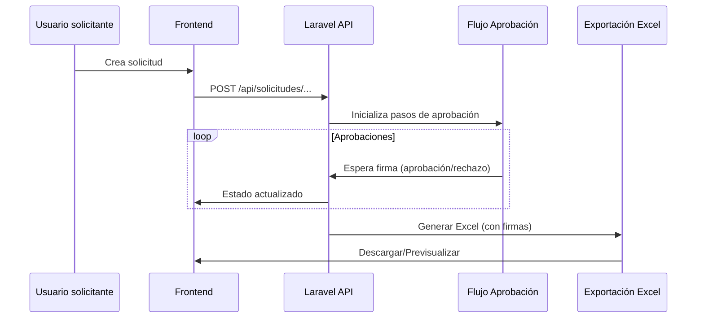
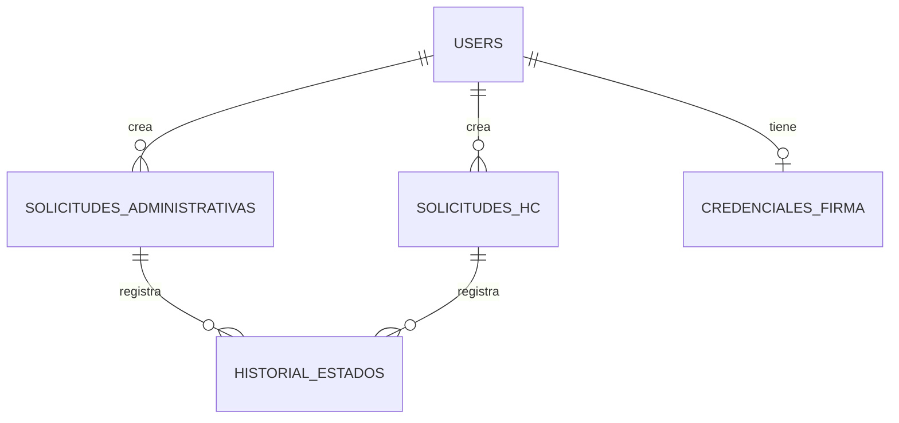
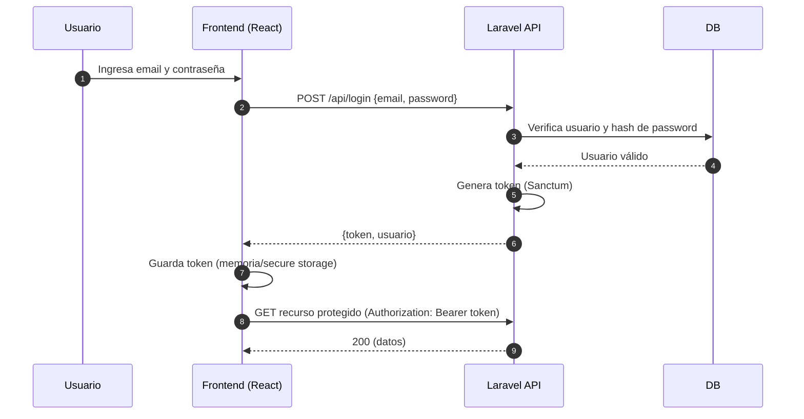
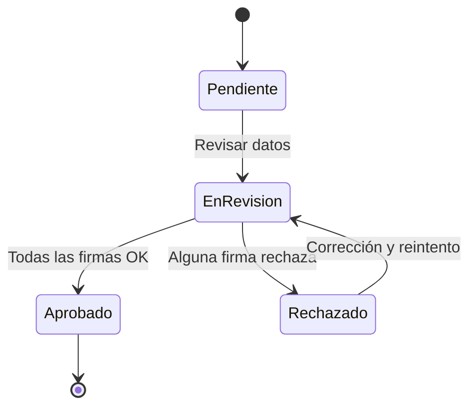
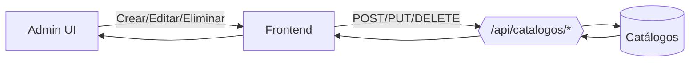
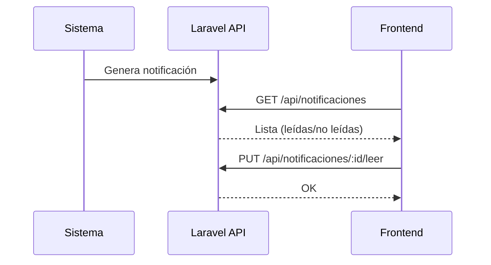
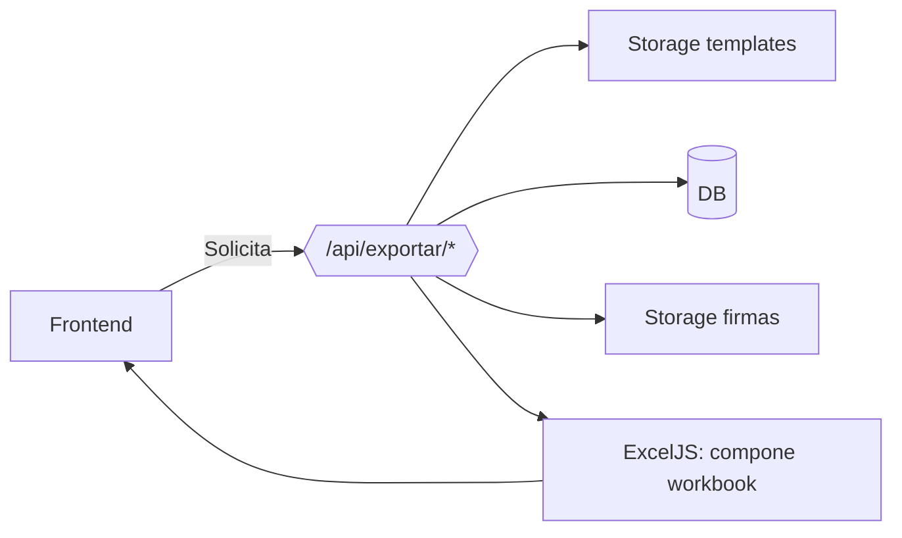
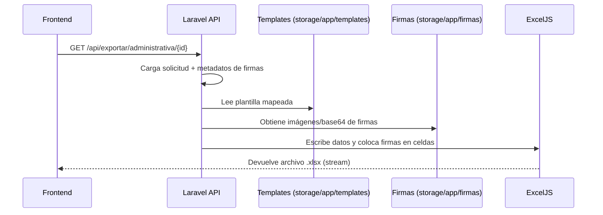
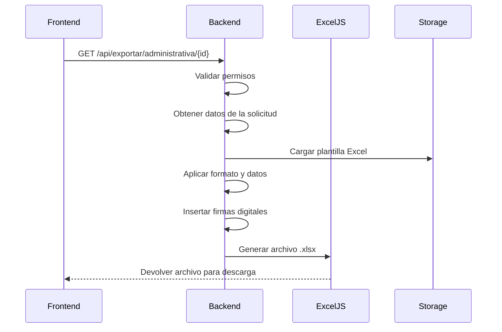
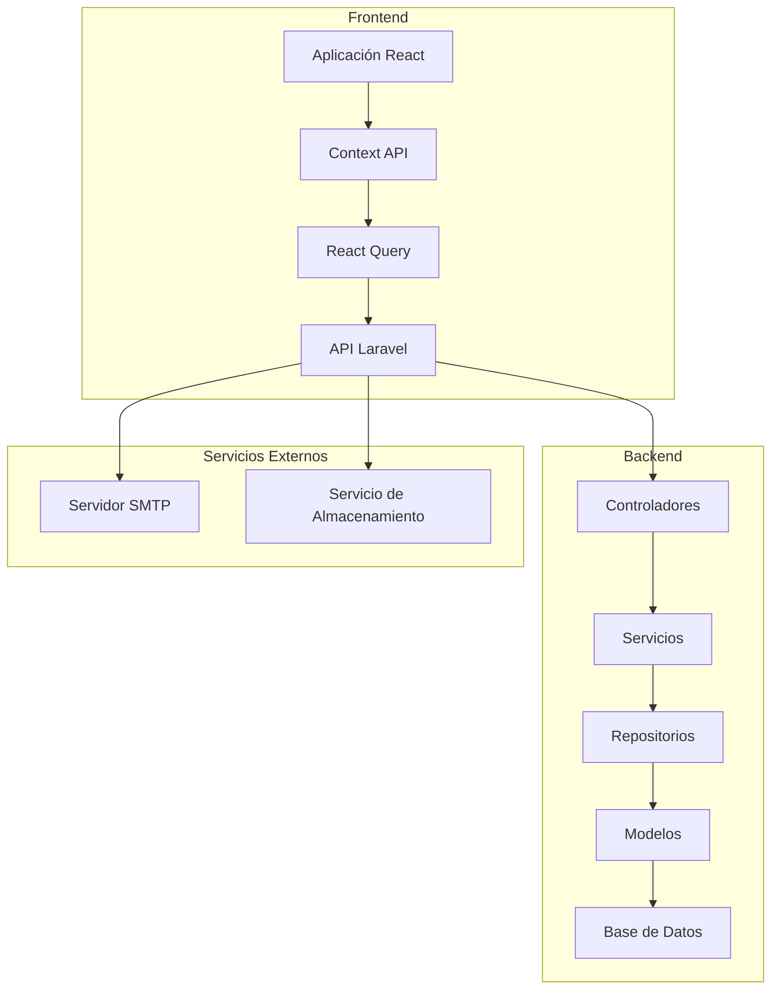

# HEFESTO — Documentación General del Proyecto

## Resumen

- **Nombre**: HEFESTO — Sistema de Gestión de Solicitudes
- **Frontend**: React 18 + Vite 7 + TypeScript + TailwindCSS + shadcn/ui (Radix)
- **Backend**: Laravel (PHP 8.1+), MySQL/MariaDB
- **APIs de desarrollo**: Express (Node) como middleware del dev server de Vite (solo en desarrollo)
- **Gestión**: pnpm para frontend, Composer para backend

## Estructura del Repositorio

```
HEFESTO/
├── client/                  # Código React (componentes, páginas, hooks, lib)
├── server/                  # API Express usada en desarrollo (middleware Vite)
├── shared/                  # Utilidades compartidas
├── hefesto-backend/         # Backend Laravel (app, routes, database, storage)
├── public/                  # Archivos públicos y Templates Excel originales
├── scripts/                 # Scripts Node de utilidades (Excel/CSV)
├── netlify/                 # Configuración para despliegue de frontend
├── docs/                    # Documentación
└── ...
```

## Frontend

- **Stack**: React 18, React Router v7 (flags future), @tanstack/react-query, TailwindCSS, shadcn/ui (Radix), framer-motion
- **Herramientas**: Vite 7, TypeScript, @vitejs/plugin-react-swc
- **Alias**: `@` → `client/`, `@shared` → `shared/`
- **Scripts** (`package.json`):
  - `dev`: Arranca Vite en `http://localhost:8080`
  - `build`: Genera `dist/spa` y `dist/server`
  - `start`: Ejecuta `node dist/server/node-build.mjs` (build del server side bundle)
- **Config** (`vite.config.ts`):
  - Dev server: `host: "::"`, `port: 8080`
  - Middleware Express (solo dev): monta `createServer()` de `server/index.ts`
  - Seguridad FS: `deny` bloquea `.env`, certs, `.git`, `server/**`
- **Variables** (`.env`):
  - `VITE_API_URL=http://localhost:8000/api` (apunta a Laravel en desarrollo)
  - `VITE_USE_API=true`

## Backend (Laravel)

- **Requisitos**: PHP 8.1+, Composer, MySQL/MariaDB
- **Carpetas relevantes**:
  - `hefesto-backend/app/` (Controladores, Modelos, Console/Commands)
  - `hefesto-backend/database/` (migrations, seeders)
  - `hefesto-backend/storage/app/templates/` (templates Excel de producción)
  - `hefesto-backend/storage/app/firmas/` (firmas digitales)
- **CORS**: `hefesto-backend/config/cors.php` permite localhost/127.0.0.1 y credenciales (`supports_credentials=true`).
- **.env Backend (ejemplo)**:
  - `APP_URL=http://localhost`
  - `DB_CONNECTION=mysql`, `DB_HOST=127.0.0.1`, `DB_DATABASE=hefesto`, `DB_USERNAME=root`, `DB_PASSWORD=`
  - `MAIL_*` para SMTP si aplica

## Endpoints Principales (según README)

- **Solicitudes Administrativas**
  - `GET /api/solicitudes-administrativas`
  - `POST /api/solicitudes-administrativas`
  - `GET /api/solicitudes-administrativas/{id}`
  - `PUT /api/solicitudes-administrativas/{id}`
  - `DELETE /api/solicitudes-administrativas/{id}`
- **Exportación**
  - `GET /api/exportacion/administrativa/{id}` (Excel)
  - `GET /api/exportacion/administrativa/{id}/preview` (HTML)
  - `GET /api/exportacion/historia-clinica/{id}`
  - `GET /api/exportacion/historia-clinica/{id}/preview`
- **Catálogos**
  - `GET /api/catalogos/areas`, `cargos`, `perfiles`, `especialidades`

## Templates Excel

- **Originales**: `public/Documentos/Mapeado/`
- **Producción**: `hefesto-backend/storage/app/templates/`
- **Tipos**: Administrativo (mapeado y vacío), Historia Clínica (mapeado y vacío)
- **Script de copiado**: `node scripts/copiar-templates.js`

## Firmas Digitales

- **Tipos**: Imagen Base64 (recomendado), Texto Firma (`FIRMA_TEXTO:Nombre`), Texto Simple
- **Almacenamiento**: `hefesto-backend/storage/app/firmas/`
- Ver guía: `INSTRUCCIONES_FIRMAS_DIGITALES.md` (si existe en docs)

## Instalación y Ejecución (Desarrollo)

1. Clonar repo y entrar a la raíz
2. Frontend
   - `pnpm install`
   - `pnpm dev` → `http://localhost:8080`
3. Backend
   - `cd hefesto-backend`
   - `composer install`
   - Copiar `.env` y configurar DB
   - `php artisan key:generate`
   - `php artisan migrate --seed`
   - `php artisan serve` → `http://127.0.0.1:8000`

## Construcción (Producción)

- Frontend: `pnpm build` → `dist/spa`
- Server bundle Node (si aplica): `vite build --config vite.config.server.ts` → `dist/server/node-build.mjs`
- Laravel: `php artisan config:cache`, `route:cache`, `view:cache`

## Dependencias Frontend (principales)

- React 18, React Router, @tanstack/react-query
- TailwindCSS, tailwind-merge, tailwindcss-animate
- shadcn/ui (Radix): `@radix-ui/react-*` (checkbox, dialog, label, select, slot, switch, toast, tooltip)
- framer-motion, lucide-react, sonner
- axios, zod

## Herramientas y Scripts

- `scripts/analyzeExcelStructure.js`, `convertExcelToCSV.js`, `parseCSV.js`, `copiar-templates.js`
- `vite.config.ts` y `vite.config.server.ts` para build SPA y server bundle

## Seguridad y Consideraciones

- Las contraseñas de usuarios se almacenan hasheadas (bcrypt/argon2) en la base de datos. **No es posible recuperar contraseñas en texto plano**.
- Configure CORS correctamente para entornos productivos.
- Asegure variables sensibles (.env) y acceso a `storage/`.

## Base de Datos (Esquema resumido)

- **`users`**: `id`, `name`, `email`, `password (hash)`, `rol`, `estado`, `cargo_id`, `area_id`, `email_verified_at`, timestamps.
- **`password_resets` / `personal_access_tokens`**: gestión de tokens si aplica (Sanctum).
- **`solicitudes_administrativas`**: datos de solicitudes administrativas, `user_id`, estado, timestamps.
- **`solicitudes_historia_clinica`**: datos de solicitudes HCE, `user_id`, recursos, estado, timestamps.
- **`credenciales_firma`**: `id`, `usuario_id`, `tipo` (imagen_base64 | texto_firma | texto_simple), `ruta_o_valor`, timestamps.
- **Catálogos**: `areas`, `cargos`, `perfiles`, `especialidades` (nombres pueden variar según migraciones/seeders).

Nota: Las contraseñas en `users.password` están hasheadas por Laravel. No existen en texto plano.

## Variables de Entorno (detalladas)

- **Frontend (`.env` en raíz)**
  - `VITE_API_URL=http://localhost:8000/api`
  - `VITE_USE_API=true`
  - `VITE_PUBLIC_BUILDER_KEY=__BUILDER_PUBLIC_KEY__` (si se usa Builder.io)

- **Backend (`hefesto-backend/.env`)**
  - `APP_NAME=HEFESTO`
  - `APP_ENV=local|production`
  - `APP_DEBUG=true|false`
  - `APP_URL=http://localhost`
  - `DB_CONNECTION=mysql`
  - `DB_HOST=127.0.0.1`
  - `DB_PORT=3306`
  - `DB_DATABASE=hefesto`
  - `DB_USERNAME=root`
  - `DB_PASSWORD=`
  - `MAIL_MAILER=smtp`, `MAIL_HOST`, `MAIL_PORT`, `MAIL_USERNAME`, `MAIL_PASSWORD`, `MAIL_ENCRYPTION`

## Servidores y Puertos

- **Frontend (Vite)**: `http://localhost:8080` (config en `vite.config.ts`)
- **Backend Laravel**: `http://127.0.0.1:8000` (`php artisan serve`)
- **Express (dev middleware)**: montado dentro del server de Vite durante desarrollo (no usar en prod)

## CRUD por Módulos (Resumen)

- **Solicitudes Administrativas**
  - Listar/Crear/Ver/Actualizar/Eliminar: rutas bajo `/api/solicitudes-administrativas*`
  - Acciones: aprobar/rechazar

- **Solicitudes Historia Clínica**
  - Listar/Crear/Ver/Actualizar y validaciones (cédula, correo, registro, recursos)
  - Acciones: aprobar/rechazar

- **Catálogos**
  - `GET /api/catalogos/areas|cargos|perfiles|especialidades`

## Despliegue

- **Frontend**
  - `pnpm build` → `dist/spa`
  - Hosting estático (Netlify/otro). Revisar `netlify/` y `netlify.toml` si se usa Netlify.

- **Backend Laravel**
  - Composer install, permisos a `storage/` y `bootstrap/cache`
  - `php artisan migrate --seed`
  - `php artisan config:cache && php artisan route:cache && php artisan view:cache`
  - Servidor PHP-FPM/Apache/Nginx según infraestructura.

## Comandos Útiles

- **Frontend**
  - `pnpm dev` — desarrollo
  - `pnpm build` — build producción
  - `pnpm test` — pruebas (vitest)

- **Backend**
  - `php artisan key:generate`
  - `php artisan migrate --seed`
  - `php artisan serve`
  - `php artisan templates:verificar` — verificar templates Excel
  - `php artisan template:analizar <archivo>` — analizar estructura de un template

## Seguridad

- **Contraseñas**: siempre hasheadas (bcrypt/argon2). Nunca exponer texto plano.
- **CORS**: `config/cors.php` ajustado para desarrollo (localhost). Ajustar dominios en producción.
- **.env**: no versionar credenciales. Proteger accesos a `storage/`.
- **Firmas digitales**: almacenar y servir de forma restringida desde `storage/app/firmas/`.

## Troubleshooting

- **Vite y cambio de gestor de paquetes**: si se alterna entre npm/pnpm, borrar caché de Vite y reinstalar dependencias.
- **PHP extensiones en XAMPP**: deshabilitar `pdo_firebird`/`pdo_oci` si no se usan para eliminar warnings.

## Rutas (Laravel API - Mapa Resumido)

- Archivo: `hefesto-backend/routes/api.php`
- Prefijo general: `/api`
- **Auth**: `POST /api/login`, `POST /api/register`, `POST /api/logout`, `GET /api/me`
- **Solicitudes Administrativas**: `GET/POST /api/solicitudes/administrativas`, `GET/PUT/DELETE /api/solicitudes/administrativas/{id}`, acciones `POST /{id}/aprobar|rechazar`
- **Solicitudes Historia Clínica**: `GET/POST /api/solicitudes/historia-clinica`, `GET/PUT/DELETE /api/solicitudes/historia-clinica/{id}`, acciones `POST /{id}/aprobar|rechazar`
- **Flujos**: `GET /api/flujos/buscar`, `GET /api/flujos/progreso/{tipo}/{id}`, `POST /api/flujos/firmar|rechazar`
- **Catálogos**: `GET /api/catalogos/areas|cargos|especialidades|todos`
- **Notificaciones**: `GET /api/notificaciones`, `GET /api/notificaciones/no-leidas`, `PUT /api/notificaciones/{id}/leer`, `POST /api/notificaciones/leer-todas`
- **Exportación**: `GET /api/exportar/administrativa/{id}`, `GET /api/exportar/historia-clinica/{id}` y previews `GET /api/exportar/preview/*`
- **Roles**: `GET/POST /api/roles`, `GET/PUT/DELETE /api/roles/{id}`
- **Parámetros**: `GET /api/parametros`, `GET/PUT /api/parametros/{key}`
- **Usuarios**: `GET/POST /api/usuarios`, `GET/PUT/DELETE /api/usuarios/{id}`, `PUT /api/usuarios/{id}/estado`, `POST /api/usuarios/{id}/cambiar-password`
- **Dashboard**: `GET /api/dashboard`, `GET /api/dashboard/admin`
- **Reportes**: `GET /api/reportes`, `POST /api/reportes/generar`, `GET /api/reportes/{id}/exportar`
- **Permisos**: `GET /api/permisos/mis-permisos`, `POST /api/permisos/verificar`, listados y asignación/remoción de roles
- **Credenciales de Firmas**: CRUD en `/api/credenciales-firmas` y utilitarios (`toggle-activo`, `reordenar`)

## Roles y Permisos (Modelo lógico)

- Modelo `User` (`hefesto-backend/app/Models/User.php`) incluye trait `HasPermissions` y helpers `estaActivo()` y `esAdministrador()`.
- Las pantallas protegidas en frontend usan `ProtectedRoute` y verifican `requireAdmin` para rutas de administración.
- Sugerencia: documentar permisos de negocio como `admin.acceso_total`, etc., y su asignación por rol.

## Backups y Restauración

- Frontend ofrece acciones de respaldo local (localStorage) desde `Configuración`.
- Recomendado en backend:
  - Respaldos de BD con `mysqldump` programados.
  - Carpeta `storage/app/` (incluye templates y firmas) con copias periódicas.
  - Versionar scripts de exportación en `scripts/`.

## Testing

- **Backend**: `cd hefesto-backend && php artisan test`
- **Frontend**: `pnpm test` (vitest)
- **Buenas prácticas**: pruebas de controladores de solicitudes, exportación y permisos; pruebas de integración frontend contra API mock o sandbox.

## Despliegue en Netlify (Frontend)

- Revisar `netlify.toml` para headers y redirects si se requiere SPA fallback.

## Glosario

- **HCE**: Historia Clínica Electrónica.
- **Template Excel mapeado**: archivo con descripciones para previsualización.
- **Template Excel vacío**: archivo para exportación sin descripciones.
- **Firma Base64**: imagen PNG capturada desde canvas y embebida en Excel.

---

Actualizado automáticamente a partir del repositorio a la fecha de preparación.

## Diagramas (Mermaid)

### Arquitectura (Frontend ↔ Backend)

```mermaid
flowchart LR
  subgraph Client[Frontend - React/Vite]
    UI[UI (shadcn/Radix)] --> RQ[@tanstack/react-query]
    RQ --> Axios
  end

  Axios -- VITE_API_URL --> API{{Laravel API}}
  subgraph Dev[Dev Server]
    Vite[Vite 7] -- middleware --> Express[Express (solo dev)]
  end

  API --> DB[(MySQL/MariaDB)]
  API --> Storage[Storage (templates, firmas)]
```

### Flujo de aprobación y firmas



### Modelo de datos (ER simplificado)



## Modelo de Datos Detallado (desde migraciones)

- **`users`** (`0001_01_01_000000_create_users_table.php`)
  - `id` (PK, big-increments)
  - `name` (string)
  - `email` (string, unique)
  - `email_verified_at` (timestamp, nullable)
  - `password` (string, hash administrado por Laravel)
  - `rol` (string, default 'Usuario')
  - `estado` (string, default 'Activo')
  - `remember_token` (string, nullable)
  - `timestamps`

- **`solicitudes_administrativas`** (`2024_01_01_000003_create_solicitudes_administrativas_table.php`)
  - `id` (PK)
  - `codigo_formato` (string, default 'FOR-GDI-SIS-004')
  - `version` (string, default '1')
  - `fecha_solicitud` (date)
  - `nombre_completo` (string)
  - `cedula` (string, index)
  - `cargo` (string)
  - `area_servicio` (string)
  - `telefono_extension` (string)
  - `tipo_vinculacion` (enum: Planta|Agremiado|Contrato)
  - `modulos_administrativos` (json, nullable)
  - `modulos_financieros` (json, nullable)
  - `tipo_permiso` (json, nullable)
  - `perfil_de` (string, nullable)
  - `opciones_web` (json, nullable)
  - `firmas` (json, nullable)
  - `login_asignado` (string, nullable)
  - `clave_temporal` (string, nullable)
  - `estado` (enum: Pendiente|En revisión|Aprobado|Rechazado, default Pendiente, index)
  - `acepta_responsabilidad` (boolean, default false)
  - `usuario_creador_id` (FK users.id, onDelete set null)
  - `timestamps`, `softDeletes`
  - Índices: `cedula`, `estado`, `fecha_solicitud`

- **Otras tablas** (según `database/migrations/`):
  - `solicitudes_historia_clinica`, `historial_solicitudes`, `historial_estados` (tracking),
    `credenciales_firma`, `roles`, `parametros_sistema`, `actividades`, `configuraciones`,
    `archivos`, `exportaciones`, `validaciones_documentos`, `notificaciones`, `permisos`,
    `sesiones_activas`, `respaldos`, `reportes`, `areas`, `servicios_medicos`, `especialidades`, `cargos`,
    `flujos_aprobacion`, `pasos_aprobacion`, `firmas_solicitud`.

> Nota: para un diccionario completo por tabla, recorrer todas las migraciones y compilar columnas, tipos y claves.

## Guía de Despliegue Paso a Paso

- **Backend (Laravel)**
  - Preparar servidor con PHP 8.1+, Composer, MySQL/MariaDB.
  - Clonar `hefesto-backend/` y configurar `.env` (DB, MAIL, APP_*).
  - `composer install`
  - `php artisan key:generate`
  - `php artisan migrate --seed`
  - `php artisan config:cache && php artisan route:cache && php artisan view:cache`
  - Configurar virtual host/NGINX o PHP-FPM; asegurar permisos de `storage/` y `bootstrap/cache`.

- **Frontend (SPA)**
  - En raíz del repo: `pnpm install` y `pnpm build`
  - Publicar `dist/spa` en hosting estático (Netlify u otro).
  - Configurar `VITE_API_URL` apuntando al dominio público del backend.

- **Netlify**
  - Build: `pnpm build`
  - Publish dir: `dist/spa`
  - Revisar `netlify.toml` para SPA fallback (`/* -> /index.html`).

## Checklists

- **Pre-producción**
  - [ ] `.env` de backend sin `APP_DEBUG` en `true`
  - [ ] CORS con dominios oficiales
  - [ ] Jobs/queues y cron si aplica (limpieza, reportes)
  - [ ] Backups automáticos de BD y `storage/app`

- **Seguridad**
  - [ ] Rotación de credenciales
  - [ ] Registros de acceso/errores monitorizados
  - [ ] Acceso restringido a firmas (`storage/app/firmas`)

- **Observabilidad**
  - [ ] Logs (`storage/logs`) y alertas
  - [ ] Health checks (`/api/ping`)

---

Actualizado automáticamente a partir del repositorio a la fecha de preparación.

## Estructura Detallada de Carpetas

- **Frontend `client/`**
  - `components/` — UI y componentes compuestos (`ui/` contiene wrappers shadcn/Radix)
  - `pages/` — páginas de app (`Index.tsx`, `Login.tsx`, `Registro*.tsx`, `Configuracion.tsx`, etc.)
  - `contexts/` — `AppContext` y estados globales
  - `hooks/` — hooks como `useRoles`
  - `lib/` — utilidades (`api`, `animations`, `toast`, `utils`)
  - `global.css` — estilos globales Tailwind

- **Backend `hefesto-backend/`**
  - `app/` — `Http/Controllers`, `Models`, `Console/Commands`, Traits (p.ej. `HasPermissions`)
  - `database/` — `migrations/`, `seeders/`
  - `routes/` — `api.php`, `web.php`
  - `storage/app/` — `templates/` (Excel), `firmas/` (firmas digitales)

## Autenticación y Autorización

- Middleware `auth:sanctum` protege múltiples grupos de rutas (`routes/api.php`).
- Flujo típico:
  - `POST /api/login` → recibe token de acceso (Sanctum)
  - En frontend, incluir token en `Authorization: Bearer <token>` para rutas protegidas
  - `POST /api/logout` para cerrar sesión
- Autorización por rol/permiso vía Trait `HasPermissions` y helpers en `User`.

## Ejemplos de API (curl)

Autenticación:
```bash
curl -X POST http://127.0.0.1:8000/api/login \
  -H "Content-Type: application/json" \
  -d '{"email":"admin@local","password":"<secreto>"}'
```

Listar solicitudes administrativas (requiere token):
```bash
curl -X GET http://127.0.0.1:8000/api/solicitudes/administrativas \
  -H "Authorization: Bearer <TOKEN>"
```

Exportar administrativa a Excel (requiere token):
```bash
curl -X GET http://127.0.0.1:8000/api/exportar/administrativa/123 \
  -H "Authorization: Bearer <TOKEN>" -OJ
```

## Configuración por Entorno

- Desarrollo:
  - Frontend: `VITE_API_URL=http://localhost:8000/api`
  - Backend: `APP_ENV=local`, `APP_DEBUG=true`
- Producción:
  - Ajustar `APP_ENV=production`, `APP_DEBUG=false`
  - Configurar CORS con dominios reales en `config/cors.php`
  - Cache de configuración/rutas/vistas en Laravel

## Logs y Errores

- Laravel: logs en `storage/logs/laravel.log`. Configurar `LOG_CHANNEL` según entorno.
- Frontend: usar `console.error` y toasts para feedback controlado (`@/lib/toast`).
- Recomendación: añadir manejo centralizado de errores en `axios` interceptors.

## Rendimiento y Buenas Prácticas

- React Query: cacheo de peticiones y revalidación para minimizar llamadas.
- Tailwind + shadcn: componentes accesibles y estilos atómicos para mantener performance.
- Evitar librerías duplicadas de UI/animación. Ya consolidado en Radix + framer-motion.
- Habilitar minificación y sourcemaps apropiados en build de producción.

## Diagramas Adicionales

### Autenticación con Laravel Sanctum



### Estado de Solicitud (diagrama de estados)



### Gestión de Catálogos (flujo CRUD)



### Notificaciones (lectura y marcado)



### Exportación Excel con Firmas (flujo)



## Matriz de Pruebas (Resumen)

- **Solicitudes Administrativas**
  - **Crear**: datos requeridos, validaciones, estados iniciales.
  - **Aprobar/Rechazar**: transición de estados, firmas.
  - **Listar/Paginar**: filtros por fecha, estado, cédula.
  - **Exportar**: contenido de Excel, firmas embebidas, metadatos.

- **Solicitudes HCE**
  - **Validaciones**: cédula/correo/registro, recursos disponibles.
  - **CRUD**: flujo idéntico a administrativo.

- **Usuarios**
  - **Auth**: login/logout, token inválido/expirado.
  - **Permisos**: rutas protegidas, rol admin vs usuario.

- **Catálogos**
  - **CRUD**: creación, actualización, conflictos (duplicados), eliminación.

## Estándares de Código

- **Frontend**
  - Componentes en `client/components/` y páginas en `client/pages/`.
  - Hooks reutilizables en `client/hooks/` (prefijo `use`), utilidades en `client/lib/`.
  - Tipado estricto progresivo (TypeScript), evitar `any` salvo justificado.
  - Estilos con Tailwind; evitar CSS global salvo utilidades.

- **Backend**
  - Controladores en `app/Http/Controllers/Api`, validación con Form Requests.
  - Servicios/Repositorios si complejidad lo amerita.
  - Respuestas JSON consistentes (estructura `data`, `meta`, `errors`).

## Convenciones de Commits y Ramas

- **Convenciones**: Conventional Commits (`feat:`, `fix:`, `docs:`, `chore:`, `refactor:`).
- **Ramas**: `main` (estable), `develop` (integración), `feature/*`, `hotfix/*`.
- **PRs**: checklists de tests, screenshots si UI, vínculo a issue.

## Operación y Mantenimiento

- **Backups**
  - BD: diario/semanal con retención definida.
  - `storage/app`: sincronización incremental periódica.

- **Monitoreo**
  - Logs de Laravel (`storage/logs`), métricas de servidor, alertas.
  - Health check endpoint `/api/ping`.

- **Rotación de Secretos**
  - `.env` y credenciales de BD/SMTP rotados periódicamente.

## Ejemplos Adicionales (curl)

Listar catálogos:
```bash
curl -X GET http://127.0.0.1:8000/api/catalogos/todos
```

Marcar notificación como leída:
```bash
curl -X PUT http://127.0.0.1:8000/api/notificaciones/42/leer \
  -H "Authorization: Bearer <TOKEN>"
```

Generar reporte:
```bash
curl -X POST http://127.0.0.1:8000/api/reportes/generar \
  -H "Authorization: Bearer <TOKEN>" \
  -H "Content-Type: application/json" \
  -d '{"tipo":"administrativa","filtros":{"estado":"Aprobado"}}'
```

## Accesibilidad (A11y)

- Usar componentes Radix/shadcn por accesibilidad por defecto.
- Contraste adecuado, soporte de teclado, focus-visible.
- Labels asociados a inputs (ver `Label` en `@/components/ui/label`).

## Internacionalización (i18n)

- Centralizar textos en utilidades para facilitar traducción futura.
- Evitar strings de UI hardcodeadas en lógica.

## Roadmap (Sugerido)

- Integrar testing E2E (Playwright/Cypress) para flujos críticos.
  - Añadir paginación/ordenamiento/filtrado consistente en listados.
  - Endpoints de auditoría y trazabilidad ampliada.
  - Caché de catálogos en frontend con invalidación selectiva.

## Sistema de Firmas y Exportaciones a Excel

### Visión General

- **Objetivo**: Generar documentos Excel institucionales a partir de plantillas, insertando datos y firmas digitales de manera confiable.
- **Tipos de firmas** (ver también `README.md`):
  - Imagen Base64 (PNG) capturada desde canvas. Recomendado.
  - Texto Firma (valor prefijado `FIRMA_TEXTO:<Nombre>`).
  - Texto Simple (solo nombre del firmante y metadatos).

### Ubicación de Plantillas y Firmas

- Originales: `public/Documentos/Mapeado/`
- Producción (Laravel): `hefesto-backend/storage/app/templates/`
- Firmas digitales: `hefesto-backend/storage/app/firmas/`

### Endpoints Relevantes (Laravel)

- Exportación:
  - `GET /api/exportar/administrativa/{id}` — Descarga Excel con datos de la solicitud y firmas.
  - `GET /api/exportar/historia-clinica/{id}` — Descarga Excel de HCE con firmas.
  - `GET /api/exportar/preview/administrativa/{id}` — HTML de previsualización.
  - `GET /api/exportar/preview/historia-clinica/{id}` — HTML de previsualización.

- Credenciales de firmas (administración):
  - `GET /api/credenciales-firmas` — Listado.
  - `POST /api/credenciales-firmas` — Crear credencial.
  - `PUT /api/credenciales-firmas/{id}` — Actualizar.
  - `DELETE /api/credenciales-firmas/{id}` — Eliminar.
  - `POST /api/credenciales-firmas/{id}/toggle-activo` — Activar/Desactivar.

### Flujo de Exportación



### Mapeo de Campos (Conceptual)

```
SOLICITUD_ADMINISTRATIVA
- A5: fecha_solicitud
- C8: nombre_completo
- C9: cedula
- C10: cargo
- C11: area_servicio
- E25: login_asignado
- E26: clave_temporal

FIRMAS
- H40: firma_responsable (imagen base64)
- H45: firma_autorizador (imagen base64)
```

### Consideraciones de Inserción de Firmas

- Formato: PNG en base64 (con canal alfa) o buffer binario.
- Dimensiones: ajustar a la celda o rango; evitar pixeleo.
- Anclaje: usar celdas nombradas o coordenadas; validar en Excel y LibreOffice.
- Compatibilidad: confirmar renderizado en visores comunes.

### Seguridad

- Restringir acceso a `storage/app/templates` y `storage/app/firmas`.
- No exponer rutas internas; servir descargas por stream.
- Sanitizar HTML en previsualización (frontend usa `dompurify`).

### Troubleshooting

- Error al abrir plantilla:
  - Verificar existencia en `storage/app/templates` (usar `php artisan templates:verificar`).
  - Revisar permisos de lectura del usuario que corre PHP.

- Firmas no visibles en Excel:
  - Validar prefijo/base64 correcto (`data:image/png;base64,` si aplica) o convertir a buffer.
  - Revisar tamaño/posición para que no queden fuera del lienzo.

- Previsualización HTML diferente al Excel:
  - La previsualización es aproximada; revisar posiciones finales en Excel.

### Ejemplos (curl)

Descargar Excel administrativa:
```bash
curl -X GET "http://127.0.0.1:8000/api/exportar/administrativa/123" \
  -H "Authorization: Bearer <TOKEN>" -OJ
```

Listar credenciales de firmas:
```bash
curl -X GET "http://127.0.0.1:8000/api/credenciales-firmas" \
  -H "Authorization: Bearer <TOKEN>"
```

Crear credencial de firma (imagen base64):
```bash
curl -X POST "http://127.0.0.1:8000/api/credenciales-firmas" \
  -H "Authorization: Bearer <TOKEN>" \
  -H "Content-Type: application/json" \
  -d '{
    "usuario_id": 7,
    "tipo": "imagen_base64",
    "valor": "data:image/png;base64,iVBORw0KGgoAAA..."
  }'
```

### Tablas de Credenciales (BD)

- En la base de datos existen tres tablas homónimas/variantes detectadas:
  - `credenciales_firmas` — Tabla en uso (autoridad).
  - `credenciales_firma` — Presente pero vacía (no utilizada).
  - `credencial_firmas` — Presente pero vacía (no utilizada).

- Para evitar ambigüedad y errores:
  - Tratar `credenciales_firmas` como la tabla oficial para CRUD y relaciones.
  - Mantener las otras dos tablas como vestigiales hasta plan de limpieza de migraciones/datos.
  - Actualizar documentación y código para referenciar únicamente `credenciales_firmas`.

## Documentación de Inputs y CRUDs

### Inputs de Formularios (Resumen)

- **Solicitud Administrativa** (`client/pages/RegistroAdministrativo.tsx` y APIs relacionadas)
  - `fecha_solicitud` (date) — obligatorio
  - `nombre_completo` (string) — obligatorio
  - `cedula` (string) — obligatorio; validación de formato y duplicados
  - `cargo` (string)
  - `area_servicio` (string)
  - `telefono_extension` (string)
  - `tipo_vinculacion` (enum: Planta | Agremiado | Contrato)
  - `modulos_administrativos` (array/json)
  - `modulos_financieros` (array/json)
  - `tipo_permiso` (array/json)
  - `perfil_de` (string)
  - `opciones_web` (array/json)
  - `acepta_responsabilidad` (boolean)

- **Solicitud Historia Clínica (HCE)** (`client/pages/RegistroHistoriaClinica.tsx`)
  - Datos personales y de registro profesional (cédula, correo, registro, especialidad)
  - Recursos solicitados (terminales, tablets) y validaciones de disponibilidad
  - Firmas requeridas por flujo de aprobación

> Nota: Los componentes `@/components/ui/*` (inputs, dialogs, toasts, switch, checkbox) y validaciones via `zod`/React Hook Form deben alinearse con estos contratos.

### Patrones CRUD (API Laravel)

- **Crear**: `POST /api/solicitudes/administrativas`
```json
{
  "fecha_solicitud": "2025-11-20",
  "nombre_completo": "Nombre Apellido",
  "cedula": "123456789",
  "cargo": "Analista",
  "area_servicio": "Sistemas",
  "tipo_vinculacion": "Planta",
  "modulos_administrativos": ["PAC", "HIS"],
  "acepta_responsabilidad": true
}
```

- **Listar**: `GET /api/solicitudes/administrativas?estado=Pendiente&fecha_desde=2025-11-01&fecha_hasta=2025-11-30&page=1`
- **Ver detalle**: `GET /api/solicitudes/administrativas/{id}`
- **Actualizar**: `PUT /api/solicitudes/administrativas/{id}` (solo campos editables)
- **Eliminar**: `DELETE /api/solicitudes/administrativas/{id}` (si la política lo permite)

- **Acciones**:
  - Aprobar: `POST /api/solicitudes/administrativas/{id}/aprobar`
  - Rechazar: `POST /api/solicitudes/administrativas/{id}/rechazar`

## Credenciales de Firma por Bloques

- **Bloques de firma**: cada flujo define pasos/bloques (p.ej., Solicitante, Jefe Inmediato, Aprobador TI, Aprobador Gestión Información).
- **Asignación**:
  - Cada usuario puede tener una credencial activa en `credenciales_firmas`.
  - El motor de exportación resuelve la credencial del firmante del bloque y la inserta en el área correspondiente de la plantilla.
- **Tipos**:
  - `imagen_base64` — firma manuscrita capturada en frontend (canvas → base64).
  - `texto_firma` — renderiza nombre con estilo cursivo.
  - `texto_simple` — texto plano con metadatos (fecha/hora).
- **Estados**: credencial activa/inactiva; utilitario `toggle-activo` en API para gestión rápida.

# Flujos de Trabajo y Arquitectura del Sistema

## 1. Flujos de Trabajo Principales

### 1.1 Proceso de Aprobación de Solicitudes

```mermaid
flowchart TD
    A[Inicio: Usuario crea solicitud] --> B{Validación de datos}
    B -->|Válido| C[Guardar como "Pendiente"]
    C --> D[Notificar a Jefe Inmediato]
    D --> E{¿Aprobado?}
    E -->|Sí| F[Notificar a TI]
    E -->|No| G[Rechazar y notificar]
    F --> H{¿Aprobado por TI?}
    H -->|Sí| I[Procesar solicitud]
    H -->|No| G
    I --> J[Notificar al solicitante]
    G --> K[Notificar al solicitante]
```

### 1.2 Flujo de Exportación a Excel



## 2. Módulos del Sistema

### 2.1 Gestión de Usuarios y Roles
- **Roles**: Administrador, Jefe Inmediato, Personal de TI, Usuario Final
- **Permisos**: Basados en roles con herencia
- **Autoservicio**: Actualización de perfil y cambio de contraseña

### 2.2 Sistema de Notificaciones
- Notificaciones en tiempo real (WebSocket)
- Historial de notificaciones
- Preferencias de notificación por usuario

### 2.3 Panel de Administración
- Dashboard con métricas clave
- Gestión de catálogos
- Monitoreo del sistema

## 3. Arquitectura Técnica

### 3.1 Diagrama de Componentes



### 3.2 Estructura de Directorios

```
hefesto/
├── client/                   # Frontend React
│   ├── components/           # Componentes reutilizables
│   ├── pages/                # Vistas de la aplicación
│   ├── hooks/                # Custom hooks
│   └── lib/                  # Utilidades y configuraciones
└── hefesto-backend/          # Backend Laravel
    ├── app/
    │   ├── Http/Controllers/ # Controladores de API
    │   ├── Services/         # Lógica de negocio
    │   ├── Repositories/     # Acceso a datos
    │   ├── Models/           # Modelos Eloquent
    │   └── Exports/          # Clases de exportación
    ├── database/
    │   ├── migrations/
    │   └── seeders/
    └── storage/app/
        ├── templates/        # Plantillas Excel
        └── firmas/          # Firmas digitales
```

## 4. Mejoras Futuras

### 4.1 Autenticación de Dos Factores (2FA)
- Implementar 2FA para mayor seguridad
- Opción de autenticación por aplicación o SMS

### 4.2 API Externa
- Documentación con Swagger/OpenAPI
- Endpoints para integración con otros sistemas

### 4.3 Reportes Avanzados
- Exportación a PDF/Excel personalizable
- Gráficos y estadísticas

### 4.4 Aplicación Móvil
- Versión móvil con React Native
- Notificaciones push
- Firma digital en dispositivos táctiles

## 5. Consideraciones de Seguridad

- Validación de entrada en frontend y backend
- Protección contra CSRF y XSS
- Cifrado de datos sensibles
- Registro de auditoría de acciones
- Política de contraseñas seguras

## 6. Rendimiento y Escalabilidad

- Caché de consultas frecuentes
- Optimización de consultas a la base de datos
- Balanceo de carga
- Escalado horizontal de servicios

## 7. Monitoreo y Mantenimiento

- Health checks automatizados
- Monitoreo de rendimiento
- Alertas tempranas
- Copias de seguridad programadas